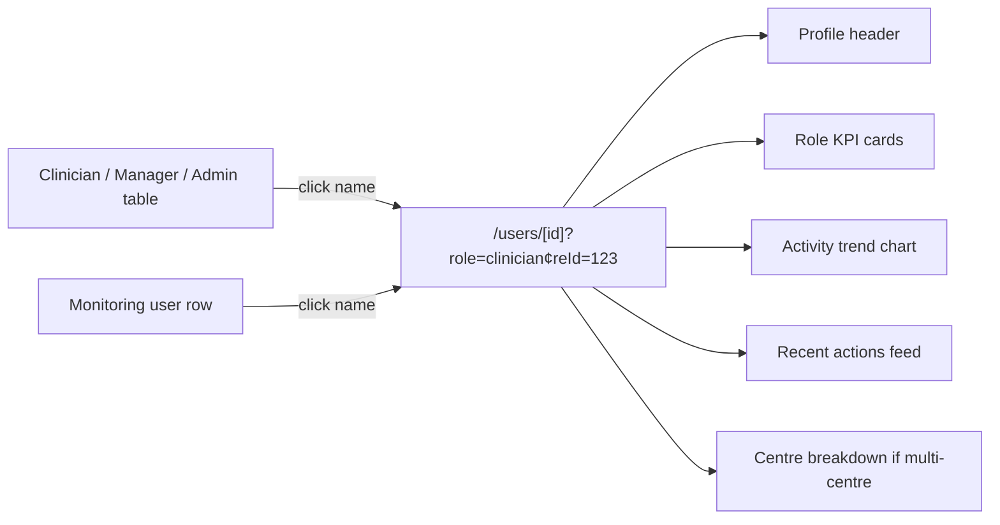

<!-- Generated by SpecStory, Markdown v2.1.0 -->

# 2026-05-25 10:20:32Z

<!-- Cursor IDE Session 424a1e9a-1f7f-4764-9abf-8d657815de4b (2026-05-25 10:20:32Z) -->

_**User**_

can i have manager or clinician or admin drill down also that takes me to their page and i can see their performace on a one on one level. suggest their kpis and hw to track their performance based on their roles 

---

_**Agent (claude-sonnet-4-6)**_

<think><details><summary>Thought Process</summary>
The user wants to implement drill-down capabilities for different user roles in a Unity Dashboard project.</details></think>

_**Agent (claude-sonnet-4-6)**_

Exploring the dashboard structure and existing role/performance tracking so we can suggest drill-down pages and role-specific KPIs.


_**Agent (claude-sonnet-4-6)**_

<tool-use data-tool-type="unknown" data-tool-name="semantic_search_full">
<details>
<summary>Tool use: **semantic_search_full**</summary>


Parameters:

```json
{
  "explanation": "",
  "query": "manager clinician admin roles performance dashboard",
  "topK": 10
}
```
Result:

```json
{
  "codeResults": [
    {
      "codeBlock": {
        "detailedLines": [
          {
            "lineNumber": 14,
            "text": "async (req, res, next) =\u003e {"
          },
          {
            "lineNumber": 74,
            "text": "const managers = (r) =\u003e ("
          },
          {
            "lineNumber": 76,
            "text": ","
          },
          {
            "lineNumber": 77,
            "text": "      lastName:            r.LastName,"
          },
          {
            "lineNumber": 78,
            "text": "      email:               r.Email,"
          },
          {
            "lineNumber": 79,
            "text": "      roleName:            r.roleName || null,"
          },
          {
            "lineNumber": 80,
            "text": "      centreId:            r.centreId,"
          },
          {
            "lineNumber": 81,
            "text": "      centreName:          r.CentreName || null,"
          },
          {
            "lineNumber": 82,
            "text": "      casesRegistered:     r.casesRegistered ?? 0,"
          },
          {
            "lineNumber": 83,
            "text": "      assessmentsAssigned: r.assessmentsAssigned ?? 0,"
          },
          {
            "lineNumber": 84,
            "text": "      totalActions:        r.totalActions ?? 0,"
          },
          {
            "lineNumber": 85,
            "text": "      lastActivityDate:    r.lastActivityDate || null,"
          },
          {
            "lineNumber": 86,
            "text": "      lastLoginDate:       r.LastLoginDateTimeUtc || null,"
          },
          {
            "lineNumber": 87,
            "text": "    }));"
          },
          {
            "lineNumber": 88
          },
          {
            "lineNumber": 89,
            "text": "    res.json(managers);"
          },
          {
            "lineNumber": 90,
            "text": "  } catch (err) {"
          },
          {
            "lineNumber": 91,
            "text": "    next(err);"
          },
          {
            "lineNumber": 92,
            "text": "  }"
          },
          {
            "lineNumber": 93,
            "text": "});"
          },
          {
            "lineNumber": 94
          },
          {
            "lineNumber": 95,
            "text": "module.exports = router;"
          }
        ],
        "range": {
          "endPosition": {
            "column": 24,
            "line": 94
          },
          "startPosition": {
            "line": 13
          }
        },
        "relativeWorkspacePath": ".\\backend\\routes\\managers.js",
        "signatures": {
          "ranges": [
            {
              "endPosition": {
                "column": 1,
                "line": 13
              },
              "startPosition": {
                "column": 1,
                "line": 13
              }
            },
            {
              "endPosition": {
                "column": 3,
                "line": 14
              },
              "startPosition": {
                "column": 17,
                "line": 13
              }
            },
            {
              "endPosition": {
                "column": 11,
                "line": 32
              },
              "startPosition": {
                "column": 5,
                "line": 32
              }
            },
            {
              "endPosition": {
                "column": 26,
                "line": 32
              },
              "startPosition": {
                "column": 11,
                "line": 32
              }
            },
            {
              "endPosition": {
                "column": 26,
                "line": 32
              },
              "startPosition": {
                "column": 26,
                "line": 32
              }
            }
          ]
        }
      },
      "score": 0.41731494665145874
    },
    {
      "codeBlock": {
        "detailedLines": [
          {
            "lineNumber": 14,
            "text": "async (req, res, next) =\u003e {"
          },
          {
            "lineNumber": 30
          },
          {
            "lineNumber": 31,
            "text": "    const centreExclusion = buildCentreExclusion('c');"
          },
          {
            "lineNumber": 32,
            "text": "    const dateFilter = buildDateFilter('pal.CreatedDateTime', '@dateFrom', '@dateTo');"
          },
          {
            "lineNumber": 33
          },
          {
            "lineNumber": 34,
            "text": "    const result = await pool.request()"
          },
          {
            "lineNumber": 35,
            "text": "      .input('centreId', sql.BigInt, centreId)"
          },
          {
            "lineNumber": 36,
            "text": "      .input('dateFrom', sql.DateTimeOffset, dateFrom)"
          },
          {
            "lineNumber": 37,
            "text": "      .input('dateTo',   sql.DateTimeOffset, dateTo)"
          },
          {
            "lineNumber": 38,
            "text": "      .query(&#96;"
          },
          {
            "lineNumber": 39,
            "text": "        SELECT"
          },
          {
            "lineNumber": 40,
            "text": "          au.Id,"
          },
          {
            "lineNumber": 41,
            "text": "          au.FirstName,"
          },
          {
            "lineNumber": 42,
            "text": "          au.LastName,"
          },
          {
            "lineNumber": 43,
            "text": "          au.Email,"
          },
          {
            "lineNumber": 44,
            "text": "          au.LastLoginDateTimeUtc,"
          },
          {
            "lineNumber": 45,
            "text": "          ar.Name      AS roleName,"
          },
          {
            "lineNumber": 46,
            "text": "          c.Id         AS centreId,"
          },
          {
            "lineNumber": 47,
            "text": "          c.CentreName,"
          },
          {
            "lineNumber": 48,
            "text": "          SUM(CASE WHEN pal.Type = 'CaseRegistered' AND p.CentreId = c.Id THEN 1 ELSE 0 END) AS casesRegistered,"
          },
          {
            "lineNumber": 49,
            "text": "          SUM(CASE WHEN pal.Type = 'CaseAssigned'   AND p.CentreId = c.Id THEN 1 ELSE 0 END) AS assessmentsAssigned,"
          },
          {
            "lineNumber": 50,
            "text": "          SUM(CASE WHEN p.CentreId = c.Id THEN 1 ELSE 0 END) AS totalActions,"
          },
          {
            "lineNumber": 51,
            "text": "          MAX(CASE WHEN p.CentreId = c.Id THEN pal.CreatedDateTime END) AS lastActivityDate"
          },
          {
            "lineNumber": 52,
            "text": "        FROM AdminUser au"
          },
          {
            "lineNumber": 53,
            "text": "        JOIN AdminUserRole aur ON aur.UserId = au.Id"
          },
          {
            "lineNumber": 54,
            "text": "        JOIN AdminRole ar      ON ar.Id = aur.RoleId AND ar.Name NOT IN ('Clinician', 'Super Admin')"
          },
          {
            "lineNumber": 55,
            "text": "        JOIN AdminUserCentre auc ON auc.AdminUserId = au.Id"
          },
          {
            "lineNumber": 56,
            "text": "        JOIN Centre c            ON c.Id = auc.CentreId"
          },
          {
            "lineNumber": 57,
            "text": "        LEFT JOIN PatientAuditLog pal ON pal.AdminUserId = au.Id"
          },
          {
            "lineNumber": 58,
            "text": "          AND ${dateFilter}"
          },
          {
            "lineNumber": 59,
            "text": "        LEFT JOIN Patient p ON p.Id = pal.PatientId"
          },
          {
            "lineNumber": 60,
            "text": "        WHERE au.FirstName NOT LIKE '%(Ops)%'"
          },
          {
            "lineNumber": 61,
            "text": "          AND au.LastName  NOT LIKE '%(Ops)%'"
          },
          {
            "lineNumber": 62,
            "text": "          AND au.Email     NOT LIKE '%(Ops)%'"
          },
          {
            "lineNumber": 63,
            "text": "          AND (@centreId IS NULL OR c.Id = @centreId)"
          },
          {
            "lineNumber": 64,
            "text": "          AND ${centreExclusion}"
          },
          {
            "lineNumber": 65,
            "text": "          AND LOWER(au.FirstName) NOT LIKE '%test%'"
          },
          {
            "lineNumber": 66,
            "text": "          AND LOWER(au.LastName)  NOT LIKE '%test%'"
          },
          {
            "lineNumber": 67,
            "text": "          AND LOWER(au.Email)     NOT LIKE '%@webority.com'"
          },
          {
            "lineNumber": 68,
            "text": "        GROUP BY"
          },
          {
            "lineNumber": 69,
            "text": "          au.Id, au.FirstName, au.LastName, au.Email,"
          },
          {
            "lineNumber": 70,
            "text": "          au.LastLoginDateTimeUtc, ar.Name, c.Id, c.CentreName"
          },
          {
            "lineNumber": 71,
            "text": "        ORDER BY ar.Name, au.LastName, au.FirstName, c.CentreName"
          },
          {
            "lineNumber": 72,
            "text": "      &#96;);"
          },
          {
            "lineNumber": 73
          },
          {
            "lineNumber": 74,
            "text": "    const managers = result.recordset.map((r) =\u003e ({"
          },
          {
            "lineNumber": 75,
            "text": "      id:                  r.Id,"
          },
          {
            "lineNumber": 76,
            "text": "      firstName:           r.FirstName,"
          },
          {
            "lineNumber": 77,
            "text": "      lastName:            r.LastName,"
          },
          {
            "lineNumber": 78,
            "text": "      email:               r.Email,"
          },
          {
            "lineNumber": 79,
            "text": "      roleName:            r.roleName || null,"
          },
          {
            "lineNumber": 80,
            "text": "      centreId:            r.centreId"
          },
          {
            "lineNumber": 87,
            "text": ");"
          },
          {
            "lineNumber": 93,
            "text": "}"
          }
        ],
        "range": {
          "endPosition": {
            "column": 1,
            "line": 92
          },
          "startPosition": {
            "line": 13
          }
        },
        "relativeWorkspacePath": ".\\backend\\routes\\managers.js",
        "signatures": {
          "ranges": [
            {
              "endPosition": {
                "column": 1,
                "line": 13
              },
              "startPosition": {
                "column": 1,
                "line": 13
              }
            },
            {
              "endPosition": {
                "column": 3,
                "line": 14
              },
              "startPosition": {
                "column": 17,
                "line": 13
              }
            }
          ]
        }
      },
      "score": 0.39601945877075195
    },
    {
      "codeBlock": {
        "detailedLines": [
          {
            "isSignature": true,
            "lineNumber": 30,
            "text": "export interface Clinician {"
          },
          {
            "lineNumber": 40
          },
          {
            "isSignature": true,
            "lineNumber": 41,
            "text": "  lastLoginDate: string | null;"
          },
          {
            "isSignature": true,
            "lineNumber": 42,
            "text": "}"
          },
          {
            "lineNumber": 43
          },
          {
            "isSignature": true,
            "lineNumber": 44,
            "text": "export interface Manager {"
          },
          {
            "lineNumber": 45,
            "text": "  id: number;"
          },
          {
            "lineNumber": 46,
            "text": "  firstName: string;"
          },
          {
            "lineNumber": 47,
            "text": "  lastName: string;"
          },
          {
            "lineNumber": 48,
            "text": "  email: string;"
          },
          {
            "lineNumber": 49,
            "text": "  roleName: string | null;"
          },
          {
            "lineNumber": 50,
            "text": "  centreId: number | null;"
          },
          {
            "lineNumber": 51,
            "text": "  centreName: string | null;"
          },
          {
            "lineNumber": 52,
            "text": "  casesRegistered: number;"
          },
          {
            "lineNumber": 53,
            "text": "  assessmentsAssigned: number;"
          },
          {
            "lineNumber": 54,
            "text": "  totalActions: number;"
          },
          {
            "lineNumber": 55,
            "text": "  lastActivityDate: string | null;"
          },
          {
            "isSignature": true,
            "lineNumber": 56,
            "text": "  lastLoginDate: string | null;"
          },
          {
            "isSignature": true,
            "lineNumber": 57,
            "text": "}"
          }
        ],
        "range": {
          "endPosition": {
            "column": 1,
            "line": 56
          },
          "startPosition": {
            "line": 29
          }
        },
        "relativeWorkspacePath": ".\\frontend\\lib\\types.ts",
        "signatures": {}
      },
      "score": 0.37861335277557373
    },
    {
      "codeBlock": {
        "detailedLines": [
          {
            "lineNumber": 14,
            "text": "async (req, res, next) =\u003e {"
          },
          {
            "lineNumber": 35,
            "text": "const result = await "
          },
          {
            "lineNumber": 83,
            "text": "${buildCentreExclusion('cc')}"
          },
          {
            "lineNumber": 84,
            "text": "          GROUP BY ap.ClinicianUserId, pt.CentreId"
          },
          {
            "lineNumber": 85,
            "text": "        ) cs ON cs.ClinicianUserId = au.Id AND cs.CentreId = c.Id"
          },
          {
            "lineNumber": 86,
            "text": "        WHERE (@centreId IS NULL OR c.Id = @centreId)"
          },
          {
            "lineNumber": 87,
            "text": "          AND ${centreExclusion}"
          },
          {
            "lineNumber": 88,
            "text": "          AND LOWER(au.FirstName) NOT LIKE '%test%'"
          },
          {
            "lineNumber": 89,
            "text": "          AND LOWER(au.LastName)  NOT LIKE '%test%'"
          },
          {
            "lineNumber": 90,
            "text": "          AND LOWER(au.Email)     NOT LIKE '%@webority.com'"
          },
          {
            "lineNumber": 91,
            "text": "        GROUP BY"
          },
          {
            "lineNumber": 92,
            "text": "          au.Id, au.FirstName, au.LastName, au.Email,"
          },
          {
            "lineNumber": 93,
            "text": "          au.LastLoginDateTimeUtc, c.Id, c.CentreName,"
          },
          {
            "lineNumber": 94,
            "text": "          rs.resultsGenerated, cs.activeCaseload"
          },
          {
            "lineNumber": 95,
            "text": "        ORDER BY au.LastName, au.FirstName, c.CentreName"
          },
          {
            "lineNumber": 96,
            "text": "      &#96;);"
          },
          {
            "lineNumber": 97
          },
          {
            "lineNumber": 98,
            "text": "    const clinicians = result.recordset.map((r) =\u003e ({"
          },
          {
            "lineNumber": 99,
            "text": "      id:                r.Id,"
          },
          {
            "lineNumber": 100,
            "text": "      firstName:         r.FirstName,"
          },
          {
            "lineNumber": 101,
            "text": "      lastName:          r.LastName,"
          },
          {
            "lineNumber": 102,
            "text": "      email:             r.Email,"
          },
          {
            "lineNumber": 103,
            "text": "      centreId:          r.centreId,"
          },
          {
            "lineNumber": 104,
            "text": "      centreName:        r.CentreName || null,"
          },
          {
            "lineNumber": 105,
            "text": "      resultsGenerated:  r.resultsGenerated ?? 0,"
          },
          {
            "lineNumber": 106,
            "text": "      activeCaseload:    r.activeCaseload ?? 0,"
          },
          {
            "lineNumber": 107,
            "text": "      totalAuditActions: r.totalAuditActions ?? 0,"
          },
          {
            "lineNumber": 108,
            "text": "      lastActivityDate:  r.lastActivityDate || null,"
          },
          {
            "lineNumber": 109,
            "text": "      lastLoginDate:     r.LastLoginDateTimeUtc || null,"
          },
          {
            "lineNumber": 110,
            "text": "    }));"
          },
          {
            "lineNumber": 111
          },
          {
            "lineNumber": 112,
            "text": "    res.json(clinicians);"
          },
          {
            "lineNumber": 113,
            "text": "  } catch (err) {"
          },
          {
            "lineNumber": 114,
            "text": "    next(err);"
          },
          {
            "lineNumber": 115,
            "text": "  }"
          },
          {
            "lineNumber": 116,
            "text": "});"
          },
          {
            "lineNumber": 117
          },
          {
            "lineNumber": 118,
            "text": "module.exports = router;"
          }
        ],
        "range": {
          "endPosition": {
            "column": 24,
            "line": 117
          },
          "startPosition": {
            "line": 13
          }
        },
        "relativeWorkspacePath": ".\\backend\\routes\\clinicians.js",
        "signatures": {
          "ranges": [
            {
              "endPosition": {
                "column": 1,
                "line": 19
              },
              "startPosition": {
                "column": 1,
                "line": 19
              }
            },
            {
              "endPosition": {
                "column": 3,
                "line": 20
              },
              "startPosition": {
                "column": 17,
                "line": 19
              }
            },
            {
              "endPosition": {
                "column": 11,
                "line": 40
              },
              "startPosition": {
                "column": 5,
                "line": 40
              }
            },
            {
              "endPosition": {
                "column": 54,
                "line": 40
              },
              "startPosition": {
                "column": 11,
                "line": 40
              }
            },
            {
              "endPosition": {
                "column": 54,
                "line": 40
              },
              "startPosition": {
                "column": 54,
                "line": 40
              }
            },
            {
              "endPosition": {
                "column": 7,
                "line": 41
              },
              "startPosition": {
                "column": 7,
                "line": 41
              }
            }
          ]
        }
      },
      "score": 0.36016595363616943
    },
    {
      "codeBlock": {
        "detailedLines": [
          {
            "lineNumber": 1,
            "text": "'use client';"
          },
          {
            "lineNumber": 2
          },
          {
            "lineNumber": 3,
            "text": "import { useState, useEffect, useRef, useMemo } from 'react';"
          },
          {
            "lineNumber": 4,
            "text": "import TopBar from '@/components/TopBar';"
          },
          {
            "lineNumber": 5,
            "text": "import TabNav from '@/components/TabNav';"
          },
          {
            "lineNumber": 6
          },
          {
            "lineNumber": 7,
            "text": "// Overview"
          },
          {
            "lineNumber": 8,
            "text": "import MetricCards from '@/components/overview/MetricCards';"
          },
          {
            "lineNumber": 9,
            "text": "import CentreTable from '@/components/overview/CentreTable';"
          },
          {
            "lineNumber": 10,
            "text": "import ActivityChart from '@/components/overview/ActivityChart';"
          },
          {
            "lineNumber": 11,
            "text": "import EventTypeChart from '@/components/overview/EventTypeChart';"
          },
          {
            "lineNumber": 12
          },
          {
            "lineNumber": 13,
            "text": "// Clinicians"
          },
          {
            "lineNumber": 14,
            "text": "import ClinicianChart from '@/components/clinicians/ClinicianChart';"
          },
          {
            "lineNumber": 15,
            "text": "import ClinicianTable from '@/components/clinicians/ClinicianTable';"
          },
          {
            "lineNumber": 16
          },
          {
            "lineNumber": 17,
            "text": "// Managers"
          },
          {
            "lineNumber": 18,
            "text": "import ManagerChart from '@/components/managers/ManagerChart';"
          },
          {
            "lineNumber": 19,
            "text": "import ManagerTable from '@/components/managers/ManagerTable';"
          },
          {
            "lineNumber": 20
          },
          {
            "lineNumber": 21,
            "text": "// Centre Admins (Ops)"
          },
          {
            "lineNumber": 22,
            "text": "import CentreAdminChart from '@/components/centre-admins/CentreAdminChart';"
          },
          {
            "lineNumber": 23,
            "text": "import CentreAdminTable from '@/components/centre-admins/CentreAdminTable';"
          },
          {
            "lineNumber": 24
          },
          {
            "lineNumber": 25,
            "text": "// Monitoring"
          },
          {
            "lineNumber": 26,
            "text": "import LivePulse from '@/components/monitoring/LivePulse';"
          },
          {
            "lineNumber": 27,
            "text": "import DayPicker from '@/components/monitoring/DayPicker';"
          },
          {
            "lineNumber": 28,
            "text": "import MonitoringCards from '@/components/monitoring/MonitoringCards';"
          },
          {
            "lineNumber": 29,
            "text": "import MonitoringEngagementFunnel from '@/components/monitoring/MonitoringEngagementFunnel';"
          },
          {
            "lineNumber": 30,
            "text": "import MonitoringCentreChart from '@/components/monitoring/MonitoringCentreChart';"
          },
          {
            "lineNumber": 31,
            "text": "import MonitoringTrendChart from '@/components/monitoring/MonitoringTrendChart';"
          },
          {
            "lineNumber": 32,
            "text": "import UserStatusTable from '@/components/monitoring/UserStatusTable';"
          },
          {
            "lineNumber": 33,
            "text": "import ActivityHeatmap from '@/components/monitoring/ActivityHeatmap';"
          },
          {
            "lineNumber": 34
          },
          {
            "lineNumber": 35,
            "text": "// Bottlenecks"
          },
          {
            "lineNumber": 36,
            "text": "import BottleneckCards from '@/components/bottlenecks/BottleneckCards';"
          },
          {
            "lineNumber": 37,
            "text": "import BottleneckFunnel from '@/components/bottlenecks/BottleneckFunnel';"
          },
          {
            "lineNumber": 38,
            "text": "import BottleneckByCentre from '@/components/bottlenecks/BottleneckByCentre';"
          },
          {
            "lineNumber": 39,
            "text": "import BottleneckActionTable from '@/components/bottlenecks/BottleneckActionTable';"
          },
          {
            "lineNumber": 40
          },
          {
            "lineNumber": 41,
            "text": "// Hooks"
          },
          {
            "lineNumber": 42,
            "text": "import { useOverview } from '@/hooks/useOverview';"
          },
          {
            "lineNumber": 43,
            "text": "import { useClinicians } from '@/hooks/useClinicians';"
          },
          {
            "lineNumber": 44,
            "text": "import { useManagers } from '@/hooks/useManagers';"
          },
          {
            "lineNumber": 45,
            "text": "import { useCentreAdmins } from '@/hooks/useCentreAdmins';"
          },
          {
            "lineNumber": 46,
            "text": "import { useMonitoring } from '@/hooks/useMonitoring';"
          },
          {
            "lineNumber": 47,
            "text": "import { useBottlenecks } from '@/hooks/useBottlenecks';"
          }
        ],
        "range": {
          "endPosition": {
            "column": 56,
            "line": 46
          },
          "startPosition": {}
        },
        "relativeWorkspacePath": ".\\frontend\\app\\page.tsx",
        "signatures": {}
      },
      "score": 0.3549858331680298
    },
    {
      "codeBlock": {
        "detailedLines": [
          {
            "isSignature": true,
            "lineNumber": 34,
            "text": "export default function ManagerChart({ managers, loading }: Props) {"
          },
          {
            "lineNumber": 74,
            "text": " ("
          },
          {
            "lineNumber": 75,
            "text": "      \u003cdiv className={cardClass}\u003e"
          },
          {
            "lineNumber": 76,
            "text": "        \u003cdiv className=\"h-44 flex items-center justify-center text-sm text-gray-400\"\u003e"
          },
          {
            "lineNumber": 77,
            "text": "          No manager data for the selected filters"
          },
          {
            "lineNumber": 78,
            "text": "        \u003c/div\u003e"
          },
          {
            "lineNumber": 79,
            "text": "      \u003c/div\u003e"
          },
          {
            "lineNumber": 80,
            "text": "    );"
          },
          {
            "lineNumber": 81,
            "text": "  }"
          },
          {
            "lineNumber": 82
          },
          {
            "lineNumber": 83,
            "text": "  return ("
          },
          {
            "lineNumber": 84,
            "text": "    \u003cdiv className=\"space-y-5\"\u003e"
          },
          {
            "lineNumber": 85,
            "text": "      \u003cdiv className={cardClass}\u003e"
          },
          {
            "lineNumber": 86,
            "text": "        \u003cdiv className=\"mb-4\"\u003e"
          },
          {
            "lineNumber": 87,
            "text": "          \u003ch2 className=\"text-sm font-semibold text-gray-900\"\u003eManager Performance\u003c/h2\u003e"
          },
          {
            "lineNumber": 88,
            "text": "          \u003cp className=\"text-xs text-gray-400 mt-0.5\"\u003eTotals across all centre assignments\u003c/p\u003e"
          },
          {
            "lineNumber": 89,
            "text": "        \u003c/div\u003e"
          },
          {
            "lineNumber": 90,
            "text": "        \u003cdiv className=\"grid grid-cols-2 sm:grid-cols-3 lg:grid-cols-5 gap-2.5\"\u003e"
          },
          {
            "lineNumber": 91,
            "text": "          \u003cKpiCard label=\"Managers\" value={peopleCount} sub={visible.length !== peopleCount ? &#96;${visible.length} assignments&#96; : undefined} /\u003e"
          },
          {
            "lineNumber": 92,
            "text": "          \u003cKpiCard label=\"Active\" value={activeCount} sub=\"have activity\" color=\"text-green-600\" /\u003e"
          },
          {
            "lineNumber": 93,
            "text": "          \u003cKpiCard label=\"Cases\" value={totalCases.toLocaleString()} color=\"text-[#7F77DD]\" /\u003e"
          },
          {
            "lineNumber": 94,
            "text": "          \u003cKpiCard label=\"Assessments\" value={totalAssessments.toLocaleString()} color=\"text-[#378ADD]\" /\u003e"
          },
          {
            "lineNumber": 95,
            "text": "          \u003cKpiCard label=\"Assign Rate\" value={avgRate} sub=\"assessments / cases\" /\u003e"
          },
          {
            "lineNumber": 96,
            "text": "        \u003c/div\u003e"
          },
          {
            "lineNumber": 97,
            "text": "      \u003c/div\u003e"
          },
          {
            "lineNumber": 98
          },
          {
            "lineNumber": 99,
            "text": "      \u003cPersonActivityChart"
          },
          {
            "lineNumber": 100,
            "text": "        title=\"Top Manager Assignments by Onboarding\""
          },
          {
            "lineNumber": 101,
            "text": "        subtitle=\"Top 8 person × centre rows by cases + assessments\""
          },
          {
            "lineNumber": 102,
            "text": "        rows={chartRows}"
          },
          {
            "lineNumber": 103,
            "text": "        loading={loading}"
          },
          {
            "isSignature": true,
            "lineNumber": 108,
            "text": "}"
          }
        ],
        "range": {
          "endPosition": {
            "column": 1,
            "line": 107
          },
          "startPosition": {
            "line": 33
          }
        },
        "relativeWorkspacePath": ".\\frontend\\components\\managers\\ManagerChart.tsx",
        "signatures": {
          "ranges": [
            {
              "endPosition": {
                "column": 16,
                "line": 33
              },
              "startPosition": {
                "column": 1,
                "line": 33
              }
            },
            {
              "endPosition": {
                "column": 3,
                "line": 34
              },
              "startPosition": {
                "column": 16,
                "line": 33
              }
            }
          ]
        }
      },
      "score": 0.3506481647491455
    },
    {
      "codeBlock": {
        "detailedLines": [
          {
            "lineNumber": 13,
            "text": "async (req, res, next) =\u003e {"
          },
          {
            "lineNumber": 75,
            "text": "const admins = (r) =\u003e ("
          },
          {
            "lineNumber": 78,
            "text": ","
          },
          {
            "lineNumber": 79,
            "text": "      email:                   r.Email,"
          },
          {
            "lineNumber": 80,
            "text": "      roleName:                r.roleName || null,"
          },
          {
            "lineNumber": 81,
            "text": "      centreId:                r.centreId,"
          },
          {
            "lineNumber": 82,
            "text": "      centreName:              r.CentreName || null,"
          },
          {
            "lineNumber": 83,
            "text": "      casesRegistered:         r.casesRegistered ?? 0,"
          },
          {
            "lineNumber": 84,
            "text": "      casesAssignedToClinical: r.casesAssignedToClinical ?? 0,"
          },
          {
            "lineNumber": 85,
            "text": "      totalActions:            r.totalActions ?? 0,"
          },
          {
            "lineNumber": 86,
            "text": "      lastActivityDate:        r.lastActivityDate || null,"
          },
          {
            "lineNumber": 87,
            "text": "      lastLoginDate:           r.LastLoginDateTimeUtc || null,"
          },
          {
            "lineNumber": 88,
            "text": "    }));"
          },
          {
            "lineNumber": 89
          },
          {
            "lineNumber": 90,
            "text": "    res.json(admins);"
          },
          {
            "lineNumber": 91,
            "text": "  } catch (err) {"
          },
          {
            "lineNumber": 92,
            "text": "    next(err);"
          },
          {
            "lineNumber": 93,
            "text": "  }"
          },
          {
            "lineNumber": 94,
            "text": "});"
          },
          {
            "lineNumber": 95
          },
          {
            "lineNumber": 96,
            "text": "module.exports = router;"
          }
        ],
        "range": {
          "endPosition": {
            "column": 24,
            "line": 95
          },
          "startPosition": {
            "line": 12
          }
        },
        "relativeWorkspacePath": ".\\backend\\routes\\centre-admins.js",
        "signatures": {
          "ranges": [
            {
              "endPosition": {
                "column": 1,
                "line": 13
              },
              "startPosition": {
                "column": 1,
                "line": 13
              }
            },
            {
              "endPosition": {
                "column": 3,
                "line": 14
              },
              "startPosition": {
                "column": 17,
                "line": 13
              }
            },
            {
              "endPosition": {
                "column": 11,
                "line": 32
              },
              "startPosition": {
                "column": 5,
                "line": 32
              }
            },
            {
              "endPosition": {
                "column": 26,
                "line": 32
              },
              "startPosition": {
                "column": 11,
                "line": 32
              }
            },
            {
              "endPosition": {
                "column": 26,
                "line": 32
              },
              "startPosition": {
                "column": 26,
                "line": 32
              }
            }
          ]
        }
      },
      "score": 0.3504982888698578
    },
    {
      "codeBlock": {
        "detailedLines": [
          {
            "isSignature": true,
            "lineNumber": 74,
            "text": "function RoleBadge({ role }: { role: string | null }) {"
          },
          {
            "lineNumber": 75,
            "text": "  if (!role) return \u003cspan className=\"text-gray-400\"\u003e—\u003c/span\u003e;"
          },
          {
            "lineNumber": 76,
            "text": "  const styles: Record\u003cstring, string\u003e = {"
          },
          {
            "lineNumber": 77,
            "text": "    Clinician:        'bg-blue-100 text-blue-700',"
          },
          {
            "lineNumber": 78,
            "text": "    'Centre Manager': 'bg-green-100 text-green-700',"
          },
          {
            "lineNumber": 79,
            "text": "    'Super Admin':    'bg-purple-100 text-purple-700',"
          },
          {
            "lineNumber": 80,
            "text": "  };"
          },
          {
            "lineNumber": 81,
            "text": "  const cls = styles[role] ?? 'bg-gray-100 text-gray-600';"
          },
          {
            "lineNumber": 82,
            "text": "  return ("
          },
          {
            "lineNumber": 83,
            "text": "    \u003cspan className={&#96;inline-flex items-center px-2 py-0.5 rounded-full text-xs font-medium ${cls}&#96;}\u003e"
          },
          {
            "lineNumber": 84,
            "text": "      {role}"
          },
          {
            "lineNumber": 85,
            "text": "    \u003c/span\u003e"
          },
          {
            "lineNumber": 86,
            "text": "  );"
          },
          {
            "isSignature": true,
            "lineNumber": 87,
            "text": "}"
          },
          {
            "lineNumber": 88
          },
          {
            "isSignature": true,
            "lineNumber": 89,
            "text": "function getVal(m: Manager, col: string): number | string {"
          },
          {
            "lineNumber": 90,
            "text": "  switch (col)"
          },
          {
            "isSignature": true,
            "lineNumber": 102,
            "text": "}"
          }
        ],
        "range": {
          "endPosition": {
            "column": 1,
            "line": 101
          },
          "startPosition": {
            "column": 1,
            "line": 71
          }
        },
        "relativeWorkspacePath": ".\\frontend\\components\\managers\\ManagerTable.tsx",
        "signatures": {}
      },
      "score": 0.34853434562683105
    },
    {
      "codeBlock": {
        "detailedLines": [
          {
            "lineNumber": 14,
            "text": "async (req, res, next) =\u003e {"
          },
          {
            "lineNumber": 35,
            "text": "const result = await "
          },
          {
            "lineNumber": 38,
            "text": "('dateTo',   sql.DateTimeOffset, dateTo)"
          },
          {
            "lineNumber": 39,
            "text": "      .query(&#96;"
          },
          {
            "lineNumber": 40,
            "text": "        SELECT"
          },
          {
            "lineNumber": 41,
            "text": "          au.Id,"
          },
          {
            "lineNumber": 42,
            "text": "          au.FirstName,"
          },
          {
            "lineNumber": 43,
            "text": "          au.LastName,"
          },
          {
            "lineNumber": 44,
            "text": "          au.Email,"
          },
          {
            "lineNumber": 45,
            "text": "          au.LastLoginDateTimeUtc,"
          },
          {
            "lineNumber": 46,
            "text": "          c.Id         AS centreId,"
          },
          {
            "lineNumber": 47,
            "text": "          c.CentreName,"
          },
          {
            "lineNumber": 48,
            "text": "          SUM(CASE WHEN p.Id IS NOT NULL THEN 1 ELSE 0 END) AS totalAuditActions,"
          },
          {
            "lineNumber": 49,
            "text": "          ISNULL(rs.resultsGenerated, 0) AS resultsGenerated,"
          },
          {
            "lineNumber": 50,
            "text": "          ISNULL(cs.activeCaseload, 0)   AS activeCaseload,"
          },
          {
            "lineNumber": 51,
            "text": "          MAX(CASE WHEN p.Id IS NOT NULL THEN pal.CreatedDateTime END) AS lastActivityDate"
          },
          {
            "lineNumber": 52,
            "text": "        FROM AdminUser au"
          },
          {
            "lineNumber": 53,
            "text": "        JOIN AdminUserRole aur ON aur.UserId = au.Id"
          },
          {
            "lineNumber": 54,
            "text": "        JOIN AdminRole ar      ON ar.Id = aur.RoleId AND ar.Name = 'Clinician'"
          },
          {
            "lineNumber": 55,
            "text": "        JOIN AdminUserCentre auc ON auc.AdminUserId = au.Id"
          },
          {
            "lineNumber": 56,
            "text": "        JOIN Centre c            ON c.Id = auc.CentreId"
          },
          {
            "lineNumber": 57,
            "text": "        LEFT JOIN PatientAuditLog pal ON pal.AdminUserId = au.Id"
          },
          {
            "lineNumber": 58,
            "text": "          AND ${dateFilterPal}"
          },
          {
            "lineNumber": 59,
            "text": "        LEFT JOIN Patient p ON p.Id = pal.PatientId AND p.CentreId = c.Id"
          },
          {
            "lineNumber": 60,
            "text": "        LEFT JOIN ("
          },
          {
            "lineNumber": 61,
            "text": "          SELECT"
          },
          {
            "lineNumber": 62,
            "text": "            ap.ClinicianUserId,"
          },
          {
            "lineNumber": 63,
            "text": "            pt.CentreId,"
          },
          {
            "lineNumber": 64,
            "text": "            COUNT(DISTINCT pal2.Id) AS resultsGenerated"
          },
          {
            "lineNumber": 65,
            "text": "          FROM PatientAuditLog pal2"
          },
          {
            "lineNumber": 66,
            "text": "          JOIN AllocatePatient ap ON ap.PatientId = pal2.PatientId"
          },
          {
            "lineNumber": 67,
            "text": "          JOIN Patient pt         ON pt.Id = pal2.PatientId"
          },
          {
            "lineNumber": 68,
            "text": "          JOIN Centre rc          ON rc.Id = pt.CentreId"
          },
          {
            "lineNumber": 69,
            "text": "          WHERE pal2.Type IN ('ReportPDFGenerated', 'AssessmentResultGenerated')"
          },
          {
            "lineNumber": 70,
            "text": "            AND ${dateFilterRes}"
          },
          {
            "lineNumber": 71,
            "text": "            AND ${buildCentreExclusion('rc')}"
          },
          {
            "lineNumber": 72,
            "text": "          GROUP BY ap.ClinicianUserId, pt.CentreId"
          },
          {
            "lineNumber": 73,
            "text": "        ) rs ON rs.ClinicianUserId = au.Id AND rs.CentreId = c.Id"
          },
          {
            "lineNumber": 74,
            "text": "        LEFT JOIN ("
          },
          {
            "lineNumber": 75,
            "text": "          SELECT"
          },
          {
            "lineNumber": 76,
            "text": "            ap.ClinicianUserId,"
          },
          {
            "lineNumber": 77,
            "text": "            pt.CentreId,"
          },
          {
            "lineNumber": 78,
            "text": "            COUNT(*) AS activeCaseload"
          },
          {
            "lineNumber": 79,
            "text": "          FROM AllocatePatient ap"
          },
          {
            "lineNumber": 80,
            "text": "          JOIN Patient pt ON pt.Id = ap.PatientId"
          },
          {
            "lineNumber": 81,
            "text": "          JOIN Centre cc ON cc.Id = pt.CentreId"
          },
          {
            "lineNumber": 82,
            "text": "          WHERE ap.Status IN ('NotStarted', 'InProgress', 'OnHold')"
          },
          {
            "lineNumber": 83,
            "text": "            AND ${buildCentreExclusion('cc')}"
          },
          {
            "lineNumber": 84,
            "text": "          GROUP BY ap.ClinicianUserId, pt.CentreId"
          },
          {
            "lineNumber": 85,
            "text": "        ) cs ON cs.ClinicianUserId = au.Id AND cs.CentreId = c.Id"
          },
          {
            "lineNumber": 86,
            "text": "        WHERE (@centreId IS NULL OR c.Id = @centreId)"
          },
          {
            "lineNumber": 87,
            "text": "          AND "
          },
          {
            "lineNumber": 96,
            "text": ";"
          },
          {
            "lineNumber": 116,
            "text": "}"
          }
        ],
        "range": {
          "endPosition": {
            "column": 1,
            "line": 115
          },
          "startPosition": {
            "line": 13
          }
        },
        "relativeWorkspacePath": ".\\backend\\routes\\clinicians.js",
        "signatures": {
          "ranges": [
            {
              "endPosition": {
                "column": 1,
                "line": 19
              },
              "startPosition": {
                "column": 1,
                "line": 19
              }
            },
            {
              "endPosition": {
                "column": 3,
                "line": 20
              },
              "startPosition": {
                "column": 17,
                "line": 19
              }
            }
          ]
        }
      },
      "score": 0.3480994701385498
    },
    {
      "codeBlock": {
        "detailedLines": [
          {
            "isSignature": true,
            "lineNumber": 118,
            "text": "export default function ManagerTable({ managers, loading, error }: Props) {"
          },
          {
            "lineNumber": 193,
            "text": "(m, idx) =\u003e {"
          },
          {
            "lineNumber": 204,
            "text": " ("
          },
          {
            "lineNumber": 205,
            "text": "                  \u003ctr key={&#96;${m.id}-${m.centreId ?? idx}&#96;} className=\"hover:bg-gray-50/70 transition-colors\"\u003e"
          },
          {
            "lineNumber": 206,
            "text": "                    \u003ctd className=\"px-6 py-3.5 text-[11px] font-bold text-gray-300 tabular-nums\"\u003e{idx + 1}\u003c/td\u003e"
          },
          {
            "lineNumber": 207,
            "text": "                    \u003ctd className=\"px-5 py-3.5 font-medium text-gray-800 whitespace-nowrap\"\u003e"
          },
          {
            "lineNumber": 208,
            "text": "                      {m.firstName} {m.lastName}"
          },
          {
            "lineNumber": 209,
            "text": "                    \u003c/td\u003e"
          },
          {
            "lineNumber": 210,
            "text": "                    \u003ctd className=\"px-5 py-3.5\"\u003e"
          },
          {
            "lineNumber": 211,
            "text": "                      \u003cRoleBadge role={m.roleName} /\u003e"
          },
          {
            "lineNumber": 212,
            "text": "                    \u003c/td\u003e"
          },
          {
            "lineNumber": 213,
            "text": "                    \u003ctd className=\"px-5 py-3.5 text-gray-600 text-xs max-w-[160px] truncate\" title={m.centreName ?? ''}\u003e"
          },
          {
            "lineNumber": 214,
            "text": "                      {shortCentreName(m.centreName)}"
          },
          {
            "lineNumber": 215,
            "text": "                    \u003c/td\u003e"
          },
          {
            "lineNumber": 216,
            "text": "                    \u003ctd className=\"px-5 py-3.5 text-right\"\u003e"
          },
          {
            "lineNumber": 217,
            "text": "                      \u003cspan className=\"tabular-nums font-semibold text-[#7F77DD]\"\u003e"
          },
          {
            "lineNumber": 218,
            "text": "                        {m.casesRegistered.toLocaleString()}"
          },
          {
            "lineNumber": 219,
            "text": "                      \u003c/span\u003e"
          },
          {
            "lineNumber": 220,
            "text": "                      \u003cMiniBar value={m.casesRegistered} max={maxCases} color=\"bg-[#7F77DD]\" /\u003e"
          },
          {
            "lineNumber": 221,
            "text": "                    \u003c/td\u003e"
          },
          {
            "lineNumber": 222,
            "text": "                    \u003ctd className=\"px-5 py-3.5 text-right\"\u003e"
          },
          {
            "lineNumber": 223,
            "text": "                      \u003cspan className=\"tabular-nums text-[#378ADD]\"\u003e"
          },
          {
            "lineNumber": 224,
            "text": "                        {m.assessmentsAssigned.toLocaleString()}"
          },
          {
            "lineNumber": 225,
            "text": "                      \u003c/span\u003e"
          },
          {
            "lineNumber": 226,
            "text": "                      \u003cMiniBar value={m.assessmentsAssigned} max={maxAssessments} color=\"bg-[#378ADD]\" /\u003e"
          },
          {
            "lineNumber": 227,
            "text": "                    \u003c/td\u003e"
          },
          {
            "lineNumber": 228,
            "text": "                    \u003ctd className={&#96;px-5 py-3.5 text-right tabular-nums ${assignRateColor}&#96;}\u003e"
          },
          {
            "lineNumber": 229,
            "text": "                      {assignRateLabel}"
          },
          {
            "lineNumber": 230,
            "text": "                    \u003c/td\u003e"
          },
          {
            "lineNumber": 231,
            "text": "                    \u003ctd className=\"px-5 py-3.5 text-right\"\u003e"
          },
          {
            "lineNumber": 232,
            "text": "                      \u003cspan className=\"tabular-nums text-gray-600\"\u003e"
          },
          {
            "lineNumber": 233,
            "text": "                        {m.totalActions.toLocaleString()}"
          },
          {
            "lineNumber": 234,
            "text": "                      \u003c/span\u003e"
          },
          {
            "lineNumber": 235,
            "text": "                      \u003cMiniBar value={m.totalActions} max={maxActions} color=\"bg-gray-300\" /\u003e"
          },
          {
            "lineNumber": 236,
            "text": "                    \u003c/td\u003e"
          },
          {
            "lineNumber": 237,
            "text": "                    \u003ctd className={&#96;px-5 py-3.5 whitespace-nowrap text-sm ${stalenessClass(m.lastActivityDate)}&#96;}\u003e"
          },
          {
            "lineNumber": 238,
            "text": "                      {timeAgo(m.lastActivityDate)}"
          },
          {
            "lineNumber": 239,
            "text": "                    \u003c/td\u003e"
          },
          {
            "lineNumber": 240,
            "text": "                    \u003ctd"
          },
          {
            "lineNumber": 245,
            "text": "              }"
          },
          {
            "isSignature": true,
            "lineNumber": 252,
            "text": "}"
          }
        ],
        "range": {
          "endPosition": {
            "column": 1,
            "line": 251
          },
          "startPosition": {
            "line": 117
          }
        },
        "relativeWorkspacePath": ".\\frontend\\components\\managers\\ManagerTable.tsx",
        "signatures": {
          "ranges": [
            {
              "endPosition": {
                "column": 16,
                "line": 125
              },
              "startPosition": {
                "column": 1,
                "line": 125
              }
            },
            {
              "endPosition": {
                "column": 3,
                "line": 126
              },
              "startPosition": {
                "column": 16,
                "line": 125
              }
            },
            {
              "endPosition": {
                "column": 15,
                "line": 195
              },
              "startPosition": {
                "column": 15,
                "line": 195
              }
            },
            {
              "endPosition": {
                "column": 17,
                "line": 196
              },
              "startPosition": {
                "column": 26,
                "line": 195
              }
            }
          ]
        }
      },
      "score": 0.3423943519592285
    },
    {
      "codeBlock": {
        "detailedLines": [
          {
            "isSignature": true,
            "lineNumber": 14,
            "text": "function KpiCard({"
          },
          {
            "isSignature": true,
            "lineNumber": 15,
            "text": "  label,"
          },
          {
            "isSignature": true,
            "lineNumber": 16,
            "text": "  value,"
          },
          {
            "isSignature": true,
            "lineNumber": 17,
            "text": "  sub,"
          },
          {
            "isSignature": true,
            "lineNumber": 18,
            "text": "  color = 'text-gray-800',"
          },
          {
            "isSignature": true,
            "lineNumber": 19,
            "text": "}: {"
          },
          {
            "isSignature": true,
            "lineNumber": 20,
            "text": "  label: string;"
          },
          {
            "isSignature": true,
            "lineNumber": 21,
            "text": "  value: string | number;"
          },
          {
            "isSignature": true,
            "lineNumber": 22,
            "text": "  sub?: string;"
          },
          {
            "isSignature": true,
            "lineNumber": 23,
            "text": "  color?: string;"
          },
          {
            "isSignature": true,
            "lineNumber": 24,
            "text": "}) {"
          },
          {
            "lineNumber": 29
          },
          {
            "lineNumber": 30,
            "text": "    \u003c/div\u003e"
          },
          {
            "lineNumber": 31,
            "text": "  );"
          },
          {
            "isSignature": true,
            "lineNumber": 32,
            "text": "}"
          },
          {
            "lineNumber": 33
          },
          {
            "isSignature": true,
            "lineNumber": 34,
            "text": "export default function ManagerChart({ managers, loading }: Props) {"
          },
          {
            "lineNumber": 35,
            "text": "  const visible = managers.filter((m) =\u003e m.roleName !== 'Super Admin');"
          },
          {
            "lineNumber": 36,
            "text": "  const peopleCount    = uniquePeopleCount(visible);"
          },
          {
            "lineNumber": 37,
            "text": "  const totalCases       = visible.reduce((s, m) =\u003e s + m.casesRegistered, 0);"
          },
          {
            "lineNumber": 38,
            "text": "  const totalAssessments = visible.reduce((s, m) =\u003e s + m.assessmentsAssigned, 0);"
          },
          {
            "lineNumber": 39,
            "text": "  const activeCount      = new Set(visible.filter((m) =\u003e m.lastActivityDate).map((m) =\u003e m.id)).size;"
          },
          {
            "lineNumber": 40,
            "text": "  const avgRate          = totalCases \u003e 0"
          },
          {
            "lineNumber": 41,
            "text": "    ? &#96;${Math.min((totalAssessments / totalCases) * 100, 100).toFixed(0)}%&#96;"
          },
          {
            "lineNumber": 42,
            "text": "    : '—';"
          },
          {
            "lineNumber": 43
          },
          {
            "lineNumber": 44,
            "text": "  const chartRows = useMemo("
          },
          {
            "lineNumber": 45,
            "text": "    () =\u003e visible.map((m) =\u003e {"
          },
          {
            "lineNumber": 46,
            "text": "      const { shortLabel, fullLabel } = personCentreChartLabel("
          },
          {
            "lineNumber": 47,
            "text": "        m.firstName, m.lastName, m.centreName, shortCentreName,"
          },
          {
            "lineNumber": 48,
            "text": "      );"
          },
          {
            "lineNumber": 49,
            "text": "      return {"
          },
          {
            "lineNumber": 50,
            "text": "        shortLabel,"
          },
          {
            "lineNumber": 51,
            "text": "        fullLabel,"
          },
          {
            "lineNumber": 52,
            "text": "        segments: ["
          },
          {
            "lineNumber": 53,
            "text": "          { label: 'Cases Registered', value: m.casesRegistered, backgroundColor: 'rgba(127,119,221,0.82)' },"
          },
          {
            "lineNumber": 54,
            "text": "          { label: 'Assessments Assigned', value: m.assessmentsAssigned, backgroundColor: 'rgba(55,138,221,0.82)' },"
          },
          {
            "lineNumber": 55,
            "text": "        ],"
          },
          {
            "lineNumber": 56,
            "text": "      };"
          },
          {
            "lineNumber": 57,
            "text": "    }),"
          },
          {
            "lineNumber": 58,
            "text": "    [visible],"
          },
          {
            "lineNumber": 59,
            "text": "  );"
          },
          {
            "lineNumber": 60
          },
          {
            "lineNumber": 61,
            "text": "  const cardClass = 'bg-white rounded-2xl border border-gray-100 shadow-[0_1px_3px_rgba(0,0,0,0.06),0_6px_24px_rgba(0,0,0,0.04)] p-5';"
          },
          {
            "lineNumber": 62
          },
          {
            "lineNumber": 63,
            "text": "  if (loading) {"
          },
          {
            "lineNumber": 64,
            "text": "    return ("
          },
          {
            "lineNumber": 65,
            "text": "      \u003cdiv className={cardClass}\u003e"
          },
          {
            "lineNumber": 66,
            "text": "        \u003cdiv className=\"h-44 flex items-center justify-center\"\u003e"
          },
          {
            "lineNumber": 67,
            "text": "          \u003cdiv className=\"h-8 w-8 border-2 border-violet-500 border-t-transparent rounded-full animate-spin\" /\u003e"
          },
          {
            "lineNumber": 68,
            "text": "        \u003c/div\u003e"
          },
          {
            "lineNumber": 69,
            "text": "      \u003c/div\u003e"
          },
          {
            "lineNumber": 70,
            "text": "    );"
          },
          {
            "lineNumber": 71,
            "text": "  }"
          },
          {
            "lineNumber": 72
          },
          {
            "lineNumber": 73,
            "text": "  if (visible.length === 0) {"
          },
          {
            "lineNumber": 74,
            "text": "    return ("
          },
          {
            "lineNumber": 75,
            "text": "      \u003cdiv className={cardClass}\u003e"
          },
          {
            "lineNumber": 76,
            "text": "        \u003cdiv"
          },
          {
            "isSignature": true,
            "lineNumber": 108,
            "text": "}"
          }
        ],
        "range": {
          "endPosition": {
            "column": 1,
            "line": 107
          },
          "startPosition": {
            "line": 13
          }
        },
        "relativeWorkspacePath": ".\\frontend\\components\\managers\\ManagerChart.tsx",
        "signatures": {}
      },
      "score": 0.3392786979675293
    },
    {
      "codeBlock": {
        "detailedLines": [
          {
            "isSignature": true,
            "lineNumber": 60,
            "text": "export default function Dashboard() {"
          },
          {
            "lineNumber": 323
          },
          {
            "lineNumber": 324,
            "text": "                  Clear"
          },
          {
            "lineNumber": 325,
            "text": "                \u003c/button\u003e"
          },
          {
            "lineNumber": 326,
            "text": "              )}"
          },
          {
            "lineNumber": 327,
            "text": "            \u003c/div\u003e"
          },
          {
            "lineNumber": 328,
            "text": "            \u003cManagerTable"
          },
          {
            "lineNumber": 329,
            "text": "              managers={(managers.data ?? []).filter((m) =\u003e {"
          },
          {
            "lineNumber": 330,
            "text": "                if (!managerSearch) return true;"
          },
          {
            "lineNumber": 331,
            "text": "                const q = managerSearch.toLowerCase();"
          },
          {
            "lineNumber": 332,
            "text": "                return &#96;${m.firstName} ${m.lastName}&#96;.toLowerCase().includes(q) ||"
          },
          {
            "lineNumber": 333,
            "text": "                  (m.centreName ?? '').toLowerCase().includes(q) ||"
          },
          {
            "lineNumber": 334,
            "text": "                  (m.roleName ?? '').toLowerCase().includes(q);"
          },
          {
            "lineNumber": 335,
            "text": "              })}"
          },
          {
            "lineNumber": 336,
            "text": "              loading={managers.loading}"
          },
          {
            "lineNumber": 337,
            "text": "              error={managers.error}"
          },
          {
            "lineNumber": 338,
            "text": "            /\u003e"
          },
          {
            "lineNumber": 339,
            "text": "          \u003c/div\u003e"
          },
          {
            "lineNumber": 340,
            "text": "        )}"
          },
          {
            "lineNumber": 341
          },
          {
            "lineNumber": 342,
            "text": "        {/* ── Centre Admins (Ops) ──────────────────────────────────────── */}"
          },
          {
            "lineNumber": 343,
            "text": "        {activeTab === 4 \u0026\u0026 ("
          },
          {
            "lineNumber": 344,
            "text": "          \u003cdiv"
          },
          {
            "lineNumber": 345,
            "text": "            id=\"tabpanel-4\""
          },
          {
            "lineNumber": 346,
            "text": "            role=\"tabpanel\""
          },
          {
            "lineNumber": 347,
            "text": "            aria-labelledby=\"tab-4\""
          },
          {
            "lineNumber": 348,
            "text": "            className=\"mt-5 space-y-5\""
          },
          {
            "lineNumber": 349,
            "text": "          \u003e"
          },
          {
            "lineNumber": 350,
            "text": "            \u003cCentreAdminChart"
          },
          {
            "lineNumber": 351,
            "text": "              admins={centreAdmins.data ?? []}"
          },
          {
            "lineNumber": 352,
            "text": "              loading={centreAdmins.loading}"
          },
          {
            "lineNumber": 353,
            "text": "            /\u003e"
          },
          {
            "lineNumber": 354,
            "text": "            {/* Tab-level name search */}"
          },
          {
            "isSignature": true,
            "lineNumber": 414,
            "text": "}"
          }
        ],
        "range": {
          "endPosition": {
            "column": 1,
            "line": 413
          },
          "startPosition": {
            "line": 59
          }
        },
        "relativeWorkspacePath": ".\\frontend\\app\\page.tsx",
        "signatures": {
          "ranges": [
            {
              "endPosition": {
                "column": 16,
                "line": 58
              },
              "startPosition": {
                "column": 1,
                "line": 58
              }
            },
            {
              "endPosition": {
                "column": 3,
                "line": 59
              },
              "startPosition": {
                "column": 16,
                "line": 58
              }
            }
          ]
        }
      },
      "score": 0.33202239871025085
    },
    {
      "codeBlock": {
        "detailedLines": [
          {
            "isSignature": true,
            "lineNumber": 89,
            "text": "function getVal(m: Manager, col: string): number | string {"
          },
          {
            "lineNumber": 94
          },
          {
            "lineNumber": 95,
            "text": "    case 'assessments': return m.assessmentsAssigned;"
          },
          {
            "lineNumber": 96,
            "text": "    case 'assignRate':  return m.casesRegistered \u003e 0 ? m.assessmentsAssigned / m.casesRegistered : -1;"
          },
          {
            "lineNumber": 97,
            "text": "    case 'totalActions': return m.totalActions;"
          },
          {
            "lineNumber": 98,
            "text": "    case 'lastActivity': return m.lastActivityDate ?? '';"
          },
          {
            "lineNumber": 99,
            "text": "    case 'lastLogin':   return m.lastLoginDate ?? '';"
          },
          {
            "lineNumber": 100,
            "text": "    default:            return 0;"
          },
          {
            "lineNumber": 101,
            "text": "  }"
          },
          {
            "isSignature": true,
            "lineNumber": 102,
            "text": "}"
          },
          {
            "lineNumber": 103
          },
          {
            "isSignature": true,
            "lineNumber": 104,
            "text": "function applySort(rows: Manager[], { col, dir }: SortState): Manager[] {"
          },
          {
            "lineNumber": 105,
            "text": "  return [...rows].sort((a, b) =\u003e {"
          },
          {
            "lineNumber": 106,
            "text": "    const av = getVal(a, col);"
          },
          {
            "lineNumber": 107,
            "text": "    const bv = getVal(b, col);"
          },
          {
            "lineNumber": 108,
            "text": "    if (av === bv) return 0;"
          },
          {
            "lineNumber": 109,
            "text": "    if (typeof av === 'string' \u0026\u0026 typeof bv === 'string') {"
          },
          {
            "lineNumber": 110,
            "text": "      if (!av) return 1;"
          },
          {
            "lineNumber": 111,
            "text": "      if (!bv) return -1;"
          },
          {
            "lineNumber": 115,
            "text": "  }"
          },
          {
            "isSignature": true,
            "lineNumber": 116,
            "text": "}"
          }
        ],
        "range": {
          "endPosition": {
            "column": 1,
            "line": 115
          },
          "startPosition": {
            "line": 88
          }
        },
        "relativeWorkspacePath": ".\\frontend\\components\\managers\\ManagerTable.tsx",
        "signatures": {}
      },
      "score": 0.3278469145298004
    },
    {
      "codeBlock": {
        "detailedLines": [
          {
            "isSignature": true,
            "lineNumber": 24,
            "text": "export default function ClinicianChart({ clinicians, loading }: Props) {"
          },
          {
            "lineNumber": 66,
            "text": " ("
          },
          {
            "lineNumber": 67,
            "text": "      \u003cdiv className={cardClass}\u003e"
          },
          {
            "lineNumber": 68,
            "text": "        \u003cdiv className=\"h-44 flex items-center justify-center text-sm text-gray-400\"\u003e"
          },
          {
            "lineNumber": 69,
            "text": "          No clinician data for the selected filters"
          },
          {
            "lineNumber": 70,
            "text": "        \u003c/div\u003e"
          },
          {
            "lineNumber": 71,
            "text": "      \u003c/div\u003e"
          },
          {
            "lineNumber": 72,
            "text": "    );"
          },
          {
            "lineNumber": 73,
            "text": "  }"
          },
          {
            "lineNumber": 74
          },
          {
            "lineNumber": 75,
            "text": "  return ("
          },
          {
            "lineNumber": 76,
            "text": "    \u003cdiv className=\"space-y-5\"\u003e"
          },
          {
            "lineNumber": 77,
            "text": "      \u003cdiv className={cardClass}\u003e"
          },
          {
            "lineNumber": 78,
            "text": "        \u003cdiv className=\"flex items-center justify-between mb-4\"\u003e"
          },
          {
            "lineNumber": 79,
            "text": "          \u003cdiv\u003e"
          },
          {
            "lineNumber": 80,
            "text": "            \u003ch2 className=\"text-sm font-semibold text-gray-900\"\u003eClinician Performance\u003c/h2\u003e"
          },
          {
            "lineNumber": 81,
            "text": "            \u003cp className=\"text-xs text-gray-400 mt-0.5\"\u003eTotals across all centre assignments\u003c/p\u003e"
          },
          {
            "lineNumber": 82,
            "text": "          \u003c/div\u003e"
          },
          {
            "lineNumber": 83,
            "text": "        \u003c/div\u003e"
          },
          {
            "lineNumber": 84,
            "text": "        \u003cdiv className=\"grid grid-cols-2 sm:grid-cols-3 lg:grid-cols-6 gap-2.5\"\u003e"
          },
          {
            "lineNumber": 85,
            "text": "          \u003cKpiCard label=\"Clinicians\" value={peopleCount} sub={clinicians.length !== peopleCount ? &#96;${clinicians.length} assignments&#96; : undefined} /\u003e"
          },
          {
            "lineNumber": 86,
            "text": "          \u003cKpiCard label=\"Active\" value={activeCount} sub=\"have activity\" color=\"text-green-600\" /\u003e"
          },
          {
            "lineNumber": 87,
            "text": "          \u003cKpiCard label=\"Results\" value={totalResults.toLocaleString()} color=\"text-[#378ADD]\" /\u003e"
          },
          {
            "lineNumber": 88,
            "text": "          \u003cKpiCard label=\"Active Caseload\" value={totalCaseload.toLocaleString()} color=\"text-[#1D9E75]\" /\u003e"
          },
          {
            "lineNumber": 89,
            "text": "          \u003cKpiCard label=\"Avg Caseload\" value={avgCaseload} sub=\"per clinician\" /\u003e"
          },
          {
            "lineNumber": 90,
            "text": "          \u003cKpiCard label=\"Completion\" value={completionPct} sub=\"results / caseload\" color=\"text-violet-600\" /\u003e"
          },
          {
            "lineNumber": 91,
            "text": "        \u003c/div\u003e"
          },
          {
            "lineNumber": 92,
            "text": "      \u003c/div\u003e"
          },
          {
            "lineNumber": 93
          },
          {
            "lineNumber": 94,
            "text": "      \u003cPersonActivityChart"
          },
          {
            "lineNumber": 95,
            "text": "        title=\"Top Clinician Assignments by Output\""
          },
          {
            "lineNumber": 96,
            "text": "        subtitle=\"Top 8 person × centre rows by caseload + actions + results\""
          },
          {
            "lineNumber": 97,
            "text": "        rows={chartRows}"
          },
          {
            "lineNumber": 98,
            "text": "        loading={loading}"
          },
          {
            "isSignature": true,
            "lineNumber": 103,
            "text": "}"
          }
        ],
        "range": {
          "endPosition": {
            "column": 1,
            "line": 102
          },
          "startPosition": {
            "line": 23
          }
        },
        "relativeWorkspacePath": ".\\frontend\\components\\clinicians\\ClinicianChart.tsx",
        "signatures": {
          "ranges": [
            {
              "endPosition": {
                "column": 16,
                "line": 23
              },
              "startPosition": {
                "column": 1,
                "line": 23
              }
            },
            {
              "endPosition": {
                "column": 3,
                "line": 24
              },
              "startPosition": {
                "column": 16,
                "line": 23
              }
            }
          ]
        }
      },
      "score": 0.326574444770813
    },
    {
      "codeBlock": {
        "detailedLines": [
          {
            "isSignature": true,
            "lineNumber": 50,
            "text": "function RoleBadge({ role }: { role: string | null }) {"
          },
          {
            "lineNumber": 51,
            "text": "  if (!role) return \u003cspan className=\"text-gray-400 text-xs\"\u003e—\u003c/span\u003e;"
          },
          {
            "lineNumber": 52,
            "text": "  const styles: Record\u003cstring, string\u003e = {"
          },
          {
            "lineNumber": 53,
            "text": "    Clinician:        'bg-blue-100 text-blue-700',"
          },
          {
            "lineNumber": 54,
            "text": "    CentreManager:    'bg-green-100 text-green-700',"
          },
          {
            "lineNumber": 55,
            "text": "    SuperAdmin:       'bg-purple-100 text-purple-700',"
          },
          {
            "lineNumber": 56,
            "text": "    'Centre Manager': 'bg-green-100 text-green-700',"
          },
          {
            "lineNumber": 57,
            "text": "    'Super Admin':    'bg-purple-100 text-purple-700',"
          },
          {
            "lineNumber": 58,
            "text": "  };"
          },
          {
            "lineNumber": 59,
            "text": "  const cls = styles[role] ?? 'bg-gray-100 text-gray-600';"
          },
          {
            "lineNumber": 60,
            "text": "  return ("
          },
          {
            "lineNumber": 61,
            "text": "    \u003cspan className={&#96;inline-flex items-center px-2 py-0.5 rounded-full text-xs font-medium ${cls}&#96;}\u003e"
          },
          {
            "lineNumber": 62,
            "text": "      {role}"
          },
          {
            "lineNumber": 63,
            "text": "    \u003c/span\u003e"
          },
          {
            "lineNumber": 64,
            "text": "  );"
          },
          {
            "isSignature": true,
            "lineNumber": 65,
            "text": "}"
          },
          {
            "lineNumber": 66
          },
          {
            "isSignature": true,
            "lineNumber": 67,
            "text": "function formatTime(iso: string | null): string {"
          },
          {
            "lineNumber": 68,
            "text": "  if (!iso) return '—';"
          },
          {
            "isSignature": true,
            "lineNumber": 70,
            "text": "}"
          }
        ],
        "range": {
          "endPosition": {
            "column": 1,
            "line": 69
          },
          "startPosition": {
            "column": 1,
            "line": 47
          }
        },
        "relativeWorkspacePath": ".\\frontend\\components\\monitoring\\UserStatusTable.tsx",
        "signatures": {}
      },
      "score": 0.32049450278282166
    },
    {
      "codeBlock": {
        "detailedLines": [
          {
            "isSignature": true,
            "lineNumber": 34,
            "text": "export default function CentreAdminChart({ admins, loading }: Props) {"
          },
          {
            "lineNumber": 73,
            "text": " ("
          },
          {
            "lineNumber": 74,
            "text": "      \u003cdiv className={cardClass}\u003e"
          },
          {
            "lineNumber": 75,
            "text": "        \u003cdiv className=\"h-44 flex items-center justify-center text-sm text-gray-400\"\u003e"
          },
          {
            "lineNumber": 76,
            "text": "          No centre admin data for the selected filters"
          },
          {
            "lineNumber": 77,
            "text": "        \u003c/div\u003e"
          },
          {
            "lineNumber": 78,
            "text": "      \u003c/div\u003e"
          },
          {
            "lineNumber": 79,
            "text": "    );"
          },
          {
            "lineNumber": 80,
            "text": "  }"
          },
          {
            "lineNumber": 81
          },
          {
            "lineNumber": 82,
            "text": "  return ("
          },
          {
            "lineNumber": 83,
            "text": "    \u003cdiv className=\"space-y-5\"\u003e"
          },
          {
            "lineNumber": 84,
            "text": "      \u003cdiv className={cardClass}\u003e"
          },
          {
            "lineNumber": 85,
            "text": "        \u003cdiv className=\"mb-4\"\u003e"
          },
          {
            "lineNumber": 86,
            "text": "          \u003ch2 className=\"text-sm font-semibold text-gray-900\"\u003eCentre Admin Performance\u003c/h2\u003e"
          },
          {
            "lineNumber": 87,
            "text": "          \u003cp className=\"text-xs text-gray-400 mt-0.5\"\u003eTotals across all centre assignments\u003c/p\u003e"
          },
          {
            "lineNumber": 88,
            "text": "        \u003c/div\u003e"
          },
          {
            "lineNumber": 89,
            "text": "        \u003cdiv className=\"grid grid-cols-2 sm:grid-cols-4 gap-2.5\"\u003e"
          },
          {
            "lineNumber": 90,
            "text": "          \u003cKpiCard label=\"Admins\" value={peopleCount} sub={admins.length !== peopleCount ? &#96;${admins.length} assignments&#96; : undefined} /\u003e"
          },
          {
            "lineNumber": 91,
            "text": "          \u003cKpiCard label=\"Active\" value={activeCount} sub=\"have activity\" color=\"text-green-600\" /\u003e"
          },
          {
            "lineNumber": 92,
            "text": "          \u003cKpiCard label=\"Cases Registered\" value={totalCases.toLocaleString()} color=\"text-teal-600\" /\u003e"
          },
          {
            "lineNumber": 93,
            "text": "          \u003cKpiCard label=\"Assigned to Clinical\" value={totalAssigned.toLocaleString()} color=\"text-orange-500\" /\u003e"
          },
          {
            "lineNumber": 94,
            "text": "          \u003cdiv className=\"col-span-2 sm:col-span-4 bg-gray-50 rounded-xl px-4 py-3\"\u003e"
          },
          {
            "lineNumber": 95,
            "text": "            \u003cspan className=\"text-[10px] font-bold text-gray-400 uppercase tracking-[0.08em]\"\u003eAssignment Rate\u003c/span\u003e"
          },
          {
            "lineNumber": 96,
            "text": "            \u003cdiv className=\"flex items-baseline gap-1.5 mt-0.5\"\u003e"
          },
          {
            "lineNumber": 97,
            "text": "              \u003cspan className=\"text-xl font-bold text-gray-800\"\u003e{assignRate}\u003c/span\u003e"
          },
          {
            "lineNumber": 98,
            "text": "              \u003cspan className=\"text-xs text-gray-400\"\u003eclinical handoffs per case registered\u003c/span\u003e"
          },
          {
            "lineNumber": 99,
            "text": "            \u003c/div\u003e"
          },
          {
            "lineNumber": 100,
            "text": "          \u003c/div\u003e"
          },
          {
            "lineNumber": 101,
            "text": "        \u003c/div\u003e"
          },
          {
            "lineNumber": 102,
            "text": "      \u003c/div\u003e"
          },
          {
            "lineNumber": 103
          },
          {
            "lineNumber": 104,
            "text": "      \u003cPersonActivityChart"
          },
          {
            "lineNumber": 105,
            "text": "        title=\"Top Admin Assignments by Handoff\""
          },
          {
            "lineNumber": 106,
            "text": "        subtitle=\"Top 8 person × centre rows by registration + clinical assignment\""
          },
          {
            "lineNumber": 107,
            "text": "        rows={chartRows}"
          },
          {
            "lineNumber": 108,
            "text": "        loading={loading}"
          },
          {
            "isSignature": true,
            "lineNumber": 113,
            "text": "}"
          }
        ],
        "range": {
          "endPosition": {
            "column": 1,
            "line": 112
          },
          "startPosition": {
            "line": 33
          }
        },
        "relativeWorkspacePath": ".\\frontend\\components\\centre-admins\\CentreAdminChart.tsx",
        "signatures": {
          "ranges": [
            {
              "endPosition": {
                "column": 16,
                "line": 33
              },
              "startPosition": {
                "column": 1,
                "line": 33
              }
            },
            {
              "endPosition": {
                "column": 3,
                "line": 34
              },
              "startPosition": {
                "column": 16,
                "line": 33
              }
            }
          ]
        }
      },
      "score": 0.3178519904613495
    },
    {
      "codeBlock": {
        "detailedLines": [
          {
            "isSignature": true,
            "lineNumber": 44,
            "text": "export interface Manager {"
          },
          {
            "lineNumber": 54
          },
          {
            "lineNumber": 55,
            "text": "  lastActivityDate: string | null;"
          },
          {
            "isSignature": true,
            "lineNumber": 56,
            "text": "  lastLoginDate: string | null;"
          },
          {
            "isSignature": true,
            "lineNumber": 57,
            "text": "}"
          },
          {
            "lineNumber": 58
          },
          {
            "isSignature": true,
            "lineNumber": 59,
            "text": "export interface CentreAdmin {"
          },
          {
            "lineNumber": 60,
            "text": "  id: number;"
          },
          {
            "lineNumber": 61,
            "text": "  firstName: string;"
          },
          {
            "lineNumber": 62,
            "text": "  lastName: string;"
          },
          {
            "lineNumber": 63,
            "text": "  email: string;"
          },
          {
            "lineNumber": 64,
            "text": "  roleName: string | null;"
          },
          {
            "lineNumber": 65,
            "text": "  centreId: number | null;"
          },
          {
            "lineNumber": 66,
            "text": "  centreName: string | null;"
          },
          {
            "lineNumber": 67,
            "text": "  casesRegistered: number;"
          },
          {
            "lineNumber": 68,
            "text": "  casesAssignedToClinical: number;"
          },
          {
            "lineNumber": 69,
            "text": "  totalActions: number;"
          },
          {
            "lineNumber": 70,
            "text": "  lastActivityDate: string | null;"
          },
          {
            "isSignature": true,
            "lineNumber": 71,
            "text": "  lastLoginDate: string | null;"
          },
          {
            "isSignature": true,
            "lineNumber": 72,
            "text": "}"
          }
        ],
        "range": {
          "endPosition": {
            "column": 1,
            "line": 71
          },
          "startPosition": {
            "line": 43
          }
        },
        "relativeWorkspacePath": ".\\frontend\\lib\\types.ts",
        "signatures": {}
      },
      "score": 0.3102448880672455
    },
    {
      "codeBlock": {
        "detailedLines": [
          {
            "isSignature": true,
            "lineNumber": 14,
            "text": "function KpiCard({ label, value, sub, color = 'text-gray-800' }: { label: string; value: string | number; sub?: string; color?: string }) {"
          },
          {
            "lineNumber": 19
          },
          {
            "lineNumber": 20,
            "text": "    \u003c/div\u003e"
          },
          {
            "lineNumber": 21,
            "text": "  );"
          },
          {
            "isSignature": true,
            "lineNumber": 22,
            "text": "}"
          },
          {
            "lineNumber": 23
          },
          {
            "isSignature": true,
            "lineNumber": 24,
            "text": "export default function ClinicianChart({ clinicians, loading }: Props) {"
          },
          {
            "lineNumber": 25,
            "text": "  const peopleCount   = uniquePeopleCount(clinicians);"
          },
          {
            "lineNumber": 26,
            "text": "  const totalResults  = clinicians.reduce((s, c) =\u003e s + c.resultsGenerated, 0);"
          },
          {
            "lineNumber": 27,
            "text": "  const totalCaseload = clinicians.reduce((s, c) =\u003e s + c.activeCaseload, 0);"
          },
          {
            "lineNumber": 28,
            "text": "  const totalActions  = clinicians.reduce((s, c) =\u003e s + c.totalAuditActions, 0);"
          },
          {
            "lineNumber": 29,
            "text": "  const activeCount   = new Set(clinicians.filter((c) =\u003e c.lastActivityDate).map((c) =\u003e c.id)).size;"
          },
          {
            "lineNumber": 30,
            "text": "  const avgCaseload   = peopleCount \u003e 0 ? (totalCaseload / peopleCount).toFixed(1) : '—';"
          },
          {
            "lineNumber": 31,
            "text": "  const completionPct = totalCaseload \u003e 0"
          },
          {
            "lineNumber": 32,
            "text": "    ? &#96;${Math.min((totalResults / totalCaseload) * 100, 100).toFixed(0)}%&#96;"
          },
          {
            "lineNumber": 33,
            "text": "    : '—';"
          },
          {
            "lineNumber": 34
          },
          {
            "lineNumber": 35,
            "text": "  const chartRows = useMemo("
          },
          {
            "lineNumber": 36,
            "text": "    () =\u003e clinicians.map((c) =\u003e {"
          },
          {
            "lineNumber": 37,
            "text": "      const { shortLabel, fullLabel } = personCentreChartLabel("
          },
          {
            "lineNumber": 38,
            "text": "        c.firstName, c.lastName, c.centreName, shortCentreName,"
          },
          {
            "lineNumber": 39,
            "text": "      );"
          },
          {
            "lineNumber": 40,
            "text": "      return {"
          },
          {
            "lineNumber": 41,
            "text": "        shortLabel,"
          },
          {
            "lineNumber": 42,
            "text": "        fullLabel,"
          },
          {
            "lineNumber": 43,
            "text": "        segments: ["
          },
          {
            "lineNumber": 44,
            "text": "          { label: 'Caseload', value: c.activeCaseload, backgroundColor: 'rgba(29,158,117,0.82)' },"
          },
          {
            "lineNumber": 45,
            "text": "          { label: 'Audit Actions', value: c.totalAuditActions, backgroundColor: 'rgba(124,58,237,0.75)' },"
          },
          {
            "lineNumber": 46,
            "text": "          { label: 'Results', value: c.resultsGenerated, backgroundColor: 'rgba(55,138,221,0.82)' },"
          },
          {
            "lineNumber": 47,
            "text": "        ],"
          },
          {
            "lineNumber": 48,
            "text": "      };"
          },
          {
            "lineNumber": 49,
            "text": "    }),"
          },
          {
            "lineNumber": 50,
            "text": "    [clinicians],"
          },
          {
            "lineNumber": 51,
            "text": "  );"
          },
          {
            "lineNumber": 52
          },
          {
            "lineNumber": 53,
            "text": "  const cardClass = 'bg-white rounded-2xl border border-gray-100 shadow-[0_1px_3px_rgba(0,0,0,0.06),0_6px_24px_rgba(0,0,0,0.04)] p-5';"
          },
          {
            "lineNumber": 54
          },
          {
            "lineNumber": 55,
            "text": "  if (loading) {"
          },
          {
            "lineNumber": 56,
            "text": "    return ("
          },
          {
            "lineNumber": 57,
            "text": "      \u003cdiv className={cardClass}\u003e"
          },
          {
            "lineNumber": 58,
            "text": "        \u003cdiv className=\"h-44 flex items-center justify-center\"\u003e"
          },
          {
            "lineNumber": 59,
            "text": "          \u003cdiv className=\"h-8 w-8 border-2 border-blue-500 border-t-transparent rounded-full animate-spin\" /\u003e"
          },
          {
            "lineNumber": 60,
            "text": "        \u003c/div\u003e"
          },
          {
            "lineNumber": 61,
            "text": "      \u003c/div\u003e"
          },
          {
            "lineNumber": 62,
            "text": "    );"
          },
          {
            "lineNumber": 63,
            "text": "  }"
          },
          {
            "lineNumber": 64
          },
          {
            "lineNumber": 65,
            "text": "  if (clinicians.length === 0) {"
          },
          {
            "lineNumber": 66,
            "text": "    return ("
          },
          {
            "lineNumber": 67,
            "text": "      \u003cdiv className={cardClass}\u003e"
          },
          {
            "lineNumber": 68,
            "text": "        \u003cdiv"
          },
          {
            "isSignature": true,
            "lineNumber": 103,
            "text": "}"
          }
        ],
        "range": {
          "endPosition": {
            "column": 1,
            "line": 102
          },
          "startPosition": {
            "line": 13
          }
        },
        "relativeWorkspacePath": ".\\frontend\\components\\clinicians\\ClinicianChart.tsx",
        "signatures": {}
      },
      "score": 0.30885979533195496
    },
    {
      "codeBlock": {
        "detailedLines": [
          {
            "lineNumber": 13,
            "text": "async (req, res, next) =\u003e {"
          },
          {
            "lineNumber": 30
          },
          {
            "lineNumber": 31,
            "text": "    const dateFilter = buildDateFilter('pal.CreatedDateTime', '@dateFrom', '@dateTo');"
          },
          {
            "lineNumber": 32
          },
          {
            "lineNumber": 33,
            "text": "    const result = await pool.request()"
          },
          {
            "lineNumber": 34,
            "text": "      .input('centreId', sql.BigInt, centreId)"
          },
          {
            "lineNumber": 35,
            "text": "      .input('dateFrom', sql.DateTimeOffset, dateFrom)"
          },
          {
            "lineNumber": 36,
            "text": "      .input('dateTo',   sql.DateTimeOffset, dateTo)"
          },
          {
            "lineNumber": 37,
            "text": "      .query(&#96;"
          },
          {
            "lineNumber": 38,
            "text": "        SELECT"
          },
          {
            "lineNumber": 39,
            "text": "          au.Id,"
          },
          {
            "lineNumber": 40,
            "text": "          au.FirstName,"
          },
          {
            "lineNumber": 41,
            "text": "          au.LastName,"
          },
          {
            "lineNumber": 42,
            "text": "          au.Email,"
          },
          {
            "lineNumber": 43,
            "text": "          au.LastLoginDateTimeUtc,"
          },
          {
            "lineNumber": 44,
            "text": "          ar.Name      AS roleName,"
          },
          {
            "lineNumber": 45,
            "text": "          c.Id         AS centreId,"
          },
          {
            "lineNumber": 46,
            "text": "          c.CentreName,"
          },
          {
            "lineNumber": 47,
            "text": "          SUM(CASE WHEN pal.Type = 'CaseRegistered' AND p.CentreId = c.Id THEN 1 ELSE 0 END) AS casesRegistered,"
          },
          {
            "lineNumber": 48,
            "text": "          SUM(CASE WHEN pal.Type = 'CaseAssigned'   AND p.CentreId = c.Id THEN 1 ELSE 0 END) AS casesAssignedToClinical,"
          },
          {
            "lineNumber": 49,
            "text": "          SUM(CASE WHEN p.CentreId = c.Id THEN 1 ELSE 0 END) AS totalActions,"
          },
          {
            "lineNumber": 50,
            "text": "          MAX(CASE WHEN p.CentreId = c.Id THEN pal.CreatedDateTime END) AS lastActivityDate"
          },
          {
            "lineNumber": 51,
            "text": "        FROM AdminUser au"
          },
          {
            "lineNumber": 52,
            "text": "        JOIN AdminUserRole aur ON aur.UserId = au.Id"
          },
          {
            "lineNumber": 53,
            "text": "        JOIN AdminRole ar      ON ar.Id = aur.RoleId AND ar.Name != 'Clinician'"
          },
          {
            "lineNumber": 54,
            "text": "        JOIN AdminUserCentre auc ON auc.AdminUserId = au.Id"
          },
          {
            "lineNumber": 55,
            "text": "        JOIN Centre c            ON c.Id = auc.CentreId"
          },
          {
            "lineNumber": 56,
            "text": "        LEFT JOIN PatientAuditLog pal ON pal.AdminUserId = au.Id"
          },
          {
            "lineNumber": 57,
            "text": "          AND ${dateFilter}"
          },
          {
            "lineNumber": 58,
            "text": "        LEFT JOIN Patient p ON p.Id = pal.PatientId"
          },
          {
            "lineNumber": 59,
            "text": "        WHERE ("
          },
          {
            "lineNumber": 60,
            "text": "            au.FirstName LIKE '%(Ops)%'"
          },
          {
            "lineNumber": 61,
            "text": "            OR au.LastName  LIKE '%(Ops)%'"
          },
          {
            "lineNumber": 62,
            "text": "            OR au.Email     LIKE '%(Ops)%'"
          },
          {
            "lineNumber": 63,
            "text": "          )"
          },
          {
            "lineNumber": 64,
            "text": "          AND (@centreId IS NULL OR c.Id = @centreId)"
          },
          {
            "lineNumber": 65,
            "text": "          AND ${centreExclusion}"
          },
          {
            "lineNumber": 66,
            "text": "          AND LOWER(au.FirstName) NOT LIKE '%test%'"
          },
          {
            "lineNumber": 67,
            "text": "          AND LOWER(au.LastName)  NOT LIKE '%test%'"
          },
          {
            "lineNumber": 68,
            "text": "          AND LOWER(au.Email)     NOT LIKE '%@webority.com'"
          },
          {
            "lineNumber": 69,
            "text": "        GROUP BY"
          },
          {
            "lineNumber": 70,
            "text": "          au.Id, au.FirstName, au.LastName, au.Email,"
          },
          {
            "lineNumber": 71,
            "text": "          au.LastLoginDateTimeUtc, ar.Name, c.Id, c.CentreName"
          },
          {
            "lineNumber": 72,
            "text": "        ORDER BY ar.Name, au.LastName, au.FirstName, c.CentreName"
          },
          {
            "lineNumber": 73,
            "text": "      &#96;);"
          },
          {
            "lineNumber": 74
          },
          {
            "lineNumber": 75,
            "text": "    const admins = result.recordset.map((r) =\u003e ({"
          },
          {
            "lineNumber": 76,
            "text": "      id:                      r.Id,"
          },
          {
            "lineNumber": 77,
            "text": "      firstName:               r.FirstName,"
          },
          {
            "lineNumber": 78,
            "text": "      lastName:                r.LastName,"
          },
          {
            "lineNumber": 79,
            "text": "      email:                   r.Email,"
          },
          {
            "lineNumber": 80,
            "text": "      roleName:                r.roleName || null,"
          },
          {
            "lineNumber": 88,
            "text": ");"
          },
          {
            "lineNumber": 94,
            "text": "}"
          }
        ],
        "range": {
          "endPosition": {
            "column": 1,
            "line": 93
          },
          "startPosition": {
            "line": 12
          }
        },
        "relativeWorkspacePath": ".\\backend\\routes\\centre-admins.js",
        "signatures": {
          "ranges": [
            {
              "endPosition": {
                "column": 1,
                "line": 13
              },
              "startPosition": {
                "column": 1,
                "line": 13
              }
            },
            {
              "endPosition": {
                "column": 3,
                "line": 14
              },
              "startPosition": {
                "column": 17,
                "line": 13
              }
            }
          ]
        }
      },
      "score": 0.30872389674186707
    },
    {
      "codeBlock": {
        "detailedLines": [
          {
            "isSignature": true,
            "lineNumber": 60,
            "text": "export default function Dashboard() {"
          },
          {
            "lineNumber": 88
          },
          {
            "lineNumber": 89
          },
          {
            "lineNumber": 90,
            "text": "  // ── Data hooks (all unconditional) ────────────────────────────────────────"
          },
          {
            "lineNumber": 91,
            "text": "  const overview = useOverview(filters);"
          },
          {
            "lineNumber": 92,
            "text": "  const clinicians = useClinicians(filters);"
          },
          {
            "lineNumber": 93,
            "text": "  const managers = useManagers(filters);"
          },
          {
            "lineNumber": 94,
            "text": "  const centreAdmins = useCentreAdmins(filters);"
          },
          {
            "lineNumber": 95,
            "text": "  const monitoring = useMonitoring(monitoringDate);"
          },
          {
            "lineNumber": 96,
            "text": "  const bottlenecks = useBottlenecks(filters);"
          },
          {
            "lineNumber": 97
          },
          {
            "lineNumber": 98,
            "text": "  // Refs to always-current refetch functions (avoids stale closures in intervals)"
          },
          {
            "lineNumber": 99,
            "text": "  const overviewRef = useRef(overview);"
          },
          {
            "lineNumber": 100,
            "text": "  const cliniciansRef = useRef(clinicians);"
          },
          {
            "lineNumber": 101,
            "text": "  const managersRef = useRef(managers);"
          },
          {
            "lineNumber": 102,
            "text": "  const centreAdminsRef = useRef(centreAdmins);"
          },
          {
            "lineNumber": 103,
            "text": "  const monitoringRef = useRef(monitoring);"
          },
          {
            "lineNumber": 104,
            "text": "  const bottlenecksRef = useRef(bottlenecks);"
          },
          {
            "lineNumber": 105,
            "text": "  overviewRef.current = overview;"
          },
          {
            "lineNumber": 106,
            "text": "  cliniciansRef.current = clinicians;"
          },
          {
            "lineNumber": 107,
            "text": "  managersRef.current = managers;"
          },
          {
            "lineNumber": 108,
            "text": "  centreAdminsRef.current = centreAdmins;"
          },
          {
            "lineNumber": 109,
            "text": "  monitoringRef.current = monitoring;"
          },
          {
            "lineNumber": 110,
            "text": "  bottlenecksRef.current = bottlenecks;"
          },
          {
            "lineNumber": 111
          },
          {
            "lineNumber": 112,
            "text": "  // Mark initial load time"
          },
          {
            "lineNumber": 113,
            "text": "  useEffect(() =\u003e {"
          },
          {
            "lineNumber": 114,
            "text": "    setLastUpdated(new Date());"
          },
          {
            "lineNumber": 115,
            "text": "  }, []);"
          },
          {
            "lineNumber": 116
          },
          {
            "lineNumber": 117,
            "text": "  // ── Auto-refresh interval ─────────────────────────────────────────────────"
          },
          {
            "lineNumber": 118,
            "text": "  useEffect(() =\u003e {"
          },
          {
            "lineNumber": 119,
            "text": "    const refreshAll = () =\u003e {"
          },
          {
            "lineNumber": 120,
            "text": "      overviewRef.current.refetch();"
          },
          {
            "lineNumber": 121,
            "text": "      cliniciansRef.current.refetch();"
          },
          {
            "lineNumber": 122,
            "text": "      managersRef.current.refetch();"
          },
          {
            "lineNumber": 123,
            "text": "      centreAdminsRef.current.refetch();"
          },
          {
            "lineNumber": 124,
            "text": "      monitoringRef.current.refetch();"
          },
          {
            "lineNumber": 125,
            "text": "      bottlenecksRef.current.refetch();"
          },
          {
            "lineNumber": 126,
            "text": "      setLastUpdated(new Date());"
          },
          {
            "lineNumber": 127,
            "text": "      setCountdown(REFRESH_INTERVAL_MS / 1000);"
          },
          {
            "lineNumber": 128,
            "text": "    };"
          },
          {
            "lineNumber": 129
          },
          {
            "lineNumber": 130,
            "text": "    const refreshTimer = setInterval(refreshAll, REFRESH_INTERVAL_MS);"
          },
          {
            "lineNumber": 131,
            "text": "    const countdownTimer = setInterval(() =\u003e {"
          },
          {
            "lineNumber": 132,
            "text": "      setCountdown((prev) =\u003e (prev \u003e 1 ? prev - 1 : 0));"
          },
          {
            "lineNumber": 133,
            "text": "    }, 1000);"
          },
          {
            "lineNumber": 134
          },
          {
            "lineNumber": 135,
            "text": "    return () =\u003e {"
          },
          {
            "lineNumber": 136,
            "text": "      clearInterval(refreshTimer);"
          },
          {
            "lineNumber": 137,
            "text": "      clearInterval(countdownTimer);"
          },
          {
            "lineNumber": 138,
            "text": "    };"
          },
          {
            "lineNumber": 139,
            "text": "  }, []);"
          },
          {
            "isSignature": true,
            "lineNumber": 414,
            "text": "}"
          }
        ],
        "range": {
          "endPosition": {
            "column": 1,
            "line": 413
          },
          "startPosition": {
            "line": 59
          }
        },
        "relativeWorkspacePath": ".\\frontend\\app\\page.tsx",
        "signatures": {
          "ranges": [
            {
              "endPosition": {
                "column": 16,
                "line": 58
              },
              "startPosition": {
                "column": 1,
                "line": 58
              }
            },
            {
              "endPosition": {
                "column": 3,
                "line": 59
              },
              "startPosition": {
                "column": 16,
                "line": 58
              }
            }
          ]
        }
      },
      "score": 0.30307286977767944
    },
    {
      "codeBlock": {
        "detailedLines": [
          {
            "isSignature": true,
            "lineNumber": 30,
            "text": "export interface Clinician {"
          },
          {
            "lineNumber": 31,
            "text": "  id: number;"
          },
          {
            "lineNumber": 32,
            "text": "  firstName: string;"
          },
          {
            "lineNumber": 33,
            "text": "  lastName: string;"
          },
          {
            "lineNumber": 34,
            "text": "  email: string;"
          },
          {
            "lineNumber": 35,
            "text": "  centreId: number | null;"
          },
          {
            "lineNumber": 36,
            "text": "  centreName: string | null;"
          },
          {
            "lineNumber": 37,
            "text": "  resultsGenerated: number;"
          },
          {
            "lineNumber": 38,
            "text": "  activeCaseload: number;"
          },
          {
            "lineNumber": 39,
            "text": "  totalAuditActions: number;"
          },
          {
            "lineNumber": 40,
            "text": "  lastActivityDate: string | null;"
          },
          {
            "isSignature": true,
            "lineNumber": 41,
            "text": "  lastLoginDate: string | null;"
          },
          {
            "isSignature": true,
            "lineNumber": 42,
            "text": "}"
          },
          {
            "lineNumber": 43
          },
          {
            "isSignature": true,
            "lineNumber": 44,
            "text": "export interface Manager {"
          },
          {
            "lineNumber": 45,
            "text": "  id: number;"
          },
          {
            "lineNumber": 46,
            "text": "  firstName: string;"
          },
          {
            "lineNumber": 47,
            "text": "  lastName: string"
          },
          {
            "isSignature": true,
            "lineNumber": 56,
            "text": ";"
          },
          {
            "isSignature": true,
            "lineNumber": 57,
            "text": "}"
          }
        ],
        "range": {
          "endPosition": {
            "column": 1,
            "line": 56
          },
          "startPosition": {
            "column": 1,
            "line": 27
          }
        },
        "relativeWorkspacePath": ".\\frontend\\lib\\types.ts",
        "signatures": {}
      },
      "score": 0.29788729548454285
    },
    {
      "codeBlock": {
        "detailedLines": [
          {
            "isSignature": true,
            "lineNumber": 60,
            "text": "export default function Dashboard() {"
          },
          {
            "lineNumber": 247
          },
          {
            "lineNumber": 248,
            "text": "          \u003c/div\u003e"
          },
          {
            "lineNumber": 249,
            "text": "        )}"
          },
          {
            "lineNumber": 250
          },
          {
            "lineNumber": 251,
            "text": "        {/* ── Clinicians ───────────────────────────────────────────────── */}"
          },
          {
            "lineNumber": 252,
            "text": "        {activeTab === 2 \u0026\u0026 ("
          },
          {
            "lineNumber": 253,
            "text": "          \u003cdiv"
          },
          {
            "lineNumber": 254,
            "text": "            id=\"tabpanel-2\""
          },
          {
            "lineNumber": 255,
            "text": "            role=\"tabpanel\""
          },
          {
            "lineNumber": 256,
            "text": "            aria-labelledby=\"tab-2\""
          },
          {
            "lineNumber": 257,
            "text": "            className=\"mt-5 space-y-5\""
          },
          {
            "lineNumber": 258,
            "text": "          \u003e"
          },
          {
            "lineNumber": 259,
            "text": "            \u003cClinicianChart"
          },
          {
            "lineNumber": 260,
            "text": "              clinicians={clinicians.data ?? []}"
          },
          {
            "lineNumber": 261,
            "text": "              loading={clinicians.loading}"
          },
          {
            "lineNumber": 262,
            "text": "            /\u003e"
          },
          {
            "lineNumber": 263,
            "text": "            {/* Tab-level name search */}"
          },
          {
            "lineNumber": 264,
            "text": "            \u003cdiv className=\"flex items-center gap-2\"\u003e"
          },
          {
            "lineNumber": 265,
            "text": "              \u003cdiv className=\"relative\"\u003e"
          },
          {
            "lineNumber": 266,
            "text": "                \u003csvg xmlns=\"http://www.w3.org/2000/svg\" className=\"absolute left-3 top-1/2 -translate-y-1/2 h-4 w-4 text-gray-400 pointer-events-none\" fill=\"none\" viewBox=\"0 0 24 24\" stroke=\"currentColor\" strokeWidth={2}\u003e"
          },
          {
            "lineNumber": 267,
            "text": "                  \u003cpath strokeLinecap=\"round\" strokeLinejoin=\"round\" d=\"M21 21l-4.35-4.35M17 11A6 6 0 115 11a6 6 0 0112 0z\" /\u003e"
          },
          {
            "lineNumber": 268,
            "text": "                \u003c/svg\u003e"
          },
          {
            "lineNumber": 269,
            "text": "                \u003cinput"
          },
          {
            "lineNumber": 270,
            "text": "                  type=\"search\""
          },
          {
            "lineNumber": 271,
            "text": "                  placeholder=\"Search clinicians…\""
          },
          {
            "lineNumber": 272,
            "text": "                  value={clinicianSearch}"
          },
          {
            "lineNumber": 273,
            "text": "                  onChange={(e) =\u003e setClinicianSearch(e.target.value)}"
          },
          {
            "lineNumber": 274,
            "text": "                  className=\"pl-9 pr-3 py-1.5 text-sm border border-gray-300 rounded-lg bg-white focus:outline-none focus:ring-2 focus:ring-blue-500 focus:border-blue-500 w-56\""
          },
          {
            "lineNumber": 275,
            "text": "                /\u003e"
          },
          {
            "lineNumber": 276,
            "text": "              \u003c/div\u003e"
          },
          {
            "lineNumber": 277,
            "text": "              {clinicianSearch \u0026\u0026 ("
          },
          {
            "lineNumber": 278,
            "text": "                \u003cbutton onClick={() =\u003e setClinicianSearch('')} className=\"text-xs text-gray-400 hover:text-gray-600\"\u003e"
          },
          {
            "lineNumber": 279,
            "text": "                  Clear"
          },
          {
            "lineNumber": 280,
            "text": "                \u003c/button\u003e"
          },
          {
            "lineNumber": 281,
            "text": "              )}"
          },
          {
            "lineNumber": 282,
            "text": "            \u003c/div\u003e"
          },
          {
            "lineNumber": 283,
            "text": "            \u003cClinicianTable"
          },
          {
            "lineNumber": 284,
            "text": "              clinicians={(clinicians.data ?? []).filter((c) =\u003e {"
          },
          {
            "lineNumber": 285,
            "text": "                if (!clinicianSearch) return true;"
          },
          {
            "lineNumber": 286,
            "text": "                const q = clinicianSearch.toLowerCase();"
          },
          {
            "lineNumber": 287,
            "text": "                return &#96;${c.firstName} ${c.lastName}&#96;.toLowerCase().includes(q) ||"
          },
          {
            "lineNumber": 288,
            "text": "                  (c.centreName ?? '').toLowerCase().includes(q);"
          },
          {
            "lineNumber": 289,
            "text": "              })}"
          },
          {
            "lineNumber": 290,
            "text": "              loading={clinicians.loading}"
          },
          {
            "lineNumber": 291,
            "text": "              error={clinicians.error}"
          },
          {
            "lineNumber": 292,
            "text": "            /\u003e"
          },
          {
            "lineNumber": 293,
            "text": "          \u003c/div\u003e"
          },
          {
            "lineNumber": 294,
            "text": "        )}"
          },
          {
            "isSignature": true,
            "lineNumber": 414,
            "text": "}"
          }
        ],
        "range": {
          "endPosition": {
            "column": 1,
            "line": 413
          },
          "startPosition": {
            "line": 59
          }
        },
        "relativeWorkspacePath": ".\\frontend\\app\\page.tsx",
        "signatures": {
          "ranges": [
            {
              "endPosition": {
                "column": 16,
                "line": 58
              },
              "startPosition": {
                "column": 1,
                "line": 58
              }
            },
            {
              "endPosition": {
                "column": 3,
                "line": 59
              },
              "startPosition": {
                "column": 16,
                "line": 58
              }
            }
          ]
        }
      },
      "score": 0.2934972643852234
    },
    {
      "codeBlock": {
        "detailedLines": [
          {
            "isSignature": true,
            "lineNumber": 14,
            "text": "function KpiCard({"
          },
          {
            "isSignature": true,
            "lineNumber": 15,
            "text": "  label,"
          },
          {
            "isSignature": true,
            "lineNumber": 16,
            "text": "  value,"
          },
          {
            "isSignature": true,
            "lineNumber": 17,
            "text": "  sub,"
          },
          {
            "isSignature": true,
            "lineNumber": 18,
            "text": "  color = 'text-gray-800',"
          },
          {
            "isSignature": true,
            "lineNumber": 19,
            "text": "}: {"
          },
          {
            "isSignature": true,
            "lineNumber": 20,
            "text": "  label: string;"
          },
          {
            "isSignature": true,
            "lineNumber": 21,
            "text": "  value: string | number;"
          },
          {
            "isSignature": true,
            "lineNumber": 22,
            "text": "  sub?: string;"
          },
          {
            "isSignature": true,
            "lineNumber": 23,
            "text": "  color?: string;"
          },
          {
            "isSignature": true,
            "lineNumber": 24,
            "text": "}) {"
          },
          {
            "lineNumber": 29
          },
          {
            "lineNumber": 30,
            "text": "    \u003c/div\u003e"
          },
          {
            "lineNumber": 31,
            "text": "  );"
          },
          {
            "isSignature": true,
            "lineNumber": 32,
            "text": "}"
          },
          {
            "lineNumber": 33
          },
          {
            "isSignature": true,
            "lineNumber": 34,
            "text": "export default function CentreAdminChart({ admins, loading }: Props) {"
          },
          {
            "lineNumber": 35,
            "text": "  const peopleCount   = uniquePeopleCount(admins);"
          },
          {
            "lineNumber": 36,
            "text": "  const totalCases    = admins.reduce((s, a) =\u003e s + a.casesRegistered, 0);"
          },
          {
            "lineNumber": 37,
            "text": "  const totalAssigned = admins.reduce((s, a) =\u003e s + a.casesAssignedToClinical, 0);"
          },
          {
            "lineNumber": 38,
            "text": "  const activeCount   = new Set(admins.filter((a) =\u003e a.lastActivityDate).map((a) =\u003e a.id)).size;"
          },
          {
            "lineNumber": 39,
            "text": "  const assignRate    = totalCases \u003e 0"
          },
          {
            "lineNumber": 40,
            "text": "    ? &#96;${Math.min((totalAssigned / totalCases) * 100, 100).toFixed(0)}%&#96;"
          },
          {
            "lineNumber": 41,
            "text": "    : '—';"
          },
          {
            "lineNumber": 42
          },
          {
            "lineNumber": 43,
            "text": "  const chartRows = useMemo("
          },
          {
            "lineNumber": 44,
            "text": "    () =\u003e admins.map((a) =\u003e {"
          },
          {
            "lineNumber": 45,
            "text": "      const { shortLabel, fullLabel } = personCentreChartLabel("
          },
          {
            "lineNumber": 46,
            "text": "        a.firstName, a.lastName, a.centreName, shortCentreName,"
          },
          {
            "lineNumber": 47,
            "text": "      );"
          },
          {
            "lineNumber": 48,
            "text": "      return {"
          },
          {
            "lineNumber": 49,
            "text": "        shortLabel,"
          },
          {
            "lineNumber": 50,
            "text": "        fullLabel,"
          },
          {
            "lineNumber": 51,
            "text": "        segments: ["
          },
          {
            "lineNumber": 52,
            "text": "          { label: 'Cases Registered', value: a.casesRegistered, backgroundColor: 'rgba(20,184,166,0.82)' },"
          },
          {
            "lineNumber": 53,
            "text": "          { label: 'Assigned to Clinical', value: a.casesAssignedToClinical, backgroundColor: 'rgba(249,115,22,0.78)' },"
          },
          {
            "lineNumber": 54,
            "text": "        ],"
          },
          {
            "lineNumber": 55,
            "text": "      };"
          },
          {
            "lineNumber": 56,
            "text": "    }),"
          },
          {
            "lineNumber": 57,
            "text": "    [admins],"
          },
          {
            "lineNumber": 58,
            "text": "  );"
          },
          {
            "lineNumber": 59
          },
          {
            "lineNumber": 60,
            "text": "  const cardClass = 'bg-white rounded-2xl border border-gray-100 shadow-[0_1px_3px_rgba(0,0,0,0.06),0_6px_24px_rgba(0,0,0,0.04)] p-5';"
          },
          {
            "lineNumber": 61
          },
          {
            "lineNumber": 62,
            "text": "  if (loading) {"
          },
          {
            "lineNumber": 63,
            "text": "    return ("
          },
          {
            "lineNumber": 64,
            "text": "      \u003cdiv className={cardClass}\u003e"
          },
          {
            "lineNumber": 65,
            "text": "        \u003cdiv className=\"h-44 flex items-center justify-center\"\u003e"
          },
          {
            "lineNumber": 66,
            "text": "          \u003cdiv className=\"h-8 w-8 border-2 border-teal-500 border-t-transparent rounded-full animate-spin\" /\u003e"
          },
          {
            "lineNumber": 67,
            "text": "        \u003c/div\u003e"
          },
          {
            "lineNumber": 68,
            "text": "      \u003c/div\u003e"
          },
          {
            "lineNumber": 69,
            "text": "    );"
          },
          {
            "lineNumber": 70,
            "text": "  }"
          },
          {
            "lineNumber": 71
          },
          {
            "lineNumber": 72,
            "text": "  if (admins.length === 0) {"
          },
          {
            "lineNumber": 73,
            "text": "    return ("
          },
          {
            "lineNumber": 74,
            "text": "      \u003cdiv className={cardClass}\u003e"
          },
          {
            "lineNumber": 75,
            "text": "        \u003cdiv"
          },
          {
            "isSignature": true,
            "lineNumber": 113,
            "text": "}"
          }
        ],
        "range": {
          "endPosition": {
            "column": 1,
            "line": 112
          },
          "startPosition": {
            "line": 13
          }
        },
        "relativeWorkspacePath": ".\\frontend\\components\\centre-admins\\CentreAdminChart.tsx",
        "signatures": {}
      },
      "score": 0.2869420051574707
    },
    {
      "codeBlock": {
        "detailedLines": [
          {
            "lineNumber": 19,
            "text": "async (req, res, next) =\u003e {"
          },
          {
            "lineNumber": 30
          },
          {
            "lineNumber": 31
          },
          {
            "lineNumber": 32,
            "text": "    const ["
          },
          {
            "lineNumber": 33,
            "text": "      actionsResult,"
          },
          {
            "lineNumber": 34,
            "text": "      usersResult,"
          },
          {
            "lineNumber": 35,
            "text": "      loginsResult,"
          },
          {
            "lineNumber": 36,
            "text": "      heatmapResult,"
          },
          {
            "lineNumber": 37,
            "text": "      datesResult,"
          },
          {
            "lineNumber": 38,
            "text": "    ] = await Promise.all(["
          },
          {
            "lineNumber": 39
          },
          {
            "lineNumber": 40,
            "text": "      // Q1: per-user action counts for the specific date"
          },
          {
            "lineNumber": 41,
            "text": "      pool.request()"
          },
          {
            "lineNumber": 42,
            "text": "        .input('date', sql.Date, new Date(date))"
          },
          {
            "lineNumber": 43,
            "text": "        .query(&#96;"
          },
          {
            "lineNumber": 44,
            "text": "          SELECT"
          },
          {
            "lineNumber": 45,
            "text": "            pal.AdminUserId          AS userId,"
          },
          {
            "lineNumber": 46,
            "text": "            COUNT(*)                 AS actionCount,"
          },
          {
            "lineNumber": 47,
            "text": "            MAX(pal.CreatedDateTime) AS lastActionTime,"
          },
          {
            "lineNumber": 48,
            "text": "            MAX(pal.Description)     AS lastActionDescription"
          },
          {
            "lineNumber": 49,
            "text": "          FROM PatientAuditLog pal"
          },
          {
            "lineNumber": 50,
            "text": "          WHERE CAST(pal.CreatedDateTime AS DATE) = @date"
          },
          {
            "lineNumber": 51,
            "text": "          GROUP BY pal.AdminUserId"
          },
          {
            "lineNumber": 52,
            "text": "        &#96;),"
          },
          {
            "lineNumber": 53
          },
          {
            "lineNumber": 54,
            "text": "      // Q2: all admin users with their role and centre (test/webority users excluded)"
          },
          {
            "lineNumber": 55,
            "text": "      pool.request().query(&#96;"
          },
          {
            "lineNumber": 56,
            "text": "        SELECT"
          },
          {
            "lineNumber": 57,
            "text": "          au.Id,"
          },
          {
            "lineNumber": 58,
            "text": "          au.FirstName,"
          },
          {
            "lineNumber": 59,
            "text": "          au.LastName,"
          },
          {
            "lineNumber": 60,
            "text": "          au.Email,"
          },
          {
            "lineNumber": 61,
            "text": "          ar.Name  AS roleName,"
          },
          {
            "lineNumber": 62,
            "text": "          c.CentreName"
          },
          {
            "lineNumber": 63,
            "text": "        FROM AdminUser au"
          },
          {
            "lineNumber": 64,
            "text": "        LEFT JOIN AdminUserRole aur ON aur.UserId = au.Id"
          },
          {
            "lineNumber": 65,
            "text": "        LEFT JOIN AdminRole ar      ON ar.Id = aur.RoleId"
          },
          {
            "lineNumber": 66,
            "text": "        LEFT JOIN AdminUserCentre auc ON auc.AdminUserId = au.Id"
          },
          {
            "lineNumber": 67,
            "text": "        LEFT JOIN Centre c            ON c.Id = auc.CentreId"
          },
          {
            "lineNumber": 68,
            "text": "        WHERE LOWER(au.FirstName) NOT LIKE '%test%'"
          },
          {
            "lineNumber": 69,
            "text": "          AND LOWER(au.LastName)  NOT LIKE '%test%'"
          },
          {
            "lineNumber": 70,
            "text": "          AND LOWER(au.Email)     NOT LIKE '%@webority.com'"
          },
          {
            "lineNumber": 71,
            "text": "      &#96;),"
          },
          {
            "lineNumber": 72
          },
          {
            "lineNumber": 73,
            "text": "      // Q3: users who logged in on the given date"
          },
          {
            "lineNumber": 74,
            "text": "      // CreatedDateTimeUtc is UTC; convert to IST (UTC+5:30 = +330 min) before"
          },
          {
            "lineNumber": 75,
            "text": "      // date-casting so that early-morning logins aren't attributed to the wrong day."
          },
          {
            "lineNumber": 76,
            "text": "      pool.request()"
          },
          {
            "lineNumber": 77,
            "text": "        .input('date', sql.Date, new Date(date))"
          },
          {
            "lineNumber": 78,
            "text": "        .query(&#96;"
          },
          {
            "lineNumber": 79,
            "text": "          SELECT DISTINCT AdminUserId"
          },
          {
            "lineNumber": 80,
            "text": "          FROM AdminUserAudit"
          },
          {
            "lineNumber": 81,
            "text": "          WHERE Type = 'Login'"
          },
          {
            "lineNumber": 82,
            "text": "            AND CAST(DATEADD(minute, 330, CreatedDateTimeUtc) AS DATE) = @date"
          },
          {
            "lineNumber": 83,
            "text": "        &#96;),"
          },
          {
            "lineNumber": 84
          },
          {
            "lineNumber": 85,
            "text": "      // Q4: heatmap — action counts per user for the last 30 days"
          },
          {
            "lineNumber": 86,
            "text": "      // CreatedDateTime is local IST time; use GETDATE() (also local) for consistency."
          },
          {
            "lineNumber": 103,
            "text": ";"
          },
          {
            "lineNumber": 160,
            "text": "}"
          }
        ],
        "range": {
          "endPosition": {
            "column": 1,
            "line": 159
          },
          "startPosition": {
            "line": 18
          }
        },
        "relativeWorkspacePath": ".\\backend\\routes\\monitoring.js",
        "signatures": {
          "ranges": [
            {
              "endPosition": {
                "column": 1,
                "line": 19
              },
              "startPosition": {
                "column": 1,
                "line": 19
              }
            },
            {
              "endPosition": {
                "column": 3,
                "line": 20
              },
              "startPosition": {
                "column": 17,
                "line": 19
              }
            }
          ]
        }
      },
      "score": 0.2811647653579712
    },
    {
      "codeBlock": {
        "detailedLines": [
          {
            "lineNumber": 1,
            "text": "'use strict';"
          },
          {
            "lineNumber": 2
          },
          {
            "lineNumber": 3,
            "text": "const { Router } = require('express');"
          },
          {
            "lineNumber": 4,
            "text": "const { sql, poolPromise } = require('../db');"
          },
          {
            "lineNumber": 5,
            "text": "const { parseDateParam, buildDateFilter, buildCentreExclusion } = require('../lib/queryHelpers');"
          },
          {
            "lineNumber": 6
          },
          {
            "lineNumber": 7,
            "text": "const router = Router();"
          },
          {
            "lineNumber": 8
          },
          {
            "lineNumber": 9,
            "text": "/**"
          },
          {
            "lineNumber": 10,
            "text": " * GET /api/managers"
          },
          {
            "lineNumber": 11,
            "text": " * One row per manager × centre assignment."
          },
          {
            "lineNumber": 12,
            "text": " * Audit metrics are scoped to patients at that centre."
          },
          {
            "lineNumber": 13,
            "text": " */"
          },
          {
            "lineNumber": 14,
            "text": "router.get('/', async (req, res, next) =\u003e {"
          },
          {
            "lineNumber": 15,
            "text": "  try {"
          },
          {
            "lineNumber": 16,
            "text": "    const centreId = req.query.centreId ? parseInt(req.query.centreId, 10) : null;"
          },
          {
            "lineNumber": 17,
            "text": "    const dateFrom = parseDateParam(req.query.dateFrom);"
          },
          {
            "lineNumber": 18,
            "text": "    const dateTo   = parseDateParam(req.query.dateTo);"
          },
          {
            "lineNumber": 19
          },
          {
            "lineNumber": 20,
            "text": "    if (req.query.centreId \u0026\u0026 isNaN(centreId)) {"
          },
          {
            "lineNumber": 21,
            "text": "      return res.status(400).json({ error: 'centreId must be a number' });"
          },
          {
            "lineNumber": 22,
            "text": "    }"
          },
          {
            "lineNumber": 23,
            "text": "    if (req.query.dateFrom \u0026\u0026 !dateFrom) {"
          },
          {
            "lineNumber": 24,
            "text": "      return res.status(400).json({ error: 'dateFrom must be a valid ISO date' });"
          },
          {
            "lineNumber": 25,
            "text": "    }"
          },
          {
            "lineNumber": 26,
            "text": "    if (req.query.dateTo \u0026\u0026 !dateTo) {"
          },
          {
            "lineNumber": 27,
            "text": "      return res.status(400).json({ error: 'dateTo must be a valid ISO date' });"
          },
          {
            "lineNumber": 28,
            "text": "    }"
          },
          {
            "lineNumber": 29
          },
          {
            "lineNumber": 30,
            "text": "    const pool = await poolPromise;"
          },
          {
            "lineNumber": 31,
            "text": "    const centreExclusion = buildCentreExclusion('c');"
          },
          {
            "lineNumber": 32,
            "text": "    const dateFilter = buildDateFilter('pal.CreatedDateTime', '@dateFrom', '@dateTo');"
          },
          {
            "lineNumber": 93,
            "text": "}"
          }
        ],
        "range": {
          "endPosition": {
            "column": 1,
            "line": 92
          },
          "startPosition": {}
        },
        "relativeWorkspacePath": ".\\backend\\routes\\managers.js",
        "signatures": {}
      },
      "score": 0.27684664726257324
    }
  ]
}
```
Status: **completed**


</details>
</tool-use>

<tool-use data-tool-type="unknown" data-tool-name="semantic_search_full"><details>
<summary>Tool use: **semantic_search_full**</summary>

</details></tool-use>

_**Agent (claude-sonnet-4-6)**_

<tool-use data-tool-type="search" data-tool-name="glob_file_search">
<details>
<summary>Tool use: **glob_file_search** • Searched codebase "" • **10000** results in **1** directory</summary>

Directory: **** (10000 files)

| File |
|------|
| `.\frontend\.next\server\app\page_client-reference-manifest.js` |
| `.\frontend\.next\server\next-font-manifest.js` |
| `.\frontend\.next\static\webpack\webpack.8111c938658ff481.hot-update.js` |
| `.\frontend\.next\static\development\_ssgManifest.js` |
| `.\frontend\.next\static\development\_buildManifest.js` |
| `.\frontend\.next\static\chunks\webpack.js` |
| `.\frontend\.next\static\webpack\app\layout.8111c938658ff481.hot-update.js` |
| `.\frontend\.next\server\middleware-react-loadable-manifest.js` |
| `.\frontend\.next\server\middleware-build-manifest.js` |
| `.\frontend\.next\static\webpack\app\page.8111c938658ff481.hot-update.js` |
| `.\frontend\.next\static\chunks\app\page.js` |
| `.\frontend\.next\static\chunks\app\layout.js` |
| `.\frontend\.next\server\app\_not-found\page_client-reference-manifest.js` |
| `.\frontend\.next\static\webpack\webpack.a56db9fa87054f99.hot-update.js` |
| `.\frontend\.next\static\webpack\app\layout.a56db9fa87054f99.hot-update.js` |
| `.\frontend\.next\static\webpack\app\page.a56db9fa87054f99.hot-update.js` |
| `.\frontend\.next\types\app\page.ts` |
| `.\frontend\.next\types\app\layout.ts` |
| `.\frontend\.next\server\server-reference-manifest.js` |
| `.\frontend\.next\server\app\page.js` |
| `.\frontend\.next\server\webpack-runtime.js` |
| `.\frontend\components\centre-admins\CentreAdminChart.tsx` |
| `.\frontend\.next\static\webpack\webpack.2bf56c898a710159.hot-update.js` |
| `.\frontend\.next\static\webpack\app\layout.2bf56c898a710159.hot-update.js` |
| `.\frontend\.next\static\webpack\app\page.2bf56c898a710159.hot-update.js` |
| `.\frontend\.next\static\webpack\webpack.f8cb3bf56f4cf3bf.hot-update.js` |
| `.\frontend\.next\static\webpack\app\layout.f8cb3bf56f4cf3bf.hot-update.js` |
| `.\frontend\.next\static\webpack\app\page.f8cb3bf56f4cf3bf.hot-update.js` |
| `.\frontend\components\managers\ManagerChart.tsx` |
| `.\frontend\.next\static\webpack\webpack.ed1c3a6d4659d275.hot-update.js` |
| `.\frontend\.next\static\webpack\app\layout.ed1c3a6d4659d275.hot-update.js` |
| `.\frontend\.next\static\webpack\app\page.ed1c3a6d4659d275.hot-update.js` |
| `.\frontend\.next\static\webpack\webpack.cc679f22d09066bf.hot-update.js` |
| `.\frontend\.next\static\webpack\app\layout.cc679f22d09066bf.hot-update.js` |
| `.\frontend\.next\static\webpack\app\page.cc679f22d09066bf.hot-update.js` |
| `.\frontend\components\clinicians\ClinicianChart.tsx` |
| `.\frontend\.next\static\webpack\app\layout.9e1e05464538ccae.hot-update.js` |
| `.\frontend\.next\static\webpack\webpack.9e1e05464538ccae.hot-update.js` |
| `.\frontend\.next\static\webpack\app\page.9e1e05464538ccae.hot-update.js` |
| `.\frontend\.next\static\webpack\webpack.03f3ea66fb53ef24.hot-update.js` |
| `.\frontend\.next\static\webpack\app\layout.03f3ea66fb53ef24.hot-update.js` |
| `.\frontend\.next\static\webpack\app\page.03f3ea66fb53ef24.hot-update.js` |
| `.\frontend\components\centre-admins\CentreAdminTable.tsx` |
| `.\frontend\.next\static\webpack\webpack.bc60ffac27e73ad5.hot-update.js` |
| `.\frontend\.next\static\webpack\app\layout.bc60ffac27e73ad5.hot-update.js` |
| `.\frontend\.next\static\webpack\app\page.bc60ffac27e73ad5.hot-update.js` |
| `.\frontend\.next\static\webpack\webpack.d2cd1f0e287e031a.hot-update.js` |
| `.\frontend\.next\static\webpack\app\layout.d2cd1f0e287e031a.hot-update.js` |
| `.\frontend\.next\static\webpack\app\page.d2cd1f0e287e031a.hot-update.js` |
| `.\frontend\.next\static\webpack\webpack.a868ac59a9a7e7ba.hot-update.js` |
| `.\frontend\.next\static\webpack\app\layout.a868ac59a9a7e7ba.hot-update.js` |
| `.\frontend\.next\static\webpack\app\page.a868ac59a9a7e7ba.hot-update.js` |
| `.\frontend\.next\static\webpack\webpack.cee09944eec21825.hot-update.js` |
| `.\frontend\.next\static\webpack\app\layout.cee09944eec21825.hot-update.js` |
| `.\frontend\.next\static\webpack\app\page.cee09944eec21825.hot-update.js` |
| `.\frontend\.next\static\webpack\webpack.be6ac8e3abddb490.hot-update.js` |
| `.\frontend\.next\static\webpack\app\layout.be6ac8e3abddb490.hot-update.js` |
| `.\frontend\.next\static\webpack\app\page.be6ac8e3abddb490.hot-update.js` |
| `.\frontend\.next\static\webpack\webpack.cfbbf867f24d2a87.hot-update.js` |
| `.\frontend\.next\static\webpack\app\layout.cfbbf867f24d2a87.hot-update.js` |
| `.\frontend\.next\static\webpack\app\page.cfbbf867f24d2a87.hot-update.js` |
| `.\frontend\.next\static\webpack\webpack.a47fcc3e5c841667.hot-update.js` |
| `.\frontend\.next\static\webpack\app\layout.a47fcc3e5c841667.hot-update.js` |
| `.\frontend\.next\static\webpack\app\page.a47fcc3e5c841667.hot-update.js` |
| `.\frontend\.next\static\webpack\webpack.3014019a8bdea3ef.hot-update.js` |
| `.\frontend\.next\static\webpack\app\layout.3014019a8bdea3ef.hot-update.js` |
| `.\frontend\.next\static\webpack\app\page.3014019a8bdea3ef.hot-update.js` |
| `.\frontend\.next\static\webpack\webpack.00b60ae383bee570.hot-update.js` |
| `.\frontend\.next\static\webpack\app\layout.00b60ae383bee570.hot-update.js` |
| `.\frontend\.next\static\webpack\app\page.00b60ae383bee570.hot-update.js` |
| `.\frontend\.next\static\webpack\webpack.f9af008e8c35927c.hot-update.js` |
| `.\frontend\.next\static\webpack\app\layout.f9af008e8c35927c.hot-update.js` |
| `.\frontend\.next\static\webpack\app\page.f9af008e8c35927c.hot-update.js` |
| `.\frontend\components\managers\ManagerTable.tsx` |
| `.\frontend\.next\static\webpack\webpack.80136f3dd41545a8.hot-update.js` |
| `.\frontend\.next\static\webpack\app\layout.80136f3dd41545a8.hot-update.js` |
| `.\frontend\.next\static\webpack\app\page.80136f3dd41545a8.hot-update.js` |
| `.\frontend\.next\static\webpack\webpack.ed3a37ad3a45b780.hot-update.js` |
| `.\frontend\.next\static\webpack\app\layout.ed3a37ad3a45b780.hot-update.js` |
| `.\frontend\.next\static\webpack\app\page.ed3a37ad3a45b780.hot-update.js` |
| `.\frontend\.next\static\webpack\webpack.272df30725f71cac.hot-update.js` |
| `.\frontend\.next\static\webpack\app\page.272df30725f71cac.hot-update.js` |
| `.\frontend\.next\static\webpack\app\layout.272df30725f71cac.hot-update.js` |
| `.\frontend\.next\static\webpack\webpack.4ab0e63cdebfd827.hot-update.js` |
| `.\frontend\.next\static\webpack\app\layout.4ab0e63cdebfd827.hot-update.js` |
| `.\frontend\.next\static\webpack\app\page.4ab0e63cdebfd827.hot-update.js` |
| `.\frontend\.next\static\webpack\webpack.970434763c78d515.hot-update.js` |
| `.\frontend\.next\static\webpack\app\layout.970434763c78d515.hot-update.js` |
| `.\frontend\.next\static\webpack\app\page.970434763c78d515.hot-update.js` |
| `.\frontend\.next\static\webpack\webpack.d7282b94992cb1fc.hot-update.js` |
| `.\frontend\.next\static\webpack\app\layout.d7282b94992cb1fc.hot-update.js` |
| `.\frontend\.next\static\webpack\app\page.d7282b94992cb1fc.hot-update.js` |
| `.\frontend\.next\static\webpack\webpack.5b97dea622d7c27e.hot-update.js` |
| `.\frontend\.next\static\webpack\app\layout.5b97dea622d7c27e.hot-update.js` |
| `.\frontend\.next\static\webpack\app\page.5b97dea622d7c27e.hot-update.js` |
| `.\frontend\.next\static\webpack\webpack.7006b7b1772e8a28.hot-update.js` |
| `.\frontend\.next\static\webpack\app\layout.7006b7b1772e8a28.hot-update.js` |
| `.\frontend\.next\static\webpack\app\page.7006b7b1772e8a28.hot-update.js` |
| `.\frontend\.next\server\_error.js` |
| `.\frontend\.next\static\webpack\webpack.3faa68cbf322519f.hot-update.js` |
| `.\frontend\.next\static\chunks\_error.js` |
| `.\frontend\.next\static\webpack\webpack.d7eefb9a923ead59.hot-update.js` |
| `.\frontend\.next\static\webpack\app\layout.d7eefb9a923ead59.hot-update.js` |
| `.\frontend\.next\static\webpack\webpack.152bbae5fd1edc60.hot-update.js` |
| `.\frontend\.next\static\webpack\app\layout.152bbae5fd1edc60.hot-update.js` |
| `.\frontend\.next\static\webpack\app\page.d7eefb9a923ead59.hot-update.js` |
| `.\frontend\.next\static\webpack\app\page.152bbae5fd1edc60.hot-update.js` |
| `.\frontend\components\clinicians\ClinicianTable.tsx` |
| `.\frontend\.next\static\webpack\app\layout.f355e3073232fb5c.hot-update.js` |
| `.\frontend\.next\static\webpack\webpack.f355e3073232fb5c.hot-update.js` |
| `.\frontend\.next\static\webpack\app\page.f355e3073232fb5c.hot-update.js` |
| `.\frontend\.next\static\webpack\webpack.4d4e2469ed145cbf.hot-update.js` |
| `.\frontend\.next\static\webpack\app\layout.4d4e2469ed145cbf.hot-update.js` |
| `.\frontend\.next\static\webpack\app\page.4d4e2469ed145cbf.hot-update.js` |
| `.\frontend\.next\static\webpack\webpack.440e198b8ae02376.hot-update.js` |
| `.\frontend\.next\static\webpack\app\layout.440e198b8ae02376.hot-update.js` |
| `.\frontend\.next\static\webpack\app\page.440e198b8ae02376.hot-update.js` |
| `.\frontend\.next\static\webpack\webpack.7685e38f7c6541b7.hot-update.js` |
| `.\frontend\.next\static\webpack\app\layout.7685e38f7c6541b7.hot-update.js` |
| `.\frontend\.next\static\webpack\app\page.7685e38f7c6541b7.hot-update.js` |
| `.\frontend\.next\server\app\_not-found\page.js` |
| `.\frontend\.next\static\webpack\webpack.09ed28c421e3790a.hot-update.js` |
| `.\frontend\.next\static\chunks\app\_not-found\page.js` |
| `.\frontend\.next\static\webpack\webpack.4a2edd9d32fac95b.hot-update.js` |
| `.\frontend\.next\static\webpack\app\layout.4a2edd9d32fac95b.hot-update.js` |
| `.\frontend\.next\static\webpack\app\page.4a2edd9d32fac95b.hot-update.js` |
| `.\frontend\.next\static\webpack\webpack.c51f783e223f4185.hot-update.js` |
| `.\frontend\.next\static\webpack\app\layout.c51f783e223f4185.hot-update.js` |
| `.\frontend\.next\static\webpack\app\page.c51f783e223f4185.hot-update.js` |
| `.\frontend\.next\static\webpack\webpack.f3109f385cda40b0.hot-update.js` |
| `.\frontend\.next\static\webpack\app\layout.f3109f385cda40b0.hot-update.js` |
| `.\frontend\.next\static\webpack\app\page.f3109f385cda40b0.hot-update.js` |
| `.\frontend\.next\static\webpack\webpack.9b2160c4e93c9481.hot-update.js` |
| `.\frontend\.next\static\webpack\app\layout.9b2160c4e93c9481.hot-update.js` |
| `.\frontend\.next\static\webpack\app\page.9b2160c4e93c9481.hot-update.js` |
| `.\frontend\.next\static\webpack\webpack.e43bff884a612126.hot-update.js` |
| `.\frontend\.next\static\webpack\app\layout.e43bff884a612126.hot-update.js` |
| `.\frontend\.next\static\webpack\app\page.e43bff884a612126.hot-update.js` |
| `.\frontend\.next\static\webpack\webpack.02c285f25210faa1.hot-update.js` |
| `.\frontend\.next\static\webpack\app\layout.02c285f25210faa1.hot-update.js` |
| `.\frontend\.next\static\webpack\app\page.02c285f25210faa1.hot-update.js` |
| `.\frontend\lib\aggregatePeople.ts` |
| `.\frontend\.next\static\webpack\webpack.9e7b3437e46557d8.hot-update.js` |
| `.\frontend\.next\static\webpack\app\layout.9e7b3437e46557d8.hot-update.js` |
| `.\frontend\.next\static\webpack\webpack.f09fbfb6403f7375.hot-update.js` |
| `.\frontend\.next\static\webpack\app\layout.f09fbfb6403f7375.hot-update.js` |
| `.\frontend\lib\types.ts` |
| `.\frontend\.next\static\webpack\webpack.73063a07142f0096.hot-update.js` |
| `.\frontend\.next\static\webpack\app\layout.73063a07142f0096.hot-update.js` |
| `.\frontend\.next\static\webpack\webpack.ea1cf24aab6ac60c.hot-update.js` |
| `.\frontend\.next\static\webpack\app\layout.ea1cf24aab6ac60c.hot-update.js` |
| `.\frontend\.next\static\webpack\webpack.4707e9fb0dadcf88.hot-update.js` |
| `.\frontend\.next\static\webpack\app\layout.4707e9fb0dadcf88.hot-update.js` |
| `.\frontend\.next\static\webpack\webpack.3083da3621c578d3.hot-update.js` |
| `.\frontend\.next\static\webpack\app\layout.3083da3621c578d3.hot-update.js` |
| `.\backend\routes\centre-admins.js` |
| `.\backend\routes\managers.js` |
| `.\backend\routes\clinicians.js` |
| `.\backend\lib\queryHelpers.js` |
| `.\backend\routes\bottlenecks.js` |
| `.\frontend\.next\static\webpack\webpack.646615647c311b92.hot-update.js` |
| `.\frontend\.next\static\webpack\app\layout.646615647c311b92.hot-update.js` |
| `.\frontend\.next\static\webpack\app\page.646615647c311b92.hot-update.js` |
| `.\frontend\.next\static\webpack\webpack.e18a3830a3d2a94c.hot-update.js` |
| `.\frontend\.next\static\webpack\app\layout.e18a3830a3d2a94c.hot-update.js` |
| `.\frontend\.next\static\webpack\app\page.e18a3830a3d2a94c.hot-update.js` |
| `.\frontend\.next\static\webpack\webpack.960295a0c22a8a10.hot-update.js` |
| `.\frontend\.next\static\webpack\app\layout.960295a0c22a8a10.hot-update.js` |
| `.\frontend\.next\static\webpack\webpack.c227faf87d51309f.hot-update.js` |
| `.\frontend\.next\static\webpack\app\layout.c227faf87d51309f.hot-update.js` |
| `.\frontend\app\page.tsx` |
| `.\frontend\.next\static\webpack\webpack.8d48d037b434892d.hot-update.js` |
| `.\frontend\.next\static\webpack\app\layout.8d48d037b434892d.hot-update.js` |
| `.\frontend\.next\static\webpack\app\page.8d48d037b434892d.hot-update.js` |
| `.\frontend\.next\static\webpack\webpack.03106cc0adaf9594.hot-update.js` |
| `.\frontend\.next\static\webpack\app\layout.03106cc0adaf9594.hot-update.js` |
| `.\frontend\.next\static\webpack\app\page.03106cc0adaf9594.hot-update.js` |
| `.\frontend\.next\static\webpack\webpack.1b4e1df983f38e66.hot-update.js` |
| `.\frontend\.next\static\webpack\app\layout.1b4e1df983f38e66.hot-update.js` |
| `.\frontend\.next\static\webpack\webpack.7485a286dd093f33.hot-update.js` |
| `.\frontend\.next\static\webpack\app\layout.7485a286dd093f33.hot-update.js` |
| `.\frontend\components\bottlenecks\BottleneckActionTable.tsx` |
| `.\frontend\.next\static\webpack\webpack.45d5fb9bc4ec2e24.hot-update.js` |
| `.\frontend\.next\static\webpack\app\layout.45d5fb9bc4ec2e24.hot-update.js` |
| `.\frontend\.next\static\webpack\webpack.5fd70c97d3cee7d2.hot-update.js` |
| `.\frontend\.next\static\webpack\app\layout.5fd70c97d3cee7d2.hot-update.js` |
| `.\frontend\components\bottlenecks\BottleneckByCentre.tsx` |
| `.\frontend\.next\static\webpack\webpack.bb340a5db4e9860b.hot-update.js` |
| `.\frontend\.next\static\webpack\app\layout.bb340a5db4e9860b.hot-update.js` |
| `.\frontend\.next\static\webpack\webpack.52eb6a264ed04d88.hot-update.js` |
| `.\frontend\.next\static\webpack\app\layout.52eb6a264ed04d88.hot-update.js` |
| `.\frontend\components\bottlenecks\BottleneckFunnel.tsx` |
| `.\frontend\.next\static\webpack\webpack.1bd688603fb21e3a.hot-update.js` |
| `.\frontend\.next\static\webpack\app\layout.1bd688603fb21e3a.hot-update.js` |
| `.\frontend\.next\static\webpack\app\page.1bd688603fb21e3a.hot-update.js` |
| `.\frontend\.next\static\webpack\webpack.bdf41682ab7ab758.hot-update.js` |
| `.\frontend\.next\static\webpack\app\layout.bdf41682ab7ab758.hot-update.js` |
| `.\frontend\.next\static\webpack\app\page.bdf41682ab7ab758.hot-update.js` |
| `.\frontend\components\bottlenecks\BottleneckCards.tsx` |
| `.\frontend\.next\static\webpack\webpack.b53f03e4ad65466c.hot-update.js` |
| `.\frontend\.next\static\webpack\app\layout.b53f03e4ad65466c.hot-update.js` |
| `.\frontend\.next\static\webpack\webpack.26e00e46ff0c391e.hot-update.js` |
| `.\frontend\.next\static\webpack\app\layout.26e00e46ff0c391e.hot-update.js` |
| `.\frontend\.next\static\webpack\webpack.7ed286b4f0bc5e2b.hot-update.js` |
| `.\frontend\.next\static\webpack\app\layout.7ed286b4f0bc5e2b.hot-update.js` |
| `.\frontend\.next\static\webpack\app\page.7ed286b4f0bc5e2b.hot-update.js` |
| `.\frontend\.next\static\webpack\webpack.472d78fad72dbc53.hot-update.js` |
| `.\frontend\.next\static\webpack\app\layout.472d78fad72dbc53.hot-update.js` |
| `.\frontend\.next\static\webpack\app\page.472d78fad72dbc53.hot-update.js` |
| `.\frontend\components\monitoring\UserStatusTable.tsx` |
| `.\frontend\.next\static\webpack\webpack.6faff4368e4ab32f.hot-update.js` |
| `.\frontend\.next\static\webpack\app\layout.6faff4368e4ab32f.hot-update.js` |
| `.\frontend\.next\static\webpack\app\page.6faff4368e4ab32f.hot-update.js` |
| `.\frontend\.next\static\webpack\webpack.465da7f084715fe7.hot-update.js` |
| `.\frontend\.next\static\webpack\app\layout.465da7f084715fe7.hot-update.js` |
| `.\frontend\.next\static\webpack\app\page.465da7f084715fe7.hot-update.js` |
| `.\frontend\.next\static\webpack\webpack.078337ac929d4543.hot-update.js` |
| `.\frontend\.next\static\webpack\app\layout.078337ac929d4543.hot-update.js` |
| `.\frontend\.next\static\webpack\app\page.078337ac929d4543.hot-update.js` |
| `.\frontend\.next\static\webpack\webpack.721512236f9af404.hot-update.js` |
| `.\frontend\.next\static\webpack\app\layout.721512236f9af404.hot-update.js` |
| `.\frontend\.next\static\webpack\app\page.721512236f9af404.hot-update.js` |
| `.\frontend\components\shared\PersonActivityChart.tsx` |
| `.\frontend\.next\static\webpack\webpack.0e30b84adf3b23d5.hot-update.js` |
| `.\frontend\.next\static\webpack\app\layout.0e30b84adf3b23d5.hot-update.js` |
| `.\frontend\.next\static\webpack\app\page.0e30b84adf3b23d5.hot-update.js` |
| `.\frontend\.next\static\webpack\webpack.99eb7e5749e0397a.hot-update.js` |
| `.\frontend\.next\static\webpack\app\layout.99eb7e5749e0397a.hot-update.js` |
| `.\frontend\.next\static\webpack\app\page.99eb7e5749e0397a.hot-update.js` |
| `.\frontend\.next\static\webpack\webpack.2d3191372de2b184.hot-update.js` |
| `.\frontend\.next\static\webpack\app\layout.78614ca6392c991a.hot-update.js` |
| `.\frontend\.next\static\webpack\app\page.78614ca6392c991a.hot-update.js` |
| `.\frontend\.next\static\webpack\webpack.78614ca6392c991a.hot-update.js` |
| `.\frontend\.next\static\webpack\webpack.41551a6388d7e10d.hot-update.js` |
| `.\frontend\.next\static\webpack\app\layout.41551a6388d7e10d.hot-update.js` |
| `.\frontend\.next\static\webpack\app\page.41551a6388d7e10d.hot-update.js` |
| `.\frontend\.next\static\webpack\webpack.5c9cadd64f075284.hot-update.js` |
| `.\frontend\.next\static\webpack\app\page.5c9cadd64f075284.hot-update.js` |
| `.\frontend\.next\static\webpack\app\layout.5c9cadd64f075284.hot-update.js` |
| `.\frontend\.next\static\webpack\webpack.7680522f1607c519.hot-update.js` |
| `.\frontend\.next\static\webpack\app\layout.7680522f1607c519.hot-update.js` |
| `.\frontend\.next\static\webpack\app\page.7680522f1607c519.hot-update.js` |
| `.\frontend\.next\static\webpack\webpack.0f5f2214117b9091.hot-update.js` |
| `.\frontend\.next\static\webpack\app\layout.0f5f2214117b9091.hot-update.js` |
| `.\frontend\.next\static\webpack\app\page.0f5f2214117b9091.hot-update.js` |
| `.\frontend\.next\static\webpack\webpack.fae667633c2258a6.hot-update.js` |
| `.\frontend\.next\static\webpack\app\layout.fae667633c2258a6.hot-update.js` |
| `.\frontend\.next\static\webpack\app\page.fae667633c2258a6.hot-update.js` |
| `.\frontend\.next\static\webpack\webpack.c2d863b4b6c1bcc9.hot-update.js` |
| `.\frontend\.next\static\webpack\app\layout.c2d863b4b6c1bcc9.hot-update.js` |
| `.\frontend\.next\static\webpack\webpack.44b3480e904375b4.hot-update.js` |
| `.\frontend\.next\static\webpack\app\layout.44b3480e904375b4.hot-update.js` |
| `.\frontend\.next\static\webpack\webpack.d252fed273daa019.hot-update.js` |
| `.\frontend\.next\static\webpack\webpack.c6542ad1aeb8d9db.hot-update.js` |
| `.\frontend\.next\static\webpack\app\layout.c6542ad1aeb8d9db.hot-update.js` |
| `.\frontend\.next\static\webpack\app\layout.d252fed273daa019.hot-update.js` |
| `.\frontend\.next\static\webpack\webpack.539a80db5b171eb2.hot-update.js` |
| `.\frontend\.next\static\webpack\app\layout.539a80db5b171eb2.hot-update.js` |
| `.\frontend\.next\static\webpack\app\page.539a80db5b171eb2.hot-update.js` |
| `.\frontend\.next\static\webpack\webpack.90ef9da80f0c5d70.hot-update.js` |
| `.\frontend\.next\static\webpack\app\layout.90ef9da80f0c5d70.hot-update.js` |
| `.\frontend\.next\static\webpack\app\page.90ef9da80f0c5d70.hot-update.js` |
| `.\frontend\.next\static\webpack\webpack.5a2ce8884c2c53f0.hot-update.js` |
| `.\frontend\.next\static\webpack\app\layout.5a2ce8884c2c53f0.hot-update.js` |
| `.\frontend\.next\static\webpack\webpack.07f6bc6df6fecb15.hot-update.js` |
| `.\frontend\.next\static\webpack\app\layout.07f6bc6df6fecb15.hot-update.js` |
| `.\frontend\.next\static\webpack\app\layout.d834a198efba5a2e.hot-update.js` |
| `.\frontend\.next\static\webpack\app\page.d834a198efba5a2e.hot-update.js` |
| `.\frontend\.next\static\webpack\webpack.d834a198efba5a2e.hot-update.js` |
| `.\frontend\.next\static\webpack\webpack.15c72e8e40373adc.hot-update.js` |
| `.\frontend\.next\static\webpack\app\layout.15c72e8e40373adc.hot-update.js` |
| `.\frontend\.next\static\webpack\app\page.15c72e8e40373adc.hot-update.js` |
| `.\frontend\.next\static\webpack\webpack.5eb4d218c0435595.hot-update.js` |
| `.\frontend\.next\static\webpack\app\layout.5eb4d218c0435595.hot-update.js` |
| `.\frontend\.next\static\webpack\app\page.5eb4d218c0435595.hot-update.js` |
| `.\frontend\.next\static\webpack\webpack.204e110698c3fa62.hot-update.js` |
| `.\frontend\.next\static\webpack\app\layout.204e110698c3fa62.hot-update.js` |
| `.\frontend\.next\static\webpack\app\page.204e110698c3fa62.hot-update.js` |
| `.\frontend\.next\static\webpack\webpack.5d8af30ff44b2cda.hot-update.js` |
| `.\frontend\.next\static\webpack\app\layout.5d8af30ff44b2cda.hot-update.js` |
| `.\frontend\.next\static\webpack\app\page.5d8af30ff44b2cda.hot-update.js` |
| `.\frontend\.next\static\webpack\webpack.8ddafdc714b6040f.hot-update.js` |
| `.\frontend\.next\static\webpack\app\layout.8ddafdc714b6040f.hot-update.js` |
| `.\frontend\.next\static\webpack\app\page.8ddafdc714b6040f.hot-update.js` |
| `.\frontend\.next\static\webpack\webpack.a192866e2a4004ff.hot-update.js` |
| `.\frontend\.next\static\webpack\app\layout.a192866e2a4004ff.hot-update.js` |
| `.\frontend\.next\static\webpack\app\page.a192866e2a4004ff.hot-update.js` |
| `.\frontend\.next\static\webpack\webpack.b4f03d16757e248a.hot-update.js` |
| `.\frontend\.next\static\webpack\app\layout.b4f03d16757e248a.hot-update.js` |
| `.\frontend\.next\static\webpack\app\page.b4f03d16757e248a.hot-update.js` |
| `.\frontend\.next\static\webpack\webpack.ad90bbdd1e52d77f.hot-update.js` |
| `.\frontend\.next\static\webpack\app\layout.ad90bbdd1e52d77f.hot-update.js` |
| `.\frontend\.next\static\webpack\app\page.ad90bbdd1e52d77f.hot-update.js` |
| `.\frontend\.next\static\webpack\webpack.40f3b60e08403113.hot-update.js` |
| `.\frontend\.next\static\webpack\app\layout.40f3b60e08403113.hot-update.js` |
| `.\frontend\.next\static\webpack\app\page.40f3b60e08403113.hot-update.js` |
| `.\frontend\components\monitoring\LivePulse.tsx` |
| `.\frontend\.next\static\webpack\webpack.8c740a6b5afa2947.hot-update.js` |
| `.\frontend\.next\static\webpack\app\layout.8c740a6b5afa2947.hot-update.js` |
| `.\frontend\.next\static\webpack\app\page.8c740a6b5afa2947.hot-update.js` |
| `.\frontend\.next\static\webpack\webpack.956533d15b8a16df.hot-update.js` |
| `.\frontend\.next\static\webpack\app\layout.956533d15b8a16df.hot-update.js` |
| `.\frontend\.next\static\webpack\app\page.956533d15b8a16df.hot-update.js` |
| `.\frontend\components\monitoring\DayPicker.tsx` |
| `.\frontend\.next\static\webpack\webpack.4df0d3b5e0df5f51.hot-update.js` |
| `.\frontend\.next\static\webpack\app\layout.4df0d3b5e0df5f51.hot-update.js` |
| `.\frontend\.next\static\webpack\app\page.4df0d3b5e0df5f51.hot-update.js` |
| `.\frontend\.next\static\webpack\webpack.ed64f0a462dd9a32.hot-update.js` |
| `.\frontend\.next\static\webpack\app\layout.ed64f0a462dd9a32.hot-update.js` |
| `.\frontend\.next\static\webpack\app\page.ed64f0a462dd9a32.hot-update.js` |
| `.\frontend\components\monitoring\ActivityHeatmap.tsx` |
| `.\frontend\.next\static\webpack\webpack.fe34392850d2fd51.hot-update.js` |
| `.\frontend\.next\static\webpack\app\layout.fe34392850d2fd51.hot-update.js` |
| `.\frontend\.next\static\webpack\app\page.fe34392850d2fd51.hot-update.js` |
| `.\frontend\.next\static\webpack\webpack.8c2a8d40290b9ca7.hot-update.js` |
| `.\frontend\.next\static\webpack\app\layout.8c2a8d40290b9ca7.hot-update.js` |
| `.\frontend\.next\static\webpack\app\page.8c2a8d40290b9ca7.hot-update.js` |
| `.\frontend\components\monitoring\MonitoringCards.tsx` |
| `.\frontend\.next\static\webpack\webpack.4411eeee31506312.hot-update.js` |
| `.\frontend\.next\static\webpack\app\layout.4411eeee31506312.hot-update.js` |
| `.\frontend\.next\static\webpack\app\layout.c7d2b39e0dcab65c.hot-update.js` |
| `.\frontend\.next\static\webpack\webpack.c7d2b39e0dcab65c.hot-update.js` |
| `.\frontend\components\monitoring\MonitoringTrendChart.tsx` |
| `.\frontend\.next\static\webpack\webpack.cda6b1c5d1a840a2.hot-update.js` |
| `.\frontend\.next\static\webpack\app\layout.cda6b1c5d1a840a2.hot-update.js` |
| `.\frontend\.next\static\webpack\webpack.470944c42debaf26.hot-update.js` |
| `.\frontend\.next\static\webpack\app\layout.470944c42debaf26.hot-update.js` |
| `.\frontend\components\monitoring\MonitoringCentreChart.tsx` |
| `.\frontend\.next\static\webpack\webpack.9edb43c70e57b6ac.hot-update.js` |
| `.\frontend\.next\static\webpack\app\layout.9edb43c70e57b6ac.hot-update.js` |
| `.\frontend\.next\static\webpack\webpack.2623fa70909568ca.hot-update.js` |
| `.\frontend\.next\static\webpack\app\layout.2623fa70909568ca.hot-update.js` |
| `.\frontend\components\monitoring\MonitoringEngagementFunnel.tsx` |
| `.\frontend\.next\static\webpack\webpack.fb1bdd6580ad3914.hot-update.js` |
| `.\frontend\.next\static\webpack\webpack.ca7ce3c184fd02b1.hot-update.js` |
| `.\frontend\.next\static\webpack\app\layout.ca7ce3c184fd02b1.hot-update.js` |
| `.\frontend\.next\static\webpack\app\layout.fb1bdd6580ad3914.hot-update.js` |
| `.\frontend\lib\monitoringStats.ts` |
| `.\frontend\.next\static\webpack\webpack.b8213c007897780a.hot-update.js` |
| `.\frontend\.next\static\webpack\app\layout.b8213c007897780a.hot-update.js` |
| `.\frontend\.next\static\webpack\app\page.b8213c007897780a.hot-update.js` |
| `.\frontend\.next\static\webpack\webpack.bf850c5ae438061e.hot-update.js` |
| `.\frontend\.next\static\webpack\app\layout.bf850c5ae438061e.hot-update.js` |
| `.\frontend\.next\static\webpack\app\page.bf850c5ae438061e.hot-update.js` |
| `.\frontend\components\overview\ActivityChart.tsx` |
| `.\frontend\.next\static\webpack\app\layout.29d84bd754bce7fa.hot-update.js` |
| `.\frontend\.next\static\webpack\webpack.29d84bd754bce7fa.hot-update.js` |
| `.\frontend\.next\static\webpack\app\page.29d84bd754bce7fa.hot-update.js` |
| `.\frontend\.next\static\webpack\webpack.c5c42d0a6e2baa30.hot-update.js` |
| `.\frontend\.next\static\webpack\app\layout.c5c42d0a6e2baa30.hot-update.js` |
| `.\frontend\.next\static\webpack\app\page.c5c42d0a6e2baa30.hot-update.js` |
| `.\frontend\components\overview\CentreTable.tsx` |
| `.\frontend\.next\static\webpack\webpack.6c4b36c213852be0.hot-update.js` |
| `.\frontend\.next\static\webpack\app\layout.6c4b36c213852be0.hot-update.js` |
| `.\frontend\.next\static\webpack\app\page.6c4b36c213852be0.hot-update.js` |
| `.\frontend\.next\static\webpack\app\layout.2ecdda1d86d95f66.hot-update.js` |
| `.\frontend\.next\static\webpack\webpack.2ecdda1d86d95f66.hot-update.js` |
| `.\frontend\.next\static\webpack\app\page.2ecdda1d86d95f66.hot-update.js` |
| `.\frontend\.next\static\webpack\webpack.9515ed6aad4aaafa.hot-update.js` |
| `.\frontend\.next\static\webpack\app\layout.9515ed6aad4aaafa.hot-update.js` |
| `.\frontend\.next\static\webpack\webpack.cdef9683f084b6c3.hot-update.js` |
| `.\frontend\.next\static\webpack\app\layout.cdef9683f084b6c3.hot-update.js` |
| `.\frontend\.next\static\webpack\webpack.00e7ac3144dfd600.hot-update.js` |
| `.\frontend\.next\static\webpack\app\layout.00e7ac3144dfd600.hot-update.js` |
| `.\frontend\.next\static\webpack\app\page.00e7ac3144dfd600.hot-update.js` |
| `.\frontend\.next\static\webpack\webpack.a13419e13bfb3835.hot-update.js` |
| `.\frontend\.next\static\webpack\app\layout.a13419e13bfb3835.hot-update.js` |
| `.\frontend\.next\static\webpack\app\page.a13419e13bfb3835.hot-update.js` |
| `.\frontend\lib\centreNames.ts` |
| `.\frontend\.next\static\webpack\webpack.c43f2ac633ff02b8.hot-update.js` |
| `.\frontend\.next\static\webpack\app\layout.c43f2ac633ff02b8.hot-update.js` |
| `.\frontend\.next\static\webpack\app\page.c43f2ac633ff02b8.hot-update.js` |
| `.\frontend\.next\static\webpack\webpack.ad585aaf04dfcc76.hot-update.js` |
| `.\frontend\.next\static\webpack\app\layout.ad585aaf04dfcc76.hot-update.js` |
| `.\frontend\.next\static\webpack\app\page.ad585aaf04dfcc76.hot-update.js` |
| `.\frontend\.next\static\webpack\webpack.6048cfcae9391d37.hot-update.js` |
| `.\frontend\.next\static\webpack\app\layout.6048cfcae9391d37.hot-update.js` |
| `.\frontend\.next\static\webpack\app\page.6048cfcae9391d37.hot-update.js` |
| `.\frontend\.next\static\webpack\webpack.3788b5ed36558c92.hot-update.js` |
| `.\frontend\.next\static\webpack\app\layout.3788b5ed36558c92.hot-update.js` |
| `.\frontend\.next\static\webpack\app\page.3788b5ed36558c92.hot-update.js` |
| `.\frontend\.next\static\webpack\webpack.9153d1b2e1074530.hot-update.js` |
| `.\frontend\.next\static\webpack\app\layout.9153d1b2e1074530.hot-update.js` |
| `.\frontend\.next\static\webpack\webpack.20a2a038c052f4d6.hot-update.js` |
| `.\frontend\.next\static\webpack\app\layout.20a2a038c052f4d6.hot-update.js` |
| `.\frontend\.next\static\webpack\webpack.a796b706df792844.hot-update.js` |
| `.\frontend\.next\static\webpack\app\layout.a796b706df792844.hot-update.js` |
| `.\frontend\.next\static\webpack\app\page.a796b706df792844.hot-update.js` |
| `.\frontend\.next\static\webpack\webpack.05788e56d9ff44ee.hot-update.js` |
| `.\frontend\.next\static\webpack\app\layout.05788e56d9ff44ee.hot-update.js` |
| `.\frontend\.next\static\webpack\app\page.05788e56d9ff44ee.hot-update.js` |
| `.\frontend\components\TopBar.tsx` |
| `.\frontend\.next\static\webpack\app\layout.e9c086ee1b46e28a.hot-update.js` |
| `.\frontend\.next\static\webpack\webpack.e9c086ee1b46e28a.hot-update.js` |
| `.\frontend\.next\static\webpack\app\page.e9c086ee1b46e28a.hot-update.js` |
| `.\frontend\.next\static\webpack\webpack.974a1a41eb267882.hot-update.js` |
| `.\frontend\.next\static\webpack\app\layout.974a1a41eb267882.hot-update.js` |
| `.\frontend\.next\static\webpack\app\page.974a1a41eb267882.hot-update.js` |
| `.\frontend\.next\static\webpack\webpack.dbad22177103defe.hot-update.js` |
| `.\frontend\.next\static\webpack\app\layout.dbad22177103defe.hot-update.js` |
| `.\frontend\.next\static\webpack\app\page.dbad22177103defe.hot-update.js` |
| `.\frontend\.next\static\webpack\webpack.a4af93fad3a857e1.hot-update.js` |
| `.\frontend\.next\static\webpack\app\layout.a4af93fad3a857e1.hot-update.js` |
| `.\frontend\.next\static\webpack\app\page.a4af93fad3a857e1.hot-update.js` |
| `.\frontend\components\TabNav.tsx` |
| `.\frontend\.next\static\webpack\app\layout.ab6ad4dcf18124f9.hot-update.js` |
| `.\frontend\.next\static\webpack\webpack.ab6ad4dcf18124f9.hot-update.js` |
| `.\frontend\.next\static\webpack\app\page.ab6ad4dcf18124f9.hot-update.js` |
| `.\frontend\.next\static\webpack\webpack.477576cf50834503.hot-update.js` |
| `.\frontend\.next\static\webpack\app\layout.477576cf50834503.hot-update.js` |
| `.\frontend\.next\static\webpack\app\page.477576cf50834503.hot-update.js` |
| `.\frontend\.next\static\webpack\webpack.faea6ec68e4b507c.hot-update.js` |
| `.\frontend\.next\static\webpack\app\layout.faea6ec68e4b507c.hot-update.js` |
| `.\frontend\.next\static\webpack\app\page.faea6ec68e4b507c.hot-update.js` |
| `.\frontend\.next\static\webpack\webpack.04fbf23d70ed0fea.hot-update.js` |
| `.\frontend\.next\static\webpack\app\layout.04fbf23d70ed0fea.hot-update.js` |
| `.\frontend\.next\static\webpack\app\page.04fbf23d70ed0fea.hot-update.js` |
| `.\frontend\.next\static\webpack\webpack.7d9bce719a723ceb.hot-update.js` |
| `.\frontend\.next\static\webpack\app\layout.7d9bce719a723ceb.hot-update.js` |
| `.\frontend\.next\static\webpack\app\page.7d9bce719a723ceb.hot-update.js` |
| `.\frontend\.next\static\webpack\webpack.6abfa41b2013ece1.hot-update.js` |
| `.\frontend\.next\static\webpack\app\layout.6abfa41b2013ece1.hot-update.js` |
| `.\frontend\.next\static\webpack\app\page.6abfa41b2013ece1.hot-update.js` |
| `.\frontend\components\overview\EventTypeChart.tsx` |
| `.\frontend\.next\static\webpack\webpack.52bd412a332a96d1.hot-update.js` |
| `.\frontend\.next\static\webpack\app\layout.52bd412a332a96d1.hot-update.js` |
| `.\frontend\.next\static\webpack\app\page.52bd412a332a96d1.hot-update.js` |
| `.\frontend\.next\static\webpack\webpack.a67332bde003090d.hot-update.js` |
| `.\frontend\.next\static\webpack\app\layout.a67332bde003090d.hot-update.js` |
| `.\frontend\.next\static\webpack\app\page.a67332bde003090d.hot-update.js` |
| `.\frontend\.next\static\webpack\webpack.4f6256c69065712c.hot-update.js` |
| `.\frontend\.next\static\webpack\app\layout.4f6256c69065712c.hot-update.js` |
| `.\frontend\.next\static\webpack\app\page.4f6256c69065712c.hot-update.js` |
| `.\frontend\.next\static\webpack\webpack.90fe9dee8c740aef.hot-update.js` |
| `.\frontend\.next\static\webpack\app\layout.90fe9dee8c740aef.hot-update.js` |
| `.\frontend\.next\static\webpack\app\page.90fe9dee8c740aef.hot-update.js` |
| `.\frontend\.next\static\webpack\webpack.d2d6f19bebfe7572.hot-update.js` |
| `.\frontend\.next\static\webpack\app\layout.d2d6f19bebfe7572.hot-update.js` |
| `.\frontend\.next\static\webpack\app\page.d2d6f19bebfe7572.hot-update.js` |
| `.\frontend\.next\static\webpack\app\layout.995e4ce09faa7c2a.hot-update.js` |
| `.\frontend\.next\static\webpack\webpack.995e4ce09faa7c2a.hot-update.js` |
| `.\frontend\.next\static\webpack\app\page.995e4ce09faa7c2a.hot-update.js` |
| `.\frontend\.next\static\webpack\app\page.2eadb413f6aa5360.hot-update.js` |
| `.\frontend\.next\static\webpack\webpack.2eadb413f6aa5360.hot-update.js` |
| `.\frontend\.next\static\webpack\app\layout.2eadb413f6aa5360.hot-update.js` |
| `.\frontend\.next\static\webpack\webpack.2d42388f14b58331.hot-update.js` |
| `.\frontend\.next\static\webpack\app\layout.2d42388f14b58331.hot-update.js` |
| `.\frontend\.next\static\webpack\app\page.2d42388f14b58331.hot-update.js` |
| `.\frontend\.next\static\webpack\webpack.51a7983e16ac1f25.hot-update.js` |
| `.\frontend\.next\static\webpack\app\layout.51a7983e16ac1f25.hot-update.js` |
| `.\frontend\.next\static\webpack\app\page.51a7983e16ac1f25.hot-update.js` |
| `.\frontend\.next\static\webpack\webpack.01da249c6d3f6257.hot-update.js` |
| `.\frontend\.next\static\webpack\app\layout.01da249c6d3f6257.hot-update.js` |
| `.\frontend\.next\static\webpack\app\page.01da249c6d3f6257.hot-update.js` |
| `.\frontend\.next\static\webpack\webpack.7dab833a4ffd219d.hot-update.js` |
| `.\frontend\.next\static\webpack\app\layout.7dab833a4ffd219d.hot-update.js` |
| `.\frontend\.next\static\webpack\app\page.7dab833a4ffd219d.hot-update.js` |
| `.\frontend\.next\static\webpack\webpack.9cbd0258ea6351d9.hot-update.js` |
| `.\frontend\.next\static\webpack\app\layout.9cbd0258ea6351d9.hot-update.js` |
| `.\frontend\.next\static\webpack\app\page.9cbd0258ea6351d9.hot-update.js` |
| `.\frontend\components\overview\MetricCards.tsx` |
| `.\frontend\.next\static\webpack\webpack.8a86b2258b4a15ea.hot-update.js` |
| `.\frontend\.next\static\webpack\webpack.0275435749cb1ed3.hot-update.js` |
| `.\frontend\.next\static\webpack\app\layout.0275435749cb1ed3.hot-update.js` |
| `.\frontend\.next\static\webpack\app\page.0275435749cb1ed3.hot-update.js` |
| `.\frontend\.next\static\webpack\webpack.addaf35eacd7fb1d.hot-update.js` |
| `.\frontend\.next\static\webpack\app\layout.addaf35eacd7fb1d.hot-update.js` |
| `.\frontend\.next\static\webpack\app\page.addaf35eacd7fb1d.hot-update.js` |
| `.\frontend\.next\static\webpack\webpack.67b48c11e4fbed6c.hot-update.js` |
| `.\frontend\.next\static\webpack\app\layout.67b48c11e4fbed6c.hot-update.js` |
| `.\frontend\.next\static\webpack\app\page.67b48c11e4fbed6c.hot-update.js` |
| `.\frontend\.next\static\webpack\webpack.2ec9c30ab9f202fe.hot-update.js` |
| `.\frontend\.next\static\webpack\app\layout.2ec9c30ab9f202fe.hot-update.js` |
| `.\frontend\.next\static\webpack\app\page.2ec9c30ab9f202fe.hot-update.js` |
| `.\frontend\.next\static\webpack\webpack.22dcdd04d6fde9cf.hot-update.js` |
| `.\frontend\.next\static\webpack\app\layout.22dcdd04d6fde9cf.hot-update.js` |
| `.\frontend\.next\static\webpack\app\page.22dcdd04d6fde9cf.hot-update.js` |
| `.\frontend\.next\static\webpack\webpack.44659a65da1b7e48.hot-update.js` |
| `.\frontend\.next\static\webpack\app\layout.44659a65da1b7e48.hot-update.js` |
| `.\frontend\.next\static\webpack\app\page.44659a65da1b7e48.hot-update.js` |
| `.\frontend\.next\static\webpack\webpack.ca26133396b522a9.hot-update.js` |
| `.\frontend\.next\static\webpack\app\layout.ca26133396b522a9.hot-update.js` |
| `.\frontend\.next\static\webpack\app\page.ca26133396b522a9.hot-update.js` |
| `.\frontend\.next\static\webpack\webpack.b17b79cff38f4adc.hot-update.js` |
| `.\frontend\.next\static\webpack\app\layout.b17b79cff38f4adc.hot-update.js` |
| `.\frontend\.next\static\webpack\app\page.b17b79cff38f4adc.hot-update.js` |
| `.\frontend\.next\static\webpack\webpack.7e67cf7b2edb2cea.hot-update.js` |
| `.\frontend\.next\static\webpack\app\layout.7e67cf7b2edb2cea.hot-update.js` |
| `.\frontend\.next\static\webpack\app\page.7e67cf7b2edb2cea.hot-update.js` |
| `.\frontend\.next\static\webpack\webpack.f5339a4b0f4e5242.hot-update.js` |
| `.\frontend\.next\static\webpack\app\layout.f5339a4b0f4e5242.hot-update.js` |
| `.\frontend\.next\static\webpack\app\page.f5339a4b0f4e5242.hot-update.js` |
| `.\frontend\.next\static\webpack\webpack.11546fa2bf2b1571.hot-update.js` |
| `.\frontend\.next\static\webpack\app\layout.11546fa2bf2b1571.hot-update.js` |
| `.\frontend\.next\static\webpack\app\page.11546fa2bf2b1571.hot-update.js` |
| `.\frontend\.next\static\webpack\app\layout.9f7f0827522c8607.hot-update.js` |
| `.\frontend\.next\static\webpack\webpack.9f7f0827522c8607.hot-update.js` |
| `.\frontend\.next\static\webpack\app\page.9f7f0827522c8607.hot-update.js` |
| `.\frontend\.next\static\webpack\webpack.39e85471e442ef45.hot-update.js` |
| `.\frontend\.next\static\webpack\app\layout.39e85471e442ef45.hot-update.js` |
| `.\frontend\.next\static\webpack\app\page.39e85471e442ef45.hot-update.js` |
| `.\frontend\.next\static\webpack\app\layout.173271274b3996e2.hot-update.js` |
| `.\frontend\.next\static\webpack\webpack.173271274b3996e2.hot-update.js` |
| `.\frontend\.next\static\webpack\app\page.173271274b3996e2.hot-update.js` |
| `.\frontend\.next\static\webpack\webpack.e01340c576d11153.hot-update.js` |
| `.\frontend\.next\static\webpack\app\layout.e01340c576d11153.hot-update.js` |
| `.\frontend\.next\static\webpack\app\page.e01340c576d11153.hot-update.js` |
| `.\frontend\.next\static\webpack\webpack.32f24885667cf99e.hot-update.js` |
| `.\frontend\.next\static\webpack\app\layout.32f24885667cf99e.hot-update.js` |
| `.\frontend\.next\static\webpack\app\page.32f24885667cf99e.hot-update.js` |
| `.\frontend\.next\static\webpack\app\layout.12f79f97f8ff2e11.hot-update.js` |
| `.\frontend\.next\static\webpack\webpack.12f79f97f8ff2e11.hot-update.js` |
| `.\frontend\.next\static\webpack\app\page.12f79f97f8ff2e11.hot-update.js` |
| `.\frontend\.next\static\webpack\webpack.c6cdaf2c198d1a0a.hot-update.js` |
| `.\frontend\.next\static\webpack\app\layout.c6cdaf2c198d1a0a.hot-update.js` |
| `.\frontend\.next\static\webpack\app\page.c6cdaf2c198d1a0a.hot-update.js` |
| `.\frontend\.next\static\webpack\webpack.8db2033d80fdd1d8.hot-update.js` |
| `.\frontend\.next\static\webpack\app\layout.8db2033d80fdd1d8.hot-update.js` |
| `.\frontend\.next\static\webpack\app\page.8db2033d80fdd1d8.hot-update.js` |
| `.\frontend\.next\static\webpack\webpack.da15aaf2488ec6ad.hot-update.js` |
| `.\frontend\.next\static\webpack\app\layout.da15aaf2488ec6ad.hot-update.js` |
| `.\frontend\.next\static\webpack\app\page.da15aaf2488ec6ad.hot-update.js` |
| `.\frontend\.next\static\webpack\app\page.38f24c661b122fa1.hot-update.js` |
| `.\frontend\.next\static\webpack\webpack.38f24c661b122fa1.hot-update.js` |
| `.\frontend\.next\static\webpack\app\layout.38f24c661b122fa1.hot-update.js` |
| `.\frontend\.next\static\webpack\webpack.66be8db9632b87d1.hot-update.js` |
| `.\frontend\.next\static\webpack\app\layout.66be8db9632b87d1.hot-update.js` |
| `.\frontend\.next\static\webpack\app\page.66be8db9632b87d1.hot-update.js` |
| `.\frontend\.next\static\webpack\webpack.5475dfa6c3e7caa8.hot-update.js` |
| `.\frontend\.next\static\webpack\app\layout.5475dfa6c3e7caa8.hot-update.js` |
| `.\frontend\.next\static\webpack\app\page.5475dfa6c3e7caa8.hot-update.js` |
| `.\frontend\.next\static\webpack\webpack.89e3bb8749886916.hot-update.js` |
| `.\frontend\.next\static\webpack\app\layout.89e3bb8749886916.hot-update.js` |
| `.\frontend\.next\static\webpack\app\page.89e3bb8749886916.hot-update.js` |
| `.\frontend\.next\static\webpack\webpack.8023a1139efe2e58.hot-update.js` |
| `.\frontend\.next\static\webpack\app\layout.8023a1139efe2e58.hot-update.js` |
| `.\frontend\.next\static\webpack\app\page.8023a1139efe2e58.hot-update.js` |
| `.\frontend\.next\static\webpack\webpack.8048cd8356218c84.hot-update.js` |
| `.\frontend\.next\static\webpack\app\page.8048cd8356218c84.hot-update.js` |
| `.\frontend\.next\static\webpack\app\layout.8048cd8356218c84.hot-update.js` |
| `.\frontend\.next\static\webpack\webpack.cb943bde2ed7769c.hot-update.js` |
| `.\frontend\.next\static\webpack\app\layout.cb943bde2ed7769c.hot-update.js` |
| `.\frontend\.next\static\webpack\app\page.cb943bde2ed7769c.hot-update.js` |
| `.\frontend\.next\static\webpack\app\page.3b6c4d8ecf20e7e7.hot-update.js` |
| `.\frontend\.next\static\webpack\webpack.3b6c4d8ecf20e7e7.hot-update.js` |
| `.\frontend\.next\static\webpack\app\layout.3b6c4d8ecf20e7e7.hot-update.js` |
| `.\frontend\.next\static\webpack\webpack.50418314c59ab48b.hot-update.js` |
| `.\frontend\.next\static\webpack\app\layout.50418314c59ab48b.hot-update.js` |
| `.\frontend\.next\static\webpack\app\page.50418314c59ab48b.hot-update.js` |
| `.\frontend\.next\static\webpack\webpack.1b9d64d0b5056089.hot-update.js` |
| `.\frontend\.next\static\webpack\app\layout.1b9d64d0b5056089.hot-update.js` |
| `.\frontend\.next\static\webpack\app\page.1b9d64d0b5056089.hot-update.js` |
| `.\frontend\.next\static\webpack\app\layout.d4fb71598cd6615f.hot-update.js` |
| `.\frontend\.next\static\webpack\webpack.d4fb71598cd6615f.hot-update.js` |
| `.\frontend\.next\static\webpack\webpack.0d747d28ddbaed2d.hot-update.js` |
| `.\frontend\.next\static\webpack\app\page.d4fb71598cd6615f.hot-update.js` |
| `.\frontend\.next\static\webpack\app\layout.0d747d28ddbaed2d.hot-update.js` |
| `.\frontend\.next\static\webpack\app\page.0d747d28ddbaed2d.hot-update.js` |
| `.\frontend\.next\static\webpack\webpack.0756fce1b07c82b7.hot-update.js` |
| `.\frontend\.next\static\webpack\webpack.9b6a68d8cdafe970.hot-update.js` |
| `.\frontend\.next\static\webpack\app\layout.9b6a68d8cdafe970.hot-update.js` |
| `.\frontend\.next\static\webpack\app\page.9b6a68d8cdafe970.hot-update.js` |
| `.\frontend\.next\static\webpack\webpack.a296605e7586a22f.hot-update.js` |
| `.\frontend\.next\static\webpack\app\layout.a296605e7586a22f.hot-update.js` |
| `.\frontend\.next\static\webpack\app\page.a296605e7586a22f.hot-update.js` |
| `.\frontend\.next\static\webpack\webpack.0ff56126f60d307a.hot-update.js` |
| `.\frontend\.next\static\webpack\app\layout.0ff56126f60d307a.hot-update.js` |
| `.\frontend\.next\static\webpack\app\page.0ff56126f60d307a.hot-update.js` |
| `.\frontend\.next\static\webpack\webpack.7c8a4428df89019f.hot-update.js` |
| `.\frontend\.next\static\webpack\app\layout.7c8a4428df89019f.hot-update.js` |
| `.\frontend\.next\static\webpack\app\page.7c8a4428df89019f.hot-update.js` |
| `.\frontend\.next\static\webpack\app\layout.3204fbf680d0b095.hot-update.js` |
| `.\frontend\.next\static\webpack\webpack.3204fbf680d0b095.hot-update.js` |
| `.\frontend\.next\static\webpack\app\page.3204fbf680d0b095.hot-update.js` |
| `.\frontend\.next\static\webpack\webpack.fcbc86b245d87dd4.hot-update.js` |
| `.\frontend\.next\static\webpack\app\layout.fcbc86b245d87dd4.hot-update.js` |
| `.\frontend\.next\static\webpack\app\page.fcbc86b245d87dd4.hot-update.js` |
| `.\frontend\.next\static\webpack\webpack.658aafe5f0b18970.hot-update.js` |
| `.\frontend\.next\static\webpack\app\layout.658aafe5f0b18970.hot-update.js` |
| `.\frontend\.next\static\webpack\webpack.e0c143a26b68517d.hot-update.js` |
| `.\frontend\.next\static\webpack\app\layout.e0c143a26b68517d.hot-update.js` |
| `.\frontend\.next\static\webpack\webpack.5a0449ca9136c2a3.hot-update.js` |
| `.\frontend\.next\static\webpack\app\layout.5a0449ca9136c2a3.hot-update.js` |
| `.\frontend\.next\static\webpack\app\page.5a0449ca9136c2a3.hot-update.js` |
| `.\frontend\.next\static\webpack\webpack.446e46e20a271861.hot-update.js` |
| `.\frontend\.next\static\webpack\app\layout.446e46e20a271861.hot-update.js` |
| `.\frontend\.next\static\webpack\app\page.446e46e20a271861.hot-update.js` |
| `.\frontend\.next\static\webpack\webpack.65905cb6710a9286.hot-update.js` |
| `.\frontend\.next\static\webpack\app\layout.65905cb6710a9286.hot-update.js` |
| `.\frontend\.next\static\webpack\app\page.65905cb6710a9286.hot-update.js` |
| `.\frontend\.next\static\webpack\webpack.80b7f22887aaad7c.hot-update.js` |
| `.\frontend\.next\static\webpack\app\layout.80b7f22887aaad7c.hot-update.js` |
| `.\frontend\.next\static\webpack\app\page.80b7f22887aaad7c.hot-update.js` |
| `.\frontend\.next\static\webpack\webpack.d6328ce9f6f0ec74.hot-update.js` |
| `.\frontend\.next\static\webpack\app\layout.d6328ce9f6f0ec74.hot-update.js` |
| `.\frontend\.next\static\webpack\app\page.d6328ce9f6f0ec74.hot-update.js` |
| `.\frontend\.next\static\webpack\webpack.a1bc924303470e3b.hot-update.js` |
| `.\frontend\.next\static\webpack\app\layout.a1bc924303470e3b.hot-update.js` |
| `.\frontend\.next\static\webpack\app\page.a1bc924303470e3b.hot-update.js` |
| `.\frontend\.next\static\webpack\webpack.167db522298eb892.hot-update.js` |
| `.\frontend\.next\static\webpack\app\layout.167db522298eb892.hot-update.js` |
| `.\frontend\.next\static\webpack\app\page.167db522298eb892.hot-update.js` |
| `.\frontend\.next\static\webpack\webpack.aff9ed312354443d.hot-update.js` |
| `.\frontend\.next\static\webpack\app\layout.aff9ed312354443d.hot-update.js` |
| `.\frontend\.next\static\webpack\app\page.aff9ed312354443d.hot-update.js` |
| `.\frontend\.next\static\webpack\app\layout.ba3a3826d34ad427.hot-update.js` |
| `.\frontend\.next\static\webpack\app\page.ba3a3826d34ad427.hot-update.js` |
| `.\frontend\.next\static\webpack\webpack.ba3a3826d34ad427.hot-update.js` |
| `.\frontend\.next\static\webpack\app\page.28cdae51004141b3.hot-update.js` |
| `.\frontend\.next\static\webpack\webpack.28cdae51004141b3.hot-update.js` |
| `.\frontend\.next\static\webpack\app\layout.28cdae51004141b3.hot-update.js` |
| `.\frontend\.next\static\webpack\webpack.14e62ed2badc2e03.hot-update.js` |
| `.\frontend\.next\static\webpack\app\layout.14e62ed2badc2e03.hot-update.js` |
| `.\frontend\.next\static\webpack\app\page.14e62ed2badc2e03.hot-update.js` |
| `.\frontend\.next\static\webpack\webpack.f18488ed8855c281.hot-update.js` |
| `.\frontend\.next\static\webpack\app\layout.f18488ed8855c281.hot-update.js` |
| `.\frontend\.next\static\webpack\app\page.f18488ed8855c281.hot-update.js` |
| `.\frontend\.next\static\webpack\webpack.ccd8c3c76f54f7cf.hot-update.js` |
| `.\frontend\.next\static\webpack\app\layout.ccd8c3c76f54f7cf.hot-update.js` |
| `.\frontend\.next\static\webpack\webpack.3ebf96ea2dfe1b77.hot-update.js` |
| `.\frontend\.next\static\webpack\app\layout.3ebf96ea2dfe1b77.hot-update.js` |
| `.\frontend\.next\static\webpack\webpack.c1ee7f92771884c5.hot-update.js` |
| `.\frontend\.next\static\webpack\app\layout.c1ee7f92771884c5.hot-update.js` |
| `.\frontend\app\layout.tsx` |
| `.\frontend\.next\static\webpack\webpack.e8f46c1bb7865c3f.hot-update.js` |
| `.\frontend\.next\static\webpack\app\layout.e8f46c1bb7865c3f.hot-update.js` |
| `.\frontend\.next\static\webpack\app\page.e8f46c1bb7865c3f.hot-update.js` |
| `.\frontend\.next\static\webpack\webpack.a300e2ce47466c11.hot-update.js` |
| `.\frontend\.next\static\webpack\app\layout.a300e2ce47466c11.hot-update.js` |
| `.\frontend\.next\static\webpack\app\page.a300e2ce47466c11.hot-update.js` |
| `.\frontend\.next\static\webpack\webpack.e09cbfd752496594.hot-update.js` |
| `.\frontend\.next\static\webpack\app\layout.e09cbfd752496594.hot-update.js` |
| `.\frontend\.next\static\webpack\app\page.e09cbfd752496594.hot-update.js` |
| `.\frontend\.next\static\webpack\app\layout.932ce0ef512c0192.hot-update.js` |
| `.\frontend\.next\static\webpack\webpack.932ce0ef512c0192.hot-update.js` |
| `.\frontend\.next\static\webpack\app\page.932ce0ef512c0192.hot-update.js` |
| `.\frontend\.next\static\webpack\webpack.73b25dd90e98d151.hot-update.js` |
| `.\frontend\.next\static\webpack\app\layout.73b25dd90e98d151.hot-update.js` |
| `.\frontend\.next\static\webpack\app\page.73b25dd90e98d151.hot-update.js` |
| `.\frontend\.next\static\webpack\webpack.dbf5e98da854629b.hot-update.js` |
| `.\frontend\.next\static\webpack\app\layout.dbf5e98da854629b.hot-update.js` |
| `.\frontend\.next\static\webpack\app\page.dbf5e98da854629b.hot-update.js` |
| `.\frontend\.next\static\webpack\app\layout.3c7e2b40a50b6166.hot-update.js` |
| `.\frontend\.next\static\webpack\webpack.3c7e2b40a50b6166.hot-update.js` |
| `.\frontend\.next\static\webpack\app\page.3c7e2b40a50b6166.hot-update.js` |
| `.\frontend\.next\static\webpack\webpack.f079ec8abbb27174.hot-update.js` |
| `.\frontend\.next\static\webpack\app\layout.f079ec8abbb27174.hot-update.js` |
| `.\frontend\.next\static\webpack\app\page.f079ec8abbb27174.hot-update.js` |
| `.\frontend\.next\static\webpack\webpack.e816610de5bdcd73.hot-update.js` |
| `.\frontend\.next\static\webpack\app\layout.e816610de5bdcd73.hot-update.js` |
| `.\frontend\.next\static\webpack\webpack.32eefe28e708f428.hot-update.js` |
| `.\frontend\.next\static\webpack\app\layout.32eefe28e708f428.hot-update.js` |
| `.\frontend\.next\static\webpack\webpack.fff3c0c13d1be9e6.hot-update.js` |
| `.\frontend\.next\static\webpack\app\layout.fff3c0c13d1be9e6.hot-update.js` |
| `.\frontend\.next\static\webpack\webpack.75b86c2dbad5e773.hot-update.js` |
| `.\frontend\.next\static\webpack\app\layout.75b86c2dbad5e773.hot-update.js` |
| `.\frontend\tailwind.config.ts` |
| `.\frontend\.next\static\webpack\webpack.2cb927266ab37dae.hot-update.js` |
| `.\frontend\.next\static\webpack\app\layout.2cb927266ab37dae.hot-update.js` |
| `.\frontend\.next\static\webpack\app\page.2cb927266ab37dae.hot-update.js` |
| `.\frontend\.next\server\vendor-chunks\next.js` |
| `.\frontend\.next\static\webpack\webpack.ecc2db44ad88664e.hot-update.js` |
| `.\frontend\.next\static\webpack\app\layout.ecc2db44ad88664e.hot-update.js` |
| `.\frontend\.next\static\webpack\app\page.ecc2db44ad88664e.hot-update.js` |
| `.\frontend\.next\static\webpack\webpack.9b49b7b0009319f2.hot-update.js` |
| `.\frontend\.next\static\webpack\app\layout.9b49b7b0009319f2.hot-update.js` |
| `.\frontend\.next\static\webpack\webpack.48c4b32a7fc0a776.hot-update.js` |
| `.\frontend\.next\static\webpack\app\layout.48c4b32a7fc0a776.hot-update.js` |
| `.\frontend\.next\static\webpack\webpack.d83d1d02d89ac9b4.hot-update.js` |
| `.\frontend\.next\static\webpack\app\layout.d83d1d02d89ac9b4.hot-update.js` |
| `.\frontend\.next\static\webpack\webpack.9fccf9ae83f2ded6.hot-update.js` |
| `.\frontend\.next\static\webpack\app\layout.9fccf9ae83f2ded6.hot-update.js` |
| `.\backend\routes\monitoring.js` |
| `.\frontend\.next\static\webpack\webpack.d79d33d56ede1c5c.hot-update.js` |
| `.\frontend\.next\static\webpack\app\layout.d79d33d56ede1c5c.hot-update.js` |
| `.\frontend\.next\static\webpack\app\page.d79d33d56ede1c5c.hot-update.js` |
| `.\frontend\.next\static\webpack\webpack.f76375366fa96738.hot-update.js` |
| `.\frontend\.next\static\webpack\app\layout.f76375366fa96738.hot-update.js` |
| `.\frontend\.next\static\webpack\app\page.f76375366fa96738.hot-update.js` |
| `.\frontend\.next\static\webpack\webpack.95161ce0b151e91c.hot-update.js` |
| `.\frontend\.next\static\webpack\app\layout.95161ce0b151e91c.hot-update.js` |
| `.\frontend\.next\static\webpack\app\page.95161ce0b151e91c.hot-update.js` |
| `.\frontend\.next\static\webpack\webpack.502602548b7b33d6.hot-update.js` |
| `.\frontend\.next\static\webpack\app\layout.502602548b7b33d6.hot-update.js` |
| `.\frontend\.next\static\webpack\app\page.502602548b7b33d6.hot-update.js` |
| `.\frontend\.next\static\webpack\webpack.60b90deade86b28c.hot-update.js` |
| `.\frontend\.next\static\webpack\app\layout.60b90deade86b28c.hot-update.js` |
| `.\frontend\.next\static\webpack\app\page.60b90deade86b28c.hot-update.js` |
| `.\frontend\.next\static\webpack\webpack.e2af3bb011c25b59.hot-update.js` |
| `.\frontend\.next\static\webpack\app\layout.e2af3bb011c25b59.hot-update.js` |
| `.\frontend\.next\static\webpack\app\page.e2af3bb011c25b59.hot-update.js` |
| `.\frontend\.next\static\webpack\webpack.28de00337985d0cc.hot-update.js` |
| `.\frontend\.next\static\webpack\app\layout.28de00337985d0cc.hot-update.js` |
| `.\frontend\.next\static\webpack\app\page.28de00337985d0cc.hot-update.js` |
| `.\frontend\.next\static\webpack\webpack.b18e671c181ed14d.hot-update.js` |
| `.\frontend\.next\static\webpack\app\layout.b18e671c181ed14d.hot-update.js` |
| `.\frontend\.next\static\webpack\app\page.b18e671c181ed14d.hot-update.js` |
| `.\frontend\.next\static\webpack\webpack.8dff52a1b138172a.hot-update.js` |
| `.\frontend\.next\static\webpack\app\layout.8dff52a1b138172a.hot-update.js` |
| `.\frontend\.next\static\webpack\app\page.8dff52a1b138172a.hot-update.js` |
| `.\frontend\.next\static\webpack\webpack.ff62dc2505210bc4.hot-update.js` |
| `.\frontend\.next\static\webpack\app\layout.ff62dc2505210bc4.hot-update.js` |
| `.\frontend\.next\static\webpack\app\page.ff62dc2505210bc4.hot-update.js` |
| `.\frontend\.next\static\webpack\webpack.e3268fc2713a6c64.hot-update.js` |
| `.\frontend\.next\static\webpack\app\layout.e3268fc2713a6c64.hot-update.js` |
| `.\frontend\.next\static\webpack\app\page.e3268fc2713a6c64.hot-update.js` |
| `.\frontend\.next\static\webpack\app\layout.7124cccb03ddb45f.hot-update.js` |
| `.\frontend\.next\static\webpack\webpack.7124cccb03ddb45f.hot-update.js` |
| `.\frontend\.next\static\webpack\app\page.7124cccb03ddb45f.hot-update.js` |
| `.\frontend\.next\static\webpack\webpack.77faa08b9198faa7.hot-update.js` |
| `.\frontend\.next\static\webpack\app\layout.77faa08b9198faa7.hot-update.js` |
| `.\frontend\.next\static\webpack\app\page.77faa08b9198faa7.hot-update.js` |
| `.\frontend\.next\static\webpack\webpack.cd1028e2dc8a5555.hot-update.js` |
| `.\frontend\.next\static\webpack\app\layout.cd1028e2dc8a5555.hot-update.js` |
| `.\frontend\.next\static\webpack\app\page.cd1028e2dc8a5555.hot-update.js` |
| `.\frontend\.next\static\webpack\webpack.fa89b8c71c32a1e1.hot-update.js` |
| `.\frontend\.next\static\webpack\app\layout.fa89b8c71c32a1e1.hot-update.js` |
| `.\frontend\.next\static\webpack\app\page.fa89b8c71c32a1e1.hot-update.js` |
| `.\frontend\.next\static\webpack\webpack.9b058f006596bd20.hot-update.js` |
| `.\frontend\.next\static\webpack\app\layout.9b058f006596bd20.hot-update.js` |
| `.\frontend\.next\static\webpack\app\page.9b058f006596bd20.hot-update.js` |
| `.\frontend\.next\static\webpack\webpack.5f933c3db5e46642.hot-update.js` |
| `.\frontend\.next\static\webpack\app\layout.5f933c3db5e46642.hot-update.js` |
| `.\frontend\.next\static\webpack\app\page.5f933c3db5e46642.hot-update.js` |
| `.\frontend\.next\static\webpack\webpack.b68930a9dd5d3630.hot-update.js` |
| `.\frontend\.next\static\webpack\app\layout.b68930a9dd5d3630.hot-update.js` |
| `.\frontend\.next\static\webpack\app\page.b68930a9dd5d3630.hot-update.js` |
| `.\frontend\.next\static\webpack\webpack.276edc8ea0bbb905.hot-update.js` |
| `.\frontend\.next\static\webpack\app\layout.276edc8ea0bbb905.hot-update.js` |
| `.\frontend\.next\static\webpack\app\page.276edc8ea0bbb905.hot-update.js` |
| `.\frontend\.next\static\webpack\app\page.47d4db053a9ac91c.hot-update.js` |
| `.\frontend\.next\static\webpack\app\layout.47d4db053a9ac91c.hot-update.js` |
| `.\frontend\.next\static\webpack\webpack.47d4db053a9ac91c.hot-update.js` |
| `.\frontend\.next\static\webpack\webpack.a7cc9dd03855732c.hot-update.js` |
| `.\frontend\.next\static\webpack\app\layout.a7cc9dd03855732c.hot-update.js` |
| `.\frontend\.next\static\webpack\app\page.a7cc9dd03855732c.hot-update.js` |
| `.\frontend\.next\static\webpack\webpack.a8673972251db455.hot-update.js` |
| `.\frontend\.next\static\webpack\app\layout.a8673972251db455.hot-update.js` |
| `.\frontend\.next\static\webpack\app\page.a8673972251db455.hot-update.js` |
| `.\frontend\.next\static\webpack\webpack.c9046b173d5a762f.hot-update.js` |
| `.\frontend\.next\static\webpack\app\layout.c9046b173d5a762f.hot-update.js` |
| `.\frontend\.next\static\webpack\app\page.c9046b173d5a762f.hot-update.js` |
| `.\frontend\.next\static\webpack\webpack.3019ab296da36ac2.hot-update.js` |
| `.\frontend\.next\static\webpack\app\layout.3019ab296da36ac2.hot-update.js` |
| `.\frontend\.next\static\webpack\app\page.3019ab296da36ac2.hot-update.js` |
| `.\frontend\.next\static\webpack\webpack.769b82d41091a543.hot-update.js` |
| `.\frontend\.next\static\webpack\app\layout.769b82d41091a543.hot-update.js` |
| `.\frontend\.next\static\webpack\webpack.3bb65249e995f822.hot-update.js` |
| `.\frontend\.next\static\webpack\app\layout.3bb65249e995f822.hot-update.js` |
| `.\frontend\.next\static\webpack\webpack.553a40e49db25b47.hot-update.js` |
| `.\frontend\.next\static\webpack\webpack.3c32436f366cd1be.hot-update.js` |
| `.\frontend\.next\static\webpack\app\layout.3c32436f366cd1be.hot-update.js` |
| `.\frontend\.next\static\webpack\app\layout.553a40e49db25b47.hot-update.js` |
| `.\frontend\.next\static\webpack\app\page.3c32436f366cd1be.hot-update.js` |
| `.\frontend\.next\static\webpack\app\page.553a40e49db25b47.hot-update.js` |
| `.\frontend\.next\static\webpack\app\layout.fe50dedbc5343e07.hot-update.js` |
| `.\frontend\.next\static\webpack\webpack.fe50dedbc5343e07.hot-update.js` |
| `.\frontend\.next\static\webpack\app\page.fe50dedbc5343e07.hot-update.js` |
| `.\frontend\.next\static\webpack\app\layout.8762393eebee673a.hot-update.js` |
| `.\frontend\.next\static\webpack\webpack.8762393eebee673a.hot-update.js` |
| `.\frontend\.next\static\webpack\app\page.8762393eebee673a.hot-update.js` |
| `.\copy-logo.js` |
| `.\frontend\.next\static\webpack\webpack.41713d57e758157f.hot-update.js` |
| `.\frontend\.next\static\webpack\webpack.6ac40e093d267aef.hot-update.js` |
| `.\frontend\.next\static\webpack\webpack.737b2afa8cabd808.hot-update.js` |
| `.\frontend\.next\static\webpack\app\layout.737b2afa8cabd808.hot-update.js` |
| `.\frontend\.next\static\webpack\app\page.737b2afa8cabd808.hot-update.js` |
| `.\frontend\.next\static\webpack\webpack.40aa3968c80cf029.hot-update.js` |
| `.\frontend\.next\static\webpack\app\layout.40aa3968c80cf029.hot-update.js` |
| `.\frontend\.next\static\webpack\app\page.40aa3968c80cf029.hot-update.js` |
| `.\frontend\.next\static\webpack\webpack.7c424b3d6106f558.hot-update.js` |
| `.\frontend\.next\static\webpack\webpack.4b3993cb2de71b4d.hot-update.js` |
| `.\frontend\.next\static\webpack\app\layout.4b3993cb2de71b4d.hot-update.js` |
| `.\frontend\.next\static\webpack\app\page.4b3993cb2de71b4d.hot-update.js` |
| `.\frontend\.next\static\webpack\app\layout.f534e88f796214c3.hot-update.js` |
| `.\frontend\.next\static\webpack\app\page.f534e88f796214c3.hot-update.js` |
| `.\frontend\.next\static\webpack\webpack.f534e88f796214c3.hot-update.js` |
| `.\backend\routes\overview.js` |
| `.\frontend\.next\static\webpack\webpack.2c1a45fb1eb61b2d.hot-update.js` |
| `.\frontend\.next\static\webpack\app\layout.2c1a45fb1eb61b2d.hot-update.js` |
| `.\frontend\.next\static\webpack\app\page.2c1a45fb1eb61b2d.hot-update.js` |
| `.\frontend\.next\static\webpack\webpack.0add9cf3021d5879.hot-update.js` |
| `.\frontend\.next\static\webpack\app\layout.0add9cf3021d5879.hot-update.js` |
| `.\frontend\.next\static\webpack\app\page.0add9cf3021d5879.hot-update.js` |
| `.\frontend\.next\static\webpack\webpack.ee35af2d95e3d798.hot-update.js` |
| `.\frontend\.next\static\webpack\app\layout.ee35af2d95e3d798.hot-update.js` |
| `.\frontend\.next\static\webpack\app\page.ee35af2d95e3d798.hot-update.js` |
| `.\frontend\.next\static\webpack\webpack.296f93bb8bc18e4b.hot-update.js` |
| `.\frontend\.next\static\webpack\app\layout.296f93bb8bc18e4b.hot-update.js` |
| `.\frontend\.next\static\webpack\app\page.296f93bb8bc18e4b.hot-update.js` |
| `.\frontend\.next\static\webpack\webpack.bf3b32001e363100.hot-update.js` |
| `.\frontend\.next\static\webpack\app\layout.bf3b32001e363100.hot-update.js` |
| `.\frontend\.next\static\webpack\app\page.bf3b32001e363100.hot-update.js` |
| `.\frontend\.next\static\webpack\webpack.c339078df3e323bd.hot-update.js` |
| `.\frontend\.next\static\webpack\app\layout.c339078df3e323bd.hot-update.js` |
| `.\frontend\.next\static\webpack\app\page.c339078df3e323bd.hot-update.js` |
| `.\frontend\.next\static\webpack\webpack.7104320e2dd45968.hot-update.js` |
| `.\frontend\.next\static\webpack\webpack.0cc75cc784a7e351.hot-update.js` |
| `.\frontend\.next\static\webpack\app\layout.0cc75cc784a7e351.hot-update.js` |
| `.\frontend\.next\static\webpack\app\page.0cc75cc784a7e351.hot-update.js` |
| `.\frontend\.next\static\webpack\webpack.8f7153820e5d61b8.hot-update.js` |
| `.\frontend\.next\static\webpack\app\layout.8f7153820e5d61b8.hot-update.js` |
| `.\frontend\.next\static\webpack\app\page.8f7153820e5d61b8.hot-update.js` |
| `.\frontend\.next\static\webpack\app\layout.53c2ce9de657949e.hot-update.js` |
| `.\frontend\.next\static\webpack\webpack.53c2ce9de657949e.hot-update.js` |
| `.\frontend\.next\static\webpack\app\page.53c2ce9de657949e.hot-update.js` |
| `.\frontend\.next\static\webpack\webpack.8979398b526131fa.hot-update.js` |
| `.\frontend\.next\static\webpack\app\layout.8979398b526131fa.hot-update.js` |
| `.\frontend\.next\static\webpack\app\page.8979398b526131fa.hot-update.js` |
| `.\frontend\.next\static\webpack\app\layout.78060d6da31b9490.hot-update.js` |
| `.\frontend\.next\static\webpack\webpack.78060d6da31b9490.hot-update.js` |
| `.\frontend\.next\static\webpack\app\page.78060d6da31b9490.hot-update.js` |
| `.\frontend\.next\static\webpack\app\page.b9aed7ece19cc6c0.hot-update.js` |
| `.\frontend\.next\static\webpack\webpack.b9aed7ece19cc6c0.hot-update.js` |
| `.\frontend\.next\static\webpack\app\layout.b9aed7ece19cc6c0.hot-update.js` |
| `.\frontend\.next\static\webpack\webpack.97878af11af9e108.hot-update.js` |
| `.\frontend\.next\static\webpack\app\layout.97878af11af9e108.hot-update.js` |
| `.\frontend\.next\static\webpack\app\page.97878af11af9e108.hot-update.js` |
| `.\frontend\.next\static\webpack\webpack.a8705325b4af19e4.hot-update.js` |
| `.\frontend\.next\static\webpack\app\layout.a8705325b4af19e4.hot-update.js` |
| `.\frontend\.next\static\webpack\app\page.a8705325b4af19e4.hot-update.js` |
| `.\frontend\.next\static\webpack\webpack.2fbf389bda9f44ed.hot-update.js` |
| `.\frontend\.next\static\webpack\app\layout.2fbf389bda9f44ed.hot-update.js` |
| `.\frontend\.next\static\webpack\app\page.2fbf389bda9f44ed.hot-update.js` |
| `.\frontend\.next\static\webpack\webpack.d90d5d8b62906b80.hot-update.js` |
| `.\frontend\.next\static\webpack\app\layout.d90d5d8b62906b80.hot-update.js` |
| `.\frontend\.next\static\webpack\app\page.d90d5d8b62906b80.hot-update.js` |
| `.\frontend\.next\static\webpack\app\page.a87d60ea41f61cec.hot-update.js` |
| `.\frontend\.next\static\webpack\webpack.a87d60ea41f61cec.hot-update.js` |
| `.\frontend\.next\static\webpack\app\layout.a87d60ea41f61cec.hot-update.js` |
| `.\frontend\.next\static\webpack\webpack.60239f6573f3542a.hot-update.js` |
| `.\frontend\.next\static\webpack\app\layout.60239f6573f3542a.hot-update.js` |
| `.\frontend\.next\static\webpack\app\page.60239f6573f3542a.hot-update.js` |
| `.\frontend\.next\static\webpack\app\layout.bc5cf82083a73857.hot-update.js` |
| `.\frontend\.next\static\webpack\webpack.bc5cf82083a73857.hot-update.js` |
| `.\frontend\.next\static\webpack\app\page.bc5cf82083a73857.hot-update.js` |
| `.\frontend\.next\static\webpack\webpack.71a30bf584fffc18.hot-update.js` |
| `.\frontend\.next\static\webpack\app\layout.71a30bf584fffc18.hot-update.js` |
| `.\frontend\.next\static\webpack\app\page.71a30bf584fffc18.hot-update.js` |
| `.\frontend\.next\static\webpack\webpack.a0ea17715c41eb37.hot-update.js` |
| `.\frontend\.next\static\webpack\app\layout.a0ea17715c41eb37.hot-update.js` |
| `.\frontend\.next\static\webpack\app\page.a0ea17715c41eb37.hot-update.js` |
| `.\frontend\.next\static\webpack\app\layout.173e1cb5c4aac7eb.hot-update.js` |
| `.\frontend\.next\static\webpack\webpack.173e1cb5c4aac7eb.hot-update.js` |
| `.\frontend\.next\static\webpack\app\page.173e1cb5c4aac7eb.hot-update.js` |
| `.\frontend\.next\static\webpack\webpack.b982b91604a057e8.hot-update.js` |
| `.\frontend\.next\static\webpack\app\layout.b982b91604a057e8.hot-update.js` |
| `.\frontend\.next\static\webpack\app\page.b982b91604a057e8.hot-update.js` |
| `.\frontend\.next\static\webpack\webpack.9706444ac99e46c8.hot-update.js` |
| `.\frontend\.next\static\webpack\app\layout.9706444ac99e46c8.hot-update.js` |
| `.\frontend\.next\static\webpack\app\page.9706444ac99e46c8.hot-update.js` |
| `.\frontend\.next\static\webpack\webpack.b7aee3ce254c7cae.hot-update.js` |
| `.\frontend\.next\static\webpack\app\layout.b7aee3ce254c7cae.hot-update.js` |
| `.\frontend\.next\static\webpack\app\page.b7aee3ce254c7cae.hot-update.js` |
| `.\frontend\.next\static\webpack\webpack.e00fbcce3eb36c08.hot-update.js` |
| `.\frontend\.next\static\webpack\app\layout.e00fbcce3eb36c08.hot-update.js` |
| `.\frontend\.next\static\webpack\app\page.e00fbcce3eb36c08.hot-update.js` |
| `.\frontend\.next\static\webpack\webpack.474a12cef0861a98.hot-update.js` |
| `.\frontend\.next\static\webpack\app\layout.474a12cef0861a98.hot-update.js` |
| `.\frontend\.next\static\webpack\app\page.474a12cef0861a98.hot-update.js` |
| `.\frontend\.next\static\webpack\webpack.bb322df3c69797ad.hot-update.js` |
| `.\frontend\.next\static\webpack\app\layout.bb322df3c69797ad.hot-update.js` |
| `.\frontend\.next\static\webpack\app\page.bb322df3c69797ad.hot-update.js` |
| `.\frontend\.next\static\webpack\webpack.91c3d47dd705b85c.hot-update.js` |
| `.\frontend\.next\static\webpack\app\layout.91c3d47dd705b85c.hot-update.js` |
| `.\frontend\.next\static\webpack\webpack.277091dd2f9cfcc8.hot-update.js` |
| `.\frontend\.next\static\webpack\app\layout.277091dd2f9cfcc8.hot-update.js` |
| `.\frontend\.next\static\webpack\app\layout.8764a18ccfc4fca1.hot-update.js` |
| `.\frontend\.next\static\webpack\webpack.8764a18ccfc4fca1.hot-update.js` |
| `.\frontend\.next\static\webpack\webpack.518de627182b9231.hot-update.js` |
| `.\frontend\.next\static\webpack\app\layout.518de627182b9231.hot-update.js` |
| `.\frontend\.next\static\webpack\webpack.59e8f91b34e05ec2.hot-update.js` |
| `.\frontend\.next\static\webpack\app\layout.59e8f91b34e05ec2.hot-update.js` |
| `.\frontend\.next\static\webpack\webpack.a0fcb67fe313d0ba.hot-update.js` |
| `.\frontend\.next\static\webpack\app\layout.a0fcb67fe313d0ba.hot-update.js` |
| `.\frontend\.next\static\webpack\webpack.979f99205aa16d4f.hot-update.js` |
| `.\frontend\.next\static\webpack\webpack.12452ad9470332b4.hot-update.js` |
| `.\frontend\.next\static\webpack\app\layout.12452ad9470332b4.hot-update.js` |
| `.\frontend\.next\static\webpack\app\layout.979f99205aa16d4f.hot-update.js` |
| `.\frontend\hooks\useCentreAdmins.ts` |
| `.\frontend\.next\static\webpack\webpack.593b58dba07436f2.hot-update.js` |
| `.\frontend\.next\static\webpack\app\layout.593b58dba07436f2.hot-update.js` |
| `.\frontend\.next\static\webpack\app\page.593b58dba07436f2.hot-update.js` |
| `.\frontend\.next\static\webpack\webpack.72989655b89b1c44.hot-update.js` |
| `.\frontend\.next\static\webpack\app\layout.72989655b89b1c44.hot-update.js` |
| `.\frontend\.next\static\webpack\app\page.72989655b89b1c44.hot-update.js` |
| `.\frontend\lib\api.ts` |
| `.\frontend\.next\server\vendor-chunks\@swc.js` |
| `.\frontend\.next\static\webpack\webpack.57ffe01cb6bfb453.hot-update.js` |
| `.\frontend\.next\static\webpack\webpack.55efda72dac17f48.hot-update.js` |
| `.\frontend\.next\static\webpack\app\layout.55efda72dac17f48.hot-update.js` |
| `.\frontend\.next\static\webpack\app\page.55efda72dac17f48.hot-update.js` |
| `.\frontend\.next\static\webpack\webpack.4c86b1fed7835599.hot-update.js` |
| `.\frontend\.next\static\webpack\app\layout.4c86b1fed7835599.hot-update.js` |
| `.\frontend\.next\static\webpack\app\page.4c86b1fed7835599.hot-update.js` |
| `.\frontend\.next\static\webpack\webpack.fdf98241a09a25f3.hot-update.js` |
| `.\frontend\.next\static\webpack\app\layout.fdf98241a09a25f3.hot-update.js` |
| `.\frontend\.next\static\webpack\webpack.ff3a9a667089ce77.hot-update.js` |
| `.\frontend\.next\static\webpack\app\layout.ff3a9a667089ce77.hot-update.js` |
| `.\frontend\.next\static\webpack\webpack.2d435b6532308f83.hot-update.js` |
| `.\frontend\.next\static\webpack\app\layout.2d435b6532308f83.hot-update.js` |
| `.\frontend\.next\static\webpack\webpack.c442581e5003e1a3.hot-update.js` |
| `.\frontend\.next\static\webpack\app\layout.c442581e5003e1a3.hot-update.js` |
| `.\backend\server.js` |
| `.\frontend\.next\static\webpack\webpack.dfafcee851165699.hot-update.js` |
| `.\frontend\.next\static\webpack\app\layout.dfafcee851165699.hot-update.js` |
| `.\frontend\.next\static\webpack\app\page.dfafcee851165699.hot-update.js` |
| `.\frontend\.next\static\webpack\app\layout.f148a058b10f0c53.hot-update.js` |
| `.\frontend\.next\static\webpack\webpack.f148a058b10f0c53.hot-update.js` |
| `.\frontend\.next\static\webpack\app\page.f148a058b10f0c53.hot-update.js` |
| `.\frontend\.next\static\webpack\app\layout.76e4af99a4774d52.hot-update.js` |
| `.\frontend\.next\static\webpack\webpack.76e4af99a4774d52.hot-update.js` |
| `.\frontend\.next\static\webpack\app\page.76e4af99a4774d52.hot-update.js` |
| `.\frontend\.next\static\webpack\webpack.0d39fed2d9e80f87.hot-update.js` |
| `.\frontend\.next\static\webpack\app\layout.0d39fed2d9e80f87.hot-update.js` |
| `.\frontend\.next\static\webpack\app\page.0d39fed2d9e80f87.hot-update.js` |
| `.\frontend\.next\static\webpack\webpack.b495cf299e5e342e.hot-update.js` |
| `.\frontend\.next\static\webpack\webpack.4eaa21d0b32927da.hot-update.js` |
| `.\frontend\.next\static\webpack\app\layout.4eaa21d0b32927da.hot-update.js` |
| `.\frontend\.next\static\webpack\app\page.4eaa21d0b32927da.hot-update.js` |
| `.\frontend\.next\static\webpack\webpack.f97c11f5a7558aed.hot-update.js` |
| `.\frontend\.next\static\webpack\app\layout.f97c11f5a7558aed.hot-update.js` |
| `.\frontend\.next\static\webpack\app\page.f97c11f5a7558aed.hot-update.js` |
| `.\frontend\.next\static\webpack\webpack.9f5949f6df266ba7.hot-update.js` |
| `.\frontend\.next\static\webpack\app\layout.9f5949f6df266ba7.hot-update.js` |
| `.\frontend\.next\static\webpack\app\page.9f5949f6df266ba7.hot-update.js` |
| `.\frontend\.next\static\webpack\webpack.434b744be156ae21.hot-update.js` |
| `.\frontend\.next\static\webpack\app\layout.434b744be156ae21.hot-update.js` |
| `.\frontend\.next\static\webpack\app\page.434b744be156ae21.hot-update.js` |
| `.\frontend\.next\static\webpack\webpack.caf320a16dc7a563.hot-update.js` |
| `.\frontend\.next\static\webpack\webpack.84127f6a088c82f7.hot-update.js` |
| `.\frontend\.next\static\webpack\app\layout.84127f6a088c82f7.hot-update.js` |
| `.\frontend\.next\static\webpack\app\page.84127f6a088c82f7.hot-update.js` |
| `.\frontend\.next\static\webpack\webpack.2b38145d5e7c768e.hot-update.js` |
| `.\frontend\.next\static\webpack\app\layout.2b38145d5e7c768e.hot-update.js` |
| `.\frontend\.next\static\webpack\app\page.2b38145d5e7c768e.hot-update.js` |
| `.\frontend\.next\static\webpack\app\layout.8821608ffb03e3ac.hot-update.js` |
| `.\frontend\.next\static\webpack\webpack.8821608ffb03e3ac.hot-update.js` |
| `.\frontend\.next\static\webpack\app\page.8821608ffb03e3ac.hot-update.js` |
| `.\frontend\.next\static\webpack\webpack.8332da1bca2ee366.hot-update.js` |
| `.\frontend\.next\static\webpack\app\layout.8332da1bca2ee366.hot-update.js` |
| `.\frontend\.next\static\webpack\app\page.8332da1bca2ee366.hot-update.js` |
| `.\frontend\.next\static\webpack\webpack.d5553813f90d45db.hot-update.js` |
| `.\frontend\.next\static\webpack\app\layout.d5553813f90d45db.hot-update.js` |
| `.\frontend\.next\static\webpack\app\page.d5553813f90d45db.hot-update.js` |
| `.\frontend\.next\static\webpack\app\page.c984e331a11ef0da.hot-update.js` |
| `.\frontend\.next\static\webpack\webpack.c984e331a11ef0da.hot-update.js` |
| `.\frontend\.next\static\webpack\app\layout.c984e331a11ef0da.hot-update.js` |
| `.\frontend\.next\static\webpack\webpack.6e7769d45b78419a.hot-update.js` |
| `.\frontend\.next\static\webpack\app\page.6e7769d45b78419a.hot-update.js` |
| `.\frontend\.next\static\webpack\app\layout.6e7769d45b78419a.hot-update.js` |
| `.\frontend\.next\static\webpack\webpack.4ba5726760c72ca1.hot-update.js` |
| `.\frontend\.next\static\webpack\app\layout.4ba5726760c72ca1.hot-update.js` |
| `.\frontend\.next\static\webpack\app\page.4ba5726760c72ca1.hot-update.js` |
| `.\frontend\.next\static\webpack\webpack.fb567c706a614c0e.hot-update.js` |
| `.\frontend\.next\static\webpack\webpack.ad45bad149cd6dc2.hot-update.js` |
| `.\frontend\.next\static\webpack\app\layout.ad45bad149cd6dc2.hot-update.js` |
| `.\frontend\.next\static\webpack\app\page.ad45bad149cd6dc2.hot-update.js` |
| `.\frontend\.next\static\webpack\app\layout.9e7b2ff92d08ac7d.hot-update.js` |
| `.\frontend\.next\static\webpack\app\page.9e7b2ff92d08ac7d.hot-update.js` |
| `.\frontend\.next\static\webpack\webpack.9e7b2ff92d08ac7d.hot-update.js` |
| `.\frontend\.next\static\webpack\webpack.525a6b938ab5d2c0.hot-update.js` |
| `.\frontend\.next\static\webpack\app\layout.525a6b938ab5d2c0.hot-update.js` |
| `.\frontend\.next\static\webpack\app\page.525a6b938ab5d2c0.hot-update.js` |
| `.\frontend\.next\static\webpack\webpack.e4cf4d333cbc0d6f.hot-update.js` |
| `.\frontend\.next\static\webpack\app\layout.e4cf4d333cbc0d6f.hot-update.js` |
| `.\frontend\.next\static\webpack\app\page.e4cf4d333cbc0d6f.hot-update.js` |
| `.\frontend\.next\static\chunks\main-app.js` |
| `.\frontend\.next\static\chunks\app-pages-internals.js` |
| `.\frontend\.next\server\pages\_error.js` |
| `.\frontend\.next\server\pages\_document.js` |
| `.\frontend\.next\server\pages\_app.js` |
| `.\frontend\.next\static\webpack\webpack.54cb549fa596d69b.hot-update.js` |
| `.\frontend\.next\static\chunks\react-refresh.js` |
| `.\frontend\.next\static\chunks\pages\_error.js` |
| `.\frontend\.next\static\chunks\pages\_app.js` |
| `.\frontend\.next\static\chunks\main.js` |
| `.\frontend\.next\server\interception-route-rewrite-manifest.js` |
| `.\frontend\.next\static\chunks\polyfills.js` |
| `.\frontend\next-env.d.ts` |
| `.\frontend\next.config.js` |
| `.\frontend\node_modules\@emnapi\wasi-threads\dist\wasi-threads.d.ts` |
| `.\frontend\node_modules\@emnapi\wasi-threads\dist\wasi-threads.cjs.min.d.ts` |
| `.\frontend\node_modules\@emnapi\wasi-threads\dist\wasi-threads.min.js` |
| `.\frontend\node_modules\@emnapi\wasi-threads\dist\wasi-threads.js` |
| `.\frontend\node_modules\@emnapi\wasi-threads\dist\wasi-threads.esm-bundler.js` |
| `.\frontend\node_modules\@emnapi\wasi-threads\dist\wasi-threads.cjs.min.js` |
| `.\frontend\node_modules\@emnapi\wasi-threads\dist\wasi-threads.cjs.js` |
| `.\frontend\node_modules\@emnapi\wasi-threads\index.js` |
| `.\frontend\node_modules\next\dist\lib\typescript\writeConfigurationDefaults.d.ts` |
| `.\frontend\node_modules\next\dist\lib\typescript\writeAppTypeDeclarations.d.ts` |
| `.\frontend\node_modules\next\dist\lib\eslint\writeOutputFile.d.ts` |
| `.\frontend\node_modules\next\dist\lib\eslint\writeDefaultConfig.d.ts` |
| `.\frontend\node_modules\next\dist\build\write-build-id.d.ts` |
| `.\frontend\node_modules\next\dist\lib\fs\write-atomic.d.ts` |
| `.\frontend\node_modules\next\dist\server\lib\worker-utils.d.ts` |
| `.\frontend\node_modules\next\dist\lib\worker.d.ts` |
| `.\frontend\node_modules\next\dist\lib\with-promise-cache.d.ts` |
| `.\frontend\node_modules\next\dist\server\future\normalizers\wrap-normalizer-fn.d.ts` |
| `.\frontend\node_modules\next\dist\export\worker.d.ts` |
| `.\frontend\node_modules\next\dist\build\worker.d.ts` |
| `.\frontend\node_modules\next\dist\client\with-router.d.ts` |
| `.\frontend\node_modules\next\dist\client\dev\error-overlay\websocket.d.ts` |
| `.\frontend\node_modules\next\dist\client\components\react-dev-overlay\pages\websocket.d.ts` |
| `.\frontend\node_modules\next\dist\build\webpack\plugins\wellknown-errors-plugin\webpackModuleError.d.ts` |
| `.\frontend\node_modules\next\dist\compiled\webpack\webpack.d.ts` |
| `.\frontend\node_modules\next\dist\build\webpack-config.d.ts` |
| `.\frontend\node_modules\next\dist\client\webpack.d.ts` |
| `.\frontend\node_modules\next\web-vitals.d.ts` |
| `.\frontend\node_modules\next\dist\shared\lib\utils\warn-once.d.ts` |
| `.\frontend\node_modules\next\dist\server\web-server.d.ts` |
| `.\frontend\node_modules\next\dist\server\response-cache\web.d.ts` |
| `.\frontend\node_modules\next\dist\server\lib\squoosh\webp\webp_enc.d.ts` |
| `.\frontend\node_modules\next\dist\server\base-http\web.d.ts` |
| `.\frontend\node_modules\next\dist\server\app-render\walk-tree-with-flight-router-state.d.ts` |
| `.\frontend\node_modules\next\dist\server\api-utils\web.d.ts` |
| `.\frontend\node_modules\next\dist\lib\wait.d.ts` |
| `.\frontend\node_modules\next\dist\esm\server\lib\squoosh\webp\webp_enc.d.ts` |
| `.\frontend\node_modules\next\dist\build\webpack\loaders\postcss-loader\src\Warning.d.ts` |
| `.\frontend\node_modules\next\dist\client\web-vitals.d.ts` |
| `.\frontend\node_modules\next\dist\client\components\react-dev-overlay\internal\components\VersionStalenessInfo\VersionStalenessInfo.d.ts` |
| `.\frontend\node_modules\next\dist\telemetry\events\version.d.ts` |
| `.\frontend\node_modules\next\dist\lib\verifyAndLint.d.ts` |
| `.\frontend\node_modules\next\dist\server\app-render\validate-url.d.ts` |
| `.\frontend\node_modules\next\dist\lib\verify-typescript-setup.d.ts` |
| `.\frontend\node_modules\next\dist\lib\verify-root-layout.d.ts` |
| `.\frontend\node_modules\next\dist\lib\verify-partytown-setup.d.ts` |
| `.\frontend\node_modules\next\dist\build\webpack\loaders\resolve-url-loader\lib\value-processor.d.ts` |
| `.\frontend\node_modules\next\dist\compiled\@next\font\dist\local\validate-local-font-function-call.test.d.ts` |
| `.\frontend\node_modules\next\dist\compiled\@next\font\dist\local\validate-local-font-function-call.d.ts` |
| `.\frontend\node_modules\next\dist\compiled\@next\font\dist\google\validate-google-font-function-call.test.d.ts` |
| `.\frontend\node_modules\next\dist\compiled\@next\font\dist\google\validate-google-font-function-call.d.ts` |
| `.\frontend\node_modules\next\dist\server\web\utils.test.d.ts` |
| `.\frontend\node_modules\next\dist\shared\lib\utils.d.ts` |
| `.\frontend\node_modules\next\dist\server\web\utils.d.ts` |
| `.\frontend\node_modules\next\dist\server\utils.d.ts` |
| `.\frontend\node_modules\next\dist\server\typescript\utils.d.ts` |
| `.\frontend\node_modules\next\dist\server\response-cache\utils.d.ts` |
| `.\frontend\node_modules\next\dist\server\lib\utils.d.ts` |
| `.\frontend\node_modules\next\dist\server\lib\server-ipc\utils.d.ts` |
| `.\frontend\node_modules\next\dist\lib\metadata\generate\utils.d.ts` |
| `.\frontend\node_modules\next\dist\export\utils.d.ts` |
| `.\frontend\node_modules\next\dist\build\webpack\utils.d.ts` |
| `.\frontend\node_modules\next\dist\build\webpack\loaders\utils.d.ts` |
| `.\frontend\node_modules\next\dist\build\webpack\loaders\postcss-loader\src\utils.d.ts` |
| `.\frontend\node_modules\next\dist\build\webpack\loaders\lightningcss-loader\src\utils.d.ts` |
| `.\frontend\node_modules\next\dist\build\webpack\loaders\css-loader\src\utils.d.ts` |
| `.\frontend\node_modules\next\dist\build\webpack\config\utils.d.ts` |
| `.\frontend\node_modules\next\dist\build\utils.d.ts` |
| `.\frontend\node_modules\next\dist\build\babel\loader\util.d.ts` |
| `.\frontend\node_modules\next\dist\server\web\spec-extension\user-agent.d.ts` |
| `.\frontend\node_modules\next\dist\client\components\react-dev-overlay\internal\helpers\use-websocket.d.ts` |
| `.\frontend\node_modules\next\dist\client\components\use-reducer-with-devtools.d.ts` |
| `.\frontend\node_modules\next\dist\client\components\react-dev-overlay\internal\helpers\use-open-in-editor.d.ts` |
| `.\frontend\node_modules\next\dist\client\components\react-dev-overlay\internal\hooks\use-on-click-outside.d.ts` |
| `.\frontend\node_modules\next\dist\client\use-intersection.d.ts` |
| `.\frontend\node_modules\next\dist\server\app-render\use-flight-response.d.ts` |
| `.\frontend\node_modules\next\dist\trace\upload-trace.d.ts` |
| `.\frontend\node_modules\next\dist\server\web\spec-extension\url-pattern.d.ts` |
| `.\frontend\node_modules\next\dist\server\web\spec-extension\unstable-no-store.d.ts` |
| `.\frontend\node_modules\next\dist\lib\url.d.ts` |
| `.\frontend\node_modules\next\dist\compiled\@edge-runtime\primitives\url.d.ts` |
| `.\frontend\node_modules\next\dist\client\components\react-dev-overlay\internal\helpers\use-error-handler.d.ts` |
| `.\frontend\node_modules\next\dist\server\web\spec-extension\unstable-cache.d.ts` |
| `.\frontend\node_modules\next\dist\server\future\normalizers\underscore-normalizer.d.ts` |
| `.\frontend\node_modules\next\dist\client\components\unresolved-thenable.d.ts` |
| `.\frontend\node_modules\next\dist\server\stream-utils\uint8array-helpers.d.ts` |
| `.\frontend\node_modules\next\dist\server\app-render\types.test.d.ts` |
| `.\frontend\node_modules\next\dist\trace\types.d.ts` |
| `.\frontend\node_modules\next\dist\trace\report\types.d.ts` |
| `.\frontend\node_modules\next\dist\shared\lib\lazy-dynamic\types.d.ts` |
| `.\frontend\node_modules\next\dist\server\web\types.d.ts` |
| `.\frontend\node_modules\next\dist\server\response-cache\types.d.ts` |
| `.\frontend\node_modules\next\dist\server\lib\types.d.ts` |
| `.\frontend\node_modules\next\dist\server\lib\router-utils\types.d.ts` |
| `.\frontend\node_modules\next\dist\server\dev\turbopack\types.d.ts` |
| `.\frontend\node_modules\next\dist\server\app-render\types.d.ts` |
| `.\frontend\node_modules\next\dist\export\types.d.ts` |
| `.\frontend\node_modules\next\dist\export\routes\types.d.ts` |
| `.\frontend\node_modules\next\dist\experimental\testmode\proxy\types.d.ts` |
| `.\frontend\node_modules\next\dist\esm\build\babel\loader\types.d.ts` |
| `.\frontend\node_modules\next\dist\compiled\@vercel\og\types.d.ts` |
| `.\frontend\node_modules\next\dist\build\babel\loader\types.d.ts` |
| `.\frontend\node_modules\next\dist\build\webpack\loaders\metadata\types.d.ts` |
| `.\frontend\node_modules\next\dist\build\type-check.d.ts` |
| `.\frontend\node_modules\next\dist\build\turborepo-access-trace\types.d.ts` |
| `.\frontend\node_modules\next\dist\compiled\@next\font\dist\types.d.ts` |
| `.\frontend\node_modules\next\dist\lib\metadata\types\twitter-types.d.ts` |
| `.\frontend\node_modules\next\dist\lib\turbopack-warning.d.ts` |
| `.\frontend\node_modules\next\dist\server\dev\turbopack-utils.d.ts` |
| `.\frontend\node_modules\next\dist\lib\try-to-parse-path.d.ts` |
| `.\frontend\node_modules\next\dist\server\api-utils\node\try-get-preview-data.d.ts` |
| `.\frontend\node_modules\next\dist\trace\trace.test.d.ts` |
| `.\frontend\node_modules\next\dist\trace\trace.d.ts` |
| `.\frontend\node_modules\next\dist\trace\trace-uploader.d.ts` |
| `.\frontend\node_modules\next\dist\trace\report\to-telemetry.d.ts` |
| `.\frontend\node_modules\next\dist\server\lib\trace\tracer.d.ts` |
| `.\frontend\node_modules\next\dist\lib\memory\trace.d.ts` |
| `.\frontend\node_modules\next\dist\build\babel\loader\transform.d.ts` |
| `.\frontend\node_modules\next\dist\client\trusted-types.d.ts` |
| `.\frontend\node_modules\next\dist\client\tracing\tracer.d.ts` |
| `.\frontend\node_modules\next\dist\client\components\react-dev-overlay\internal\components\Toast\Toast.d.ts` |
| `.\frontend\node_modules\next\dist\server\lib\to-route.test.d.ts` |
| `.\frontend\node_modules\next\dist\server\lib\to-route.d.ts` |
| `.\frontend\node_modules\next\dist\trace\report\to-json.d.ts` |
| `.\frontend\node_modules\next\dist\server\app-render\rsc\taint.d.ts` |
| `.\frontend\node_modules\next\dist\build\webpack\plugins\telemetry-plugin.d.ts` |
| `.\frontend\node_modules\next\dist\build\turborepo-access-trace\tcp.d.ts` |
| `.\frontend\node_modules\next\dist\compiled\@edge-runtime\primitives\timers.d.ts` |
| `.\frontend\node_modules\next\dist\client\components\react-dev-overlay\internal\components\Terminal\Terminal.d.ts` |
| `.\frontend\node_modules\next\dist\telemetry\events\swc-plugins.d.ts` |
| `.\frontend\node_modules\next\dist\telemetry\events\swc-load-failure.d.ts` |
| `.\frontend\node_modules\next\dist\server\future\normalizers\request\suffix.test.d.ts` |
| `.\frontend\node_modules\next\dist\server\future\normalizers\request\suffix.d.ts` |
| `.\frontend\node_modules\next\dist\build\webpack\plugins\subresource-integrity-plugin.d.ts` |
| `.\frontend\node_modules\next\dist\client\components\react-dev-overlay\internal\components\VersionStalenessInfo\styles.d.ts` |
| `.\frontend\node_modules\next\dist\client\components\react-dev-overlay\internal\components\Toast\styles.d.ts` |
| `.\frontend\node_modules\next\dist\client\components\react-dev-overlay\internal\components\Terminal\styles.d.ts` |
| `.\frontend\node_modules\next\dist\shared\lib\styled-jsx.d.ts` |
| `.\frontend\node_modules\next\dist\client\components\react-dev-overlay\internal\components\Overlay\styles.d.ts` |
| `.\frontend\node_modules\next\dist\client\components\react-dev-overlay\internal\components\LeftRightDialogHeader\styles.d.ts` |
| `.\frontend\node_modules\next\dist\client\components\react-dev-overlay\internal\components\Dialog\styles.d.ts` |
| `.\frontend\node_modules\next\dist\client\components\react-dev-overlay\internal\components\CodeFrame\styles.d.ts` |
| `.\frontend\node_modules\next\dist\esm\shared\lib\styled-jsx.d.ts` |
| `.\frontend\node_modules\next\dist\styled-jsx\types\style.d.ts` |
| `.\frontend\node_modules\next\dist\compiled\@edge-runtime\primitives\structured-clone.d.ts` |
| `.\frontend\node_modules\next\dist\server\app-render\strip-flight-headers.d.ts` |
| `.\frontend\node_modules\next\dist\build\webpack\stringify-request.d.ts` |
| `.\frontend\node_modules\next\dist\build\output\store.d.ts` |
| `.\frontend\node_modules\next\dist\telemetry\storage.d.ts` |
| `.\frontend\node_modules\next\dist\experimental\testmode\playwright\step.d.ts` |
| `.\frontend\node_modules\next\dist\server\app-render\static\static-renderer.d.ts` |
| `.\frontend\node_modules\next\dist\server\dev\static-paths-worker.d.ts` |
| `.\frontend\node_modules\next\dist\client\components\static-generation-bailout.d.ts` |
| `.\frontend\node_modules\next\dist\client\components\static-generation-async-storage.external.d.ts` |
| `.\frontend\node_modules\next\dist\server\async-storage\static-generation-async-storage-wrapper.d.ts` |
| `.\frontend\node_modules\next\dist\client\components\static-generation-async-storage-instance.d.ts` |
| `.\frontend\node_modules\next\dist\server\lib\start-server.d.ts` |
| `.\frontend\node_modules\next\dist\lib\memory\startup.d.ts` |
| `.\frontend\node_modules\next\dist\build\spinner.d.ts` |
| `.\frontend\node_modules\next\dist\client\components\react-dev-overlay\internal\helpers\stack-frame.d.ts` |
| `.\frontend\node_modules\next\dist\shared\lib\router\utils\sorted-routes.d.ts` |
| `.\frontend\node_modules\next\dist\compiled\@next\font\dist\google\sort-fonts-variant-values.test.d.ts` |
| `.\frontend\node_modules\next\dist\compiled\@next\font\dist\google\sort-fonts-variant-values.d.ts` |
| `.\frontend\node_modules\next\dist\build\webpack\plugins\wellknown-errors-plugin\simpleWebpackError.d.ts` |
| `.\frontend\node_modules\next\dist\shared\lib\side-effect.d.ts` |
| `.\frontend\node_modules\next\dist\lib\memory\shutdown.d.ts` |
| `.\frontend\node_modules\next\dist\client\components\router-reducer\should-hard-navigate.test.d.ts` |
| `.\frontend\node_modules\next\dist\trace\shared.d.ts` |
| `.\frontend\node_modules\next\dist\server\lib\incremental-cache\shared-revalidate-timings.test.d.ts` |
| `.\frontend\node_modules\next\dist\build\webpack\plugins\next-types-plugin\shared.d.ts` |
| `.\frontend\node_modules\next\dist\client\components\react-dev-overlay\shared.d.ts` |
| `.\frontend\node_modules\next\dist\client\components\react-dev-overlay\server\shared.d.ts` |
| `.\frontend\node_modules\next\dist\client\components\router-reducer\should-hard-navigate.d.ts` |
| `.\frontend\node_modules\next\dist\server\lib\incremental-cache\shared-revalidate-timings.d.ts` |
| `.\frontend\node_modules\next\dist\server\future\route-modules\app-route\shared-modules.d.ts` |
| `.\frontend\node_modules\next\dist\client\components\react-dev-overlay\internal\components\ShadowPortal.d.ts` |
| `.\frontend\node_modules\next\dist\client\setup-hydration-warning.d.ts` |
| `.\frontend\node_modules\next\dist\server\setup-http-agent-env.d.ts` |
| `.\frontend\node_modules\next\dist\server\lib\router-utils\setup-dev-bundler.d.ts` |
| `.\frontend\node_modules\next\dist\telemetry\events\session-stopped.d.ts` |
| `.\frontend\node_modules\next\server.d.ts` |
| `.\frontend\node_modules\next\dist\server\typescript\rules\server.d.ts` |
| `.\frontend\node_modules\next\dist\server\server-utils.d.ts` |
| `.\frontend\node_modules\next\dist\server\server-route-utils.d.ts` |
| `.\frontend\node_modules\next\dist\experimental\testmode\server.d.ts` |
| `.\frontend\node_modules\next\dist\experimental\testmode\proxy\server.d.ts` |
| `.\frontend\node_modules\next\dist\build\webpack\loaders\next-flight-loader\server-reference.d.ts` |
| `.\frontend\node_modules\next\dist\api\server.d.ts` |
| `.\frontend\node_modules\next\dist\shared\lib\server-inserted-html.shared-runtime.d.ts` |
| `.\frontend\node_modules\next\dist\server\typescript\rules\server-boundary.d.ts` |
| `.\frontend\node_modules\next\dist\server\lib\server-action-request-meta.d.ts` |
| `.\frontend\node_modules\next\dist\server\app-render\server-inserted-html.d.ts` |
| `.\frontend\node_modules\next\dist\server\future\route-matcher-providers\helpers\manifest-loaders\server-manifest-loader.d.ts` |
| `.\frontend\node_modules\next\dist\experimental\testmode\server-edge.d.ts` |
| `.\frontend\node_modules\next\dist\client\components\router-reducer\reducers\server-patch-reducer.d.ts` |
| `.\frontend\node_modules\next\dist\client\components\router-reducer\reducers\server-action-reducer.d.ts` |
| `.\frontend\node_modules\next\dist\server\serve-static.d.ts` |
| `.\frontend\node_modules\next\dist\server\send-response.d.ts` |
| `.\frontend\node_modules\next\dist\server\send-payload.d.ts` |
| `.\frontend\node_modules\next\dist\lib\semver-noop.d.ts` |
| `.\frontend\node_modules\next\dist\shared\lib\segment.d.ts` |
| `.\frontend\node_modules\next\script.d.ts` |
| `.\frontend\node_modules\next\dist\client\components\search-params.d.ts` |
| `.\frontend\node_modules\next\dist\client\script.d.ts` |
| `.\frontend\node_modules\next\dist\server\web\sandbox\sandbox.d.ts` |
| `.\frontend\node_modules\next\dist\lib\typescript\runTypeCheck.d.ts` |
| `.\frontend\node_modules\next\dist\lib\scheduler.d.ts` |
| `.\frontend\node_modules\next\dist\api\script.d.ts` |
| `.\frontend\node_modules\next\dist\client\components\react-dev-overlay\internal\helpers\runtime-error-handler.d.ts` |
| `.\frontend\node_modules\next\dist\shared\lib\runtime-config.external.d.ts` |
| `.\frontend\node_modules\next\router.d.ts` |
| `.\frontend\node_modules\next\compat\router.d.ts` |
| `.\frontend\node_modules\next\dist\shared\lib\router-context.shared-runtime.d.ts` |
| `.\frontend\node_modules\next\dist\shared\lib\router\router.d.ts` |
| `.\frontend\node_modules\next\dist\server\lib\router-server.d.ts` |
| `.\frontend\node_modules\next\dist\lib\eslint\runLintCheck.d.ts` |
| `.\frontend\node_modules\next\dist\server\future\normalizers\request\rsc.d.ts` |
| `.\frontend\node_modules\next\dist\api\router.d.ts` |
| `.\frontend\node_modules\next\dist\client\compat\router.d.ts` |
| `.\frontend\node_modules\next\dist\client\router.d.ts` |
| `.\frontend\node_modules\next\dist\client\components\router-reducer\router-reducer.d.ts` |
| `.\frontend\node_modules\next\dist\client\components\router-reducer\router-reducer-types.d.ts` |
| `.\frontend\node_modules\next\dist\shared\lib\router\utils\route-regex.test.d.ts` |
| `.\frontend\node_modules\next\dist\shared\lib\router\utils\route-regex.d.ts` |
| `.\frontend\node_modules\next\dist\server\future\route-modules\route-module.d.ts` |
| `.\frontend\node_modules\next\dist\server\future\helpers\module-loader\route-module-loader.d.ts` |
| `.\frontend\node_modules\next\dist\shared\lib\router\utils\route-matcher.d.ts` |
| `.\frontend\node_modules\next\dist\server\future\route-matchers\route-matcher.d.ts` |
| `.\frontend\node_modules\next\dist\server\future\route-matcher-providers\route-matcher-provider.d.ts` |
| `.\frontend\node_modules\next\dist\server\future\route-matches\route-match.d.ts` |
| `.\frontend\node_modules\next\dist\server\future\route-matcher-managers\route-matcher-manager.d.ts` |
| `.\frontend\node_modules\next\dist\client\route-loader.d.ts` |
| `.\frontend\node_modules\next\dist\server\future\route-kind.d.ts` |
| `.\frontend\node_modules\next\dist\server\future\route-definitions\route-definition.d.ts` |
| `.\frontend\node_modules\next\dist\server\web\spec-extension\revalidate.d.ts` |
| `.\frontend\node_modules\next\dist\server\lib\revalidate.d.ts` |
| `.\frontend\node_modules\next\dist\client\route-announcer.d.ts` |
| `.\frontend\node_modules\next\dist\compiled\@next\font\dist\google\retry.d.ts` |
| `.\frontend\node_modules\next\dist\client\components\react-dev-overlay\internal\container\root-layout-missing-tags-error.d.ts` |
| `.\frontend\node_modules\next\dist\build\turborepo-access-trace\result.d.ts` |
| `.\frontend\node_modules\next\dist\server\web\spec-extension\response.d.ts` |
| `.\frontend\node_modules\next\dist\client\components\router-reducer\reducers\restore-reducer.d.ts` |
| `.\frontend\node_modules\next\dist\server\future\route-modules\helpers\response-handlers.d.ts` |
| `.\frontend\node_modules\next\dist\server\web\sandbox\resource-managers.d.ts` |
| `.\frontend\node_modules\next\dist\lib\metadata\types\resolvers.d.ts` |
| `.\frontend\node_modules\next\dist\lib\metadata\resolvers\resolve-url.test.d.ts` |
| `.\frontend\node_modules\next\dist\lib\metadata\resolvers\resolve-url.d.ts` |
| `.\frontend\node_modules\next\dist\build\webpack-config-rules\resolve.d.ts` |
| `.\frontend\node_modules\next\dist\lib\metadata\resolvers\resolve-title.test.d.ts` |
| `.\frontend\node_modules\next\dist\lib\metadata\resolvers\resolve-title.d.ts` |
| `.\frontend\node_modules\next\dist\server\lib\router-utils\resolve-routes.d.ts` |
| `.\frontend\node_modules\next\dist\build\webpack\loaders\metadata\resolve-route-data.test.d.ts` |
| `.\frontend\node_modules\next\dist\build\webpack\loaders\metadata\resolve-route-data.d.ts` |
| `.\frontend\node_modules\next\dist\shared\lib\router\utils\resolve-rewrites.d.ts` |
| `.\frontend\node_modules\next\dist\lib\metadata\resolvers\resolve-opengraph.test.d.ts` |
| `.\frontend\node_modules\next\dist\lib\metadata\resolvers\resolve-opengraph.d.ts` |
| `.\frontend\node_modules\next\dist\server\future\route-modules\app-route\helpers\resolve-handler-error.d.ts` |
| `.\frontend\node_modules\next\dist\lib\resolve-from.d.ts` |
| `.\frontend\node_modules\next\dist\lib\metadata\resolvers\resolve-icons.d.ts` |
| `.\frontend\node_modules\next\dist\lib\metadata\resolve-metadata.test.d.ts` |
| `.\frontend\node_modules\next\dist\lib\metadata\resolve-metadata.d.ts` |
| `.\frontend\node_modules\next\dist\client\resolve-href.d.ts` |
| `.\frontend\node_modules\next\dist\server\require.d.ts` |
| `.\frontend\node_modules\next\dist\server\app-render\required-scripts.d.ts` |
| `.\frontend\node_modules\next\dist\lib\metadata\resolvers\resolve-basics.d.ts` |
| `.\frontend\node_modules\next\dist\server\web\spec-extension\request.d.ts` |
| `.\frontend\node_modules\next\dist\server\require-hook.d.ts` |
| `.\frontend\node_modules\next\dist\server\request-meta.d.ts` |
| `.\frontend\node_modules\next\dist\server\lib\server-ipc\request-utils.d.ts` |
| `.\frontend\node_modules\next\dist\client\request-idle-callback.d.ts` |
| `.\frontend\node_modules\next\dist\server\web\spec-extension\adapters\request-cookies.test.d.ts` |
| `.\frontend\node_modules\next\dist\server\web\spec-extension\adapters\request-cookies.d.ts` |
| `.\frontend\node_modules\next\dist\server\render.d.ts` |
| `.\frontend\node_modules\next\dist\server\async-storage\request-async-storage-wrapper.d.ts` |
| `.\frontend\node_modules\next\dist\experimental\testmode\playwright\report.d.ts` |
| `.\frontend\node_modules\next\dist\client\tracing\report-to-socket.d.ts` |
| `.\frontend\node_modules\next\dist\client\components\request-async-storage.external.d.ts` |
| `.\frontend\node_modules\next\dist\client\components\request-async-storage-instance.d.ts` |
| `.\frontend\node_modules\next\dist\build\webpack\loaders\next-edge-ssr-loader\render.d.ts` |
| `.\frontend\node_modules\next\dist\server\lib\render-server.d.ts` |
| `.\frontend\node_modules\next\dist\server\app-render\render-to-string.d.ts` |
| `.\frontend\node_modules\next\dist\shared\lib\router\utils\remove-trailing-slash.d.ts` |
| `.\frontend\node_modules\next\dist\shared\lib\router\utils\remove-path-prefix.d.ts` |
| `.\frontend\node_modules\next\dist\shared\lib\page-path\remove-page-path-tail.d.ts` |
| `.\frontend\node_modules\next\dist\server\render-result.d.ts` |
| `.\frontend\node_modules\next\dist\lib\fs\rename.d.ts` |
| `.\frontend\node_modules\next\dist\client\remove-locale.d.ts` |
| `.\frontend\node_modules\next\dist\client\components\render-from-template-context.d.ts` |
| `.\frontend\node_modules\next\dist\client\remove-base-path.d.ts` |
| `.\frontend\node_modules\next\dist\shared\lib\router\utils\relativize-url.d.ts` |
| `.\frontend\node_modules\next\dist\server\web\spec-extension\adapters\reflect.d.ts` |
| `.\frontend\node_modules\next\dist\lib\redirect-status.d.ts` |
| `.\frontend\node_modules\next\dist\lib\recursive-readdir.d.ts` |
| `.\frontend\node_modules\next\dist\client\components\redirect.d.ts` |
| `.\frontend\node_modules\next\dist\client\components\redirect-status-code.d.ts` |
| `.\frontend\node_modules\next\dist\client\components\redirect-boundary.d.ts` |
| `.\frontend\node_modules\next\dist\client\components\router-reducer\refetch-inactive-parallel-segments.d.ts` |
| `.\frontend\node_modules\next\dist\client\components\redirect.test.d.ts` |
| `.\frontend\node_modules\next\dist\client\components\router-reducer\reducers\refresh-reducer.d.ts` |
| `.\frontend\node_modules\next\dist\lib\recursive-delete.d.ts` |
| `.\frontend\node_modules\next\dist\lib\recursive-copy.d.ts` |
| `.\frontend\node_modules\next\dist\lib\realpath.d.ts` |
| `.\frontend\node_modules\next\dist\client\components\react-dev-overlay\pages\ReactDevOverlay.d.ts` |
| `.\frontend\node_modules\next\dist\client\components\react-dev-overlay\app\ReactDevOverlay.d.ts` |
| `.\frontend\node_modules\next\dist\server\app-render\react-server.node.d.ts` |
| `.\frontend\node_modules\next\dist\build\webpack\plugins\react-loadable-plugin.d.ts` |
| `.\frontend\node_modules\next\dist\build\babel\plugins\react-loadable-plugin.d.ts` |
| `.\frontend\node_modules\next\dist\shared\lib\router\utils\querystring.d.ts` |
| `.\frontend\node_modules\next\experimental\testmode\proxy.d.ts` |
| `.\frontend\node_modules\next\dist\server\lib\router-utils\proxy-request.d.ts` |
| `.\frontend\node_modules\next\dist\client\components\promise-queue.test.d.ts` |
| `.\frontend\node_modules\next\dist\client\components\promise-queue.d.ts` |
| `.\frontend\node_modules\next\dist\telemetry\project-id.d.ts` |
| `.\frontend\node_modules\next\dist\shared\lib\router\utils\prepare-destination.d.ts` |
| `.\frontend\node_modules\next\dist\lib\pretty-bytes.d.ts` |
| `.\frontend\node_modules\next\dist\build\webpack\plugins\profiling-plugin.d.ts` |
| `.\frontend\node_modules\next\dist\build\babel\preset.d.ts` |
| `.\frontend\node_modules\next\dist\build\progress.d.ts` |
| `.\frontend\node_modules\next\dist\shared\lib\lazy-dynamic\preload-css.d.ts` |
| `.\frontend\node_modules\next\dist\server\app-render\rsc\preloads.d.ts` |
| `.\frontend\node_modules\next\dist\server\future\normalizers\request\prefix.test.d.ts` |
| `.\frontend\node_modules\next\dist\server\future\normalizers\request\prefix.d.ts` |
| `.\frontend\node_modules\next\dist\server\future\normalizers\prefixing-normalizer.d.ts` |
| `.\frontend\node_modules\next\dist\server\future\normalizers\request\prefetch-rsc.d.ts` |
| `.\frontend\node_modules\next\dist\client\components\router-reducer\reducers\prefetch-reducer.d.ts` |
| `.\frontend\node_modules\next\dist\client\components\router-reducer\prefetch-cache-utils.d.ts` |
| `.\frontend\node_modules\next\dist\client\components\router-reducer\ppr-navigations.d.ts` |
| `.\frontend\node_modules\next\dist\server\app-render\rsc\postpone.d.ts` |
| `.\frontend\node_modules\next\dist\server\future\normalizers\request\postponed.test.d.ts` |
| `.\frontend\node_modules\next\dist\server\future\normalizers\request\postponed.d.ts` |
| `.\frontend\node_modules\next\dist\build\webpack\loaders\resolve-url-loader\lib\postcss.d.ts` |
| `.\frontend\node_modules\next\dist\build\webpack\loaders\next-font-loader\postcss-next-font.d.ts` |
| `.\frontend\node_modules\next\dist\build\webpack\loaders\css-loader\src\plugins\postcss-url-parser.d.ts` |
| `.\frontend\node_modules\next\dist\build\webpack\loaders\css-loader\src\plugins\postcss-import-parser.d.ts` |
| `.\frontend\node_modules\next\experimental\testmode\playwright.d.ts` |
| `.\frontend\node_modules\next\dist\telemetry\post-payload.d.ts` |
| `.\frontend\node_modules\next\dist\telemetry\events\plugins.d.ts` |
| `.\frontend\node_modules\next\dist\server\post-process.d.ts` |
| `.\frontend\node_modules\next\dist\server\pipe-readable.d.ts` |
| `.\frontend\node_modules\next\dist\lib\picocolors.d.ts` |
| `.\frontend\node_modules\next\dist\lib\pick.d.ts` |
| `.\frontend\node_modules\next\dist\build\webpack\loaders\css-loader\src\plugins\postcss-icss-parser.d.ts` |
| `.\frontend\node_modules\next\dist\build\webpack\config\blocks\css\plugins.d.ts` |
| `.\frontend\node_modules\next\dist\compiled\@next\font\dist\local\pick-font-file-for-fallback-generation.test.d.ts` |
| `.\frontend\node_modules\next\dist\compiled\@next\font\dist\local\pick-font-file-for-fallback-generation.d.ts` |
| `.\frontend\node_modules\next\dist\client\performance-relayer.d.ts` |
| `.\frontend\node_modules\next\dist\client\performance-relayer-app.d.ts` |
| `.\frontend\node_modules\next\dist\shared\lib\router\utils\path-match.d.ts` |
| `.\frontend\node_modules\next\dist\shared\lib\router\utils\path-has-prefix.d.ts` |
| `.\frontend\node_modules\next\dist\shared\lib\isomorphic\path.d.ts` |
| `.\frontend\node_modules\next\dist\server\lib\patch-fetch.d.ts` |
| `.\frontend\node_modules\next\dist\lib\patch-incorrect-lockfile.d.ts` |
| `.\frontend\node_modules\next\dist\server\future\normalizers\request\pathname-normalizer.d.ts` |
| `.\frontend\node_modules\next\dist\esm\shared\lib\isomorphic\path.d.ts` |
| `.\frontend\node_modules\next\dist\build\webpack\plugins\wellknown-errors-plugin\parseScss.d.ts` |
| `.\frontend\node_modules\next\dist\build\webpack\plugins\wellknown-errors-plugin\parseRSC.d.ts` |
| `.\frontend\node_modules\next\dist\build\webpack\plugins\wellknown-errors-plugin\parseNotFoundError.d.ts` |
| `.\frontend\node_modules\next\dist\client\components\react-dev-overlay\internal\helpers\parseStack.d.ts` |
| `.\frontend\node_modules\next\dist\build\webpack\plugins\wellknown-errors-plugin\parseNextInvalidImportError.d.ts` |
| `.\frontend\node_modules\next\dist\build\webpack\plugins\wellknown-errors-plugin\parseNextFontError.d.ts` |
| `.\frontend\node_modules\next\dist\build\webpack\plugins\wellknown-errors-plugin\parseNextAppLoaderError.d.ts` |
| `.\frontend\node_modules\next\dist\server\future\route-modules\app-route\helpers\parsed-url-query-to-params.d.ts` |
| `.\frontend\node_modules\next\dist\build\webpack\plugins\wellknown-errors-plugin\parseCss.d.ts` |
| `.\frontend\node_modules\next\dist\server\dev\parse-version-info.test.d.ts` |
| `.\frontend\node_modules\next\dist\build\webpack\plugins\wellknown-errors-plugin\parseBabel.d.ts` |
| `.\frontend\node_modules\next\dist\server\dev\parse-version-info.d.ts` |
| `.\frontend\node_modules\next\dist\shared\lib\router\utils\parse-url.d.ts` |
| `.\frontend\node_modules\next\dist\shared\lib\router\utils\parse-relative-url.d.ts` |
| `.\frontend\node_modules\next\dist\shared\lib\router\utils\parse-path.d.ts` |
| `.\frontend\node_modules\next\dist\build\analysis\parse-module.d.ts` |
| `.\frontend\node_modules\next\dist\server\app-render\parse-loader-tree.d.ts` |
| `.\frontend\node_modules\next\dist\build\webpack\plugins\wellknown-errors-plugin\parse-dynamic-code-evaluation-error.d.ts` |
| `.\frontend\node_modules\next\dist\client\components\react-dev-overlay\internal\helpers\parse-component-stack.d.ts` |
| `.\frontend\node_modules\next\dist\server\api-utils\node\parse-body.d.ts` |
| `.\frontend\node_modules\next\dist\server\app-render\parse-and-validate-flight-router-state.d.ts` |
| `.\frontend\node_modules\next\dist\server\future\route-matchers\pages-route-matcher.d.ts` |
| `.\frontend\node_modules\next\dist\server\future\route-matcher-providers\pages-route-matcher-provider.test.d.ts` |
| `.\frontend\node_modules\next\dist\server\future\route-matcher-providers\pages-route-matcher-provider.d.ts` |
| `.\frontend\node_modules\next\dist\export\routes\pages.d.ts` |
| `.\frontend\node_modules\next\dist\build\templates\pages.d.ts` |
| `.\frontend\node_modules\next\dist\client\components\parallel-route-default.d.ts` |
| `.\frontend\node_modules\next\dist\server\future\route-matches\pages-route-match.d.ts` |
| `.\frontend\node_modules\next\dist\server\future\route-definitions\pages-route-definition.d.ts` |
| `.\frontend\node_modules\next\dist\server\future\normalizers\built\pages\pages-pathname-normalizer.d.ts` |
| `.\frontend\node_modules\next\dist\server\future\normalizers\built\pages\pages-page-normalizer.d.ts` |
| `.\frontend\node_modules\next\dist\build\webpack\plugins\pages-manifest-plugin.d.ts` |
| `.\frontend\node_modules\next\dist\server\future\normalizers\built\pages\pages-filename-normalizer.d.ts` |
| `.\frontend\node_modules\next\dist\server\future\normalizers\built\pages\pages-bundle-path-normalizer.d.ts` |
| `.\frontend\node_modules\next\dist\build\templates\pages-edge-api.d.ts` |
| `.\frontend\node_modules\next\dist\build\templates\pages-api.d.ts` |
| `.\frontend\node_modules\next\dist\server\future\route-matchers\pages-api-route-matcher.d.ts` |
| `.\frontend\node_modules\next\dist\server\future\route-matcher-providers\pages-api-route-matcher-provider.test.d.ts` |
| `.\frontend\node_modules\next\dist\server\future\route-matcher-providers\pages-api-route-matcher-provider.d.ts` |
| `.\frontend\node_modules\next\dist\server\future\route-matches\pages-api-route-match.d.ts` |
| `.\frontend\node_modules\next\dist\lib\page-types.d.ts` |
| `.\frontend\node_modules\next\dist\server\future\route-definitions\pages-api-route-definition.d.ts` |
| `.\frontend\node_modules\next\dist\experimental\testmode\playwright\page-route.d.ts` |
| `.\frontend\node_modules\next\dist\build\page-extensions-type.d.ts` |
| `.\frontend\node_modules\next\dist\client\page-loader.d.ts` |
| `.\frontend\node_modules\next\dist\client\page-bootstrap.d.ts` |
| `.\frontend\node_modules\next\dist\lib\oxford-comma-list.d.ts` |
| `.\frontend\node_modules\next\dist\client\components\react-dev-overlay\internal\components\Overlay\Overlay.d.ts` |
| `.\frontend\node_modules\next\dist\build\swc\options.d.ts` |
| `.\frontend\node_modules\next\dist\build\webpack\plugins\optional-peer-dependency-resolve-plugin.d.ts` |
| `.\frontend\node_modules\next\dist\build\babel\plugins\optimize-hook-destructuring.d.ts` |
| `.\frontend\node_modules\next\dist\server\optimize-amp.d.ts` |
| `.\frontend\node_modules\next\dist\lib\metadata\generate\opengraph.d.ts` |
| `.\frontend\node_modules\next\dist\shared\lib\router\utils\omit.d.ts` |
| `.\frontend\node_modules\next\dist\lib\metadata\types\opengraph-types.d.ts` |
| `.\frontend\node_modules\next\dist\server\dev\on-demand-entry-handler.d.ts` |
| `.\frontend\node_modules\next\dist\client\on-recoverable-error.d.ts` |
| `.\frontend\node_modules\next\dist\client\dev\on-demand-entries-client.d.ts` |
| `.\frontend\node_modules\next\og.d.ts` |
| `.\frontend\node_modules\next\dist\shared\lib\normalized-asset-prefix.test.d.ts` |
| `.\frontend\node_modules\next\dist\shared\lib\normalized-asset-prefix.d.ts` |
| `.\frontend\node_modules\next\dist\server\future\normalizers\normalizers.d.ts` |
| `.\frontend\node_modules\next\dist\server\future\normalizers\normalizer.d.ts` |
| `.\frontend\node_modules\next\dist\build\jest\object-proxy.d.ts` |
| `.\frontend\node_modules\next\dist\api\og.d.ts` |
| `.\frontend\node_modules\next\dist\build\polyfills\object-assign.d.ts` |
| `.\frontend\node_modules\next\dist\compiled\@vercel\og\og.d.ts` |
| `.\frontend\node_modules\next\dist\client\components\not-found.d.ts` |
| `.\frontend\node_modules\next\dist\client\components\not-found-error.d.ts` |
| `.\frontend\node_modules\next\dist\client\components\not-found-boundary.d.ts` |
| `.\frontend\node_modules\next\dist\client\normalize-trailing-slash.d.ts` |
| `.\frontend\node_modules\next\dist\shared\lib\page-path\normalize-path-sep.d.ts` |
| `.\frontend\node_modules\next\dist\shared\lib\page-path\normalize-page-path.d.ts` |
| `.\frontend\node_modules\next\dist\shared\lib\i18n\normalize-locale-path.d.ts` |
| `.\frontend\node_modules\next\dist\server\stream-utils\node-web-streams-helper.d.ts` |
| `.\frontend\node_modules\next\dist\server\base-http\node.d.ts` |
| `.\frontend\node_modules\next\dist\lib\non-nullable.d.ts` |
| `.\frontend\node_modules\next\dist\build\normalize-catchall-routes.d.ts` |
| `.\frontend\node_modules\next\dist\build\normalize-catchall-routes.test.d.ts` |
| `.\frontend\node_modules\next\dist\client\components\noop-head.d.ts` |
| `.\frontend\node_modules\next\dist\client\normalize-locale-path.d.ts` |
| `.\frontend\node_modules\next\dist\client\components\react-dev-overlay\internal\helpers\noop-template.d.ts` |
| `.\frontend\node_modules\next\dist\client\components\react-dev-overlay\internal\helpers\nodeStackFrames.d.ts` |
| `.\frontend\node_modules\next\dist\client\dev\noop-turbopack-hmr.d.ts` |
| `.\frontend\node_modules\next\dist\server\node-polyfill-crypto.test.d.ts` |
| `.\frontend\node_modules\next\dist\server\future\helpers\module-loader\node-module-loader.d.ts` |
| `.\frontend\node_modules\next\dist\server\lib\node-fs-methods.d.ts` |
| `.\frontend\node_modules\next\dist\server\future\route-matcher-providers\helpers\manifest-loaders\node-manifest-loader.d.ts` |
| `.\frontend\node_modules\next\dist\build\webpack\plugins\nextjs-require-cache-hot-reloader.d.ts` |
| `.\frontend\node_modules\next\dist\server\next.d.ts` |
| `.\frontend\node_modules\next\dist\experimental\testmode\playwright\next-worker-fixture.d.ts` |
| `.\frontend\node_modules\next\dist\bin\next.d.ts` |
| `.\frontend\node_modules\next\dist\client\next.d.ts` |
| `.\frontend\node_modules\next\dist\server\web\next-url.d.ts` |
| `.\frontend\node_modules\next\dist\server\next-typescript.d.ts` |
| `.\frontend\node_modules\next\dist\cli\next-telemetry.d.ts` |
| `.\frontend\node_modules\next\dist\build\webpack\plugins\next-trace-entrypoints-plugin.d.ts` |
| `.\frontend\node_modules\next\dist\cli\next-start.d.ts` |
| `.\frontend\node_modules\next\dist\build\webpack\loaders\next-swc-loader.d.ts` |
| `.\frontend\node_modules\next\dist\build\babel\plugins\next-ssg-transform.d.ts` |
| `.\frontend\node_modules\next\dist\server\web\spec-extension\adapters\next-request.d.ts` |
| `.\frontend\node_modules\next\dist\server\next-server.d.ts` |
| `.\frontend\node_modules\next\dist\experimental\testmode\playwright\next-options.d.ts` |
| `.\frontend\node_modules\next\dist\build\webpack\loaders\next-middleware-wasm-loader.d.ts` |
| `.\frontend\node_modules\next\dist\build\webpack\loaders\next-middleware-loader.d.ts` |
| `.\frontend\node_modules\next\dist\build\babel\plugins\next-page-disallow-re-export-all-exports.d.ts` |
| `.\frontend\node_modules\next\dist\build\babel\plugins\next-page-config.d.ts` |
| `.\frontend\node_modules\next\dist\build\webpack\loaders\next-middleware-asset-loader.d.ts` |
| `.\frontend\node_modules\next\dist\build\webpack\loaders\next-metadata-route-loader.d.ts` |
| `.\frontend\node_modules\next\dist\build\webpack\loaders\next-metadata-image-loader.d.ts` |
| `.\frontend\node_modules\next\dist\cli\next-lint.d.ts` |
| `.\frontend\node_modules\next\dist\build\webpack\loaders\next-invalid-import-error-loader.d.ts` |
| `.\frontend\node_modules\next\dist\cli\next-info.d.ts` |
| `.\frontend\node_modules\next\dist\build\webpack\config\blocks\css\loaders\next-font.d.ts` |
| `.\frontend\node_modules\next\dist\build\babel\plugins\next-font-unsupported.d.ts` |
| `.\frontend\node_modules\next\dist\build\webpack\plugins\next-font-manifest-plugin.d.ts` |
| `.\frontend\node_modules\next\dist\compiled\@next\font\dist\next-font-error.d.ts` |
| `.\frontend\node_modules\next\dist\build\webpack\loaders\next-flight-css-loader.d.ts` |
| `.\frontend\node_modules\next\dist\build\webpack\loaders\next-flight-client-module-loader.d.ts` |
| `.\frontend\node_modules\next\dist\build\webpack\loaders\next-flight-client-entry-loader.d.ts` |
| `.\frontend\node_modules\next\dist\experimental\testmode\playwright\next-fixture.d.ts` |
| `.\frontend\node_modules\next\dist\cli\next-export.d.ts` |
| `.\frontend\node_modules\next\dist\build\webpack\loaders\next-error-browser-binary-loader.d.ts` |
| `.\frontend\node_modules\next\dist\build\webpack\loaders\next-edge-function-loader.d.ts` |
| `.\frontend\node_modules\next\dist\build\webpack\loaders\next-flight-action-entry-loader.d.ts` |
| `.\frontend\node_modules\next\dist\build\webpack\plugins\next-drop-client-page-plugin.d.ts` |
| `.\frontend\node_modules\next\dist\client\next-dev.d.ts` |
| `.\frontend\node_modules\next\dist\cli\next-dev.d.ts` |
| `.\frontend\node_modules\next\dist\client\next-dev-turbopack.d.ts` |
| `.\frontend\node_modules\next\dist\server\dev\next-dev-server.d.ts` |
| `.\frontend\node_modules\next\dist\server\future\normalizers\request\next-data.test.d.ts` |
| `.\frontend\node_modules\next\dist\server\future\normalizers\request\next-data.d.ts` |
| `.\frontend\node_modules\next\dist\build\webpack\loaders\next-client-pages-loader.d.ts` |
| `.\frontend\node_modules\next\dist\cli\next-build.d.ts` |
| `.\frontend\node_modules\next\dist\build\webpack\loaders\next-barrel-loader.d.ts` |
| `.\frontend\node_modules\next\dist\build\webpack\loaders\next-app-loader.d.ts` |
| `.\frontend\node_modules\next\navigation.d.ts` |
| `.\frontend\node_modules\next\navigation-types\compat\navigation.d.ts` |
| `.\frontend\node_modules\next\dist\lib\needs-experimental-react.d.ts` |
| `.\frontend\node_modules\next\dist\api\navigation.react-server.d.ts` |
| `.\frontend\node_modules\next\dist\client\components\navigation.test.d.ts` |
| `.\frontend\node_modules\next\dist\client\components\navigation.react-server.d.ts` |
| `.\frontend\node_modules\next\dist\client\components\navigation.d.ts` |
| `.\frontend\node_modules\next\experimental\testmode\playwright\msw.d.ts` |
| `.\frontend\node_modules\next\dist\server\lib\squoosh\mozjpeg\mozjpeg_enc.d.ts` |
| `.\frontend\node_modules\next\dist\server\future\route-modules\pages\module.render.d.ts` |
| `.\frontend\node_modules\next\dist\server\future\route-modules\pages\module.d.ts` |
| `.\frontend\node_modules\next\dist\server\future\route-modules\app-page\module.render.d.ts` |
| `.\frontend\node_modules\next\dist\experimental\testmode\playwright\msw.d.ts` |
| `.\frontend\node_modules\next\dist\esm\server\lib\squoosh\mozjpeg\mozjpeg_enc.d.ts` |
| `.\frontend\node_modules\next\dist\api\navigation.d.ts` |
| `.\frontend\node_modules\next\dist\build\webpack\config\blocks\css\loaders\modules.d.ts` |
| `.\frontend\node_modules\next\dist\client\components\router-reducer\reducers\navigate-reducer.d.ts` |
| `.\frontend\node_modules\next\dist\server\future\route-modules\pages-api\module.d.ts` |
| `.\frontend\node_modules\next\dist\server\future\route-modules\pages-api\module.compiled.d.ts` |
| `.\frontend\node_modules\next\dist\server\future\route-modules\pages\module.compiled.d.ts` |
| `.\frontend\node_modules\next\dist\server\future\route-modules\app-route\module.d.ts` |
| `.\frontend\node_modules\next\dist\server\future\route-modules\app-route\module.compiled.d.ts` |
| `.\frontend\node_modules\next\dist\server\future\route-modules\app-page\module.d.ts` |
| `.\frontend\node_modules\next\dist\server\future\route-modules\app-page\module.compiled.d.ts` |
| `.\frontend\node_modules\next\dist\esm\server\future\route-modules\pages-api\module.compiled.d.ts` |
| `.\frontend\node_modules\next\dist\esm\server\future\route-modules\pages\module.compiled.d.ts` |
| `.\frontend\node_modules\next\dist\esm\server\future\route-modules\app-route\module.compiled.d.ts` |
| `.\frontend\node_modules\next\dist\server\future\helpers\module-loader\module-loader.d.ts` |
| `.\frontend\node_modules\next\dist\esm\server\future\route-modules\app-page\module.compiled.d.ts` |
| `.\frontend\node_modules\next\dist\build\webpack\loaders\next-flight-loader\module-proxy.d.ts` |
| `.\frontend\node_modules\next\dist\build\webpack\loaders\modularize-import-loader.d.ts` |
| `.\frontend\node_modules\next\dist\shared\lib\modern-browserslist-target.d.ts` |
| `.\frontend\node_modules\next\dist\server\lib\mock-request.test.d.ts` |
| `.\frontend\node_modules\next\dist\esm\shared\lib\modern-browserslist-target.d.ts` |
| `.\frontend\node_modules\next\dist\server\lib\mock-request.d.ts` |
| `.\frontend\node_modules\next\dist\lib\mkcert.d.ts` |
| `.\frontend\node_modules\next\dist\shared\lib\mitt.d.ts` |
| `.\frontend\node_modules\next\dist\lib\typescript\missingDependencyError.d.ts` |
| `.\frontend\node_modules\next\dist\build\webpack\plugins\terser-webpack-plugin\src\minify.d.ts` |
| `.\frontend\node_modules\next\dist\build\webpack\loaders\lightningcss-loader\src\minify.d.ts` |
| `.\frontend\node_modules\next\dist\build\webpack\plugins\mini-css-extract-plugin.d.ts` |
| `.\frontend\node_modules\next\dist\lib\mime-type.d.ts` |
| `.\frontend\node_modules\next\dist\client\components\react-dev-overlay\server\middleware.d.ts` |
| `.\frontend\node_modules\next\dist\build\templates\middleware.d.ts` |
| `.\frontend\node_modules\next\dist\shared\lib\router\utils\middleware-route-matcher.d.ts` |
| `.\frontend\node_modules\next\dist\client\components\react-dev-overlay\server\middleware-turbopack.d.ts` |
| `.\frontend\node_modules\next\dist\server\typescript\rules\metadata.d.ts` |
| `.\frontend\node_modules\next\dist\build\webpack\plugins\middleware-plugin.d.ts` |
| `.\frontend\node_modules\next\dist\lib\metadata\metadata.d.ts` |
| `.\frontend\node_modules\next\dist\lib\metadata\types\metadata-types.d.ts` |
| `.\frontend\node_modules\next\dist\lib\metadata\types\metadata-interface.d.ts` |
| `.\frontend\node_modules\next\dist\lib\metadata\generate\meta.d.ts` |
| `.\frontend\node_modules\next\dist\server\dev\messages.d.ts` |
| `.\frontend\node_modules\next\dist\build\webpack\plugins\memory-with-gc-cache-plugin.d.ts` |
| `.\frontend\node_modules\next\dist\build\webpack\config\blocks\images\messages.d.ts` |
| `.\frontend\node_modules\next\dist\build\webpack\config\blocks\css\messages.d.ts` |
| `.\frontend\node_modules\next\dist\shared\lib\match-remote-pattern.d.ts` |
| `.\frontend\node_modules\next\dist\shared\lib\match-local-pattern.d.ts` |
| `.\frontend\node_modules\next\dist\server\match-bundle.d.ts` |
| `.\frontend\node_modules\next\dist\server\lib\match-next-data-pathname.d.ts` |
| `.\frontend\node_modules\next\dist\client\components\match-segments.d.ts` |
| `.\frontend\node_modules\next\dist\lib\metadata\types\manifest-types.d.ts` |
| `.\frontend\node_modules\next\dist\server\future\route-matcher-providers\manifest-route-matcher-provider.d.ts` |
| `.\frontend\node_modules\next\dist\server\future\route-matcher-providers\helpers\manifest-loaders\manifest-loader.d.ts` |
| `.\frontend\node_modules\next\dist\server\dev\turbopack\manifest-loader.d.ts` |
| `.\frontend\node_modules\next\dist\styled-jsx\types\macro.d.ts` |
| `.\frontend\node_modules\next\dist\shared\lib\magic-identifier.d.ts` |
| `.\frontend\node_modules\next\dist\server\lib\squoosh\main.d.ts` |
| `.\frontend\node_modules\next\dist\server\app-render\make-get-server-inserted-html.d.ts` |
| `.\frontend\node_modules\next\dist\server\future\route-matches\locale-route-match.d.ts` |
| `.\frontend\node_modules\next\dist\server\future\route-matchers\locale-route-matcher.d.ts` |
| `.\frontend\node_modules\next\dist\server\future\route-definitions\locale-route-definition.d.ts` |
| `.\frontend\node_modules\next\dist\server\future\normalizers\locale-route-normalizer.d.ts` |
| `.\frontend\node_modules\next\dist\server\dev\log-app-dir-error.d.ts` |
| `.\frontend\node_modules\next\dist\build\output\log.d.ts` |
| `.\frontend\node_modules\next\dist\compiled\@next\font\dist\local\loader.test.d.ts` |
| `.\frontend\node_modules\next\dist\client\components\react-dev-overlay\internal\components\Overlay\maintain--tab-focus.d.ts` |
| `.\frontend\node_modules\next\dist\compiled\@next\font\local\loader.d.ts` |
| `.\frontend\node_modules\next\dist\compiled\@next\font\dist\google\loader.test.d.ts` |
| `.\frontend\node_modules\next\dist\compiled\@next\font\google\loader.d.ts` |
| `.\frontend\node_modules\next\dist\compiled\@next\font\dist\local\loader.d.ts` |
| `.\frontend\node_modules\next\dist\compiled\@next\font\dist\google\loader.d.ts` |
| `.\frontend\node_modules\next\dist\shared\lib\loadable.shared-runtime.d.ts` |
| `.\frontend\node_modules\next\dist\shared\lib\lazy-dynamic\loadable.d.ts` |
| `.\frontend\node_modules\next\dist\build\webpack\loaders\lightningcss-loader\src\loader.d.ts` |
| `.\frontend\node_modules\next\dist\shared\lib\loadable-context.shared-runtime.d.ts` |
| `.\frontend\node_modules\next\dist\server\load-manifest.test.d.ts` |
| `.\frontend\node_modules\next\dist\server\load-manifest.d.ts` |
| `.\frontend\node_modules\next\dist\build\load-jsconfig.d.ts` |
| `.\frontend\node_modules\next\dist\compiled\@edge-runtime\primitives\load.d.ts` |
| `.\frontend\node_modules\next\link.d.ts` |
| `.\frontend\node_modules\next\dist\server\load-default-error-components.d.ts` |
| `.\frontend\node_modules\next\dist\server\load-components.d.ts` |
| `.\frontend\node_modules\next\dist\lib\load-custom-routes.d.ts` |
| `.\frontend\node_modules\next\dist\build\load-entrypoint.d.ts` |
| `.\frontend\node_modules\next\dist\api\link.d.ts` |
| `.\frontend\node_modules\next\dist\client\link.d.ts` |
| `.\frontend\node_modules\next\dist\client\components\react-dev-overlay\internal\components\LeftRightDialogHeader\LeftRightDialogHeader.d.ts` |
| `.\frontend\node_modules\next\jest.d.ts` |
| `.\frontend\node_modules\next\dist\server\lib\router-utils\is-postpone.d.ts` |
| `.\frontend\node_modules\next\dist\lib\is-serializable-props.d.ts` |
| `.\frontend\node_modules\next\dist\build\webpack\plugins\jsconfig-paths-plugin.d.ts` |
| `.\frontend\node_modules\next\dist\build\webpack\loaders\resolve-url-loader\lib\join-function.d.ts` |
| `.\frontend\node_modules\next\dist\build\webpack\loaders\next-style-loader\runtime\isEqualLocals.d.ts` |
| `.\frontend\node_modules\next\dist\build\is-writeable.d.ts` |
| `.\frontend\node_modules\next\dist\build\jest\jest.d.ts` |
| `.\frontend\node_modules\next\dist\build\babel\plugins\jsx-pragma.d.ts` |
| `.\frontend\node_modules\next\dist\build\swc\jest-transformer.d.ts` |
| `.\frontend\node_modules\next\dist\client\components\layout-router.d.ts` |
| `.\frontend\node_modules\next\dist\client\components\react-dev-overlay\internal\helpers\launchEditor.d.ts` |
| `.\frontend\node_modules\next\dist\shared\lib\is-plain-object.d.ts` |
| `.\frontend\node_modules\next\dist\export\helpers\is-navigation-signal-error.d.ts` |
| `.\frontend\node_modules\next\dist\client\components\is-next-router-error.d.ts` |
| `.\frontend\node_modules\next\dist\client\components\router-reducer\is-navigating-to-new-root-layout.test.d.ts` |
| `.\frontend\node_modules\next\dist\client\components\router-reducer\is-navigating-to-new-root-layout.d.ts` |
| `.\frontend\node_modules\next\dist\lib\metadata\is-metadata-route.d.ts` |
| `.\frontend\node_modules\next\dist\shared\lib\router\utils\is-local-url.d.ts` |
| `.\frontend\node_modules\next\dist\server\lib\is-ipv6.d.ts` |
| `.\frontend\node_modules\next\dist\lib\is-internal-component.d.ts` |
| `.\frontend\node_modules\next\dist\client\components\is-hydration-error.d.ts` |
| `.\frontend\node_modules\next\dist\lib\is-error.d.ts` |
| `.\frontend\node_modules\next\dist\shared\lib\router\utils\is-dynamic.d.ts` |
| `.\frontend\node_modules\next\dist\shared\lib\router\utils\is-bot.d.ts` |
| `.\frontend\node_modules\next\dist\lib\is-edge-runtime.d.ts` |
| `.\frontend\node_modules\next\dist\lib\is-app-route-route.d.ts` |
| `.\frontend\node_modules\next\dist\export\helpers\is-dynamic-usage-error.d.ts` |
| `.\frontend\node_modules\next\dist\lib\is-app-page-route.d.ts` |
| `.\frontend\node_modules\next\dist\server\lib\server-ipc\invoke-request.d.ts` |
| `.\frontend\node_modules\next\dist\lib\is-api-route.d.ts` |
| `.\frontend\node_modules\next\dist\client\components\router-reducer\invalidate-cache-by-router-state.test.d.ts` |
| `.\frontend\node_modules\next\dist\client\components\router-reducer\invalidate-cache-by-router-state.d.ts` |
| `.\frontend\node_modules\next\dist\client\components\router-reducer\invalidate-cache-below-flight-segmentpath.test.d.ts` |
| `.\frontend\node_modules\next\dist\shared\lib\router\utils\interpolate-as.d.ts` |
| `.\frontend\node_modules\next\dist\server\web\internal-edge-wait-until.d.ts` |
| `.\frontend\node_modules\next\dist\server\internal-utils.d.ts` |
| `.\frontend\node_modules\next\dist\server\app-render\interop-default.d.ts` |
| `.\frontend\node_modules\next\dist\lib\interop-default.d.ts` |
| `.\frontend\node_modules\next\dist\build\webpack\loaders\lightningcss-loader\src\interface.d.ts` |
| `.\frontend\node_modules\next\dist\client\components\router-reducer\invalidate-cache-below-flight-segmentpath.d.ts` |
| `.\frontend\node_modules\next\dist\server\future\helpers\interception-routes.test.d.ts` |
| `.\frontend\node_modules\next\dist\lib\helpers\install.d.ts` |
| `.\frontend\node_modules\next\dist\server\future\helpers\interception-routes.d.ts` |
| `.\frontend\node_modules\next\dist\lib\install-dependencies.d.ts` |
| `.\frontend\node_modules\next\dist\build\webpack\loaders\next-style-loader\runtime\injectStylesIntoStyleTag.d.ts` |
| `.\frontend\node_modules\next\dist\build\webpack\loaders\next-style-loader\runtime\injectStylesIntoLinkTag.d.ts` |
| `.\frontend\node_modules\next\types\index.d.ts` |
| `.\frontend\node_modules\next\index.d.ts` |
| `.\frontend\node_modules\next\font\local\index.d.ts` |
| `.\frontend\node_modules\next\font\index.d.ts` |
| `.\frontend\node_modules\next\font\google\index.d.ts` |
| `.\frontend\node_modules\next\dist\trace\report\index.test.d.ts` |
| `.\frontend\node_modules\next\dist\trace\report\index.d.ts` |
| `.\frontend\node_modules\next\dist\build\webpack\plugins\next-types-plugin\index.test.d.ts` |
| `.\frontend\node_modules\next\dist\compiled\@vercel\og\index.node.d.ts` |
| `.\frontend\node_modules\next\dist\compiled\@vercel\og\index.edge.d.ts` |
| `.\frontend\node_modules\next\dist\trace\index.d.ts` |
| `.\frontend\node_modules\next\dist\telemetry\events\index.d.ts` |
| `.\frontend\node_modules\next\dist\styled-jsx\types\index.d.ts` |
| `.\frontend\node_modules\next\dist\shared\lib\router\utils\index.d.ts` |
| `.\frontend\node_modules\next\dist\server\web\sandbox\index.d.ts` |
| `.\frontend\node_modules\next\dist\server\web\exports\index.d.ts` |
| `.\frontend\node_modules\next\dist\server\typescript\index.d.ts` |
| `.\frontend\node_modules\next\dist\server\response-cache\index.d.ts` |
| `.\frontend\node_modules\next\dist\server\lib\server-ipc\index.d.ts` |
| `.\frontend\node_modules\next\dist\server\lib\incremental-cache\index.d.ts` |
| `.\frontend\node_modules\next\dist\server\future\normalizers\built\pages\index.d.ts` |
| `.\frontend\node_modules\next\dist\server\future\normalizers\built\app\index.d.ts` |
| `.\frontend\node_modules\next\dist\server\base-http\index.d.ts` |
| `.\frontend\node_modules\next\dist\server\api-utils\index.d.ts` |
| `.\frontend\node_modules\next\dist\export\index.d.ts` |
| `.\frontend\node_modules\next\dist\experimental\testmode\proxy\index.d.ts` |
| `.\frontend\node_modules\next\dist\experimental\testmode\playwright\index.d.ts` |
| `.\frontend\node_modules\next\dist\compiled\@vercel\og\satori\index.d.ts` |
| `.\frontend\node_modules\next\dist\compiled\@vercel\og\language\index.d.ts` |
| `.\frontend\node_modules\next\dist\compiled\@vercel\og\figma\index.d.ts` |
| `.\frontend\node_modules\next\dist\compiled\@vercel\og\emoji\index.d.ts` |
| `.\frontend\node_modules\next\dist\compiled\@next\font\local\index.d.ts` |
| `.\frontend\node_modules\next\dist\compiled\@next\font\google\index.d.ts` |
| `.\frontend\node_modules\next\dist\compiled\@next\font\dist\local\index.d.ts` |
| `.\frontend\node_modules\next\dist\compiled\@next\font\dist\google\index.d.ts` |
| `.\frontend\node_modules\next\dist\compiled\@edge-runtime\primitives\index.d.ts` |
| `.\frontend\node_modules\next\dist\compiled\@edge-runtime\ponyfill\index.d.ts` |
| `.\frontend\node_modules\next\dist\compiled\@edge-runtime\cookies\index.d.ts` |
| `.\frontend\node_modules\next\dist\client\portal\index.d.ts` |
| `.\frontend\node_modules\next\dist\client\index.d.ts` |
| `.\frontend\node_modules\next\dist\client\components\react-dev-overlay\internal\container\RuntimeError\index.d.ts` |
| `.\frontend\node_modules\next\dist\client\components\react-dev-overlay\internal\components\VersionStalenessInfo\index.d.ts` |
| `.\frontend\node_modules\next\dist\client\components\react-dev-overlay\internal\components\Toast\index.d.ts` |
| `.\frontend\node_modules\next\dist\client\components\react-dev-overlay\internal\components\Terminal\index.d.ts` |
| `.\frontend\node_modules\next\dist\client\components\react-dev-overlay\internal\components\Overlay\index.d.ts` |
| `.\frontend\node_modules\next\dist\client\components\react-dev-overlay\internal\components\LeftRightDialogHeader\index.d.ts` |
| `.\frontend\node_modules\next\dist\client\components\react-dev-overlay\internal\components\hot-linked-text\index.d.ts` |
| `.\frontend\node_modules\next\dist\client\components\react-dev-overlay\internal\components\Dialog\index.d.ts` |
| `.\frontend\node_modules\next\dist\client\components\react-dev-overlay\internal\components\CodeFrame\index.d.ts` |
| `.\frontend\node_modules\next\dist\build\webpack\plugins\wellknown-errors-plugin\index.d.ts` |
| `.\frontend\node_modules\next\dist\build\webpack\plugins\terser-webpack-plugin\src\index.d.ts` |
| `.\frontend\node_modules\next\dist\build\webpack\plugins\next-types-plugin\index.d.ts` |
| `.\frontend\node_modules\next\dist\build\webpack\loaders\resolve-url-loader\index.d.ts` |
| `.\frontend\node_modules\next\dist\build\webpack\loaders\postcss-loader\src\index.d.ts` |
| `.\frontend\node_modules\next\dist\build\webpack\loaders\next-style-loader\index.d.ts` |
| `.\frontend\node_modules\next\dist\build\webpack\loaders\next-route-loader\index.d.ts` |
| `.\frontend\node_modules\next\dist\build\webpack\loaders\next-image-loader\index.d.ts` |
| `.\frontend\node_modules\next\dist\build\webpack\loaders\next-font-loader\index.d.ts` |
| `.\frontend\node_modules\next\dist\build\webpack\loaders\next-flight-loader\index.d.ts` |
| `.\frontend\node_modules\next\dist\build\webpack\loaders\next-edge-ssr-loader\index.d.ts` |
| `.\frontend\node_modules\next\dist\build\webpack\loaders\next-edge-app-route-loader\index.d.ts` |
| `.\frontend\node_modules\next\dist\build\webpack\loaders\lightningcss-loader\src\index.d.ts` |
| `.\frontend\node_modules\next\dist\build\webpack\loaders\css-loader\src\plugins\index.d.ts` |
| `.\frontend\node_modules\next\dist\build\webpack\loaders\css-loader\src\index.d.ts` |
| `.\frontend\node_modules\next\dist\build\webpack\config\index.d.ts` |
| `.\frontend\node_modules\next\dist\build\webpack\config\blocks\images\index.d.ts` |
| `.\frontend\node_modules\next\dist\build\webpack\config\blocks\css\loaders\index.d.ts` |
| `.\frontend\node_modules\next\dist\build\webpack\config\blocks\css\index.d.ts` |
| `.\frontend\node_modules\next\dist\build\webpack-build\index.d.ts` |
| `.\frontend\node_modules\next\dist\build\turborepo-access-trace\index.d.ts` |
| `.\frontend\node_modules\next\dist\build\swc\index.d.ts` |
| `.\frontend\node_modules\next\dist\build\polyfills\object.assign\index.d.ts` |
| `.\frontend\node_modules\next\dist\server\lib\incremental-cache-server.d.ts` |
| `.\frontend\node_modules\next\dist\build\index.d.ts` |
| `.\frontend\node_modules\next\dist\build\babel\loader\index.d.ts` |
| `.\frontend\node_modules\next\dist\build\output\index.d.ts` |
| `.\frontend\node_modules\next\dist\build\polyfills\fetch\index.d.ts` |
| `.\frontend\node_modules\next\dist\lib\import-next-warning.d.ts` |
| `.\frontend\node_modules\next\legacy\image.d.ts` |
| `.\frontend\node_modules\next\image.d.ts` |
| `.\frontend\node_modules\next\dist\server\lib\squoosh\impl.d.ts` |
| `.\frontend\node_modules\next\dist\build\webpack-build\impl.d.ts` |
| `.\frontend\node_modules\next\dist\client\legacy\image.d.ts` |
| `.\frontend\node_modules\next\dist\server\web\spec-extension\image-response.d.ts` |
| `.\frontend\node_modules\next\dist\shared\lib\image-loader.d.ts` |
| `.\frontend\node_modules\next\dist\shared\lib\image-external.d.ts` |
| `.\frontend\node_modules\next\dist\shared\lib\image-config.d.ts` |
| `.\frontend\node_modules\next\dist\shared\lib\image-config-context.shared-runtime.d.ts` |
| `.\frontend\node_modules\next\dist\server\og\image-response.d.ts` |
| `.\frontend\node_modules\next\dist\server\image-optimizer.d.ts` |
| `.\frontend\node_modules\next\dist\api\image.d.ts` |
| `.\frontend\node_modules\next\dist\client\image-component.d.ts` |
| `.\frontend\node_modules\next\dist\shared\lib\image-blur-svg.d.ts` |
| `.\frontend\node_modules\next\dist\server\lib\squoosh\image_data.d.ts` |
| `.\frontend\node_modules\next\dist\lib\metadata\types\icons.d.ts` |
| `.\frontend\node_modules\next\dist\lib\metadata\generate\icons.d.ts` |
| `.\frontend\node_modules\next\dist\server\web\http.d.ts` |
| `.\frontend\node_modules\next\dist\server\htmlescape.d.ts` |
| `.\frontend\node_modules\next\dist\experimental\testmode\httpget.d.ts` |
| `.\frontend\node_modules\next\dist\server\future\helpers\i18n-provider.test.d.ts` |
| `.\frontend\node_modules\next\dist\server\future\helpers\i18n-provider.d.ts` |
| `.\frontend\node_modules\next\dist\client\components\react-dev-overlay\internal\helpers\hydration-error-info.d.ts` |
| `.\frontend\node_modules\next\dist\shared\lib\html-context.shared-runtime.d.ts` |
| `.\frontend\node_modules\next\dist\server\dev\hot-reloader-webpack.d.ts` |
| `.\frontend\node_modules\next\dist\server\dev\hot-reloader-types.d.ts` |
| `.\frontend\node_modules\next\dist\server\dev\hot-reloader-turbopack.d.ts` |
| `.\frontend\node_modules\next\dist\server\dev\hot-middleware.d.ts` |
| `.\frontend\node_modules\next\dist\client\components\react-dev-overlay\pages\hot-reloader-client.d.ts` |
| `.\frontend\node_modules\next\dist\client\components\react-dev-overlay\app\hot-reloader-client.d.ts` |
| `.\frontend\node_modules\next\dist\client\dev\hot-middleware-client.d.ts` |
| `.\frontend\node_modules\next\dist\client\components\hooks-server-context.d.ts` |
| `.\frontend\node_modules\next\dist\shared\lib\hooks-client-context.shared-runtime.d.ts` |
| `.\frontend\node_modules\next\dist\build\webpack\config\helpers.d.ts` |
| `.\frontend\node_modules\next\dist\build\turborepo-access-trace\helpers.d.ts` |
| `.\frontend\node_modules\next\dist\build\templates\helpers.d.ts` |
| `.\frontend\node_modules\next\dist\build\swc\helpers.d.ts` |
| `.\frontend\node_modules\next\dist\server\web\spec-extension\adapters\headers.test.d.ts` |
| `.\frontend\node_modules\next\headers.d.ts` |
| `.\frontend\node_modules\next\dist\server\web\spec-extension\adapters\headers.d.ts` |
| `.\frontend\node_modules\next\dist\client\components\headers.d.ts` |
| `.\frontend\node_modules\next\dist\api\headers.d.ts` |
| `.\frontend\node_modules\next\head.d.ts` |
| `.\frontend\node_modules\next\dist\shared\lib\head.d.ts` |
| `.\frontend\node_modules\next\dist\shared\lib\head-manager-context.shared-runtime.d.ts` |
| `.\frontend\node_modules\next\dist\api\head.d.ts` |
| `.\frontend\node_modules\next\dist\client\head-manager.d.ts` |
| `.\frontend\node_modules\next\dist\shared\lib\hash.d.ts` |
| `.\frontend\node_modules\next\dist\lib\has-necessary-dependencies.d.ts` |
| `.\frontend\node_modules\next\dist\lib\eslint\hasEslintConfiguration.d.ts` |
| `.\frontend\node_modules\next\dist\server\app-render\has-loading-component-in-tree.d.ts` |
| `.\frontend\node_modules\next\dist\client\components\router-reducer\reducers\has-interception-route-in-current-tree.d.ts` |
| `.\frontend\node_modules\next\dist\client\has-base-path.d.ts` |
| `.\frontend\node_modules\next\dist\shared\lib\router\utils\handle-smooth-scroll.d.ts` |
| `.\frontend\node_modules\next\dist\client\components\router-reducer\handle-segment-mismatch.d.ts` |
| `.\frontend\node_modules\next\dist\build\handle-externals.d.ts` |
| `.\frontend\node_modules\next\dist\client\components\router-reducer\handle-mutable.d.ts` |
| `.\frontend\node_modules\next\dist\compiled\@next\font\dist\google\google-fonts-metadata.d.ts` |
| `.\frontend\node_modules\next\dist\client\components\react-dev-overlay\internal\helpers\group-stack-frames-by-framework.d.ts` |
| `.\frontend\node_modules\next\dist\client\components\react-dev-overlay\internal\container\RuntimeError\GroupedStackFrames.d.ts` |
| `.\frontend\node_modules\next\dist\server\web\globals.d.ts` |
| `.\frontend\node_modules\next\types\global.d.ts` |
| `.\frontend\node_modules\next\image-types\global.d.ts` |
| `.\frontend\node_modules\next\dist\styled-jsx\types\global.d.ts` |
| `.\frontend\node_modules\next\dist\build\webpack\config\blocks\css\loaders\global.d.ts` |
| `.\frontend\node_modules\next\dist\lib\typescript\getTypeScriptIntent.d.ts` |
| `.\frontend\node_modules\next\dist\lib\typescript\getTypeScriptConfiguration.d.ts` |
| `.\frontend\node_modules\next\dist\client\components\react-dev-overlay\internal\helpers\getSourceMapUrl.d.ts` |
| `.\frontend\node_modules\next\dist\client\components\react-dev-overlay\internal\helpers\getRawSourceMap.d.ts` |
| `.\frontend\node_modules\next\dist\build\webpack\plugins\wellknown-errors-plugin\getModuleTrace.d.ts` |
| `.\frontend\node_modules\next\dist\lib\eslint\getESLintPromptValues.d.ts` |
| `.\frontend\node_modules\next\dist\client\components\react-dev-overlay\internal\helpers\getErrorByType.d.ts` |
| `.\frontend\node_modules\next\dist\server\app-render\get-short-dynamic-param-type.d.ts` |
| `.\frontend\node_modules\next\dist\build\webpack\config\blocks\css\loaders\getCssModuleLocalIdent.d.ts` |
| `.\frontend\node_modules\next\dist\client\components\router-reducer\get-segment-value.test.d.ts` |
| `.\frontend\node_modules\next\dist\client\components\react-dev-overlay\internal\helpers\get-socket-url.d.ts` |
| `.\frontend\node_modules\next\dist\server\app-render\get-segment-param.d.ts` |
| `.\frontend\node_modules\next\dist\client\components\router-reducer\reducers\get-segment-value.d.ts` |
| `.\frontend\node_modules\next\dist\shared\lib\router\utils\get-route-from-asset-path.d.ts` |
| `.\frontend\node_modules\next\dist\server\get-route-from-entrypoint.d.ts` |
| `.\frontend\node_modules\next\dist\server\app-render\get-script-nonce-from-header.d.ts` |
| `.\frontend\node_modules\next\dist\server\app-render\get-preloadable-fonts.d.ts` |
| `.\frontend\node_modules\next\dist\server\future\route-modules\app-route\helpers\get-pathname-from-absolute-path.d.ts` |
| `.\frontend\node_modules\next\dist\lib\helpers\get-reserved-port.d.ts` |
| `.\frontend\node_modules\next\dist\lib\helpers\get-registry.d.ts` |
| `.\frontend\node_modules\next\dist\lib\helpers\get-pkg-manager.d.ts` |
| `.\frontend\node_modules\next\dist\lib\get-project-dir.d.ts` |
| `.\frontend\node_modules\next\dist\export\helpers\get-params.d.ts` |
| `.\frontend\node_modules\next\dist\build\analysis\get-page-static-info.d.ts` |
| `.\frontend\node_modules\next\dist\compiled\@next\font\dist\google\get-proxy-agent.d.ts` |
| `.\frontend\node_modules\next\dist\shared\lib\page-path\get-page-paths.d.ts` |
| `.\frontend\node_modules\next\dist\server\get-page-files.d.ts` |
| `.\frontend\node_modules\next\dist\shared\lib\router\utils\get-next-pathname-info.d.ts` |
| `.\frontend\node_modules\next\dist\shared\lib\i18n\get-locale-redirect.d.ts` |
| `.\frontend\node_modules\next\dist\shared\lib\get-img-props.d.ts` |
| `.\frontend\node_modules\next\dist\shared\lib\get-hostname.test.d.ts` |
| `.\frontend\node_modules\next\dist\shared\lib\get-hostname.d.ts` |
| `.\frontend\node_modules\next\dist\server\app-render\get-layer-assets.d.ts` |
| `.\frontend\node_modules\next\dist\lib\metadata\get-metadata-route.d.ts` |
| `.\frontend\node_modules\next\dist\lib\helpers\get-online.d.ts` |
| `.\frontend\node_modules\next\dist\lib\helpers\get-npx-command.d.ts` |
| `.\frontend\node_modules\next\dist\lib\get-package-version.d.ts` |
| `.\frontend\node_modules\next\dist\build\webpack\loaders\get-module-build-info.d.ts` |
| `.\frontend\node_modules\next\dist\compiled\@next\font\dist\google\get-google-fonts-url.d.ts` |
| `.\frontend\node_modules\next\dist\lib\get-files-in-dir.d.ts` |
| `.\frontend\node_modules\next\dist\compiled\@next\font\dist\local\get-fallback-metrics-from-font-file.d.ts` |
| `.\frontend\node_modules\next\dist\compiled\@next\font\dist\google\get-font-axes.test.d.ts` |
| `.\frontend\node_modules\next\dist\compiled\@next\font\dist\google\get-font-axes.d.ts` |
| `.\frontend\node_modules\next\dist\compiled\@next\font\dist\google\get-fallback-font-override-metrics.d.ts` |
| `.\frontend\node_modules\next\dist\server\web\get-edge-preview-props.d.ts` |
| `.\frontend\node_modules\next\dist\server\app-render\get-css-inlined-link-tags.d.ts` |
| `.\frontend\node_modules\next\dist\client\get-domain-locale.d.ts` |
| `.\frontend\node_modules\next\dist\server\api-utils\get-cookie-parser.d.ts` |
| `.\frontend\node_modules\next\dist\build\babel\loader\get-config.d.ts` |
| `.\frontend\node_modules\next\dist\shared\lib\router\utils\get-asset-path-from-route.d.ts` |
| `.\frontend\node_modules\next\dist\shared\lib\router\utils\format-url.d.ts` |
| `.\frontend\node_modules\next\dist\server\get-app-route-from-entrypoint.d.ts` |
| `.\frontend\node_modules\next\dist\server\app-render\get-asset-query-string.d.ts` |
| `.\frontend\node_modules\next\dist\lib\memory\gc-observer.d.ts` |
| `.\frontend\node_modules\next\dist\lib\helpers\get-cache-directory.d.ts` |
| `.\frontend\node_modules\next\dist\lib\generate-interception-routes-rewrites.d.ts` |
| `.\frontend\node_modules\next\dist\lib\format-server-error.test.d.ts` |
| `.\frontend\node_modules\next\dist\lib\format-server-error.d.ts` |
| `.\frontend\node_modules\next\dist\build\get-babel-config-file.d.ts` |
| `.\frontend\node_modules\next\dist\build\generate-build-id.d.ts` |
| `.\frontend\node_modules\next\dist\client\components\react-dev-overlay\internal\icons\FrameworkIcon.d.ts` |
| `.\frontend\node_modules\next\dist\client\dev\fouc.d.ts` |
| `.\frontend\node_modules\next\dist\client\components\react-dev-overlay\internal\helpers\format-webpack-messages.d.ts` |
| `.\frontend\node_modules\next\dist\shared\lib\router\utils\format-next-pathname-info.d.ts` |
| `.\frontend\node_modules\next\dist\build\manifests\formatter\format-manifest.d.ts` |
| `.\frontend\node_modules\next\dist\server\lib\format-hostname.d.ts` |
| `.\frontend\node_modules\next\dist\lib\format-dynamic-import-path.d.ts` |
| `.\frontend\node_modules\next\dist\lib\format-cli-help-output.d.ts` |
| `.\frontend\node_modules\next\dist\compiled\@next\font\dist\format-available-values.d.ts` |
| `.\frontend\node_modules\next\dist\server\font-utils.d.ts` |
| `.\frontend\node_modules\next\dist\build\webpack\plugins\font-stylesheet-gathering-plugin.d.ts` |
| `.\frontend\node_modules\next\dist\shared\lib\fnv1a.d.ts` |
| `.\frontend\node_modules\next\dist\telemetry\flush-and-exit.d.ts` |
| `.\frontend\node_modules\next\dist\server\app-render\flight-render-result.d.ts` |
| `.\frontend\node_modules\next\dist\build\webpack\plugins\flight-manifest-plugin.d.ts` |
| `.\frontend\node_modules\next\dist\build\webpack\plugins\flight-client-entry-plugin.d.ts` |
| `.\frontend\node_modules\next\dist\lib\find-root.d.ts` |
| `.\frontend\node_modules\next\dist\lib\find-pages-dir.d.ts` |
| `.\frontend\node_modules\next\dist\server\lib\find-page-file.d.ts` |
| `.\frontend\node_modules\next\dist\client\components\router-reducer\reducers\find-head-in-cache.test.d.ts` |
| `.\frontend\node_modules\next\dist\client\components\router-reducer\reducers\find-head-in-cache.d.ts` |
| `.\frontend\node_modules\next\dist\compiled\@next\font\dist\google\find-font-files-in-css.test.d.ts` |
| `.\frontend\node_modules\next\dist\compiled\@next\font\dist\google\find-font-files-in-css.d.ts` |
| `.\frontend\node_modules\next\dist\lib\find-config.test.d.ts` |
| `.\frontend\node_modules\next\dist\lib\find-config.d.ts` |
| `.\frontend\node_modules\next\dist\client\components\router-reducer\fill-lazy-items-till-leaf-with-head.test.d.ts` |
| `.\frontend\node_modules\next\dist\client\components\router-reducer\fill-lazy-items-till-leaf-with-head.d.ts` |
| `.\frontend\node_modules\next\dist\client\components\router-reducer\fill-cache-with-new-subtree-data.test.d.ts` |
| `.\frontend\node_modules\next\dist\client\components\router-reducer\fill-cache-with-new-subtree-data.d.ts` |
| `.\frontend\node_modules\next\dist\server\lib\router-utils\filesystem.d.ts` |
| `.\frontend\node_modules\next\dist\server\lib\incremental-cache\file-system-cache.d.ts` |
| `.\frontend\node_modules\next\dist\build\webpack\config\blocks\css\loaders\file-resolve.d.ts` |
| `.\frontend\node_modules\next\dist\server\future\route-matcher-providers\dev\helpers\file-reader\file-reader.d.ts` |
| `.\frontend\node_modules\next\dist\build\webpack\loaders\resolve-url-loader\lib\file-protocol.d.ts` |
| `.\frontend\node_modules\next\dist\server\future\route-matcher-providers\dev\file-cache-route-matcher-provider.d.ts` |
| `.\frontend\node_modules\next\dist\lib\file-exists.d.ts` |
| `.\frontend\node_modules\next\dist\experimental\testmode\fetch.d.ts` |
| `.\frontend\node_modules\next\dist\compiled\@edge-runtime\primitives\fetch.d.ts` |
| `.\frontend\node_modules\next\dist\client\components\router-reducer\fetch-server-response.d.ts` |
| `.\frontend\node_modules\next\dist\server\web\spec-extension\fetch-event.d.ts` |
| `.\frontend\node_modules\next\dist\server\web\sandbox\fetch-inline-assets.d.ts` |
| `.\frontend\node_modules\next\dist\server\lib\incremental-cache\fetch-cache.d.ts` |
| `.\frontend\node_modules\next\dist\compiled\@next\font\dist\google\fetch-font-file.d.ts` |
| `.\frontend\node_modules\next\dist\compiled\@next\font\dist\google\fetch-css-from-google-fonts.d.ts` |
| `.\frontend\node_modules\next\dist\shared\lib\escape-regexp.d.ts` |
| `.\frontend\node_modules\next\dist\server\lib\etag.d.ts` |
| `.\frontend\node_modules\next\dist\lib\metadata\types\extra-types.d.ts` |
| `.\frontend\node_modules\next\dist\lib\fatal-error.d.ts` |
| `.\frontend\node_modules\next\dist\experimental\testmode\proxy\fetch-api.d.ts` |
| `.\frontend\node_modules\next\dist\server\dev\extract-modules-from-turbopack-message.d.ts` |
| `.\frontend\node_modules\next\dist\build\analysis\extract-const-value.d.ts` |
| `.\frontend\node_modules\next\dist\compiled\@edge-runtime\primitives\events.d.ts` |
| `.\frontend\node_modules\next\dist\client\components\router-reducer\reducers\fast-refresh-reducer.d.ts` |
| `.\frontend\node_modules\next\dist\shared\lib\router\utils\escape-path-delimiters.d.ts` |
| `.\frontend\node_modules\next\dist\client\components\react-dev-overlay\internal\container\Errors.d.ts` |
| `.\frontend\node_modules\next\error.d.ts` |
| `.\frontend\node_modules\next\dist\server\web\error.d.ts` |
| `.\frontend\node_modules\next\dist\server\typescript\rules\error.d.ts` |
| `.\frontend\node_modules\next\dist\client\components\react-dev-overlay\pages\ErrorBoundary.d.ts` |
| `.\frontend\node_modules\next\dist\shared\lib\error-source.d.ts` |
| `.\frontend\node_modules\next\dist\server\typescript\rules\entry.d.ts` |
| `.\frontend\node_modules\next\dist\server\future\route-modules\pages\vendored\contexts\entrypoints.d.ts` |
| `.\frontend\node_modules\next\dist\server\future\route-modules\app-page\vendored\ssr\entrypoints.d.ts` |
| `.\frontend\node_modules\next\dist\server\future\route-modules\app-page\vendored\rsc\entrypoints.d.ts` |
| `.\frontend\node_modules\next\dist\server\future\route-modules\app-page\vendored\contexts\entrypoints.d.ts` |
| `.\frontend\node_modules\next\dist\server\dev\turbopack\entry-key.d.ts` |
| `.\frontend\node_modules\next\dist\build\webpack\loaders\postcss-loader\src\Error.d.ts` |
| `.\frontend\node_modules\next\dist\build\webpack\loaders\error-loader.d.ts` |
| `.\frontend\node_modules\next\dist\build\turborepo-access-trace\env.d.ts` |
| `.\frontend\node_modules\next\dist\client\components\error-boundary.d.ts` |
| `.\frontend\node_modules\next\dist\server\app-render\entry-base.d.ts` |
| `.\frontend\node_modules\next\dist\shared\lib\page-path\ensure-leading-slash.d.ts` |
| `.\frontend\node_modules\next\dist\shared\lib\encode-uri-path.d.ts` |
| `.\frontend\node_modules\next\dist\server\stream-utils\encodedTags.d.ts` |
| `.\frontend\node_modules\next\dist\server\lib\squoosh\emscripten-utils.d.ts` |
| `.\frontend\node_modules\next\dist\server\lib\squoosh\emscripten-types.d.ts` |
| `.\frontend\node_modules\next\dist\server\app-render\encryption.d.ts` |
| `.\frontend\node_modules\next\dist\server\app-render\encryption-utils.d.ts` |
| `.\frontend\node_modules\next\dist\esm\server\lib\squoosh\emscripten-types.d.ts` |
| `.\frontend\node_modules\next\dist\build\entries.d.ts` |
| `.\frontend\node_modules\next\dist\build\webpack\loaders\empty-loader.d.ts` |
| `.\frontend\node_modules\next\dist\build\templates\edge-ssr.d.ts` |
| `.\frontend\node_modules\next\dist\build\templates\edge-ssr-app.d.ts` |
| `.\frontend\node_modules\next\dist\client\components\react-dev-overlay\internal\components\Terminal\EditorLink.d.ts` |
| `.\frontend\node_modules\next\dist\server\web\edge-route-module-wrapper.d.ts` |
| `.\frontend\node_modules\next\dist\build\templates\edge-app-route.d.ts` |
| `.\frontend\node_modules\next\dynamic.d.ts` |
| `.\frontend\node_modules\next\dist\shared\lib\dynamic.d.ts` |
| `.\frontend\node_modules\next\dist\server\app-render\dynamic-rendering.d.ts` |
| `.\frontend\node_modules\next\dist\api\dynamic.d.ts` |
| `.\frontend\node_modules\next\dist\shared\lib\lazy-dynamic\dynamic-bailout-to-csr.d.ts` |
| `.\frontend\node_modules\next\dist\client\components\draft-mode.d.ts` |
| `.\frontend\node_modules\next\dist\server\async-storage\draft-mode-provider.d.ts` |
| `.\frontend\node_modules\next\dist\lib\download-swc.d.ts` |
| `.\frontend\node_modules\next\document.d.ts` |
| `.\frontend\node_modules\next\dist\api\document.d.ts` |
| `.\frontend\node_modules\next\dist\build\webpack\loaders\metadata\discover.d.ts` |
| `.\frontend\node_modules\next\dist\client\components\react-dev-overlay\internal\components\Dialog\DialogHeader.d.ts` |
| `.\frontend\node_modules\next\dist\client\components\react-dev-overlay\internal\components\Dialog\DialogContent.d.ts` |
| `.\frontend\node_modules\next\dist\client\components\react-dev-overlay\internal\components\Dialog\DialogBody.d.ts` |
| `.\frontend\node_modules\next\dist\client\components\react-dev-overlay\internal\components\Dialog\Dialog.d.ts` |
| `.\frontend\node_modules\next\dist\lib\typescript\diagnosticFormatter.d.ts` |
| `.\frontend\node_modules\next\dist\server\future\route-matcher-managers\dev-route-matcher-manager.d.ts` |
| `.\frontend\node_modules\next\dist\server\future\route-matcher-providers\dev\dev-pages-route-matcher-provider.test.d.ts` |
| `.\frontend\node_modules\next\dist\client\components\dev-root-not-found-boundary.d.ts` |
| `.\frontend\node_modules\next\dist\server\future\route-matcher-providers\dev\dev-pages-route-matcher-provider.d.ts` |
| `.\frontend\node_modules\next\dist\server\future\route-matcher-providers\dev\dev-pages-api-route-matcher-provider.test.d.ts` |
| `.\frontend\node_modules\next\dist\server\future\route-matcher-providers\dev\dev-pages-api-route-matcher-provider.d.ts` |
| `.\frontend\node_modules\next\dist\server\lib\dev-bundler-service.d.ts` |
| `.\frontend\node_modules\next\dist\client\dev\dev-build-watcher.d.ts` |
| `.\frontend\node_modules\next\dist\server\future\route-matcher-providers\dev\dev-app-route-route-matcher-provider.test.d.ts` |
| `.\frontend\node_modules\next\dist\server\future\route-matcher-providers\dev\dev-app-route-route-matcher-provider.d.ts` |
| `.\frontend\node_modules\next\dist\server\future\route-matcher-providers\dev\dev-app-page-route-matcher-provider.test.d.ts` |
| `.\frontend\node_modules\next\dist\server\future\route-matcher-providers\dev\dev-app-page-route-matcher-provider.d.ts` |
| `.\frontend\node_modules\next\dist\lib\detect-typo.d.ts` |
| `.\frontend\node_modules\next\dist\shared\lib\i18n\detect-domain-locale.d.ts` |
| `.\frontend\node_modules\next\dist\lib\detached-promise.d.ts` |
| `.\frontend\node_modules\next\dist\client\detect-domain-locale.d.ts` |
| `.\frontend\node_modules\next\dist\telemetry\detached-flush.d.ts` |
| `.\frontend\node_modules\next\dist\build\deployment-id.d.ts` |
| `.\frontend\node_modules\next\dist\shared\lib\page-path\denormalize-page-path.d.ts` |
| `.\frontend\node_modules\next\dist\shared\lib\page-path\denormalize-app-path.d.ts` |
| `.\frontend\node_modules\next\dist\build\webpack\plugins\define-env-plugin.d.ts` |
| `.\frontend\node_modules\next\dist\server\future\route-matcher-managers\default-route-matcher-manager.test.d.ts` |
| `.\frontend\node_modules\next\dist\server\future\route-matcher-managers\default-route-matcher-manager.d.ts` |
| `.\frontend\node_modules\next\dist\lib\metadata\default-metadata.d.ts` |
| `.\frontend\node_modules\next\dist\client\components\default-layout.d.ts` |
| `.\frontend\node_modules\next\dist\server\future\route-matcher-providers\dev\helpers\file-reader\default-file-reader.d.ts` |
| `.\frontend\node_modules\next\dist\shared\lib\deep-readonly.d.ts` |
| `.\frontend\node_modules\next\dist\shared\lib\deep-freeze.test.d.ts` |
| `.\frontend\node_modules\next\dist\shared\lib\deep-freeze.d.ts` |
| `.\frontend\node_modules\next\dist\server\lib\dedupe-fetch.d.ts` |
| `.\frontend\node_modules\next\dist\lib\eslint\customFormatter.d.ts` |
| `.\frontend\node_modules\next\dist\build\webpack\loaders\css-loader\src\CssSyntaxError.d.ts` |
| `.\frontend\node_modules\next\dist\styled-jsx\types\css.d.ts` |
| `.\frontend\node_modules\next\dist\server\app-render\csrf-protection.test.d.ts` |
| `.\frontend\node_modules\next\dist\server\app-render\csrf-protection.d.ts` |
| `.\frontend\node_modules\next\dist\server\crypto-utils.d.ts` |
| `.\frontend\node_modules\next\dist\build\webpack\plugins\css-minimizer-plugin.d.ts` |
| `.\frontend\node_modules\next\dist\build\webpack\plugins\css-chunking-plugin.d.ts` |
| `.\frontend\node_modules\next\dist\compiled\@edge-runtime\primitives\crypto.d.ts` |
| `.\frontend\node_modules\next\dist\client\components\router-reducer\create-router-cache-key.d.ts` |
| `.\frontend\node_modules\next\dist\client\components\react-dev-overlay\internal\styles\CssReset.d.ts` |
| `.\frontend\node_modules\next\dist\client\components\router-reducer\create-router-cache-key.test.d.ts` |
| `.\frontend\node_modules\next\dist\client\components\router-reducer\create-initial-router-state.test.d.ts` |
| `.\frontend\node_modules\next\dist\server\web\spec-extension\cookies.d.ts` |
| `.\frontend\node_modules\next\dist\server\lib\cpu-profile.d.ts` |
| `.\frontend\node_modules\next\dist\server\app-render\create-flight-router-state-from-loader-tree.d.ts` |
| `.\frontend\node_modules\next\dist\server\app-render\create-error-handler.d.ts` |
| `.\frontend\node_modules\next\dist\server\app-render\create-component-tree.d.ts` |
| `.\frontend\node_modules\next\dist\server\app-render\create-component-styles-and-scripts.d.ts` |
| `.\frontend\node_modules\next\dist\lib\create-client-router-filter.d.ts` |
| `.\frontend\node_modules\next\dist\export\helpers\create-incremental-cache.d.ts` |
| `.\frontend\node_modules\next\dist\build\webpack\plugins\copy-file-plugin.d.ts` |
| `.\frontend\node_modules\next\dist\build\create-compiler-aliases.d.ts` |
| `.\frontend\node_modules\next\dist\client\components\router-reducer\create-initial-router-state.d.ts` |
| `.\frontend\node_modules\next\dist\client\components\router-reducer\create-href-from-url.test.d.ts` |
| `.\frontend\node_modules\next\dist\client\components\router-reducer\create-href-from-url.d.ts` |
| `.\frontend\node_modules\next\dist\shared\lib\constants.d.ts` |
| `.\frontend\node_modules\next\dist\server\web\sandbox\context.d.ts` |
| `.\frontend\node_modules\next\dist\server\lib\trace\constants.d.ts` |
| `.\frontend\node_modules\next\dist\lib\metadata\constants.d.ts` |
| `.\frontend\node_modules\next\dist\lib\constants.d.ts` |
| `.\frontend\node_modules\next\dist\experimental\testmode\context.d.ts` |
| `.\frontend\node_modules\next\dist\compiled\@next\font\dist\constants.d.ts` |
| `.\frontend\node_modules\next\dist\api\constants.d.ts` |
| `.\frontend\node_modules\next\dist\server\typescript\constant.d.ts` |
| `.\frontend\node_modules\next\constants.d.ts` |
| `.\frontend\node_modules\next\dist\server\config.test.d.ts` |
| `.\frontend\node_modules\next\dist\compiled\@edge-runtime\primitives\console.d.ts` |
| `.\frontend\node_modules\next\dist\server\typescript\rules\config.d.ts` |
| `.\frontend\node_modules\next\dist\server\config.d.ts` |
| `.\frontend\node_modules\next\config.d.ts` |
| `.\frontend\node_modules\next\dist\server\config-utils.d.ts` |
| `.\frontend\node_modules\next\dist\server\config-shared.d.ts` |
| `.\frontend\node_modules\next\dist\server\config-schema.d.ts` |
| `.\frontend\node_modules\next\dist\client\components\router-reducer\compute-changed-path.test.d.ts` |
| `.\frontend\node_modules\next\dist\client\components\router-reducer\compute-changed-path.d.ts` |
| `.\frontend\node_modules\next\dist\client\components\react-dev-overlay\internal\styles\ComponentStyles.d.ts` |
| `.\frontend\node_modules\next\dist\build\compiler.d.ts` |

</details>
</tool-use>

<tool-use data-tool-type="search" data-tool-name="glob_file_search"><details>
<summary>Tool use: **glob_file_search**</summary>

</details></tool-use>

_**Agent (claude-sonnet-4-6)**_

<tool-use data-tool-type="unknown" data-tool-name="ripgrep_raw_search">
<details>
<summary>Tool use: **ripgrep_raw_search**</summary>


Parameters:

```json
{
  "caseInsensitive": true,
  "glob": "*.{tsx,ts,md}",
  "pattern": "manager|clinician|admin"
}
```
Additional data:

```json
{
  "isPruned": true,
  "outputMode": "content",
  "pattern": "manager|clinician|admin",
  "topFiles": [
    {
      "matchCount": 15,
      "uri": ".\\frontend\\components\\centre-admins\\CentreAdminChart.tsx"
    },
    {
      "matchCount": 9,
      "uri": ".\\frontend\\components\\managers\\ManagerChart.tsx"
    },
    {
      "matchCount": 16,
      "uri": ".\\frontend\\components\\clinicians\\ClinicianChart.tsx"
    }
  ],
  "totalFiles": 3,
  "totalMatches": 3336
}
```
Status: **completed**


</details>
</tool-use>

<tool-use data-tool-type="unknown" data-tool-name="ripgrep_raw_search"><details>
<summary>Tool use: **ripgrep_raw_search**</summary>

</details></tool-use>

_**Agent (claude-sonnet-4-6)**_

<tool-use data-tool-type="read" data-tool-name="read_file_v2">
<details><summary>Tool use: **read_file_v2** • Read file: e:\Mom's Belief\Unity Dashboard\frontend\lib\types.ts</summary>

</details>
</tool-use>

<tool-use data-tool-type="read" data-tool-name="read_file_v2"><details>
<summary>Tool use: **read_file_v2**</summary>

</details></tool-use>

_**Agent (claude-sonnet-4-6)**_

<tool-use data-tool-type="read" data-tool-name="read_file_v2">
<details><summary>Tool use: **read_file_v2** • Read file: e:\Mom's Belief\Unity Dashboard\backend\routes\clinicians.js</summary>

</details>
</tool-use>

<tool-use data-tool-type="read" data-tool-name="read_file_v2"><details>
<summary>Tool use: **read_file_v2**</summary>

</details></tool-use>

_**Agent (claude-sonnet-4-6)**_

<tool-use data-tool-type="read" data-tool-name="read_file_v2">
<details><summary>Tool use: **read_file_v2** • Read file: e:\Mom's Belief\Unity Dashboard\backend\routes\centre-admins.js</summary>

</details>
</tool-use>

<tool-use data-tool-type="read" data-tool-name="read_file_v2"><details>
<summary>Tool use: **read_file_v2**</summary>

</details></tool-use>

_**Agent (claude-sonnet-4-6)**_

<tool-use data-tool-type="search" data-tool-name="glob_file_search">
<details>
<summary>Tool use: **glob_file_search** • Searched codebase "" • **2** results in **1** directory</summary>

Directory: **** (2 files)

| File |
|------|
| `.\frontend\app\page.tsx` |
| `.\frontend\app\layout.tsx` |

</details>
</tool-use>

<tool-use data-tool-type="search" data-tool-name="glob_file_search"><details>
<summary>Tool use: **glob_file_search**</summary>

</details></tool-use>

_**Agent (claude-sonnet-4-6)**_

<tool-use data-tool-type="read" data-tool-name="read_file_v2">
<details><summary>Tool use: **read_file_v2** • Read file: e:\Mom's Belief\Unity Dashboard\frontend\components\clinicians\ClinicianTable.tsx</summary>

</details>
</tool-use>

<tool-use data-tool-type="read" data-tool-name="read_file_v2"><details>
<summary>Tool use: **read_file_v2**</summary>

</details></tool-use>

_**Agent (claude-sonnet-4-6)**_

<tool-use data-tool-type="read" data-tool-name="read_file_v2">
<details><summary>Tool use: **read_file_v2** • Read file: e:\Mom's Belief\Unity Dashboard\backend\routes\bottlenecks.js</summary>

</details>
</tool-use>

<tool-use data-tool-type="read" data-tool-name="read_file_v2"><details>
<summary>Tool use: **read_file_v2**</summary>

</details></tool-use>

_**Agent (claude-sonnet-4-6)**_

<tool-use data-tool-type="unknown" data-tool-name="ripgrep_raw_search">
<details>
<summary>Tool use: **ripgrep_raw_search**</summary>


Parameters:

```json
{
  "caseInsensitive": false,
  "glob": "**/*.{js,ts,tsx}",
  "pattern": "PatientAuditLog|Type IN|pal\\.Type"
}
```
Additional data:

```json
{
  "isPruned": true,
  "outputMode": "content",
  "pattern": "PatientAuditLog|Type IN|pal\\.Type",
  "topFiles": [
    {
      "matchCount": 3,
      "uri": ".\\backend\\routes\\centre-admins.js"
    },
    {
      "matchCount": 3,
      "uri": ".\\backend\\routes\\managers.js"
    },
    {
      "matchCount": 3,
      "uri": ".\\backend\\routes\\clinicians.js"
    },
    {
      "matchCount": 20,
      "uri": ".\\backend\\routes\\bottlenecks.js"
    },
    {
      "matchCount": 3,
      "uri": ".\\backend\\routes\\monitoring.js"
    },
    {
      "matchCount": 8,
      "uri": ".\\backend\\routes\\overview.js"
    },
    {
      "matchCount": 3,
      "uri": ".\\backend\\server.js"
    }
  ],
  "totalFiles": 7,
  "totalMatches": 43
}
```
Status: **completed**


</details>
</tool-use>

<tool-use data-tool-type="unknown" data-tool-name="ripgrep_raw_search"><details>
<summary>Tool use: **ripgrep_raw_search**</summary>

</details></tool-use>

_**Agent (claude-sonnet-4-6)**_

<tool-use data-tool-type="read" data-tool-name="read_file_v2">
<details><summary>Tool use: **read_file_v2** • Read file: e:\Mom's Belief\Unity Dashboard\backend\routes\monitoring.js</summary>

</details>
</tool-use>

<tool-use data-tool-type="read" data-tool-name="read_file_v2"><details>
<summary>Tool use: **read_file_v2**</summary>

</details></tool-use>

_**Agent (claude-sonnet-4-6)**_

<tool-use data-tool-type="read" data-tool-name="read_file_v2">
<details><summary>Tool use: **read_file_v2** • Read file: e:\Mom's Belief\Unity Dashboard\backend\routes\managers.js</summary>

</details>
</tool-use>

<tool-use data-tool-type="read" data-tool-name="read_file_v2"><details>
<summary>Tool use: **read_file_v2**</summary>

</details></tool-use>

_**Agent (claude-sonnet-4-6)**_

<tool-use data-tool-type="search" data-tool-name="glob_file_search">
<details>
<summary>Tool use: **glob_file_search** • Searched codebase "" • **630** results in **1** directory</summary>

Directory: **** (630 files)

| File |
|------|
| `.\frontend\node_modules\@emnapi\wasi-threads\README.md` |
| `.\frontend\node_modules\next\README.md` |
| `.\frontend\node_modules\next\dist\compiled\regenerator-runtime\README.md` |
| `.\frontend\node_modules\next\dist\compiled\@babel\runtime\README.md` |
| `.\frontend\node_modules\next\dist\compiled\react-refresh\README.md` |
| `.\frontend\node_modules\next\dist\compiled\react-is\README.md` |
| `.\frontend\node_modules\es-abstract\README.md` |
| `.\frontend\node_modules\caniuse-lite\README.md` |
| `.\frontend\node_modules\eslint\README.md` |
| `.\frontend\node_modules\eslint-plugin-react\README.md` |
| `.\frontend\node_modules\tailwindcss\src\value-parser\README.md` |
| `.\frontend\node_modules\tailwindcss\src\postcss-plugins\nesting\README.md` |
| `.\frontend\node_modules\tailwindcss\README.md` |
| `.\frontend\node_modules\tailwindcss\lib\value-parser\README.md` |
| `.\frontend\node_modules\tailwindcss\lib\postcss-plugins\nesting\README.md` |
| `.\frontend\node_modules\@typescript-eslint\eslint-plugin\README.md` |
| `.\frontend\node_modules\eslint-plugin-jsx-a11y\README.md` |
| `.\frontend\node_modules\aria-query\README.md` |
| `.\frontend\node_modules\typescript\README.md` |
| `.\frontend\node_modules\@typescript-eslint\scope-manager\README.md` |
| `.\frontend\node_modules\axobject-query\README.md` |
| `.\frontend\node_modules\sucrase\README.md` |
| `.\frontend\node_modules\eslint-plugin-import\README.md` |
| `.\frontend\node_modules\eslint-plugin-import\memo-parser\README.md` |
| `.\frontend\node_modules\@rushstack\eslint-patch\README.md` |
| `.\frontend\node_modules\resolve\readme.markdown` |
| `.\frontend\node_modules\jsx-ast-utils\README.md` |
| `.\frontend\node_modules\es-iterator-helpers\README.md` |
| `.\frontend\node_modules\tailwindcss\node_modules\resolve\readme.markdown` |
| `.\frontend\node_modules\postcss-import\node_modules\resolve\readme.markdown` |
| `.\frontend\node_modules\ajv\README.md` |
| `.\frontend\node_modules\ajv\lib\dotjs\README.md` |
| `.\frontend\node_modules\autoprefixer\README.md` |
| `.\frontend\node_modules\react-dom\README.md` |
| `.\frontend\node_modules\glob\README.md` |
| `.\frontend\node_modules\@typescript-eslint\typescript-estree\node_modules\minimatch\README.md` |
| `.\frontend\node_modules\glob\node_modules\minimatch\README.md` |
| `.\frontend\node_modules\axe-core\README.md` |
| `.\frontend\node_modules\@typescript-eslint\utils\README.md` |
| `.\frontend\node_modules\@typescript-eslint\typescript-estree\README.md` |
| `.\frontend\node_modules\axe-core\locales\README.md` |
| `.\frontend\node_modules\semver\README.md` |
| `.\frontend\node_modules\uri-js\README.md` |
| `.\frontend\node_modules\postcss-selector-parser\README.md` |
| `.\frontend\node_modules\js-yaml\README.md` |
| `.\frontend\node_modules\@eslint\eslintrc\README.md` |
| `.\frontend\node_modules\fast-glob\README.md` |
| `.\frontend\node_modules\foreground-child\README.md` |
| `.\frontend\node_modules\@next\eslint-plugin-next\README.md` |
| `.\frontend\node_modules\language-subtag-registry\README.md` |
| `.\frontend\node_modules\@jridgewell\trace-mapping\README.md` |
| `.\frontend\node_modules\postcss\README.md` |
| `.\frontend\node_modules\next\node_modules\postcss\README.md` |
| `.\frontend\node_modules\object-inspect\readme.markdown` |
| `.\frontend\node_modules\signal-exit\README.md` |
| `.\frontend\node_modules\jiti\README.md` |
| `.\frontend\node_modules\@typescript-eslint\type-utils\README.md` |
| `.\frontend\node_modules\jackspeak\README.md` |
| `.\frontend\node_modules\lru-cache\README.md` |
| `.\frontend\node_modules\esquery\README.md` |
| `.\frontend\node_modules\styled-jsx\readme.md` |
| `.\frontend\node_modules\minimist\README.md` |
| `.\frontend\node_modules\graphemer\README.md` |
| `.\frontend\node_modules\react\README.md` |
| `.\frontend\node_modules\nanoid\README.md` |
| `.\frontend\node_modules\node-exports-info\README.md` |
| `.\frontend\node_modules\@jridgewell\gen-mapping\README.md` |
| `.\frontend\node_modules\@jridgewell\sourcemap-codec\README.md` |
| `.\frontend\node_modules\fraction.js\README.md` |
| `.\frontend\node_modules\path-scurry\README.md` |
| `.\frontend\node_modules\napi-postinstall\README.md` |
| `.\frontend\node_modules\object.assign\README.md` |
| `.\frontend\node_modules\math-intrinsics\README.md` |
| `.\frontend\node_modules\scheduler\README.md` |
| `.\frontend\node_modules\minipass\README.md` |
| `.\frontend\node_modules\@nodelib\fs.walk\README.md` |
| `.\frontend\node_modules\object.entries\README.md` |
| `.\frontend\node_modules\function.prototype.name\README.md` |
| `.\frontend\node_modules\@pkgjs\parseargs\README.md` |
| `.\frontend\node_modules\source-map-js\README.md` |
| `.\frontend\node_modules\es-to-primitive\README.md` |
| `.\frontend\node_modules\@ungap\structured-clone\README.md` |
| `.\frontend\node_modules\@nodelib\fs.scandir\README.md` |
| `.\frontend\node_modules\regexp.prototype.flags\README.md` |
| `.\frontend\node_modules\globalthis\README.md` |
| `.\frontend\node_modules\eslint-scope\README.md` |
| `.\frontend\node_modules\object.values\README.md` |
| `.\frontend\node_modules\@typescript-eslint\typescript-estree\node_modules\brace-expansion\README.md` |
| `.\frontend\node_modules\@typescript-eslint\typescript-estree\node_modules\balanced-match\README.md` |
| `.\frontend\node_modules\string.prototype.matchall\README.md` |
| `.\frontend\node_modules\fast-json-stable-stringify\README.md` |
| `.\frontend\node_modules\array.prototype.flatmap\README.md` |
| `.\frontend\node_modules\array.prototype.findlast\README.md` |
| `.\frontend\node_modules\string.prototype.trim\README.md` |
| `.\frontend\node_modules\string.prototype.trimend\README.md` |
| `.\frontend\node_modules\array-includes\README.md` |
| `.\frontend\node_modules\arraybuffer.prototype.slice\README.md` |
| `.\frontend\node_modules\array.prototype.flat\README.md` |
| `.\frontend\node_modules\object.fromentries\README.md` |
| `.\frontend\node_modules\string.prototype.trimstart\README.md` |
| `.\frontend\node_modules\array.prototype.findlastindex\README.md` |
| `.\frontend\node_modules\object.groupby\README.md` |
| `.\frontend\node_modules\array.prototype.tosorted\README.md` |
| `.\frontend\node_modules\reflect.getprototypeof\README.md` |
| `.\frontend\node_modules\json5\README.md` |
| `.\frontend\node_modules\postcss-import\README.md` |
| `.\frontend\node_modules\has-symbols\README.md` |
| `.\frontend\node_modules\electron-to-chromium\README.md` |
| `.\frontend\node_modules\string.prototype.includes\README.md` |
| `.\frontend\node_modules\has-tostringtag\README.md` |
| `.\frontend\node_modules\call-bind-apply-helpers\README.md` |
| `.\frontend\node_modules\es-errors\README.md` |
| `.\frontend\node_modules\flatted\README.md` |
| `.\frontend\node_modules\prop-types\README.md` |
| `.\frontend\node_modules\tinyglobby\node_modules\picomatch\README.md` |
| `.\frontend\node_modules\@nodelib\fs.stat\README.md` |
| `.\frontend\node_modules\braces\README.md` |
| `.\frontend\node_modules\has-proto\README.md` |
| `.\frontend\node_modules\dunder-proto\README.md` |
| `.\frontend\node_modules\espree\README.md` |
| `.\frontend\node_modules\flatted\golang\README.md` |
| `.\frontend\node_modules\is-generator-function\README.md` |
| `.\frontend\node_modules\string.prototype.repeat\README.md` |
| `.\frontend\node_modules\prelude-ls\README.md` |
| `.\frontend\node_modules\acorn\README.md` |
| `.\frontend\node_modules\cross-spawn\README.md` |
| `.\frontend\node_modules\picomatch\README.md` |
| `.\frontend\node_modules\text-table\readme.markdown` |
| `.\frontend\node_modules\@eslint-community\eslint-utils\README.md` |
| `.\frontend\node_modules\fastq\README.md` |
| `.\frontend\node_modules\json-stable-stringify-without-jsonify\readme.markdown` |
| `.\frontend\node_modules\call-bind\README.md` |
| `.\frontend\node_modules\es-object-atoms\README.md` |
| `.\frontend\node_modules\baseline-browser-mapping\README.md` |
| `.\frontend\node_modules\get-proto\README.md` |
| `.\frontend\node_modules\is-set\README.md` |
| `.\frontend\node_modules\set-proto\README.md` |
| `.\frontend\node_modules\reusify\README.md` |
| `.\frontend\node_modules\eslint-import-resolver-node\node_modules\debug\README.md` |
| `.\frontend\node_modules\is-map\README.md` |
| `.\frontend\node_modules\is-weakset\README.md` |
| `.\frontend\node_modules\eslint-module-utils\node_modules\debug\README.md` |
| `.\frontend\node_modules\ts-api-utils\README.md` |
| `.\frontend\node_modules\eslint-plugin-import\node_modules\debug\README.md` |
| `.\frontend\node_modules\@humanwhocodes\module-importer\README.md` |
| `.\frontend\node_modules\function-bind\README.md` |
| `.\frontend\node_modules\internal-slot\README.md` |
| `.\frontend\node_modules\@eslint-community\regexpp\README.md` |
| `.\frontend\node_modules\es-shim-unscopables\README.md` |
| `.\frontend\node_modules\which-typed-array\README.md` |
| `.\frontend\node_modules\is-async-function\README.md` |
| `.\frontend\node_modules\is-boolean-object\README.md` |
| `.\frontend\node_modules\emoji-regex\README.md` |
| `.\frontend\node_modules\postcss-value-parser\README.md` |
| `.\frontend\node_modules\@typescript-eslint\types\README.md` |
| `.\frontend\node_modules\get-symbol-description\README.md` |
| `.\frontend\node_modules\object-keys\README.md` |
| `.\frontend\node_modules\is-regex\README.md` |
| `.\frontend\node_modules\is-data-view\README.md` |
| `.\frontend\node_modules\unbox-primitive\README.md` |
| `.\frontend\node_modules\is-date-object\README.md` |
| `.\frontend\node_modules\is-symbol\README.md` |
| `.\frontend\node_modules\side-channel\README.md` |
| `.\frontend\node_modules\side-channel-map\README.md` |
| `.\frontend\node_modules\side-channel-list\README.md` |
| `.\frontend\node_modules\which-boxed-primitive\README.md` |
| `.\frontend\node_modules\for-each\README.md` |
| `.\frontend\node_modules\generator-function\README.md` |
| `.\frontend\node_modules\is-number-object\README.md` |
| `.\frontend\node_modules\is-weakmap\README.md` |
| `.\frontend\node_modules\@humanwhocodes\object-schema\README.md` |
| `.\frontend\node_modules\argparse\README.md` |
| `.\frontend\node_modules\async-function\README.md` |
| `.\frontend\node_modules\is-negative-zero\README.md` |
| `.\frontend\node_modules\is-typed-array\README.md` |
| `.\frontend\node_modules\side-channel-weakmap\README.md` |
| `.\frontend\node_modules\browserslist\README.md` |
| `.\frontend\node_modules\available-typed-arrays\README.md` |
| `.\frontend\node_modules\define-data-property\README.md` |
| `.\frontend\node_modules\which-builtin-type\README.md` |
| `.\frontend\node_modules\csstype\README.md` |
| `.\frontend\node_modules\es-set-tostringtag\README.md` |
| `.\frontend\node_modules\is-callable\README.md` |
| `.\frontend\node_modules\is-core-module\README.md` |
| `.\frontend\node_modules\is-string\README.md` |
| `.\frontend\node_modules\data-view-byte-offset\README.md` |
| `.\frontend\node_modules\data-view-byte-length\README.md` |
| `.\frontend\node_modules\array-buffer-byte-length\README.md` |
| `.\frontend\node_modules\is-array-buffer\README.md` |
| `.\frontend\node_modules\data-view-buffer\README.md` |
| `.\frontend\node_modules\es-define-property\README.md` |
| `.\frontend\node_modules\gopd\README.md` |
| `.\frontend\node_modules\is-shared-array-buffer\README.md` |
| `.\frontend\node_modules\is-weakref\README.md` |
| `.\frontend\node_modules\safe-array-concat\README.md` |
| `.\frontend\node_modules\typed-array-byte-offset\README.md` |
| `.\frontend\node_modules\own-keys\README.md` |
| `.\frontend\node_modules\chokidar\README.md` |
| `.\frontend\node_modules\functions-have-names\README.md` |
| `.\frontend\node_modules\deep-is\README.markdown` |
| `.\frontend\node_modules\which-collection\README.md` |
| `.\frontend\node_modules\call-bound\README.md` |
| `.\frontend\node_modules\typed-array-length\README.md` |
| `.\frontend\node_modules\typed-array-buffer\README.md` |
| `.\frontend\node_modules\has-bigints\README.md` |
| `.\frontend\node_modules\is-bigint\README.md` |
| `.\frontend\node_modules\is-finalizationregistry\README.md` |
| `.\frontend\node_modules\safe-regex-test\README.md` |
| `.\frontend\node_modules\safe-push-apply\README.md` |
| `.\frontend\node_modules\stop-iteration-iterator\README.md` |
| `.\frontend\node_modules\set-function-length\README.md` |
| `.\frontend\node_modules\typed-array-byte-length\README.md` |
| `.\frontend\node_modules\tslib\README.md` |
| `.\frontend\node_modules\supports-preserve-symlinks-flag\README.md` |
| `.\frontend\node_modules\@typescript-eslint\visitor-keys\node_modules\eslint-visitor-keys\README.md` |
| `.\frontend\node_modules\debug\README.md` |
| `.\frontend\node_modules\eslint-visitor-keys\README.md` |
| `.\frontend\node_modules\optionator\README.md` |
| `.\frontend\node_modules\get-intrinsic\README.md` |
| `.\frontend\node_modules\postcss-load-config\README.md` |
| `.\frontend\node_modules\postcss-js\README.md` |
| `.\frontend\node_modules\eslint-plugin-react-hooks\README.md` |
| `.\frontend\node_modules\has-property-descriptors\README.md` |
| `.\frontend\node_modules\define-properties\README.md` |
| `.\frontend\node_modules\possible-typed-array-names\README.md` |
| `.\frontend\node_modules\@eslint\js\README.md` |
| `.\frontend\node_modules\fast-deep-equal\README.md` |
| `.\frontend\node_modules\eslint-import-resolver-typescript\README.md` |
| `.\frontend\node_modules\chalk\readme.md` |
| `.\frontend\node_modules\levn\README.md` |
| `.\frontend\node_modules\iterator.prototype\README.md` |
| `.\frontend\node_modules\type-check\README.md` |
| `.\frontend\node_modules\@jridgewell\resolve-uri\README.md` |
| `.\frontend\node_modules\eslint-plugin-import\node_modules\semver\README.md` |
| `.\frontend\node_modules\eslint-plugin-react\node_modules\semver\README.md` |
| `.\frontend\node_modules\node-exports-info\node_modules\semver\README.md` |
| `.\frontend\node_modules\update-browserslist-db\README.md` |
| `.\frontend\node_modules\@typescript-eslint\tsconfig-utils\README.md` |
| `.\frontend\node_modules\@typescript-eslint\project-service\README.md` |
| `.\frontend\node_modules\@typescript-eslint\visitor-keys\README.md` |
| `.\frontend\node_modules\set-function-name\README.md` |
| `.\frontend\node_modules\node-releases\README.md` |
| `.\frontend\node_modules\hasown\README.md` |
| `.\frontend\node_modules\graceful-fs\README.md` |
| `.\frontend\node_modules\loose-envify\README.md` |
| `.\frontend\node_modules\rimraf\node_modules\glob\README.md` |
| `.\frontend\node_modules\get-tsconfig\README.md` |
| `.\frontend\node_modules\language-tags\README.md` |
| `.\frontend\node_modules\@isaacs\cliui\README.md` |
| `.\frontend\node_modules\busboy\README.md` |
| `.\frontend\node_modules\eslint-plugin-import\node_modules\doctrine\README.md` |
| `.\frontend\node_modules\eslint-plugin-react\node_modules\doctrine\README.md` |
| `.\frontend\node_modules\doctrine\README.md` |
| `.\frontend\node_modules\estraverse\README.md` |
| `.\frontend\node_modules\streamsearch\README.md` |
| `.\frontend\node_modules\tinyglobby\node_modules\fdir\README.md` |
| `.\frontend\node_modules\which\README.md` |
| `.\frontend\node_modules\color-convert\README.md` |
| `.\frontend\node_modules\damerau-levenshtein\README.md` |
| `.\frontend\node_modules\commander\Readme.md` |
| `.\frontend\node_modules\rimraf\README.md` |
| `.\frontend\node_modules\ast-types-flow\README.md` |
| `.\frontend\node_modules\is-bun-module\README.md` |
| `.\frontend\node_modules\json-schema-traverse\README.md` |
| `.\frontend\node_modules\object-hash\readme.markdown` |
| `.\frontend\node_modules\unrs-resolver\README.md` |
| `.\frontend\node_modules\@typescript-eslint\eslint-plugin\node_modules\ignore\README.md` |
| `.\frontend\node_modules\globals\readme.md` |
| `.\frontend\node_modules\ignore\README.md` |
| `.\frontend\node_modules\@typescript-eslint\parser\README.md` |
| `.\frontend\node_modules\tinyglobby\README.md` |
| `.\frontend\node_modules\resolve-pkg-maps\README.md` |
| `.\frontend\node_modules\escalade\readme.md` |
| `.\frontend\node_modules\file-entry-cache\README.md` |
| `.\frontend\node_modules\acorn-jsx\README.md` |
| `.\frontend\node_modules\esrecurse\README.md` |
| `.\frontend\node_modules\js-tokens\README.md` |
| `.\frontend\node_modules\wrap-ansi-cjs\node_modules\emoji-regex\README.md` |
| `.\frontend\node_modules\chokidar\node_modules\glob-parent\README.md` |
| `.\frontend\node_modules\string-width-cjs\node_modules\emoji-regex\README.md` |
| `.\frontend\node_modules\fast-glob\node_modules\glob-parent\README.md` |
| `.\frontend\node_modules\picocolors\README.md` |
| `.\frontend\node_modules\supports-color\readme.md` |
| `.\frontend\node_modules\@rtsao\scc\README.md` |
| `.\frontend\node_modules\path-exists\readme.md` |
| `.\frontend\node_modules\concat-map\README.markdown` |
| `.\frontend\node_modules\json-buffer\README.md` |
| `.\frontend\node_modules\callsites\readme.md` |
| `.\frontend\node_modules\is-fullwidth-code-point\readme.md` |
| `.\frontend\node_modules\shebang-regex\readme.md` |
| `.\frontend\node_modules\react-is\README.md` |
| `.\frontend\node_modules\didyoumean\README.md` |
| `.\frontend\node_modules\binary-extensions\readme.md` |
| `.\frontend\node_modules\has-flag\readme.md` |
| `.\frontend\node_modules\is-binary-path\readme.md` |
| `.\frontend\node_modules\camelcase-css\README.md` |
| `.\frontend\node_modules\thenify\README.md` |
| `.\frontend\node_modules\inherits\README.md` |
| `.\frontend\node_modules\@humanwhocodes\config-array\README.md` |
| `.\frontend\node_modules\lodash.merge\README.md` |
| `.\frontend\node_modules\micromatch\README.md` |
| `.\frontend\node_modules\minimatch\README.md` |
| `.\frontend\node_modules\punycode\README.md` |
| `.\frontend\node_modules\is-glob\README.md` |
| `.\frontend\node_modules\lilconfig\readme.md` |
| `.\frontend\node_modules\fill-range\README.md` |
| `.\frontend\node_modules\lines-and-columns\README.md` |
| `.\frontend\node_modules\readdirp\README.md` |
| `.\frontend\node_modules\pirates\README.md` |
| `.\frontend\node_modules\to-regex-range\README.md` |
| `.\frontend\node_modules\@isaacs\cliui\node_modules\ansi-regex\readme.md` |
| `.\frontend\node_modules\wrap-ansi\node_modules\strip-ansi\readme.md` |
| `.\frontend\node_modules\wrap-ansi\node_modules\ansi-styles\readme.md` |
| `.\frontend\node_modules\glob\node_modules\brace-expansion\README.md` |
| `.\frontend\node_modules\string-width\node_modules\strip-ansi\readme.md` |
| `.\frontend\node_modules\@isaacs\cliui\node_modules\strip-ansi\readme.md` |
| `.\frontend\node_modules\wrap-ansi-cjs\node_modules\string-width\readme.md` |
| `.\frontend\node_modules\wrap-ansi\node_modules\ansi-regex\readme.md` |
| `.\frontend\node_modules\string-width\node_modules\ansi-regex\readme.md` |
| `.\frontend\node_modules\escape-string-regexp\readme.md` |
| `.\frontend\node_modules\find-up\readme.md` |
| `.\frontend\node_modules\ansi-styles\readme.md` |
| `.\frontend\node_modules\color-name\README.md` |
| `.\frontend\node_modules\glob-parent\README.md` |
| `.\frontend\node_modules\eslint-import-resolver-node\README.md` |
| `.\frontend\node_modules\is-path-inside\readme.md` |
| `.\frontend\node_modules\import-fresh\readme.md` |
| `.\frontend\node_modules\path-key\readme.md` |
| `.\frontend\node_modules\ms\readme.md` |
| `.\frontend\node_modules\run-parallel\README.md` |
| `.\frontend\node_modules\shebang-command\readme.md` |
| `.\frontend\node_modules\strip-ansi\readme.md` |
| `.\frontend\node_modules\strip-json-comments\readme.md` |
| `.\frontend\node_modules\locate-path\readme.md` |
| `.\frontend\node_modules\string-width-cjs\readme.md` |
| `.\frontend\node_modules\string-width\readme.md` |
| `.\frontend\node_modules\resolve-from\readme.md` |
| `.\frontend\node_modules\balanced-match\README.md` |
| `.\frontend\node_modules\yocto-queue\readme.md` |
| `.\frontend\node_modules\wrap-ansi-cjs\readme.md` |
| `.\frontend\node_modules\wrap-ansi\readme.md` |
| `.\frontend\node_modules\word-wrap\README.md` |
| `.\frontend\node_modules\brace-expansion\README.md` |
| `.\frontend\node_modules\parent-module\readme.md` |
| `.\frontend\node_modules\p-locate\readme.md` |
| `.\frontend\node_modules\p-limit\readme.md` |
| `.\frontend\node_modules\strip-ansi-cjs\readme.md` |
| `.\frontend\node_modules\isarray\README.md` |
| `.\frontend\node_modules\path-parse\README.md` |
| `.\frontend\node_modules\object-assign\readme.md` |
| `.\frontend\node_modules\queue-microtask\README.md` |
| `.\frontend\node_modules\@alloc\quick-lru\readme.md` |
| `.\frontend\node_modules\arg\README.md` |
| `.\frontend\node_modules\ansi-regex\readme.md` |
| `.\frontend\node_modules\merge2\README.md` |
| `.\frontend\node_modules\normalize-path\README.md` |
| `.\frontend\node_modules\@next\env\README.md` |
| `.\frontend\node_modules\anymatch\README.md` |
| `.\frontend\node_modules\cssesc\README.md` |
| `.\frontend\node_modules\postcss-nested\README.md` |
| `.\frontend\node_modules\pify\readme.md` |
| `.\frontend\node_modules\is-number\README.md` |
| `.\frontend\node_modules\strip-bom\readme.md` |
| `.\frontend\node_modules\path-is-absolute\readme.md` |
| `.\frontend\node_modules\type-fest\readme.md` |
| `.\frontend\node_modules\tsconfig-paths\README.md` |
| `.\frontend\node_modules\ts-interface-checker\README.md` |
| `.\frontend\node_modules\stable-hash\README.md` |
| `.\frontend\node_modules\undici-types\README.md` |
| `.\frontend\node_modules\esutils\README.md` |
| `.\frontend\node_modules\@swc\counter\README.md` |
| `.\frontend\node_modules\eastasianwidth\README.md` |
| `.\frontend\node_modules\dlv\README.md` |
| `.\frontend\node_modules\any-promise\README.md` |
| `.\frontend\node_modules\isexe\README.md` |
| `.\frontend\node_modules\@next\swc-win32-x64-msvc\README.md` |
| `.\frontend\node_modules\@types\react\README.md` |
| `.\frontend\node_modules\@unrs\resolver-binding-win32-x64-msvc\README.md` |
| `.\frontend\node_modules\@types\react-dom\README.md` |
| `.\frontend\node_modules\@types\node\README.md` |
| `.\frontend\node_modules\@types\prop-types\README.md` |
| `.\frontend\node_modules\imurmurhash\README.md` |
| `.\frontend\node_modules\flat-cache\README.md` |
| `.\frontend\node_modules\fast-levenshtein\README.md` |
| `.\frontend\node_modules\is-extglob\README.md` |
| `.\frontend\node_modules\natural-compare\README.md` |
| `.\frontend\node_modules\util-deprecate\README.md` |
| `.\frontend\node_modules\read-cache\README.md` |
| `.\frontend\node_modules\wrappy\README.md` |
| `.\frontend\node_modules\fs.realpath\README.md` |
| `.\frontend\node_modules\thenify-all\README.md` |
| `.\frontend\node_modules\inflight\README.md` |
| `.\frontend\node_modules\once\README.md` |
| `.\frontend\node_modules\mz\README.md` |
| `.\frontend\node_modules\keyv\README.md` |
| `.\frontend\node_modules\@types\json5\README.md` |
| `.\backend\node_modules\@azure\identity\README.md` |
| `.\backend\node_modules\@typespec\ts-http-runtime\README.md` |
| `.\backend\node_modules\@azure\msal-browser\README.md` |
| `.\backend\node_modules\@azure\keyvault-keys\README.md` |
| `.\backend\node_modules\@azure\core-rest-pipeline\README.md` |
| `.\backend\node_modules\@azure\msal-common\README.md` |
| `.\backend\node_modules\@azure\msal-common\node\README.md` |
| `.\backend\node_modules\@azure\msal-common\browser\README.md` |
| `.\backend\node_modules\tedious\README.md` |
| `.\backend\node_modules\tedious\benchmarks\README.md` |
| `.\backend\node_modules\@azure\core-lro\README.md` |
| `.\backend\node_modules\@azure\core-client\README.md` |
| `.\backend\node_modules\@azure\msal-node\README.md` |
| `.\backend\node_modules\@js-joda\core\README.md` |
| `.\backend\node_modules\@azure\core-http-compat\README.md` |
| `.\backend\node_modules\@azure-rest\core-client\README.md` |
| `.\backend\node_modules\@azure\keyvault-common\README.md` |
| `.\backend\node_modules\@azure\core-auth\README.md` |
| `.\backend\node_modules\@azure\core-tracing\README.md` |
| `.\backend\node_modules\@azure\core-util\README.md` |
| `.\backend\node_modules\@azure\core-paging\README.md` |
| `.\backend\node_modules\@azure\abort-controller\README.md` |
| `.\backend\node_modules\semver\README.md` |
| `.\backend\node_modules\readable-stream\README.md` |
| `.\backend\node_modules\mssql\README.md` |
| `.\backend\node_modules\tedious\node_modules\iconv-lite\README.md` |
| `.\backend\node_modules\object-inspect\readme.markdown` |
| `.\backend\node_modules\events\Readme.md` |
| `.\backend\node_modules\express\Readme.md` |
| `.\backend\node_modules\@azure\logger\README.md` |
| `.\backend\node_modules\@tediousjs\connection-string\README.md` |
| `.\backend\node_modules\qs\README.md` |
| `.\backend\node_modules\math-intrinsics\README.md` |
| `.\backend\node_modules\jsonwebtoken\README.md` |
| `.\backend\node_modules\body-parser\README.md` |
| `.\backend\node_modules\commander\Readme.md` |
| `.\backend\node_modules\has-symbols\README.md` |
| `.\backend\node_modules\call-bind-apply-helpers\README.md` |
| `.\backend\node_modules\es-errors\README.md` |
| `.\backend\node_modules\sprintf-js\README.md` |
| `.\backend\node_modules\agent-base\README.md` |
| `.\backend\node_modules\https-proxy-agent\README.md` |
| `.\backend\node_modules\tarn\README.md` |
| `.\backend\node_modules\dunder-proto\README.md` |
| `.\backend\node_modules\bl\README.md` |
| `.\backend\node_modules\es-object-atoms\README.md` |
| `.\backend\node_modules\dotenv\README.md` |
| `.\backend\node_modules\negotiator\README.md` |
| `.\backend\node_modules\get-proto\README.md` |
| `.\backend\node_modules\function-bind\README.md` |
| `.\backend\node_modules\jws\readme.md` |
| `.\backend\node_modules\side-channel-list\README.md` |
| `.\backend\node_modules\side-channel-map\README.md` |
| `.\backend\node_modules\side-channel\README.md` |
| `.\backend\node_modules\side-channel-weakmap\README.md` |
| `.\backend\node_modules\dotenv\README-es.md` |
| `.\backend\node_modules\helmet\README.md` |
| `.\backend\node_modules\gopd\README.md` |
| `.\backend\node_modules\es-define-property\README.md` |
| `.\backend\node_modules\http-proxy-agent\README.md` |
| `.\backend\node_modules\call-bound\README.md` |
| `.\backend\node_modules\tslib\README.md` |
| `.\backend\node_modules\mime-db\README.md` |
| `.\backend\node_modules\https-proxy-agent\node_modules\debug\README.md` |
| `.\backend\node_modules\http-proxy-agent\node_modules\debug\README.md` |
| `.\backend\node_modules\mssql\node_modules\debug\README.md` |
| `.\backend\node_modules\get-intrinsic\README.md` |
| `.\backend\node_modules\rfdc\readme.md` |
| `.\backend\node_modules\hasown\README.md` |
| `.\backend\node_modules\morgan\README.md` |
| `.\backend\node_modules\abort-controller\README.md` |
| `.\backend\node_modules\statuses\README.md` |
| `.\backend\node_modules\buffer\README.md` |
| `.\backend\node_modules\send\README.md` |
| `.\backend\node_modules\open\readme.md` |
| `.\backend\node_modules\basic-auth\node_modules\safe-buffer\README.md` |
| `.\backend\node_modules\basic-auth\README.md` |
| `.\backend\node_modules\depd\Readme.md` |
| `.\backend\node_modules\content-disposition\README.md` |
| `.\backend\node_modules\finalhandler\README.md` |
| `.\backend\node_modules\serve-static\README.md` |
| `.\backend\node_modules\safer-buffer\Readme.md` |
| `.\backend\node_modules\proxy-addr\README.md` |
| `.\backend\node_modules\on-finished\README.md` |
| `.\backend\node_modules\mime-types\README.md` |
| `.\backend\node_modules\accepts\README.md` |
| `.\backend\node_modules\type-is\README.md` |
| `.\backend\node_modules\toidentifier\README.md` |
| `.\backend\node_modules\setprototypeof\README.md` |
| `.\backend\node_modules\range-parser\README.md` |
| `.\backend\node_modules\parseurl\README.md` |
| `.\backend\node_modules\on-headers\README.md` |
| `.\backend\node_modules\content-type\README.md` |
| `.\backend\node_modules\bytes\Readme.md` |
| `.\backend\node_modules\merge-descriptors\README.md` |
| `.\backend\node_modules\inherits\README.md` |
| `.\backend\node_modules\http-errors\README.md` |
| `.\backend\node_modules\forwarded\README.md` |
| `.\backend\node_modules\base64-js\README.md` |
| `.\backend\node_modules\default-browser\readme.md` |
| `.\backend\node_modules\is-inside-container\readme.md` |
| `.\backend\node_modules\is-docker\readme.md` |
| `.\backend\node_modules\path-to-regexp\Readme.md` |
| `.\backend\node_modules\cors\README.md` |
| `.\backend\node_modules\string_decoder\README.md` |
| `.\backend\node_modules\cookie\README.md` |
| `.\backend\node_modules\safe-buffer\README.md` |
| `.\backend\node_modules\raw-body\README.md` |
| `.\backend\node_modules\ipaddr.js\README.md` |
| `.\backend\node_modules\ecdsa-sig-formatter\README.md` |
| `.\backend\node_modules\jwa\README.md` |
| `.\backend\node_modules\http-proxy-agent\node_modules\ms\readme.md` |
| `.\backend\node_modules\event-target-shim\README.md` |
| `.\backend\node_modules\send\node_modules\ms\readme.md` |
| `.\backend\node_modules\object-assign\readme.md` |
| `.\backend\node_modules\mssql\node_modules\ms\readme.md` |
| `.\backend\node_modules\cookie-signature\Readme.md` |
| `.\backend\node_modules\jsonwebtoken\node_modules\ms\readme.md` |
| `.\backend\node_modules\https-proxy-agent\node_modules\ms\readme.md` |
| `.\backend\node_modules\escape-html\Readme.md` |
| `.\backend\node_modules\encodeurl\README.md` |
| `.\backend\node_modules\destroy\README.md` |
| `.\backend\node_modules\ms\readme.md` |
| `.\backend\node_modules\iconv-lite\README.md` |
| `.\backend\node_modules\ieee754\README.md` |
| `.\backend\node_modules\wsl-utils\readme.md` |
| `.\backend\node_modules\run-applescript\readme.md` |
| `.\backend\node_modules\define-lazy-prop\readme.md` |
| `.\backend\node_modules\default-browser-id\readme.md` |
| `.\backend\node_modules\bundle-name\readme.md` |
| `.\backend\node_modules\is-wsl\readme.md` |
| `.\backend\node_modules\debug\README.md` |
| `.\backend\node_modules\utils-merge\README.md` |
| `.\backend\node_modules\undici-types\README.md` |
| `.\backend\node_modules\native-duplexpair\README.md` |
| `.\backend\node_modules\js-md4\README.md` |
| `.\backend\node_modules\buffer-equal-constant-time\README.md` |
| `.\backend\node_modules\mime\README.md` |
| `.\backend\node_modules\vary\README.md` |
| `.\backend\node_modules\morgan\node_modules\on-finished\README.md` |
| `.\backend\node_modules\array-flatten\README.md` |
| `.\backend\node_modules\fresh\README.md` |
| `.\backend\node_modules\etag\README.md` |
| `.\backend\node_modules\methods\README.md` |
| `.\backend\node_modules\unpipe\README.md` |
| `.\backend\node_modules\ee-first\README.md` |
| `.\backend\node_modules\media-typer\README.md` |
| `.\backend\node_modules\@types\node\README.md` |
| `.\backend\node_modules\lodash.isstring\README.md` |
| `.\backend\node_modules\lodash.isplainobject\README.md` |
| `.\backend\node_modules\lodash.isnumber\README.md` |
| `.\backend\node_modules\lodash.isinteger\README.md` |
| `.\backend\node_modules\lodash.isboolean\README.md` |
| `.\backend\node_modules\lodash.includes\README.md` |
| `.\backend\node_modules\@types\readable-stream\README.md` |
| `.\backend\node_modules\process\README.md` |
| `.\backend\node_modules\lodash.once\README.md` |
| `.\node_modules\@azure\identity\README.md` |
| `.\node_modules\@typespec\ts-http-runtime\README.md` |
| `.\node_modules\@azure\msal-browser\README.md` |
| `.\node_modules\@azure\keyvault-keys\README.md` |
| `.\node_modules\@azure\core-rest-pipeline\README.md` |
| `.\node_modules\@azure\msal-common\README.md` |
| `.\node_modules\@azure\msal-common\node\README.md` |
| `.\node_modules\@azure\msal-common\browser\README.md` |
| `.\node_modules\@azure\core-lro\README.md` |
| `.\node_modules\tedious\README.md` |
| `.\node_modules\@azure\core-client\README.md` |
| `.\node_modules\@azure\msal-node\README.md` |
| `.\node_modules\@js-joda\core\README.md` |
| `.\node_modules\@azure\core-auth\README.md` |
| `.\node_modules\@azure\core-http-compat\README.md` |
| `.\node_modules\@azure-rest\core-client\README.md` |
| `.\node_modules\@azure\keyvault-common\README.md` |
| `.\node_modules\@tediousjs\connection-string\README.md` |
| `.\node_modules\@azure\core-util\README.md` |
| `.\node_modules\@azure\core-tracing\README.md` |
| `.\node_modules\@azure\core-paging\README.md` |
| `.\node_modules\@azure\abort-controller\README.md` |
| `.\node_modules\mssql\README.md` |
| `.\node_modules\semver\README.md` |
| `.\node_modules\readable-stream\README.md` |
| `.\node_modules\iconv-lite\README.md` |
| `.\node_modules\events\Readme.md` |
| `.\node_modules\tarn\README.md` |
| `.\node_modules\bl\README.md` |
| `.\node_modules\@azure\logger\README.md` |
| `.\node_modules\jsonwebtoken\README.md` |
| `.\node_modules\sprintf-js\README.md` |
| `.\node_modules\commander\Readme.md` |
| `.\node_modules\agent-base\README.md` |
| `.\node_modules\https-proxy-agent\README.md` |
| `.\node_modules\dotenv\README.md` |
| `.\node_modules\jws\readme.md` |
| `.\node_modules\dotenv\README-es.md` |
| `.\node_modules\http-proxy-agent\README.md` |
| `.\node_modules\debug\README.md` |
| `.\node_modules\tslib\README.md` |
| `.\node_modules\open\readme.md` |
| `.\node_modules\buffer\README.md` |
| `.\node_modules\abort-controller\README.md` |
| `.\node_modules\native-duplexpair\README.md` |
| `.\node_modules\@types\node\README.md` |
| `.\node_modules\safer-buffer\Readme.md` |
| `.\node_modules\js-md4\README.md` |
| `.\node_modules\ecdsa-sig-formatter\README.md` |
| `.\node_modules\inherits\README.md` |
| `.\node_modules\base64-js\README.md` |
| `.\node_modules\default-browser\readme.md` |
| `.\node_modules\is-inside-container\readme.md` |
| `.\node_modules\is-docker\readme.md` |
| `.\node_modules\jwa\README.md` |
| `.\node_modules\string_decoder\README.md` |
| `.\node_modules\@types\readable-stream\README.md` |
| `.\node_modules\wsl-utils\readme.md` |
| `.\node_modules\safe-buffer\README.md` |
| `.\node_modules\event-target-shim\README.md` |
| `.\node_modules\ms\readme.md` |
| `.\node_modules\define-lazy-prop\readme.md` |
| `.\node_modules\bundle-name\readme.md` |
| `.\node_modules\ieee754\README.md` |
| `.\node_modules\run-applescript\readme.md` |
| `.\node_modules\default-browser-id\readme.md` |
| `.\node_modules\is-wsl\readme.md` |
| `.\node_modules\buffer-equal-constant-time\README.md` |
| `.\node_modules\undici-types\README.md` |
| `.\node_modules\lodash.isplainobject\README.md` |
| `.\node_modules\lodash.isnumber\README.md` |
| `.\node_modules\lodash.isinteger\README.md` |
| `.\node_modules\lodash.isboolean\README.md` |
| `.\node_modules\lodash.includes\README.md` |
| `.\node_modules\process\README.md` |
| `.\node_modules\lodash.once\README.md` |
| `.\node_modules\lodash.isstring\README.md` |

</details>
</tool-use>

<tool-use data-tool-type="search" data-tool-name="glob_file_search"><details>
<summary>Tool use: **glob_file_search**</summary>

</details></tool-use>

_**Agent (claude-sonnet-4-6)**_

<think><details><summary>Thought Process</summary>
I now have a clear understanding of the user's request. The user is asking for:

1.</details></think>

_**Agent (claude-sonnet-4-6)**_

Yes — this fits the dashboard well. You already have role-level tables and metrics; what’s missing is a **person-level drill-down page** you can open from any row.

## Current state

The dashboard tracks three role groups with list views only (no individual pages yet):

| Role | Tab | Metrics already tracked |
|------|-----|-------------------------|
| **Clinician** | Clinicians | Results, active caseload, yield, audit actions, last activity/login |
| **Manager** | Managers | Cases registered, assessments assigned, total actions, last activity/login |
| **Centre Admin (Ops)** | Centre Admins | Cases registered, handoffs to clinical, total actions, last activity/login |

The Monitoring tab has per-user heatmaps and daily activity, but rows aren’t linked to a profile page.

---

## Proposed drill-down UX



**Routing:** `/users/[userId]?role=clinician|manager|centre-admin&centreId=X&dateFrom=...&dateTo=...`

**Interaction:** Make the name column clickable in `ClinicianTable`, `ManagerTable`, `CentreAdminTable`, and `UserStatusTable`.

---

## Role-specific KPIs

### Clinician — delivery & throughput

**Primary (already in data):**
- **Results generated** — `ReportPDFGenerated` + `AssessmentResultGenerated`
- **Active caseload** — assigned cases in `NotStarted`, `InProgress`, `OnHold`
- **Yield** — results ÷ (results + active caseload) — you already compute this
- **Audit actions** — overall platform engagement

**Recommended additions (derivable from existing tables):**

| KPI | Why it matters | How to track |
|-----|----------------|--------------|
| **Avg time to result** | Clinical turnaround | `CaseAssigned` → first result event per patient, attributed to clinician via `AllocatePatient` |
| **Completion rate** | Are cases getting closed? | Completed cases ÷ total assigned in period |
| **Stuck cases** | Bottleneck signal | Assigned cases with no result in >X days |
| **Results per active day** | Normalizes for part-time clinicians | Results ÷ days with audit activity |
| **Goal approvals pending** | Clinical admin burden | Count from `PatientGoalApprovalRequest` for their caseload |

**1:1 review questions:** “Is caseload balanced?” “Which cases are stuck longest?” “Is yield low because of backlog or low activity?”

---

### Manager — onboarding & pipeline ownership

**Primary (already in data):**
- **Cases registered** — new intake
- **Assessments assigned** — handoff to clinical
- **Total actions** — overall engagement

**Recommended additions:**

| KPI | Why it matters | How to track |
|-----|----------------|--------------|
| **Registration → assignment time** | Onboarding speed | Per manager: avg hours from their `CaseRegistered` to first `CaseAssigned` on same patient |
| **Handoff rate** | Are registrations becoming assignments? | Assignments ÷ registrations in period |
| **Stuck in onboarding** | Cases they registered but never assigned | From bottlenecks logic, filtered by `AdminUserId` |
| **Transfers / status changes** | Pipeline management | `CaseTransfer`, `CaseStatusChanged` where user = manager |
| **Active days & login frequency** | Engagement | Reuse Monitoring heatmap for this user |

**1:1 review questions:** “Are registrations piling up unassigned?” “Which centre is slowest for this manager?”

---

### Centre Admin (Ops) — intake & routing

**Primary (already in data):**
- **Cases registered**
- **Cases assigned to clinical**
- **Total actions**

**Recommended additions:**

| KPI | Why it matters | How to track |
|-----|----------------|--------------|
| **Intake volume trend** | Daily/weekly registration pattern | Time series of `CaseRegistered` by this user |
| **Routing efficiency** | Ops → clinical handoff | Assignments ÷ registrations |
| **Avg routing time** | Speed of handoff | `CaseRegistered` → `CaseAssigned` for cases they touched |
| **Same-day routing %** | SLA-style metric | % of registrations assigned within 24h |
| **Centre coverage** | Multi-centre admins | Breakdown by `centreId` (you already have one row per user×centre) |

**1:1 review questions:** “Is intake steady or spiky?” “Are handoffs happening same day?”

---

## Individual profile page layout

```
┌─────────────────────────────────────────────────────────┐
│ ← Back    Dr. Priya Sharma · Clinician · Mumbai Centre  │
│           priya@... · Last login: 2d ago                │
├─────────────────────────────────────────────────────────┤
│ [Results: 42] [Caseload: 18] [Yield: 70%] [Avg TAT: 3.2d]│
├─────────────────────────────────────────────────────────┤
│ Activity (30d)          │  Action breakdown (pie/bar)   │
│ [line chart from        │  CaseAssigned, Results, etc.  │
│  PatientAuditLog]       │                               │
├─────────────────────────────────────────────────────────┤
│ Recent actions (paginated PatientAuditLog for this user)  │
│ 12 May · CaseAssigned · Patient #1234 · "Assigned to…"  │
├─────────────────────────────────────────────────────────┤
│ Active caseload table (clinicians only)                 │
│ Patient · Status · Days since assigned · Last action    │
└─────────────────────────────────────────────────────────┘
```

Reuse patterns you already have:
- **Heatmap / trend** from `monitoring.js` (scoped to one `userId`)
- **Staleness colors** from the tables (`timeAgo`, green/amber/red)
- **MiniBar** for peer comparison vs centre average

---

## API shape (new endpoint)

```
GET /api/users/:id/profile?role=clinician&centreId=&dateFrom=&dateTo=
```

**Response:**
```typescript
interface UserProfile {
  user: { id, firstName, lastName, email, roleName, centres[] };
  summary: RoleSpecificKpis;           // role-dependent
  trend: { date: string; count: number }[];  // daily actions
  actionBreakdown: { type: string; count: number }[];
  recentActions: { time, type, description, patientId }[];
  // clinicians only:
  activeCases?: { patientId, status, daysSinceAssigned, lastAction }[];
  peerComparison?: { metric, userValue, centreAvg }; // optional
}
```

Most of this can be built from `PatientAuditLog`, `AllocatePatient`, `AdminUser`, and the bottleneck queries you already use — scoped with `AdminUserId = @userId`.

---

## How to track performance over time

| Cadence | What to review | Where in dashboard |
|---------|----------------|-------------------|
| **Daily** | Logged in? Any actions? | Monitoring → drill to profile |
| **Weekly** | Volume vs prior week, stuck cases | Profile trend + caseload table |
| **Monthly** | Yield, handoff rate, avg TAT | Profile KPIs vs centre/team average |
| **1:1** | Top 5 recent actions + exceptions | Recent actions feed |

**Benchmarking:** Show each KPI with a small “vs centre avg” or percentile badge so 1:1 conversations are relative, not absolute.

**Alerts (future):** Flag profiles where last activity > 7 days, yield < 33%, or stuck onboarding cases > threshold — link straight to the profile.

---

## Suggested build order

1. **Clickable rows** → `/users/[id]` with header + existing KPIs (quick win)
2. **`GET /api/users/:id/profile`** with trend + action breakdown + recent actions
3. **Role-specific extras** — caseload table (clinician), onboarding TAT (manager/admin)
4. **Peer comparison** — centre averages on the profile page
5. **Monitoring integration** — link from heatmap/user table to the same profile

---

If you want this built, I can start with Phase 1: clickable names, a shared profile page, and the backend endpoint using your existing `PatientAuditLog` queries. Say which role you want prioritized first (clinician is usually highest value for 1:1 reviews).

---

_**User**_

yes then other two 

---

_**Agent (claude-sonnet-4-6)**_

<think><details><summary>Thought Process</summary>
The user requests implementation of a drill-down feature for individual user profiles.</details></think>

_**Agent (claude-sonnet-4-6)**_

Implementing clinician drill-down first, then manager and centre-admin profiles. Exploring the codebase structure and patterns.


_**Agent (claude-sonnet-4-6)**_

<tool-use data-tool-type="read" data-tool-name="read_file_v2">
<details><summary>Tool use: **read_file_v2** • Read file: e:\Mom's Belief\Unity Dashboard\frontend\hooks\useClinicians.ts</summary>

</details>
</tool-use>

<tool-use data-tool-type="read" data-tool-name="read_file_v2"><details>
<summary>Tool use: **read_file_v2**</summary>

</details></tool-use>

_**Agent (claude-sonnet-4-6)**_

<tool-use data-tool-type="read" data-tool-name="read_file_v2">
<details><summary>Tool use: **read_file_v2** • Read file: e:\Mom's Belief\Unity Dashboard\backend\server.js</summary>

</details>
</tool-use>

<tool-use data-tool-type="read" data-tool-name="read_file_v2"><details>
<summary>Tool use: **read_file_v2**</summary>

</details></tool-use>

_**Agent (claude-sonnet-4-6)**_

<tool-use data-tool-type="search" data-tool-name="glob_file_search">
<details>
<summary>Tool use: **glob_file_search** • Searched codebase "" • **5** results in **1** directory</summary>

Directory: **** (5 files)

| File |
|------|
| `.\frontend\lib\aggregatePeople.ts` |
| `.\frontend\lib\types.ts` |
| `.\frontend\lib\monitoringStats.ts` |
| `.\frontend\lib\centreNames.ts` |
| `.\frontend\lib\api.ts` |

</details>
</tool-use>

<tool-use data-tool-type="search" data-tool-name="glob_file_search"><details>
<summary>Tool use: **glob_file_search**</summary>

</details></tool-use>

_**Agent (claude-sonnet-4-6)**_

<tool-use data-tool-type="read" data-tool-name="read_file_v2">
<details><summary>Tool use: **read_file_v2** • Read file: e:\Mom's Belief\Unity Dashboard\frontend\app\layout.tsx</summary>

</details>
</tool-use>

<tool-use data-tool-type="read" data-tool-name="read_file_v2"><details>
<summary>Tool use: **read_file_v2**</summary>

</details></tool-use>

_**Agent (claude-sonnet-4-6)**_

<tool-use data-tool-type="read" data-tool-name="read_file_v2">
<details><summary>Tool use: **read_file_v2** • Read file: e:\Mom's Belief\Unity Dashboard\frontend\lib\api.ts</summary>

</details>
</tool-use>

<tool-use data-tool-type="read" data-tool-name="read_file_v2"><details>
<summary>Tool use: **read_file_v2**</summary>

</details></tool-use>

_**Agent (claude-sonnet-4-6)**_

<tool-use data-tool-type="read" data-tool-name="read_file_v2">
<details><summary>Tool use: **read_file_v2** • Read file: e:\Mom's Belief\Unity Dashboard\backend\lib\queryHelpers.js</summary>

</details>
</tool-use>

<tool-use data-tool-type="read" data-tool-name="read_file_v2"><details>
<summary>Tool use: **read_file_v2**</summary>

</details></tool-use>

_**Agent (claude-sonnet-4-6)**_

<tool-use data-tool-type="read" data-tool-name="read_file_v2">
<details><summary>Tool use: **read_file_v2** • Read file: e:\Mom's Belief\Unity Dashboard\frontend\components\TopBar.tsx</summary>

</details>
</tool-use>

<tool-use data-tool-type="read" data-tool-name="read_file_v2"><details>
<summary>Tool use: **read_file_v2**</summary>

</details></tool-use>

_**Agent (claude-sonnet-4-6)**_

<tool-use data-tool-type="read" data-tool-name="read_file_v2">
<details><summary>Tool use: **read_file_v2** • Read file: e:\Mom's Belief\Unity Dashboard\frontend\components\monitoring\UserStatusTable.tsx</summary>

</details>
</tool-use>

<tool-use data-tool-type="read" data-tool-name="read_file_v2"><details>
<summary>Tool use: **read_file_v2**</summary>

</details></tool-use>

_**Agent (claude-sonnet-4-6)**_

<tool-use data-tool-type="read" data-tool-name="read_file_v2">
<details><summary>Tool use: **read_file_v2** • Read file: e:\Mom's Belief\Unity Dashboard\frontend\components\overview\ActivityChart.tsx</summary>

</details>
</tool-use>

<tool-use data-tool-type="read" data-tool-name="read_file_v2"><details>
<summary>Tool use: **read_file_v2**</summary>

</details></tool-use>

_**Agent (claude-sonnet-4-6)**_

<tool-use data-tool-type="read" data-tool-name="read_file_v2">
<details><summary>Tool use: **read_file_v2** • Read file: e:\Mom's Belief\Unity Dashboard\frontend\components\managers\ManagerTable.tsx</summary>

</details>
</tool-use>

<tool-use data-tool-type="read" data-tool-name="read_file_v2"><details>
<summary>Tool use: **read_file_v2**</summary>

</details></tool-use>

_**Agent (claude-sonnet-4-6)**_

<tool-use data-tool-type="read" data-tool-name="read_file_v2">
<details><summary>Tool use: **read_file_v2** • Read file: e:\Mom's Belief\Unity Dashboard\frontend\app\page.tsx</summary>

</details>
</tool-use>

<tool-use data-tool-type="read" data-tool-name="read_file_v2"><details>
<summary>Tool use: **read_file_v2**</summary>

</details></tool-use>

_**Agent (claude-sonnet-4-6)**_

<tool-use data-tool-type="read" data-tool-name="read_file_v2">
<details><summary>Tool use: **read_file_v2** • Read file: e:\Mom's Belief\Unity Dashboard\frontend\lib\monitoringStats.ts</summary>

</details>
</tool-use>

<tool-use data-tool-type="read" data-tool-name="read_file_v2"><details>
<summary>Tool use: **read_file_v2**</summary>

</details></tool-use>

_**Agent (claude-sonnet-4-6)**_

<think><details><summary>Thought Process</summary>
Now I have a clear understanding and will proceed with the implementation as follows:

1.</details></think>

_**Agent (claude-sonnet-4-6)**_

<tool-use data-tool-type="read" data-tool-name="read_file_v2">
<details><summary>Tool use: **read_file_v2** • Read file: e:\Mom's Belief\Unity Dashboard\backend\routes\bottlenecks.js</summary>

</details>
</tool-use>

<tool-use data-tool-type="read" data-tool-name="read_file_v2"><details>
<summary>Tool use: **read_file_v2**</summary>

</details></tool-use>

_**Agent (claude-sonnet-4-6)**_

<tool-use data-tool-type="unknown" data-tool-name="ripgrep_raw_search">
<details>
<summary>Tool use: **ripgrep_raw_search**</summary>


Parameters:

```json
{
  "caseInsensitive": false,
  "glob": "backend/**/*.js",
  "pattern": "AllocatePatient|PatientGoal"
}
```
Additional data:

```json
{
  "isPruned": true,
  "outputMode": "content",
  "pattern": "AllocatePatient|PatientGoal",
  "topFiles": [
    {
      "matchCount": 2,
      "uri": ".\\backend\\routes\\clinicians.js"
    },
    {
      "matchCount": 10,
      "uri": ".\\backend\\routes\\bottlenecks.js"
    }
  ],
  "totalFiles": 2,
  "totalMatches": 12
}
```
Status: **completed**


</details>
</tool-use>

<tool-use data-tool-type="unknown" data-tool-name="ripgrep_raw_search"><details>
<summary>Tool use: **ripgrep_raw_search**</summary>

</details></tool-use>

_**Agent (claude-sonnet-4-6)**_

<think><details><summary>Thought Process</summary>
I'll create a comprehensive users route.

I'll structure the backend file properly with the user profile endpoint:

GET /api/users/:id/profile?role=clinician|manager|centre-admin&centreId=&dateFrom=&dateTo=

Common queries for all roles:
1. User info - AdminUser + roles + centres
2. Trend - daily action counts (last 30 days or within date range)
3. Action breakdown - count by Type
4. Recent actions - last 50 actions

Role-specific summary KPIs:
- resultsGenerated
- activeCaseload
- yield
- totalAuditActions
- activeDays (days with activity in period)
- avgTimeToResultHours (optional - complex)

- stuckCases (assigned > X days without result)
- casesRegistered
- assessmentsAssigned
- handoffRate
- totalActions
- avgOnboardingHours (for cases they registered)
- stuckOnboarding (cases they registered but not assigned > 48h)
- casesRegistered
- casesAssignedToClinical
- routingRate
- totalActions
- avgRoutingHours

I'll also add active cases for clinicians and create helper functions in the route file to maintain organization.

For centre scoping, when centreId is provided, patients and actions will be filtered to that centre.

Additionally, I'll create a lib/userProfileRole.ts file for mapping roles in the frontend.

For the profile page, I'll use searchParams to pass role, centreId, dateFrom, and dateTo parameters. The link format will be `/users/${id}?role=clinician&centreId=${centreId}&dateFrom=${dateFrom}&dateTo=${dateTo}`, and I'll create a shared UserProfileLink component or utility.

I'll also reference CentreAdminTable for similar patterns. The profile page layout will include:
- `frontend/app/users/[id]/page.tsx` - main page
- `frontend/components/users/UserProfileHeader.tsx`
- `frontend/components/users/UserKpiCards.tsx`
- `frontend/components/users/UserTrendChart.tsx`
- `frontend/components/users/UserActionBreakdown.tsx`

I'll create additional frontend components for displaying recent actions and active caseload, along with a hook and role mapping utility. The backend route will handle user validation and implement centre filtering using a SQL fragment. For trend data, it will use the provided date range or default to the last 30 days, following a pattern similar to clinicians.js.</details></think>

_**Agent (claude-sonnet-4-6)**_

Implementing the backend profile API, then the frontend profile page and clickable table links.


_**Agent (claude-sonnet-4-6)**_

<tool-use data-tool-type="unknown" data-tool-name="todo_write">
<details>
<summary>Tool use: **todo_write**</summary>


Parameters:

```json
{
  "merge": true
}
```
Result:

```json
{
  "finalTodos": [
    {
      "content": "Backend GET /api/users/:id/profile with role-specific KPIs",
      "id": "1",
      "status": "in_progress"
    },
    {
      "content": "Frontend types, API, hook, user profile page + components",
      "id": "2",
      "status": "pending"
    },
    {
      "content": "Clickable links in Clinician/Manager/Admin/Monitoring tables",
      "id": "3",
      "status": "pending"
    }
  ],
  "success": true
}
```
Status: **completed**


</details>
</tool-use>

<tool-use data-tool-type="unknown" data-tool-name="todo_write"><details>
<summary>Tool use: **todo_write**</summary>

</details></tool-use>

_**Agent (claude-sonnet-4-6)**_

<tool-use data-tool-type="write" data-tool-name="edit_file_v2">

<details><summary>Tool use: **edit_file_v2** • Edit file: e:\Mom's Belief\Unity Dashboard\backend\routes\users.js</summary>

</details>

</tool-use>

<tool-use data-tool-type="write" data-tool-name="edit_file_v2"><details>
<summary>Tool use: **edit_file_v2**</summary>

</details></tool-use>

_**Agent (claude-sonnet-4-6)**_

<tool-use data-tool-type="write" data-tool-name="edit_file_v2">

<details><summary>Tool use: **edit_file_v2** • Edit file: e:\Mom's Belief\Unity Dashboard\backend\server.js</summary>

</details>

</tool-use>

<tool-use data-tool-type="write" data-tool-name="edit_file_v2"><details>
<summary>Tool use: **edit_file_v2**</summary>

</details></tool-use>

_**Agent (claude-sonnet-4-6)**_

<tool-use data-tool-type="write" data-tool-name="edit_file_v2">

<details><summary>Tool use: **edit_file_v2** • Edit file: e:\Mom's Belief\Unity Dashboard\backend\server.js</summary>

</details>

</tool-use>

<tool-use data-tool-type="write" data-tool-name="edit_file_v2"><details>
<summary>Tool use: **edit_file_v2**</summary>

</details></tool-use>

_**Agent (claude-sonnet-4-6)**_

<tool-use data-tool-type="write" data-tool-name="edit_file_v2">

<details><summary>Tool use: **edit_file_v2** • Edit file: e:\Mom's Belief\Unity Dashboard\backend\routes\users.js</summary>

</details>

</tool-use>

<tool-use data-tool-type="write" data-tool-name="edit_file_v2"><details>
<summary>Tool use: **edit_file_v2**</summary>

</details></tool-use>

_**Agent (claude-sonnet-4-6)**_

<think><details><summary>Thought Process</summary>
I will create the frontend files next.</details></think>

_**Agent (claude-sonnet-4-6)**_

<tool-use data-tool-type="read" data-tool-name="read_file_v2">
<details><summary>Tool use: **read_file_v2** • Read file: e:\Mom's Belief\Unity Dashboard\frontend\app\page.tsx</summary>

</details>
</tool-use>

<tool-use data-tool-type="read" data-tool-name="read_file_v2"><details>
<summary>Tool use: **read_file_v2**</summary>

</details></tool-use>

_**Agent (claude-sonnet-4-6)**_

Creating frontend types, API, profile page, and components.


_**Agent (claude-sonnet-4-6)**_

<tool-use data-tool-type="write" data-tool-name="edit_file_v2">

<details><summary>Tool use: **edit_file_v2** • Edit file: e:\Mom's Belief\Unity Dashboard\frontend\lib\types.ts</summary>

</details>

</tool-use>

<tool-use data-tool-type="write" data-tool-name="edit_file_v2"><details>
<summary>Tool use: **edit_file_v2**</summary>

</details></tool-use>

_**Agent (claude-sonnet-4-6)**_

<tool-use data-tool-type="write" data-tool-name="edit_file_v2">

<details><summary>Tool use: **edit_file_v2** • Edit file: e:\Mom's Belief\Unity Dashboard\frontend\lib\userProfile.ts</summary>

</details>

</tool-use>

<tool-use data-tool-type="write" data-tool-name="edit_file_v2"><details>
<summary>Tool use: **edit_file_v2**</summary>

</details></tool-use>

_**Agent (claude-sonnet-4-6)**_

<tool-use data-tool-type="write" data-tool-name="edit_file_v2">

<details><summary>Tool use: **edit_file_v2** • Edit file: e:\Mom's Belief\Unity Dashboard\frontend\lib\api.ts</summary>

</details>

</tool-use>

<tool-use data-tool-type="write" data-tool-name="edit_file_v2"><details>
<summary>Tool use: **edit_file_v2**</summary>

</details></tool-use>

_**Agent (claude-sonnet-4-6)**_

<tool-use data-tool-type="write" data-tool-name="edit_file_v2">

<details><summary>Tool use: **edit_file_v2** • Edit file: e:\Mom's Belief\Unity Dashboard\frontend\lib\api.ts</summary>

</details>

</tool-use>

<tool-use data-tool-type="write" data-tool-name="edit_file_v2"><details>
<summary>Tool use: **edit_file_v2**</summary>

</details></tool-use>

_**Agent (claude-sonnet-4-6)**_

<tool-use data-tool-type="write" data-tool-name="edit_file_v2">

<details><summary>Tool use: **edit_file_v2** • Edit file: e:\Mom's Belief\Unity Dashboard\frontend\hooks\useUserProfile.ts</summary>

</details>

</tool-use>

<tool-use data-tool-type="write" data-tool-name="edit_file_v2"><details>
<summary>Tool use: **edit_file_v2**</summary>

</details></tool-use>

_**Agent (claude-sonnet-4-6)**_

<think><details><summary>Thought Process</summary>
Create the profile page components and the page itself.</details></think>

_**Agent (claude-sonnet-4-6)**_

<tool-use data-tool-type="write" data-tool-name="edit_file_v2">

<details><summary>Tool use: **edit_file_v2** • Edit file: e:\Mom's Belief\Unity Dashboard\frontend\components\users\UserProfileLink.tsx</summary>

</details>

</tool-use>

<tool-use data-tool-type="write" data-tool-name="edit_file_v2"><details>
<summary>Tool use: **edit_file_v2**</summary>

</details></tool-use>

_**Agent (claude-sonnet-4-6)**_

<tool-use data-tool-type="write" data-tool-name="edit_file_v2">

<details><summary>Tool use: **edit_file_v2** • Edit file: e:\Mom's Belief\Unity Dashboard\frontend\components\users\UserKpiCards.tsx</summary>

</details>

</tool-use>

<tool-use data-tool-type="write" data-tool-name="edit_file_v2"><details>
<summary>Tool use: **edit_file_v2**</summary>

</details></tool-use>

_**Agent (claude-sonnet-4-6)**_

<tool-use data-tool-type="write" data-tool-name="edit_file_v2">

<details><summary>Tool use: **edit_file_v2** • Edit file: e:\Mom's Belief\Unity Dashboard\frontend\components\users\UserTrendChart.tsx</summary>

</details>

</tool-use>

<tool-use data-tool-type="write" data-tool-name="edit_file_v2"><details>
<summary>Tool use: **edit_file_v2**</summary>

</details></tool-use>

_**Agent (claude-sonnet-4-6)**_

<tool-use data-tool-type="write" data-tool-name="edit_file_v2">

<details><summary>Tool use: **edit_file_v2** • Edit file: e:\Mom's Belief\Unity Dashboard\frontend\components\users\UserActionBreakdown.tsx</summary>

</details>

</tool-use>

<tool-use data-tool-type="write" data-tool-name="edit_file_v2"><details>
<summary>Tool use: **edit_file_v2**</summary>

</details></tool-use>

_**Agent (claude-sonnet-4-6)**_

<tool-use data-tool-type="write" data-tool-name="edit_file_v2">

<details><summary>Tool use: **edit_file_v2** • Edit file: e:\Mom's Belief\Unity Dashboard\frontend\components\users\RecentActionsTable.tsx</summary>

</details>

</tool-use>

<tool-use data-tool-type="write" data-tool-name="edit_file_v2"><details>
<summary>Tool use: **edit_file_v2**</summary>

</details></tool-use>

_**Agent (claude-sonnet-4-6)**_

<tool-use data-tool-type="write" data-tool-name="edit_file_v2">

<details><summary>Tool use: **edit_file_v2** • Edit file: e:\Mom's Belief\Unity Dashboard\frontend\components\users\ActiveCaseloadTable.tsx</summary>

</details>

</tool-use>

<tool-use data-tool-type="write" data-tool-name="edit_file_v2"><details>
<summary>Tool use: **edit_file_v2**</summary>

</details></tool-use>

_**Agent (claude-sonnet-4-6)**_

<tool-use data-tool-type="write" data-tool-name="edit_file_v2">

<details><summary>Tool use: **edit_file_v2** • Edit file: e:\Mom's Belief\Unity Dashboard\frontend\app\users\[id]\page.tsx</summary>

</details>

</tool-use>

<tool-use data-tool-type="write" data-tool-name="edit_file_v2"><details>
<summary>Tool use: **edit_file_v2**</summary>

</details></tool-use>

_**Agent (claude-sonnet-4-6)**_

<think><details><summary>Thought Process</summary>
I corrected a typo in the import statement, changing `use, useMemo, useState (useCallback` to `use, useMemo, useState, useCallback`.</details></think>

_**Agent (claude-sonnet-4-6)**_

<tool-use data-tool-type="write" data-tool-name="edit_file_v2">

<details><summary>Tool use: **edit_file_v2** • Edit file: e:\Mom's Belief\Unity Dashboard\frontend\app\users\[id]\page.tsx</summary>

</details>

</tool-use>

<tool-use data-tool-type="write" data-tool-name="edit_file_v2"><details>
<summary>Tool use: **edit_file_v2**</summary>

</details></tool-use>

_**Agent (claude-sonnet-4-6)**_

<tool-use data-tool-type="write" data-tool-name="edit_file_v2">

<details><summary>Tool use: **edit_file_v2** • Edit file: e:\Mom's Belief\Unity Dashboard\frontend\app\users\[id]\page.tsx</summary>

</details>

</tool-use>

<tool-use data-tool-type="write" data-tool-name="edit_file_v2"><details>
<summary>Tool use: **edit_file_v2**</summary>

</details></tool-use>

_**Agent (claude-sonnet-4-6)**_

<tool-use data-tool-type="read" data-tool-name="read_file_v2">
<details><summary>Tool use: **read_file_v2** • Read file: e:\Mom's Belief\Unity Dashboard\frontend\app\users\[id]\page.tsx</summary>

</details>
</tool-use>

<tool-use data-tool-type="read" data-tool-name="read_file_v2"><details>
<summary>Tool use: **read_file_v2**</summary>

</details></tool-use>

_**Agent (claude-sonnet-4-6)**_

Incorrect tool arguments

<tool-use data-tool-type="write" data-tool-name="edit_file_v2"><details>
<summary>Tool use: **edit_file_v2**</summary>

</details></tool-use>

_**Agent (claude-sonnet-4-6)**_

<tool-use data-tool-type="read" data-tool-name="read_file_v2">
<details><summary>Tool use: **read_file_v2** • Read file: e:\Mom's Belief\Unity Dashboard\frontend\app\users\[id]\page.tsx</summary>

</details>
</tool-use>

<tool-use data-tool-type="read" data-tool-name="read_file_v2"><details>
<summary>Tool use: **read_file_v2**</summary>

</details></tool-use>

_**Agent (claude-sonnet-4-6)**_

Updating tables with profile links and passing filter params from the dashboard.


_**Agent (claude-sonnet-4-6)**_

<tool-use data-tool-type="write" data-tool-name="edit_file_v2">

<details><summary>Tool use: **edit_file_v2** • Edit file: e:\Mom's Belief\Unity Dashboard\frontend\components\clinicians\ClinicianTable.tsx</summary>

</details>

</tool-use>

<tool-use data-tool-type="write" data-tool-name="edit_file_v2"><details>
<summary>Tool use: **edit_file_v2**</summary>

</details></tool-use>

_**Agent (claude-sonnet-4-6)**_

<tool-use data-tool-type="write" data-tool-name="edit_file_v2">

<details><summary>Tool use: **edit_file_v2** • Edit file: e:\Mom's Belief\Unity Dashboard\frontend\components\clinicians\ClinicianTable.tsx</summary>

</details>

</tool-use>

<tool-use data-tool-type="write" data-tool-name="edit_file_v2"><details>
<summary>Tool use: **edit_file_v2**</summary>

</details></tool-use>

_**Agent (claude-sonnet-4-6)**_

<tool-use data-tool-type="write" data-tool-name="edit_file_v2">

<details><summary>Tool use: **edit_file_v2** • Edit file: e:\Mom's Belief\Unity Dashboard\frontend\components\clinicians\ClinicianTable.tsx</summary>

</details>

</tool-use>

<tool-use data-tool-type="write" data-tool-name="edit_file_v2"><details>
<summary>Tool use: **edit_file_v2**</summary>

</details></tool-use>

_**Agent (claude-sonnet-4-6)**_

<tool-use data-tool-type="read" data-tool-name="read_file_v2">
<details><summary>Tool use: **read_file_v2** • Read file: e:\Mom's Belief\Unity Dashboard\frontend\components\managers\ManagerTable.tsx</summary>

</details>
</tool-use>

<tool-use data-tool-type="read" data-tool-name="read_file_v2"><details>
<summary>Tool use: **read_file_v2**</summary>

</details></tool-use>

_**Agent (claude-sonnet-4-6)**_

<tool-use data-tool-type="read" data-tool-name="read_file_v2">
<details><summary>Tool use: **read_file_v2** • Read file: e:\Mom's Belief\Unity Dashboard\frontend\components\centre-admins\CentreAdminTable.tsx</summary>

</details>
</tool-use>

<tool-use data-tool-type="read" data-tool-name="read_file_v2"><details>
<summary>Tool use: **read_file_v2**</summary>

</details></tool-use>

_**Agent (claude-sonnet-4-6)**_

<tool-use data-tool-type="unknown" data-tool-name="ripgrep_raw_search">
<details>
<summary>Tool use: **ripgrep_raw_search**</summary>


Parameters:

```json
{
  "caseInsensitive": false,
  "glob": "frontend/components/managers/ManagerTable.tsx",
  "pattern": "firstName.*lastName"
}
```
Additional data:

```json
{
  "isPruned": true,
  "outputMode": "content",
  "pattern": "firstName.*lastName",
  "topFiles": [
    {
      "matchCount": 1,
      "uri": ".\\frontend\\components\\managers\\ManagerTable.tsx"
    }
  ],
  "totalFiles": 1,
  "totalMatches": 1
}
```
Status: **completed**


</details>
</tool-use>

<tool-use data-tool-type="unknown" data-tool-name="ripgrep_raw_search"><details>
<summary>Tool use: **ripgrep_raw_search**</summary>

</details></tool-use>

_**Agent (claude-sonnet-4-6)**_

<tool-use data-tool-type="unknown" data-tool-name="ripgrep_raw_search">
<details>
<summary>Tool use: **ripgrep_raw_search**</summary>


Parameters:

```json
{
  "caseInsensitive": false,
  "glob": "frontend/components/centre-admins/CentreAdminTable.tsx",
  "pattern": "firstName.*lastName"
}
```
Additional data:

```json
{
  "isPruned": true,
  "outputMode": "content",
  "pattern": "firstName.*lastName",
  "topFiles": [
    {
      "matchCount": 1,
      "uri": ".\\frontend\\components\\centre-admins\\CentreAdminTable.tsx"
    }
  ],
  "totalFiles": 1,
  "totalMatches": 1
}
```
Status: **completed**


</details>
</tool-use>

<tool-use data-tool-type="unknown" data-tool-name="ripgrep_raw_search"><details>
<summary>Tool use: **ripgrep_raw_search**</summary>

</details></tool-use>

_**Agent (claude-sonnet-4-6)**_

<tool-use data-tool-type="unknown" data-tool-name="ripgrep_raw_search">
<details>
<summary>Tool use: **ripgrep_raw_search**</summary>


Parameters:

```json
{
  "caseInsensitive": false,
  "glob": "frontend/components/managers/ManagerTable.tsx",
  "pattern": "export default function ManagerTable"
}
```
Additional data:

```json
{
  "isPruned": true,
  "outputMode": "content",
  "pattern": "export default function ManagerTable",
  "topFiles": [
    {
      "matchCount": 1,
      "uri": ".\\frontend\\components\\managers\\ManagerTable.tsx"
    }
  ],
  "totalFiles": 1,
  "totalMatches": 1
}
```
Status: **completed**


</details>
</tool-use>

<tool-use data-tool-type="unknown" data-tool-name="ripgrep_raw_search"><details>
<summary>Tool use: **ripgrep_raw_search**</summary>

</details></tool-use>

_**Agent (claude-sonnet-4-6)**_

<tool-use data-tool-type="unknown" data-tool-name="ripgrep_raw_search">
<details>
<summary>Tool use: **ripgrep_raw_search**</summary>


Parameters:

```json
{
  "caseInsensitive": false,
  "glob": "frontend/components/centre-admins/CentreAdminTable.tsx",
  "pattern": "export default function CentreAdminTable"
}
```
Additional data:

```json
{
  "isPruned": true,
  "outputMode": "content",
  "pattern": "export default function CentreAdminTable",
  "topFiles": [
    {
      "matchCount": 1,
      "uri": ".\\frontend\\components\\centre-admins\\CentreAdminTable.tsx"
    }
  ],
  "totalFiles": 1,
  "totalMatches": 1
}
```
Status: **completed**


</details>
</tool-use>

<tool-use data-tool-type="unknown" data-tool-name="ripgrep_raw_search"><details>
<summary>Tool use: **ripgrep_raw_search**</summary>

</details></tool-use>

_**Agent (claude-sonnet-4-6)**_

<tool-use data-tool-type="write" data-tool-name="edit_file_v2">

<details><summary>Tool use: **edit_file_v2** • Edit file: e:\Mom's Belief\Unity Dashboard\frontend\components\managers\ManagerTable.tsx</summary>

</details>

</tool-use>

<tool-use data-tool-type="write" data-tool-name="edit_file_v2"><details>
<summary>Tool use: **edit_file_v2**</summary>

</details></tool-use>

_**Agent (claude-sonnet-4-6)**_

<tool-use data-tool-type="write" data-tool-name="edit_file_v2">

<details><summary>Tool use: **edit_file_v2** • Edit file: e:\Mom's Belief\Unity Dashboard\frontend\components\managers\ManagerTable.tsx</summary>

</details>

</tool-use>

<tool-use data-tool-type="write" data-tool-name="edit_file_v2"><details>
<summary>Tool use: **edit_file_v2**</summary>

</details></tool-use>

_**Agent (claude-sonnet-4-6)**_

<tool-use data-tool-type="write" data-tool-name="edit_file_v2">

<details><summary>Tool use: **edit_file_v2** • Edit file: e:\Mom's Belief\Unity Dashboard\frontend\components\managers\ManagerTable.tsx</summary>

</details>

</tool-use>

<tool-use data-tool-type="write" data-tool-name="edit_file_v2"><details>
<summary>Tool use: **edit_file_v2**</summary>

</details></tool-use>

_**Agent (claude-sonnet-4-6)**_

<tool-use data-tool-type="write" data-tool-name="edit_file_v2">

<details><summary>Tool use: **edit_file_v2** • Edit file: e:\Mom's Belief\Unity Dashboard\frontend\components\centre-admins\CentreAdminTable.tsx</summary>

</details>

</tool-use>

<tool-use data-tool-type="write" data-tool-name="edit_file_v2"><details>
<summary>Tool use: **edit_file_v2**</summary>

</details></tool-use>

_**Agent (claude-sonnet-4-6)**_

<tool-use data-tool-type="write" data-tool-name="edit_file_v2">

<details><summary>Tool use: **edit_file_v2** • Edit file: e:\Mom's Belief\Unity Dashboard\frontend\components\centre-admins\CentreAdminTable.tsx</summary>

</details>

</tool-use>

<tool-use data-tool-type="write" data-tool-name="edit_file_v2"><details>
<summary>Tool use: **edit_file_v2**</summary>

</details></tool-use>

_**Agent (claude-sonnet-4-6)**_

<tool-use data-tool-type="write" data-tool-name="edit_file_v2">

<details><summary>Tool use: **edit_file_v2** • Edit file: e:\Mom's Belief\Unity Dashboard\frontend\components\centre-admins\CentreAdminTable.tsx</summary>

</details>

</tool-use>

<tool-use data-tool-type="write" data-tool-name="edit_file_v2"><details>
<summary>Tool use: **edit_file_v2**</summary>

</details></tool-use>

_**Agent (claude-sonnet-4-6)**_

<tool-use data-tool-type="write" data-tool-name="edit_file_v2">

<details><summary>Tool use: **edit_file_v2** • Edit file: e:\Mom's Belief\Unity Dashboard\frontend\components\monitoring\UserStatusTable.tsx</summary>

</details>

</tool-use>

<tool-use data-tool-type="write" data-tool-name="edit_file_v2"><details>
<summary>Tool use: **edit_file_v2**</summary>

</details></tool-use>

_**Agent (claude-sonnet-4-6)**_

<tool-use data-tool-type="write" data-tool-name="edit_file_v2">

<details><summary>Tool use: **edit_file_v2** • Edit file: e:\Mom's Belief\Unity Dashboard\frontend\components\monitoring\UserStatusTable.tsx</summary>

</details>

</tool-use>

<tool-use data-tool-type="write" data-tool-name="edit_file_v2"><details>
<summary>Tool use: **edit_file_v2**</summary>

</details></tool-use>

_**Agent (claude-sonnet-4-6)**_

<tool-use data-tool-type="write" data-tool-name="edit_file_v2">

<details><summary>Tool use: **edit_file_v2** • Edit file: e:\Mom's Belief\Unity Dashboard\frontend\app\page.tsx</summary>

</details>

</tool-use>

<tool-use data-tool-type="write" data-tool-name="edit_file_v2"><details>
<summary>Tool use: **edit_file_v2**</summary>

</details></tool-use>

_**Agent (claude-sonnet-4-6)**_

<tool-use data-tool-type="write" data-tool-name="edit_file_v2">

<details><summary>Tool use: **edit_file_v2** • Edit file: e:\Mom's Belief\Unity Dashboard\frontend\app\page.tsx</summary>

</details>

</tool-use>

<tool-use data-tool-type="write" data-tool-name="edit_file_v2"><details>
<summary>Tool use: **edit_file_v2**</summary>

</details></tool-use>

_**Agent (claude-sonnet-4-6)**_

<tool-use data-tool-type="unknown" data-tool-name="ripgrep_raw_search">
<details>
<summary>Tool use: **ripgrep_raw_search**</summary>


Parameters:

```json
{
  "caseInsensitive": false,
  "path": "e:\\Mom's Belief\\Unity Dashboard\\frontend\\app\\page.tsx",
  "pattern": "ManagerTable|CentreAdminTable"
}
```
Additional data:

```json
{
  "isPruned": true,
  "outputMode": "content",
  "path": "e:\\Mom's Belief\\Unity Dashboard\\frontend\\app\\page.tsx",
  "pattern": "ManagerTable|CentreAdminTable",
  "topFiles": [
    {
      "matchCount": 4,
      "uri": "frontend\\app\\page.tsx"
    }
  ],
  "totalFiles": 1,
  "totalMatches": 4
}
```
Status: **completed**


</details>
</tool-use>

<tool-use data-tool-type="unknown" data-tool-name="ripgrep_raw_search"><details>
<summary>Tool use: **ripgrep_raw_search**</summary>

</details></tool-use>

_**Agent (claude-sonnet-4-6)**_

<tool-use data-tool-type="read" data-tool-name="read_file_v2">
<details><summary>Tool use: **read_file_v2** • Read file: e:\Mom's Belief\Unity Dashboard\frontend\app\page.tsx</summary>

</details>
</tool-use>

<tool-use data-tool-type="read" data-tool-name="read_file_v2"><details>
<summary>Tool use: **read_file_v2**</summary>

</details></tool-use>

_**Agent (claude-sonnet-4-6)**_

<tool-use data-tool-type="write" data-tool-name="edit_file_v2">

<details><summary>Tool use: **edit_file_v2** • Edit file: e:\Mom's Belief\Unity Dashboard\frontend\app\page.tsx</summary>

</details>

</tool-use>

<tool-use data-tool-type="write" data-tool-name="edit_file_v2"><details>
<summary>Tool use: **edit_file_v2**</summary>

</details></tool-use>

_**Agent (claude-sonnet-4-6)**_

<tool-use data-tool-type="read" data-tool-name="read_file_v2">
<details><summary>Tool use: **read_file_v2** • Read file: e:\Mom's Belief\Unity Dashboard\frontend\app\page.tsx</summary>

</details>
</tool-use>

<tool-use data-tool-type="read" data-tool-name="read_file_v2"><details>
<summary>Tool use: **read_file_v2**</summary>

</details></tool-use>

_**Agent (claude-sonnet-4-6)**_

<tool-use data-tool-type="write" data-tool-name="edit_file_v2">

<details><summary>Tool use: **edit_file_v2** • Edit file: e:\Mom's Belief\Unity Dashboard\frontend\app\page.tsx</summary>

</details>

</tool-use>

<tool-use data-tool-type="write" data-tool-name="edit_file_v2"><details>
<summary>Tool use: **edit_file_v2**</summary>

</details></tool-use>

_**Agent (claude-sonnet-4-6)**_

<tool-use data-tool-type="write" data-tool-name="edit_file_v2">

<details><summary>Tool use: **edit_file_v2** • Edit file: e:\Mom's Belief\Unity Dashboard\frontend\components\users\UserActionBreakdown.tsx</summary>

</details>

</tool-use>

<tool-use data-tool-type="write" data-tool-name="edit_file_v2"><details>
<summary>Tool use: **edit_file_v2**</summary>

</details></tool-use>

_**Agent (claude-sonnet-4-6)**_

<tool-use data-tool-type="write" data-tool-name="edit_file_v2">

<details><summary>Tool use: **edit_file_v2** • Edit file: e:\Mom's Belief\Unity Dashboard\frontend\components\users\UserActionBreakdown.tsx</summary>

</details>

</tool-use>

<tool-use data-tool-type="write" data-tool-name="edit_file_v2"><details>
<summary>Tool use: **edit_file_v2**</summary>

</details></tool-use>

_**Agent (claude-sonnet-4-6)**_

<tool-use data-tool-type="shell" data-tool-name="run_terminal_command_v2">
<details><summary>Tool use: **run_terminal_command_v2** • Run command: cd "e:\Mom's Belief\Unity Dashboard\frontend" && npx tsc --noEmit 2>&1 | head -40</summary>

```bash
cd "e:\Mom's Belief\Unity Dashboard\frontend" && npx tsc --noEmit 2>&1 | head -40
```

```
At C:\Users\Prithivi\AppData\Local\Temp\ps-script-ff326a14-2c3c-4838-b6e4-dfdd910b3bf3.ps1:56 char:125
+ ... ata\Local\Temp\ps-state-out-9a3190f8-a6df-402a-b230-98375929fdf0.txt"
+                                                                         ~
The string is missing the terminator: ".
    + CategoryInfo          : ParserError: (:) [], ParentContainsErrorRecordException
    + FullyQualifiedErrorId : TerminatorExpectedAtEndOfString
 

```
</details>
</tool-use>

<tool-use data-tool-type="shell" data-tool-name="run_terminal_command_v2"><details>
<summary>Tool use: **run_terminal_command_v2**</summary>

</details></tool-use>

_**Agent (claude-sonnet-4-6)**_

<tool-use data-tool-type="shell" data-tool-name="run_terminal_command_v2">
<details><summary>Tool use: **run_terminal_command_v2** • Run command: cd "e:\Mom's Belief\Unity Dashboard\backend" && node -c routes/users.js 2>&1</summary>

```bash
cd "e:\Mom's Belief\Unity Dashboard\backend" && node -c routes/users.js 2>&1
```

```
At C:\Users\Prithivi\AppData\Local\Temp\ps-script-47c3257c-50a6-4ff4-a42f-b4cd261e862c.ps1:56 char:125
+ ... ata\Local\Temp\ps-state-out-c7cd1174-42cc-4e35-8afe-42a4215ad37a.txt"
+                                                                         ~
The string is missing the terminator: ".
    + CategoryInfo          : ParserError: (:) [], ParentContainsErrorRecordException
    + FullyQualifiedErrorId : TerminatorExpectedAtEndOfString
 

```
</details>
</tool-use>

<tool-use data-tool-type="shell" data-tool-name="run_terminal_command_v2"><details>
<summary>Tool use: **run_terminal_command_v2**</summary>

</details></tool-use>

_**Agent (claude-sonnet-4-6)**_

<tool-use data-tool-type="shell" data-tool-name="run_terminal_command_v2">
<details><summary>Tool use: **run_terminal_command_v2** • Run command: npx tsc --noEmit 2>&1 | Select-Object -First 40</summary>

```bash
npx tsc --noEmit 2>&1 | Select-Object -First 40
```

```
At C:\Users\Prithivi\AppData\Local\Temp\ps-script-7ed82700-f5ae-4b60-8f76-4d1a8239ac3e.ps1:34 char:134
+ ... coding]::UTF8.GetString([System.Convert]::FromBase64String(''{1}''))) ...
+                                                                  ~
Missing ')' in method call.
At C:\Users\Prithivi\AppData\Local\Temp\ps-script-7ed82700-f5ae-4b60-8f76-4d1a8239ac3e.ps1:34 char:134
+ ... oding]::UTF8.GetString([System.Convert]::FromBase64String(''{1}'')))' ...
+                                                                 ~
Unexpected token '{' in expression or statement.
At C:\Users\Prithivi\AppData\Local\Temp\ps-script-7ed82700-f5ae-4b60-8f76-4d1a8239ac3e.ps1:34 char:134
+ ... coding]::UTF8.GetString([System.Convert]::FromBase64String(''{1}''))) ...
+                                                                  ~
Missing closing ')' in expression.
At C:\Users\Prithivi\AppData\Local\Temp\ps-script-7ed82700-f5ae-4b60-8f76-4d1a8239ac3e.ps1:34 char:139
+ ... ]::UTF8.GetString([System.Convert]::FromBase64String(''{1}'')))' -f $ ...
+                                                                 ~
Unexpected token ')' in expression or statement.
At C:\Users\Prithivi\AppData\Local\Temp\ps-script-7ed82700-f5ae-4b60-8f76-4d1a8239ac3e.ps1:34 char:140
+ ... ::UTF8.GetString([System.Convert]::FromBase64String(''{1}'')))' -f $v ...
+                                                                 ~
Unexpected token ')' in expression or statement.
At C:\Users\Prithivi\AppData\Local\Temp\ps-script-7ed82700-f5ae-4b60-8f76-4d1a8239ac3e.ps1:34 char:141
+ ... :UTF8.GetString([System.Convert]::FromBase64String(''{1}'')))' -f $va ...
+                                                                 ~
Unexpected token ')' in expression or statement.
At C:\Users\Prithivi\AppData\Local\Temp\ps-script-7ed82700-f5ae-4b60-8f76-4d1a8239ac3e.ps1:49 char:20
+             Emit ('Set-Alias -Name "{0}" -Value "{1}"' -f $alias.Name ...
+                    ~~~~~~~~~
Unexpected token 'Set-Alias' in expression or statement.
At C:\Users\Prithivi\AppData\Local\Temp\ps-script-7ed82700-f5ae-4b60-8f76-4d1a8239ac3e.ps1:49 char:54
+ ... it ('Set-Alias -Name "{0}" -Value "{1}"' -f $alias.Name, $definition)
+                                            ~~~~~~~~~~~~~~~~~~~~~~~~~~~~~~
The string is missing the terminator: '.
    + CategoryInfo          : ParserError: (:) [], ParentContainsErrorRecordException
    + FullyQualifiedErrorId : MissingEndParenthesisInMethodCall
 

```
</details>
</tool-use>

<tool-use data-tool-type="shell" data-tool-name="run_terminal_command_v2"><details>
<summary>Tool use: **run_terminal_command_v2**</summary>

</details></tool-use>

_**Agent (claude-sonnet-4-6)**_

<tool-use data-tool-type="shell" data-tool-name="run_terminal_command_v2">
<details><summary>Tool use: **run_terminal_command_v2** • Run command: node -c routes/users.js</summary>

```bash
node -c routes/users.js
```

```
At C:\Users\Prithivi\AppData\Local\Temp\ps-script-ce34e310-5932-4ecc-aa87-0039482064fe.ps1:34 char:134
+ ... coding]::UTF8.GetString([System.Convert]::FromBase64String(''{1}''))) ...
+                                                                  ~
Missing ')' in method call.
At C:\Users\Prithivi\AppData\Local\Temp\ps-script-ce34e310-5932-4ecc-aa87-0039482064fe.ps1:34 char:134
+ ... oding]::UTF8.GetString([System.Convert]::FromBase64String(''{1}'')))' ...
+                                                                 ~
Unexpected token '{' in expression or statement.
At C:\Users\Prithivi\AppData\Local\Temp\ps-script-ce34e310-5932-4ecc-aa87-0039482064fe.ps1:34 char:134
+ ... coding]::UTF8.GetString([System.Convert]::FromBase64String(''{1}''))) ...
+                                                                  ~
Missing closing ')' in expression.
At C:\Users\Prithivi\AppData\Local\Temp\ps-script-ce34e310-5932-4ecc-aa87-0039482064fe.ps1:34 char:139
+ ... ]::UTF8.GetString([System.Convert]::FromBase64String(''{1}'')))' -f $ ...
+                                                                 ~
Unexpected token ')' in expression or statement.
At C:\Users\Prithivi\AppData\Local\Temp\ps-script-ce34e310-5932-4ecc-aa87-0039482064fe.ps1:34 char:140
+ ... ::UTF8.GetString([System.Convert]::FromBase64String(''{1}'')))' -f $v ...
+                                                                 ~
Unexpected token ')' in expression or statement.
At C:\Users\Prithivi\AppData\Local\Temp\ps-script-ce34e310-5932-4ecc-aa87-0039482064fe.ps1:34 char:141
+ ... :UTF8.GetString([System.Convert]::FromBase64String(''{1}'')))' -f $va ...
+                                                                 ~
Unexpected token ')' in expression or statement.
At C:\Users\Prithivi\AppData\Local\Temp\ps-script-ce34e310-5932-4ecc-aa87-0039482064fe.ps1:49 char:20
+             Emit ('Set-Alias -Name "{0}" -Value "{1}"' -f $alias.Name ...
+                    ~~~~~~~~~
Unexpected token 'Set-Alias' in expression or statement.
At C:\Users\Prithivi\AppData\Local\Temp\ps-script-ce34e310-5932-4ecc-aa87-0039482064fe.ps1:49 char:54
+ ... it ('Set-Alias -Name "{0}" -Value "{1}"' -f $alias.Name, $definition)
+                                            ~~~~~~~~~~~~~~~~~~~~~~~~~~~~~~
The string is missing the terminator: '.
    + CategoryInfo          : ParserError: (:) [], ParentContainsErrorRecordException
    + FullyQualifiedErrorId : MissingEndParenthesisInMethodCall
 

```
</details>
</tool-use>

<tool-use data-tool-type="shell" data-tool-name="run_terminal_command_v2"><details>
<summary>Tool use: **run_terminal_command_v2**</summary>

</details></tool-use>

_**Agent (claude-sonnet-4-6)**_

<tool-use data-tool-type="unknown" data-tool-name="read_lints">
<details>
<summary>Tool use: **read_lints**</summary>


Parameters:

```json
{
  "paths": [
    "e:\\Mom's Belief\\Unity Dashboard\\frontend\\app\\users\\[id]\\page.tsx",
    "e:\\Mom's Belief\\Unity Dashboard\\frontend\\components\\users",
    "e:\\Mom's Belief\\Unity Dashboard\\frontend\\lib\\types.ts",
    "e:\\Mom's Belief\\Unity Dashboard\\frontend\\components\\clinicians\\ClinicianTable.tsx",
    "e:\\Mom's Belief\\Unity Dashboard\\frontend\\components\\managers\\ManagerTable.tsx",
    "e:\\Mom's Belief\\Unity Dashboard\\frontend\\components\\centre-admins\\CentreAdminTable.tsx"
  ]
}
```
Result:

```json
{
  "linterErrorsByFile": [
    {
      "relativeWorkspacePath": "e:\\Mom's Belief\\Unity Dashboard\\frontend\\app\\users\\[id]\\page.tsx"
    },
    {
      "relativeWorkspacePath": "e:\\Mom's Belief\\Unity Dashboard\\frontend\\components\\users"
    },
    {
      "relativeWorkspacePath": "e:\\Mom's Belief\\Unity Dashboard\\frontend\\lib\\types.ts"
    },
    {
      "relativeWorkspacePath": "e:\\Mom's Belief\\Unity Dashboard\\frontend\\components\\clinicians\\ClinicianTable.tsx"
    },
    {
      "relativeWorkspacePath": "e:\\Mom's Belief\\Unity Dashboard\\frontend\\components\\managers\\ManagerTable.tsx"
    },
    {
      "relativeWorkspacePath": "e:\\Mom's Belief\\Unity Dashboard\\frontend\\components\\centre-admins\\CentreAdminTable.tsx"
    }
  ]
}
```
Status: **completed**


</details>
</tool-use>

<tool-use data-tool-type="unknown" data-tool-name="read_lints"><details>
<summary>Tool use: **read_lints**</summary>

</details></tool-use>

_**Agent (claude-sonnet-4-6)**_

<tool-use data-tool-type="unknown" data-tool-name="todo_write">
<details>
<summary>Tool use: **todo_write**</summary>


Parameters:

```json
{
  "merge": true
}
```
Result:

```json
{
  "finalTodos": [
    {
      "content": "Backend GET /api/users/:id/profile with role-specific KPIs",
      "id": "1",
      "status": "completed"
    },
    {
      "content": "Frontend types, API, hook, user profile page + components",
      "id": "2",
      "status": "completed"
    },
    {
      "content": "Clickable links in Clinician/Manager/Admin/Monitoring tables",
      "id": "3",
      "status": "completed"
    }
  ],
  "initialTodos": [
    {
      "content": "Backend GET /api/users/:id/profile with role-specific KPIs",
      "id": "1",
      "status": "in_progress"
    },
    {
      "content": "Frontend types, API, hook, user profile page + components",
      "id": "2",
      "status": "pending"
    },
    {
      "content": "Clickable links in Clinician/Manager/Admin/Monitoring tables",
      "id": "3",
      "status": "pending"
    }
  ],
  "success": true,
  "wasMerge": true
}
```
Status: **completed**


</details>
</tool-use>

<tool-use data-tool-type="unknown" data-tool-name="todo_write"><details>
<summary>Tool use: **todo_write**</summary>

</details></tool-use>

_**Agent (claude-sonnet-4-6)**_

All three role drill-downs are in place. Here’s what was added:

## What’s new

### Click any name to open their profile
Names are links in:
- **Clinicians** tab
- **Centre Managers** tab
- **Centre Admins** tab
- **Daily Monitoring** user table

Links carry your current **centre** and **date range** filters into the profile.

### Profile page: `/users/[id]?role=clinician|manager|centre-admin`
Each profile shows:
- Header (name, role, email, centre, last login)
- **Role-specific KPI cards**
- **Activity trend** (daily actions)
- **Action breakdown** (by audit log type)
- **Recent actions** feed
- **Active caseload table** (clinicians only)

### KPIs by role

| Clinician | Manager | Centre Admin |
|-----------|---------|--------------|
| Results, caseload, yield | Registered, assigned, handoff rate | Registered, routed to clinical |
| Active days, avg time to result | Avg onboarding time, stuck onboarding | Routing rate, avg routing time |
| Stuck cases (>14d, no result) | Transfers & status changes | Same-day routing % |

## How to use it

1. Restart the backend so it picks up the new `/api/users/:id/profile` route.
2. From any role table, **click a person’s name**.
3. On the profile page, adjust **Centre** and **Period** in the top bar (same as the main dashboard).
4. Use **Back to dashboard** to return.

Example URL:
```
/users/42?role=clinician&centreId=5&dateFrom=2026-04-01&dateTo=2026-05-25
```

If you want next steps, we could add peer comparison badges (“vs centre average”) or deep links from the activity heatmap.

---

_**User**_

@c:\Users\Prithivi\.cursor\projects\e-Mom-s-Belief-Unity-Dashboard\terminals\2.txt:1013-1034 error

---

_**Agent (claude-sonnet-4-6)**_

Port 3001 is already in use — likely a leftover backend process. Finding and resolving it.


_**Agent (claude-sonnet-4-6)**_

Offset 990 is beyond file length (268 lines)

<tool-use data-tool-type="read" data-tool-name="read_file_v2"><details>
<summary>Tool use: **read_file_v2**</summary>

</details></tool-use>

_**Agent (claude-sonnet-4-6)**_

<tool-use data-tool-type="read" data-tool-name="read_file_v2">
<details><summary>Tool use: **read_file_v2** • Read file: c:\Users\Prithivi\.cursor\projects\e-Mom-s-Belief-Unity-Dashboard\terminals\6.txt</summary>

</details>
</tool-use>

<tool-use data-tool-type="read" data-tool-name="read_file_v2"><details>
<summary>Tool use: **read_file_v2**</summary>

</details></tool-use>

_**Agent (claude-sonnet-4-6)**_

<think><details><summary>Thought Process</summary>
Terminal 6 is already running the backend on port 3001 using `npm run dev`.</details></think>

_**Agent (claude-sonnet-4-6)**_

<tool-use data-tool-type="shell" data-tool-name="run_terminal_command_v2">
<details><summary>Tool use: **run_terminal_command_v2** • Run command: netstat -ano | findstr :3001</summary>

```bash
netstat -ano | findstr :3001
```

```
At C:\Users\Prithivi\AppData\Local\Temp\ps-script-a80493ef-6b2c-4214-b27e-3bd02be05696.ps1:34 char:134
+ ... coding]::UTF8.GetString([System.Convert]::FromBase64String(''{1}''))) ...
+                                                                  ~
Missing ')' in method call.
At C:\Users\Prithivi\AppData\Local\Temp\ps-script-a80493ef-6b2c-4214-b27e-3bd02be05696.ps1:34 char:134
+ ... oding]::UTF8.GetString([System.Convert]::FromBase64String(''{1}'')))' ...
+                                                                 ~
Unexpected token '{' in expression or statement.
At C:\Users\Prithivi\AppData\Local\Temp\ps-script-a80493ef-6b2c-4214-b27e-3bd02be05696.ps1:34 char:134
+ ... coding]::UTF8.GetString([System.Convert]::FromBase64String(''{1}''))) ...
+                                                                  ~
Missing closing ')' in expression.
At C:\Users\Prithivi\AppData\Local\Temp\ps-script-a80493ef-6b2c-4214-b27e-3bd02be05696.ps1:34 char:139
+ ... ]::UTF8.GetString([System.Convert]::FromBase64String(''{1}'')))' -f $ ...
+                                                                 ~
Unexpected token ')' in expression or statement.
At C:\Users\Prithivi\AppData\Local\Temp\ps-script-a80493ef-6b2c-4214-b27e-3bd02be05696.ps1:34 char:140
+ ... ::UTF8.GetString([System.Convert]::FromBase64String(''{1}'')))' -f $v ...
+                                                                 ~
Unexpected token ')' in expression or statement.
At C:\Users\Prithivi\AppData\Local\Temp\ps-script-a80493ef-6b2c-4214-b27e-3bd02be05696.ps1:34 char:141
+ ... :UTF8.GetString([System.Convert]::FromBase64String(''{1}'')))' -f $va ...
+                                                                 ~
Unexpected token ')' in expression or statement.
At C:\Users\Prithivi\AppData\Local\Temp\ps-script-a80493ef-6b2c-4214-b27e-3bd02be05696.ps1:49 char:20
+             Emit ('Set-Alias -Name "{0}" -Value "{1}"' -f $alias.Name ...
+                    ~~~~~~~~~
Unexpected token 'Set-Alias' in expression or statement.
At C:\Users\Prithivi\AppData\Local\Temp\ps-script-a80493ef-6b2c-4214-b27e-3bd02be05696.ps1:49 char:54
+ ... it ('Set-Alias -Name "{0}" -Value "{1}"' -f $alias.Name, $definition)
+                                            ~~~~~~~~~~~~~~~~~~~~~~~~~~~~~~
The string is missing the terminator: '.
    + CategoryInfo          : ParserError: (:) [], ParentContainsErrorRecordException
    + FullyQualifiedErrorId : MissingEndParenthesisInMethodCall
 

```
</details>
</tool-use>

<tool-use data-tool-type="shell" data-tool-name="run_terminal_command_v2"><details>
<summary>Tool use: **run_terminal_command_v2**</summary>

</details></tool-use>

_**Agent (claude-sonnet-4-6)**_

<think><details><summary>Thought Process</summary>
The shell encounters problems with the apostrophe in the file path.</details></think>

_**Agent (claude-sonnet-4-6)**_

<tool-use data-tool-type="read" data-tool-name="read_file_v2">
<details><summary>Tool use: **read_file_v2** • Read file: c:\Users\Prithivi\.cursor\projects\e-Mom-s-Belief-Unity-Dashboard\terminals\2.txt</summary>

</details>
</tool-use>

<tool-use data-tool-type="read" data-tool-name="read_file_v2"><details>
<summary>Tool use: **read_file_v2**</summary>

</details></tool-use>

_**Agent (claude-sonnet-4-6)**_

This isn’t a code bug — **port 3001 is already taken** because the backend is already running in **terminal 6** (`npm run dev` there, serving `/api/clinicians`, `/api/managers`, etc.).

Starting it again in **terminal 2** fails with `EADDRINUSE`.

## What to do

**Option A — Keep the current server (simplest)**  
Do nothing in terminal 2. Use the backend that’s already running in terminal 6.

**Option B — Restart to pick up new code (e.g. user profile route)**  
1. In **terminal 6**, press `Ctrl+C` to stop the backend  
2. Run once: `npm run dev`  
3. Don’t start the backend in a second terminal

## Rule of thumb

You only need **one** backend on port 3001 and **one** frontend (usually port 3000). A typical setup:

| Terminal | Command        | Port |
|----------|----------------|------|
| 1        | `npm run dev` (frontend) | 3000 |
| 2        | `npm run dev` (backend)    | 3001 |

If you want to confirm the API is up, open: `http://localhost:3001/api/health`

---

_**User**_


1 of 1 error
Next.js (14.2.29) is outdated (learn more)

Unhandled Runtime Error
Error: An unsupported type was passed to use(): [object Object]

Source
app\users\[id]\page.tsx (59:22) @ params

  57 |
  58 | function UserProfileContent({ params }: { params: Promise<{ id: string }> }) {
> 59 |   const { id } = use(params);
     |                      ^
  60 |   const userId = parseInt(id, 10);
  61 |   const searchParams = useSearchParams();
  62 |
Call Stack
Show collapsed frames

---

_**Agent (claude-sonnet-4-6)**_

<think><details><summary>Thought Process</summary>
The error is "An unsupported type was passed to use(): [object Object]" - this happens because in Next.js 14, `params` is not a Promise yet - it's a plain object. The `use()` hook for params is a Next.js 15 pattern. In Next.js 14, params is just `{ id: string }`, not `Promise<{ id: string }>`.

Let me fix the page to work with Next.js 14 by treating params as a plain object.</details></think>

_**Agent (claude-sonnet-4-6)**_

In Next.js 14, `params` is a plain object, not a Promise. The `use(params)` pattern is Next.js 15+. Let me fix this.

_**Agent (claude-sonnet-4-6)**_

<tool-use data-tool-type="read" data-tool-name="read_file_v2">
<details><summary>Tool use: **read_file_v2** • Read file: e:\Mom's Belief\Unity Dashboard\frontend\app\users\[id]\page.tsx</summary>

</details>
</tool-use>

<tool-use data-tool-type="read" data-tool-name="read_file_v2"><details>
<summary>Tool use: **read_file_v2**</summary>

</details></tool-use>

_**Agent (claude-sonnet-4-6)**_

<tool-use data-tool-type="write" data-tool-name="edit_file_v2">

<details><summary>Tool use: **edit_file_v2** • Edit file: e:\Mom's Belief\Unity Dashboard\frontend\app\users\[id]\page.tsx</summary>

</details>

</tool-use>

<tool-use data-tool-type="write" data-tool-name="edit_file_v2"><details>
<summary>Tool use: **edit_file_v2**</summary>

</details></tool-use>

_**Agent (claude-sonnet-4-6)**_

The fix was straightforward. In **Next.js 14**, `params` is a plain synchronous object — the `Promise<{id}>` + `use()` pattern only works in Next.js 15+.

**What changed:**
- Removed the `use` import and `Promise<{id: string}>` type
- `UserProfilePage` now receives `params: { id: string }` directly and passes `params.id` as a plain string prop
- `UserProfileContent` accepts `{ id: string }` instead of an unwrapped Promise

The page should load correctly now without restarting anything since Next.js hot-reloads the change automatically.
