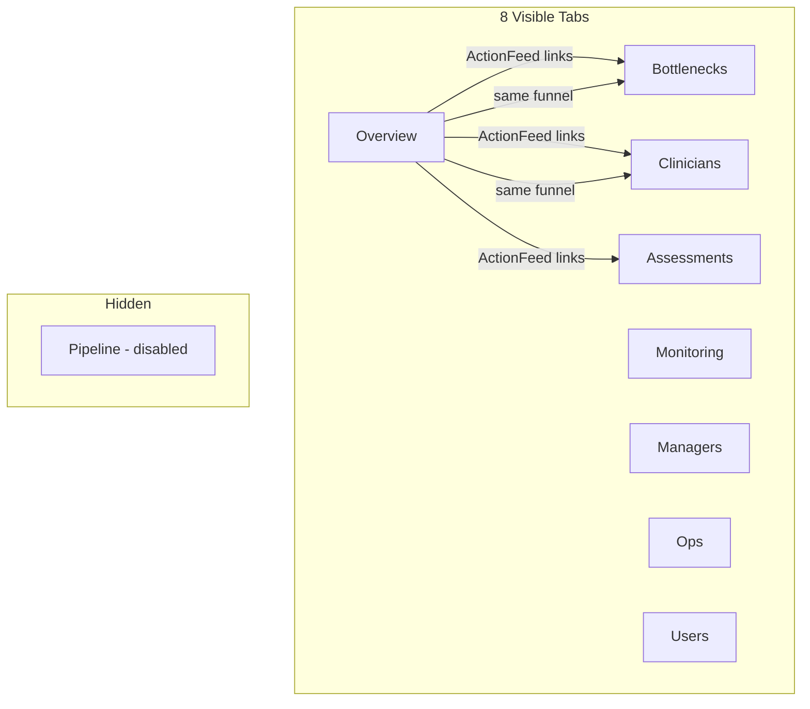
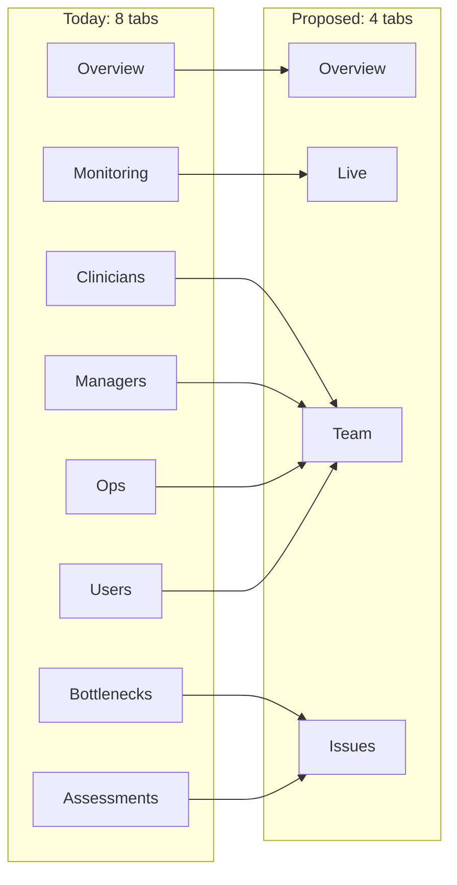

<!-- Generated by SpecStory, Markdown v2.1.0 -->

# 2026-05-25 13:15:10Z

<!-- Cursor IDE Session a87161ea-3e8c-4368-98d2-b7caa419623b (2026-05-25 13:15:10Z) -->

_**User**_

invoke the best system architect to audit the codebase. i feel a lot of info is being repeated in different tabs. also the are too many tabs in my opinion. can you do a thorough audit and suggest how we can reduce the cluter 

---

_**Agent (claude-sonnet-4-6)**_

I'll audit the codebase for tab structure and duplicated information. Starting with the app layout, navigation, and how data is shared across tabs.


_**Agent (claude-sonnet-4-6)**_

<tool-use data-tool-type="read" data-tool-name="read_file_v2">
<details><summary>Tool use: **read_file_v2** • Read file: C:\Users\Prithivi\.cursor\skills\backend-architect\SKILL.md</summary>

</details>
</tool-use>

<tool-use data-tool-type="read" data-tool-name="read_file_v2"><details>
<summary>Tool use: **read_file_v2**</summary>

</details></tool-use>

_**Agent (claude-sonnet-4-6)**_

<tool-use data-tool-type="unknown" data-tool-name="task_v2">
<details>
<summary>Tool use: **task_v2**</summary>


Parameters:

```json
{
  "description": "Explore tabs and navigation",
  "model": "composer-2.5-fast",
  "name": "explore",
  "prompt": "Thoroughly explore the Unity Dashboard codebase at \"e:\\Mom's Belief\\Unity Dashboard\" to understand:\n\n1. All tabs/pages in the application - list every tab, route, and navigation item\n2. What data/information each tab displays\n3. Where the same or similar information appears in multiple tabs (duplication)\n4. The overall app architecture (routing, layout, data fetching patterns)\n\nSearch for: navigation components, tab definitions, routes, sidebar, menu items, page components.\n\nReturn a structured report with:\n- Complete list of tabs/pages with brief description of content\n- Duplication matrix (what info appears where)\n- File paths for key navigation/routing files\n- Data sources used by each tab\n\nBe very thorough - check src/, app/, components/, pages/, routes/ etc.",
  "subagentType": "explore"
}
```
Additional data:

```json
{
  "status": "success",
  "subagentComposerId": "6c4338f6-df9c-464e-93dd-4c3ec6d3c204",
  "terminationReason": "completed"
}
```
Result:

```json
{
  "agentId": "6c4338f6-df9c-464e-93dd-4c3ec6d3c204"
}
```
Status: **completed**


</details>
</tool-use>

<tool-use data-tool-type="unknown" data-tool-name="task_v2"><details>
<summary>Tool use: **task_v2**</summary>

</details></tool-use>

_**Agent (claude-sonnet-4-6)**_

<tool-use data-tool-type="read" data-tool-name="read_file_v2">
<details><summary>Tool use: **read_file_v2** • Read file: e:\Mom's Belief\Unity Dashboard\DATA-DICTIONARY.md</summary>

</details>
</tool-use>

<tool-use data-tool-type="read" data-tool-name="read_file_v2"><details>
<summary>Tool use: **read_file_v2**</summary>

</details></tool-use>

_**Agent (claude-sonnet-4-6)**_

<tool-use data-tool-type="search" data-tool-name="glob_file_search">
<details>
<summary>Tool use: **glob_file_search** • Searched codebase "" • **10000** results in **1** directory</summary>

Directory: **e:\Mom's Belief\Unity Dashboard** (10000 files)

| File |
|------|
| `../.\frontend\.next\static\webpack\app\layout.ee9e0282f420f663.hot-update.js` |
| `../.\frontend\.next\static\chunks\app\page.js` |
| `../.\frontend\.next\server\app\page_client-reference-manifest.js` |
| `../.\frontend\.next\static\webpack\webpack.ee9e0282f420f663.hot-update.js` |
| `../.\frontend\.next\static\webpack\app\page.ee9e0282f420f663.hot-update.js` |
| `../.\frontend\.next\static\development\_ssgManifest.js` |
| `../.\frontend\.next\static\development\_buildManifest.js` |
| `../.\frontend\.next\static\chunks\webpack.js` |
| `../.\frontend\.next\static\chunks\app\layout.js` |
| `../.\frontend\.next\server\next-font-manifest.js` |
| `../.\frontend\.next\server\middleware-react-loadable-manifest.js` |
| `../.\frontend\.next\server\middleware-build-manifest.js` |
| `../.\frontend\.next\types\app\page.ts` |
| `../.\frontend\.next\types\app\layout.ts` |
| `../.\frontend\.next\server\webpack-runtime.js` |
| `../.\frontend\.next\server\server-reference-manifest.js` |
| `../.\frontend\.next\server\app\page.js` |
| `../.\frontend\app\page.tsx` |
| `../.\frontend\.next\static\webpack\webpack.52e6264d96e4af6c.hot-update.js` |
| `../.\frontend\.next\static\webpack\app\page.52e6264d96e4af6c.hot-update.js` |
| `../.\frontend\.next\static\webpack\app\layout.52e6264d96e4af6c.hot-update.js` |
| `../.\frontend\.next\static\webpack\webpack.7b2c5f9d881ebb03.hot-update.js` |
| `../.\frontend\.next\static\webpack\app\page.7b2c5f9d881ebb03.hot-update.js` |
| `../.\frontend\.next\static\webpack\app\layout.7b2c5f9d881ebb03.hot-update.js` |
| `../.\frontend\.next\static\webpack\webpack.fa23e929a63142b0.hot-update.js` |
| `../.\frontend\.next\static\webpack\app\page.fa23e929a63142b0.hot-update.js` |
| `../.\frontend\.next\static\webpack\app\layout.fa23e929a63142b0.hot-update.js` |
| `../.\frontend\.next\static\webpack\webpack.1016bcbbfef037c4.hot-update.js` |
| `../.\frontend\.next\static\webpack\app\page.1016bcbbfef037c4.hot-update.js` |
| `../.\frontend\.next\static\webpack\app\layout.1016bcbbfef037c4.hot-update.js` |
| `../.\frontend\components\TabNav.tsx` |
| `../.\frontend\.next\static\chunks\main-app.js` |
| `../.\frontend\.next\static\chunks\app-pages-internals.js` |
| `../.\frontend\.next\server\vendor-chunks\xlsx.js` |
| `../.\frontend\.next\server\vendor-chunks\next.js` |
| `../.\frontend\.next\server\vendor-chunks\@swc.js` |
| `../.\frontend\.next\server\interception-route-rewrite-manifest.js` |
| `../.\frontend\.next\static\chunks\polyfills.js` |
| `../.\frontend\components\pipeline\PipelineStuckCases.tsx` |
| `../.\frontend\lib\types.ts` |
| `../.\backend\routes\pipeline.js` |
| `../.\frontend\components\monitoring\UserStatusTable.tsx` |
| `../.\frontend\components\pipeline\PipelineByCentre.tsx` |
| `../.\frontend\components\overview\CentreTable.tsx` |
| `../.\frontend\components\pipeline\PipelineFunnel.tsx` |
| `../.\frontend\lib\chartKeys.ts` |
| `../.\backend\routes\overview.js` |
| `../.\frontend\components\shared\RoleDrillDownPanel.tsx` |
| `../.\frontend\components\shared\DrillDownTable.tsx` |
| `../.\frontend\lib\actionNavigation.ts` |
| `../.\frontend\lib\dashboardTabs.ts` |
| `../.\frontend\components\pipeline\PipelineManagerTable.tsx` |
| `../.\frontend\components\pipeline\PipelineApprovalCards.tsx` |
| `../.\frontend\hooks\usePipeline.ts` |
| `../.\frontend\lib\api.ts` |
| `../.\backend\server.js` |
| `../.\frontend\components\TopBar.tsx` |
| `../.\frontend\components\users\UserProfileLink.tsx` |
| `../.\frontend\components\monitoring\MonitoringEngagementFunnel.tsx` |
| `../.\frontend\components\users\UserProfileDrawer.tsx` |
| `../.\frontend\components\FilterChips.tsx` |
| `../.\frontend\components\overview\MultipleAssessmentCasesPanel.tsx` |
| `../.\frontend\components\users\UsersTab.tsx` |
| `../.\frontend\components\assessments\AssessmentByCentreTable.tsx` |
| `../.\frontend\components\assessments\AssessmentClinicianMatrix.tsx` |
| `../.\frontend\components\assessments\OverdueAssessmentsTable.tsx` |
| `../.\frontend\components\bottlenecks\BottleneckActionTable.tsx` |
| `../.\frontend\components\centre-admins\CentreAdminTable.tsx` |
| `../.\frontend\components\managers\ManagerTable.tsx` |
| `../.\frontend\components\clinicians\ClinicianTable.tsx` |
| `../.\frontend\components\shared\RoleCentreTable.tsx` |
| `../.\frontend\components\shared\ScrollRegion.tsx` |
| `../.\frontend\components\assessments\AssessmentTypeCards.tsx` |
| `../.\frontend\app\layout.tsx` |
| `../.\backend\routes\assessments.js` |
| `../.\backend\routes\bottleneckDrillDown.js` |
| `../.\frontend\components\shared\DrillDownDetailLines.tsx` |
| `../.\backend\routes\roleDrillDown.js` |
| `../.\frontend\components\clinicians\ClinicianChart.tsx` |
| `../.\frontend\components\bottlenecks\BottleneckCards.tsx` |
| `../.\frontend\components\overview\MetricCards.tsx` |
| `../.\frontend\components\shared\KpiTooltip.tsx` |
| `../.\frontend\components\bottlenecks\BottleneckDrillDownPanel.tsx` |
| `../.\frontend\components\shared\ExportExcelButton.tsx` |
| `../.\frontend\components\shared\RoleFunnel.tsx` |
| `../.\frontend\lib\kpiDefinitions.ts` |
| `../.\backend\routes\role.js` |
| `../.\frontend\components\shared\SortableTh.tsx` |
| `../.\frontend\hooks\useSlideOverPanel.ts` |
| `../.\frontend\lib\filterScopeLabel.ts` |
| `../.\frontend\lib\idleClinician.ts` |
| `../.\frontend\app\users\[id]\page.tsx` |
| `../.\frontend\components\overview\ActionFeed.tsx` |
| `../.\frontend\hooks\useClinicalPipeline.ts` |
| `../.\frontend\hooks\useRoleSummary.ts` |
| `../.\frontend\hooks\useCentreAdmins.ts` |
| `../.\frontend\hooks\useManagers.ts` |
| `../.\frontend\hooks\useClinicians.ts` |
| `../.\frontend\hooks\useDashboardUrl.ts` |
| `../.\frontend\hooks\useBottlenecks.ts` |
| `../.\frontend\hooks\useAssessments.ts` |
| `../.\frontend\hooks\useMonitoring.ts` |
| `../.\frontend\hooks\useUserBreakdown.ts` |
| `../.\frontend\lib\datePresets.ts` |
| `../.\backend\routes\users.js` |
| `../.\frontend\node_modules\codepage\types\index.d.ts` |
| `../.\frontend\node_modules\codepage\dist\sbcs.full.js` |
| `../.\frontend\node_modules\codepage\cputils.js` |
| `../.\frontend\node_modules\codepage\cptable.js` |
| `../.\frontend\node_modules\codepage\dist\cpexcel.full.js` |
| `../.\frontend\node_modules\codepage\bits\950.js` |
| `../.\frontend\node_modules\codepage\bits\949.js` |
| `../.\frontend\node_modules\codepage\bits\936.js` |
| `../.\frontend\node_modules\codepage\bits\932.js` |
| `../.\frontend\node_modules\codepage\bits\895.js` |
| `../.\frontend\node_modules\codepage\bits\875.js` |
| `../.\frontend\node_modules\codepage\bits\874.js` |
| `../.\frontend\node_modules\codepage\bits\872.js` |
| `../.\frontend\node_modules\codepage\bits\870.js` |
| `../.\frontend\node_modules\codepage\bits\869.js` |
| `../.\frontend\node_modules\codepage\bits\866.js` |
| `../.\frontend\node_modules\codepage\bits\865.js` |
| `../.\frontend\node_modules\codepage\bits\864.js` |
| `../.\frontend\node_modules\codepage\bits\863.js` |
| `../.\frontend\node_modules\codepage\bits\862.js` |
| `../.\frontend\node_modules\codepage\bits\861.js` |
| `../.\frontend\node_modules\codepage\bits\860.js` |
| `../.\frontend\node_modules\codepage\bits\858.js` |
| `../.\frontend\node_modules\codepage\bits\857.js` |
| `../.\frontend\node_modules\codepage\bits\855.js` |
| `../.\frontend\node_modules\codepage\bits\852.js` |
| `../.\frontend\node_modules\codepage\bits\850.js` |
| `../.\frontend\node_modules\codepage\bits\808.js` |
| `../.\frontend\node_modules\codepage\bits\775.js` |
| `../.\frontend\node_modules\codepage\bits\737.js` |
| `../.\frontend\node_modules\codepage\bits\720.js` |
| `../.\frontend\node_modules\codepage\bits\708.js` |
| `../.\frontend\node_modules\codepage\bits\620.js` |
| `../.\frontend\node_modules\codepage\bits\57011.js` |
| `../.\frontend\node_modules\codepage\bits\57010.js` |
| `../.\frontend\node_modules\codepage\bits\57009.js` |
| `../.\frontend\node_modules\codepage\bits\57008.js` |
| `../.\frontend\node_modules\codepage\bits\57007.js` |
| `../.\frontend\node_modules\codepage\bits\57006.js` |
| `../.\frontend\node_modules\codepage\bits\57005.js` |
| `../.\frontend\node_modules\codepage\bits\57004.js` |
| `../.\frontend\node_modules\codepage\bits\54936.js` |
| `../.\frontend\node_modules\codepage\bits\57003.js` |
| `../.\frontend\node_modules\codepage\bits\52936.js` |
| `../.\frontend\node_modules\codepage\bits\57002.js` |
| `../.\frontend\node_modules\codepage\bits\51949.js` |
| `../.\frontend\node_modules\codepage\bits\51932.js` |
| `../.\frontend\node_modules\codepage\bits\50227.js` |
| `../.\frontend\node_modules\codepage\bits\51936.js` |
| `../.\frontend\node_modules\codepage\bits\50225.js` |
| `../.\frontend\node_modules\codepage\bits\50222.js` |
| `../.\frontend\node_modules\codepage\bits\50221.js` |
| `../.\frontend\node_modules\codepage\bits\50220.js` |
| `../.\frontend\node_modules\codepage\bits\500.js` |
| `../.\frontend\node_modules\codepage\bits\47451.js` |
| `../.\frontend\node_modules\codepage\bits\437.js` |
| `../.\frontend\node_modules\codepage\bits\38598.js` |
| `../.\frontend\node_modules\codepage\bits\37.js` |
| `../.\frontend\node_modules\codepage\bits\29001.js` |
| `../.\frontend\node_modules\codepage\bits\28606.js` |
| `../.\frontend\node_modules\codepage\bits\28605.js` |
| `../.\frontend\node_modules\codepage\bits\28604.js` |
| `../.\frontend\node_modules\codepage\bits\28603.js` |
| `../.\frontend\node_modules\codepage\bits\28601.js` |
| `../.\frontend\node_modules\codepage\bits\28600.js` |
| `../.\frontend\node_modules\codepage\bits\28599.js` |
| `../.\frontend\node_modules\codepage\bits\28598.js` |
| `../.\frontend\node_modules\codepage\bits\28597.js` |
| `../.\frontend\node_modules\codepage\bits\28596.js` |
| `../.\frontend\node_modules\codepage\bits\28595.js` |
| `../.\frontend\node_modules\codepage\bits\28594.js` |
| `../.\frontend\node_modules\codepage\bits\28593.js` |
| `../.\frontend\node_modules\codepage\bits\28592.js` |
| `../.\frontend\node_modules\codepage\bits\28591.js` |
| `../.\frontend\node_modules\codepage\bits\21027.js` |
| `../.\frontend\node_modules\codepage\bits\21866.js` |
| `../.\frontend\node_modules\codepage\bits\21025.js` |
| `../.\frontend\node_modules\codepage\bits\20949.js` |
| `../.\frontend\node_modules\codepage\bits\20936.js` |
| `../.\frontend\node_modules\codepage\bits\20932.js` |
| `../.\frontend\node_modules\xlsx\types\index.d.ts` |
| `../.\frontend\node_modules\codepage\bits\20924.js` |
| `../.\frontend\node_modules\codepage\bits\20880.js` |
| `../.\frontend\node_modules\codepage\bits\20905.js` |
| `../.\frontend\node_modules\codepage\bits\20871.js` |
| `../.\frontend\node_modules\codepage\bits\20866.js` |
| `../.\frontend\node_modules\codepage\bits\20838.js` |
| `../.\frontend\node_modules\codepage\bits\20833.js` |
| `../.\frontend\node_modules\codepage\bits\20424.js` |
| `../.\frontend\node_modules\codepage\bits\20423.js` |
| `../.\frontend\node_modules\codepage\bits\20420.js` |
| `../.\frontend\node_modules\codepage\bits\20297.js` |
| `../.\frontend\node_modules\codepage\bits\20290.js` |
| `../.\frontend\node_modules\codepage\bits\20285.js` |
| `../.\frontend\node_modules\codepage\bits\20284.js` |
| `../.\frontend\node_modules\codepage\bits\20280.js` |
| `../.\frontend\node_modules\codepage\bits\20278.js` |
| `../.\frontend\node_modules\codepage\bits\20277.js` |
| `../.\frontend\node_modules\codepage\bits\20273.js` |
| `../.\frontend\node_modules\codepage\bits\20269.js` |
| `../.\frontend\node_modules\codepage\bits\20261.js` |
| `../.\frontend\node_modules\codepage\bits\20108.js` |
| `../.\frontend\node_modules\codepage\bits\20107.js` |
| `../.\frontend\node_modules\codepage\bits\20106.js` |
| `../.\frontend\node_modules\codepage\bits\20105.js` |
| `../.\frontend\node_modules\codepage\bits\20005.js` |
| `../.\frontend\node_modules\codepage\bits\20002.js` |
| `../.\frontend\node_modules\codepage\bits\20003.js` |
| `../.\frontend\node_modules\codepage\bits\20004.js` |
| `../.\frontend\node_modules\codepage\bits\20001.js` |
| `../.\frontend\node_modules\codepage\bits\20000.js` |
| `../.\frontend\node_modules\codepage\bits\1361.js` |
| `../.\frontend\node_modules\codepage\bits\1258.js` |
| `../.\frontend\node_modules\xlsx\xlsxworker.js` |
| `../.\frontend\node_modules\xlsx\dist\xlsx.zahl.js` |
| `../.\frontend\node_modules\codepage\bits\1257.js` |
| `../.\frontend\node_modules\codepage\bits\1256.js` |
| `../.\frontend\node_modules\codepage\bits\1255.js` |
| `../.\frontend\node_modules\xlsx\dist\xlsx.mini.min.js` |
| `../.\frontend\node_modules\codepage\bits\1254.js` |
| `../.\frontend\node_modules\codepage\bits\1253.js` |
| `../.\frontend\node_modules\codepage\bits\1252.js` |
| `../.\frontend\node_modules\codepage\bits\1251.js` |
| `../.\frontend\node_modules\codepage\bits\1149.js` |
| `../.\frontend\node_modules\codepage\bits\1250.js` |
| `../.\frontend\node_modules\codepage\bits\1148.js` |
| `../.\frontend\node_modules\xlsx\xlsx.js` |
| `../.\frontend\node_modules\codepage\bits\1147.js` |
| `../.\frontend\node_modules\codepage\bits\1146.js` |
| `../.\frontend\node_modules\xlsx\dist\xlsx.full.min.js` |
| `../.\frontend\node_modules\codepage\bits\1145.js` |
| `../.\frontend\node_modules\codepage\bits\1144.js` |
| `../.\frontend\node_modules\codepage\bits\1143.js` |
| `../.\frontend\node_modules\codepage\bits\1142.js` |
| `../.\frontend\node_modules\codepage\bits\1141.js` |
| `../.\frontend\node_modules\xlsx\dist\xlsx.extendscript.js` |
| `../.\frontend\node_modules\codepage\bits\1140.js` |
| `../.\frontend\node_modules\codepage\bits\1132.js` |
| `../.\frontend\node_modules\codepage\bits\1047.js` |
| `../.\frontend\node_modules\codepage\bits\1026.js` |
| `../.\frontend\node_modules\codepage\bits\1010.js` |
| `../.\frontend\node_modules\xlsx\dist\xlsx.core.min.js` |
| `../.\frontend\node_modules\codepage\bits\10082.js` |
| `../.\frontend\node_modules\cfb\types\index.d.ts` |
| `../.\frontend\node_modules\codepage\bits\10081.js` |
| `../.\frontend\node_modules\codepage\bits\10079.js` |
| `../.\frontend\node_modules\codepage\bits\10029.js` |
| `../.\frontend\node_modules\codepage\bits\10021.js` |
| `../.\frontend\node_modules\codepage\bits\10017.js` |
| `../.\frontend\node_modules\codepage\bits\10010.js` |
| `../.\frontend\node_modules\codepage\bits\10008.js` |
| `../.\frontend\node_modules\xlsx\dist\shim.min.js` |
| `../.\frontend\node_modules\codepage\bits\10007.js` |
| `../.\frontend\node_modules\xlsx\dist\cpexcel.js` |
| `../.\frontend\node_modules\codepage\bits\10006.js` |
| `../.\frontend\node_modules\cfb\dist\xlscfb.js` |
| `../.\frontend\node_modules\codepage\bits\10005.js` |
| `../.\frontend\node_modules\codepage\bits\10004.js` |
| `../.\frontend\node_modules\cfb\xlscfb.flow.js` |
| `../.\frontend\node_modules\codepage\bits\10003.js` |
| `../.\frontend\node_modules\cfb\dist\cfb.min.js` |
| `../.\frontend\node_modules\crc-32\types\index.d.ts` |
| `../.\frontend\node_modules\codepage\bits\10002.js` |
| `../.\frontend\node_modules\frac\types\index.d.ts` |
| `../.\frontend\node_modules\ssf\types\index.d.ts` |
| `../.\frontend\node_modules\cfb\dist\cfb.js` |
| `../.\frontend\node_modules\adler-32\types\index.d.ts` |
| `../.\frontend\node_modules\cfb\cfb.js` |
| `../.\frontend\node_modules\word\word.js` |
| `../.\frontend\node_modules\wmf\dist\wmf.node.js` |
| `../.\frontend\node_modules\wmf\dist\wmf.js` |
| `../.\frontend\node_modules\codepage\bits\10001.js` |
| `../.\frontend\node_modules\frac\dist\frac.min.js` |
| `../.\frontend\node_modules\frac\dist\frac.js` |
| `../.\frontend\node_modules\ssf\ssf.js` |
| `../.\frontend\node_modules\ssf\ssf.flow.js` |
| `../.\frontend\node_modules\adler-32\adler32.js` |
| `../.\frontend\node_modules\crc-32\crc32c.js` |
| `../.\frontend\node_modules\codepage\bits\10000.js` |
| `../.\frontend\node_modules\crc-32\crc32.js` |
| `../.\frontend\node_modules\frac\frac.js` |
| `../.\frontend\lib\exportMultipleAssessmentExcel.ts` |
| `../.\frontend\lib\exportDrillDownExcel.ts` |
| `../.\frontend\lib\exportExcel.ts` |
| `../.\frontend\hooks\useActionFocus.ts` |
| `../.\frontend\lib\drillDownDisplay.ts` |
| `../.\frontend\components\shared\ClinicalPipelineCard.tsx` |
| `../.\frontend\lib\clinicalPipelineSteps.ts` |
| `../.\frontend\components\overview\EventTypeChart.tsx` |
| `../.\frontend\components\bottlenecks\BottleneckFunnel.tsx` |
| `../.\backend\lib\pipelineDetailExprs.js` |
| `../.\frontend\components\monitoring\MonitoringCards.tsx` |
| `../.\frontend\lib\monitoringStats.ts` |
| `../.\backend\routes\bottlenecks.js` |
| `../.\frontend\components\users\UserActionBreakdown.tsx` |
| `../.\frontend\components\users\RecentActionsTable.tsx` |
| `../.\frontend\components\bottlenecks\BottleneckByCentre.tsx` |
| `../.\frontend\components\monitoring\MonitoringCentreChart.tsx` |
| `../.\frontend\components\monitoring\MonitoringTrendChart.tsx` |
| `../.\frontend\components\monitoring\ActivityHeatmap.tsx` |
| `../.\frontend\components\assessments\AssessmentCompletionChart.tsx` |
| `../.\frontend\components\bottlenecks\BottleneckTrendChart.tsx` |
| `../.\frontend\lib\bottleneckDrillDown.ts` |
| `../.\frontend\lib\roleDrillDown.ts` |
| `../.\frontend\components\shared\RoleCentreChart.tsx` |
| `../.\frontend\components\managers\ManagerChart.tsx` |
| `../.\backend\routes\clinicians.js` |
| `../.\frontend\components\centre-admins\CentreAdminChart.tsx` |
| `../.\backend\lib\clinicalPipelineQueries.js` |
| `../.\frontend\lib\auditEventLabels.ts` |
| `../.\backend\lib\auditEventLabels.js` |
| `../.\backend\routes\monitoring.js` |
| `../.\frontend\components\shared\PersonActivityChart.tsx` |
| `../.\frontend\tailwind.config.ts` |
| `../.\frontend\components\users\UserKpiCards.tsx` |
| `../.\frontend\lib\assessmentBadges.ts` |
| `../.\generate-data-dictionary.js` |
| `../.\frontend\hooks\useUserSummaryProfile.ts` |
| `../.\frontend\lib\roleStats.ts` |
| `../.\frontend\hooks\useRoleDrillDown.ts` |
| `../.\frontend\hooks\useBottleneckDrillDown.ts` |
| `../.\frontend\lib\unityLinks.ts` |
| `../.\frontend\components\monitoring\LivePulse.tsx` |
| `../.\frontend\components\users\ActiveCaseloadTable.tsx` |
| `../.\frontend\components\users\UserTrendChart.tsx` |
| `../.\frontend\hooks\useUserProfile.ts` |
| `../.\frontend\lib\userProfile.ts` |
| `../.\frontend\lib\aggregatePeople.ts` |
| `../.\backend\routes\centre-admins.js` |
| `../.\backend\routes\managers.js` |
| `../.\backend\lib\queryHelpers.js` |
| `../.\frontend\components\monitoring\DayPicker.tsx` |
| `../.\frontend\lib\centreNames.ts` |
| `../.\copy-logo.js` |
| `../.\frontend\next-env.d.ts` |
| `../.\frontend\next.config.js` |
| `../.\frontend\node_modules\@emnapi\wasi-threads\dist\wasi-threads.d.ts` |
| `../.\frontend\node_modules\@emnapi\wasi-threads\dist\wasi-threads.cjs.min.d.ts` |
| `../.\frontend\node_modules\@emnapi\wasi-threads\dist\wasi-threads.min.js` |
| `../.\frontend\node_modules\@emnapi\wasi-threads\dist\wasi-threads.js` |
| `../.\frontend\node_modules\@emnapi\wasi-threads\dist\wasi-threads.esm-bundler.js` |
| `../.\frontend\node_modules\@emnapi\wasi-threads\dist\wasi-threads.cjs.min.js` |
| `../.\frontend\node_modules\@emnapi\wasi-threads\dist\wasi-threads.cjs.js` |
| `../.\frontend\node_modules\@emnapi\wasi-threads\index.js` |
| `../.\frontend\node_modules\next\dist\lib\typescript\writeConfigurationDefaults.d.ts` |
| `../.\frontend\node_modules\next\dist\lib\typescript\writeAppTypeDeclarations.d.ts` |
| `../.\frontend\node_modules\next\dist\lib\eslint\writeOutputFile.d.ts` |
| `../.\frontend\node_modules\next\dist\lib\eslint\writeDefaultConfig.d.ts` |
| `../.\frontend\node_modules\next\dist\build\write-build-id.d.ts` |
| `../.\frontend\node_modules\next\dist\lib\fs\write-atomic.d.ts` |
| `../.\frontend\node_modules\next\dist\lib\worker.d.ts` |
| `../.\frontend\node_modules\next\dist\lib\with-promise-cache.d.ts` |
| `../.\frontend\node_modules\next\dist\export\worker.d.ts` |
| `../.\frontend\node_modules\next\dist\server\lib\worker-utils.d.ts` |
| `../.\frontend\node_modules\next\dist\server\future\normalizers\wrap-normalizer-fn.d.ts` |
| `../.\frontend\node_modules\next\dist\client\with-router.d.ts` |
| `../.\frontend\node_modules\next\dist\build\worker.d.ts` |
| `../.\frontend\node_modules\next\dist\client\dev\error-overlay\websocket.d.ts` |
| `../.\frontend\node_modules\next\dist\client\components\react-dev-overlay\pages\websocket.d.ts` |
| `../.\frontend\node_modules\next\dist\build\webpack\plugins\wellknown-errors-plugin\webpackModuleError.d.ts` |
| `../.\frontend\node_modules\next\dist\compiled\webpack\webpack.d.ts` |
| `../.\frontend\node_modules\next\dist\client\webpack.d.ts` |
| `../.\frontend\node_modules\next\dist\build\webpack-config.d.ts` |
| `../.\frontend\node_modules\next\web-vitals.d.ts` |
| `../.\frontend\node_modules\next\dist\esm\server\lib\squoosh\webp\webp_enc.d.ts` |
| `../.\frontend\node_modules\next\dist\lib\wait.d.ts` |
| `../.\frontend\node_modules\next\dist\shared\lib\utils\warn-once.d.ts` |
| `../.\frontend\node_modules\next\dist\server\api-utils\web.d.ts` |
| `../.\frontend\node_modules\next\dist\server\base-http\web.d.ts` |
| `../.\frontend\node_modules\next\dist\server\web-server.d.ts` |
| `../.\frontend\node_modules\next\dist\server\app-render\walk-tree-with-flight-router-state.d.ts` |
| `../.\frontend\node_modules\next\dist\server\response-cache\web.d.ts` |
| `../.\frontend\node_modules\next\dist\server\lib\squoosh\webp\webp_enc.d.ts` |
| `../.\frontend\node_modules\next\dist\client\web-vitals.d.ts` |
| `../.\frontend\node_modules\next\dist\build\webpack\loaders\postcss-loader\src\Warning.d.ts` |
| `../.\frontend\node_modules\next\dist\client\components\react-dev-overlay\internal\components\VersionStalenessInfo\VersionStalenessInfo.d.ts` |
| `../.\frontend\node_modules\next\dist\telemetry\events\version.d.ts` |
| `../.\frontend\node_modules\next\dist\lib\verifyAndLint.d.ts` |
| `../.\frontend\node_modules\next\dist\lib\verify-typescript-setup.d.ts` |
| `../.\frontend\node_modules\next\dist\lib\verify-root-layout.d.ts` |
| `../.\frontend\node_modules\next\dist\lib\verify-partytown-setup.d.ts` |
| `../.\frontend\node_modules\next\dist\server\app-render\validate-url.d.ts` |
| `../.\frontend\node_modules\next\dist\compiled\@next\font\dist\local\validate-local-font-function-call.test.d.ts` |
| `../.\frontend\node_modules\next\dist\compiled\@next\font\dist\local\validate-local-font-function-call.d.ts` |
| `../.\frontend\node_modules\next\dist\compiled\@next\font\dist\google\validate-google-font-function-call.test.d.ts` |
| `../.\frontend\node_modules\next\dist\build\webpack\loaders\resolve-url-loader\lib\value-processor.d.ts` |
| `../.\frontend\node_modules\next\dist\compiled\@next\font\dist\google\validate-google-font-function-call.d.ts` |
| `../.\frontend\node_modules\next\dist\server\web\utils.test.d.ts` |
| `../.\frontend\node_modules\next\dist\shared\lib\utils.d.ts` |
| `../.\frontend\node_modules\next\dist\lib\metadata\generate\utils.d.ts` |
| `../.\frontend\node_modules\next\dist\export\utils.d.ts` |
| `../.\frontend\node_modules\next\dist\server\web\utils.d.ts` |
| `../.\frontend\node_modules\next\dist\server\response-cache\utils.d.ts` |
| `../.\frontend\node_modules\next\dist\server\lib\utils.d.ts` |
| `../.\frontend\node_modules\next\dist\server\utils.d.ts` |
| `../.\frontend\node_modules\next\dist\server\typescript\utils.d.ts` |
| `../.\frontend\node_modules\next\dist\server\lib\server-ipc\utils.d.ts` |
| `../.\frontend\node_modules\next\dist\build\webpack\utils.d.ts` |
| `../.\frontend\node_modules\next\dist\build\webpack\loaders\utils.d.ts` |
| `../.\frontend\node_modules\next\dist\build\webpack\loaders\postcss-loader\src\utils.d.ts` |
| `../.\frontend\node_modules\next\dist\build\webpack\loaders\lightningcss-loader\src\utils.d.ts` |
| `../.\frontend\node_modules\next\dist\build\webpack\loaders\css-loader\src\utils.d.ts` |
| `../.\frontend\node_modules\next\dist\build\webpack\config\utils.d.ts` |
| `../.\frontend\node_modules\next\dist\build\utils.d.ts` |
| `../.\frontend\node_modules\next\dist\build\babel\loader\util.d.ts` |
| `../.\frontend\node_modules\next\dist\server\web\spec-extension\user-agent.d.ts` |
| `../.\frontend\node_modules\next\dist\client\components\react-dev-overlay\internal\helpers\use-websocket.d.ts` |
| `../.\frontend\node_modules\next\dist\client\components\use-reducer-with-devtools.d.ts` |
| `../.\frontend\node_modules\next\dist\client\components\react-dev-overlay\internal\helpers\use-open-in-editor.d.ts` |
| `../.\frontend\node_modules\next\dist\client\components\react-dev-overlay\internal\hooks\use-on-click-outside.d.ts` |
| `../.\frontend\node_modules\next\dist\client\use-intersection.d.ts` |
| `../.\frontend\node_modules\next\dist\server\app-render\use-flight-response.d.ts` |
| `../.\frontend\node_modules\next\dist\trace\upload-trace.d.ts` |
| `../.\frontend\node_modules\next\dist\lib\url.d.ts` |
| `../.\frontend\node_modules\next\dist\server\web\spec-extension\url-pattern.d.ts` |
| `../.\frontend\node_modules\next\dist\server\web\spec-extension\unstable-no-store.d.ts` |
| `../.\frontend\node_modules\next\dist\compiled\@edge-runtime\primitives\url.d.ts` |
| `../.\frontend\node_modules\next\dist\client\components\react-dev-overlay\internal\helpers\use-error-handler.d.ts` |
| `../.\frontend\node_modules\next\dist\server\web\spec-extension\unstable-cache.d.ts` |
| `../.\frontend\node_modules\next\dist\server\future\normalizers\underscore-normalizer.d.ts` |
| `../.\frontend\node_modules\next\dist\client\components\unresolved-thenable.d.ts` |
| `../.\frontend\node_modules\next\dist\server\stream-utils\uint8array-helpers.d.ts` |
| `../.\frontend\node_modules\next\dist\server\app-render\types.test.d.ts` |
| `../.\frontend\node_modules\next\dist\trace\types.d.ts` |
| `../.\frontend\node_modules\next\dist\trace\report\types.d.ts` |
| `../.\frontend\node_modules\next\dist\shared\lib\lazy-dynamic\types.d.ts` |
| `../.\frontend\node_modules\next\dist\server\web\types.d.ts` |
| `../.\frontend\node_modules\next\dist\server\response-cache\types.d.ts` |
| `../.\frontend\node_modules\next\dist\server\lib\types.d.ts` |
| `../.\frontend\node_modules\next\dist\server\dev\turbopack\types.d.ts` |
| `../.\frontend\node_modules\next\dist\server\lib\router-utils\types.d.ts` |
| `../.\frontend\node_modules\next\dist\server\app-render\types.d.ts` |
| `../.\frontend\node_modules\next\dist\export\types.d.ts` |
| `../.\frontend\node_modules\next\dist\export\routes\types.d.ts` |
| `../.\frontend\node_modules\next\dist\experimental\testmode\proxy\types.d.ts` |
| `../.\frontend\node_modules\next\dist\esm\build\babel\loader\types.d.ts` |
| `../.\frontend\node_modules\next\dist\compiled\@vercel\og\types.d.ts` |
| `../.\frontend\node_modules\next\dist\compiled\@next\font\dist\types.d.ts` |
| `../.\frontend\node_modules\next\dist\build\babel\loader\types.d.ts` |
| `../.\frontend\node_modules\next\dist\build\type-check.d.ts` |
| `../.\frontend\node_modules\next\dist\build\turborepo-access-trace\types.d.ts` |
| `../.\frontend\node_modules\next\dist\build\webpack\loaders\metadata\types.d.ts` |
| `../.\frontend\node_modules\next\dist\lib\metadata\types\twitter-types.d.ts` |
| `../.\frontend\node_modules\next\dist\lib\turbopack-warning.d.ts` |
| `../.\frontend\node_modules\next\dist\server\dev\turbopack-utils.d.ts` |
| `../.\frontend\node_modules\next\dist\lib\try-to-parse-path.d.ts` |
| `../.\frontend\node_modules\next\dist\server\api-utils\node\try-get-preview-data.d.ts` |
| `../.\frontend\node_modules\next\dist\trace\trace.test.d.ts` |
| `../.\frontend\node_modules\next\dist\trace\trace.d.ts` |
| `../.\frontend\node_modules\next\dist\trace\trace-uploader.d.ts` |
| `../.\frontend\node_modules\next\dist\trace\report\to-telemetry.d.ts` |
| `../.\frontend\node_modules\next\dist\lib\memory\trace.d.ts` |
| `../.\frontend\node_modules\next\dist\server\lib\trace\tracer.d.ts` |
| `../.\frontend\node_modules\next\dist\client\trusted-types.d.ts` |
| `../.\frontend\node_modules\next\dist\client\tracing\tracer.d.ts` |
| `../.\frontend\node_modules\next\dist\build\babel\loader\transform.d.ts` |
| `../.\frontend\node_modules\next\dist\client\components\react-dev-overlay\internal\components\Toast\Toast.d.ts` |
| `../.\frontend\node_modules\next\dist\server\lib\to-route.test.d.ts` |
| `../.\frontend\node_modules\next\dist\server\lib\to-route.d.ts` |
| `../.\frontend\node_modules\next\dist\trace\report\to-json.d.ts` |
| `../.\frontend\node_modules\next\dist\server\app-render\rsc\taint.d.ts` |
| `../.\frontend\node_modules\next\dist\compiled\@edge-runtime\primitives\timers.d.ts` |
| `../.\frontend\node_modules\next\dist\build\webpack\plugins\telemetry-plugin.d.ts` |
| `../.\frontend\node_modules\next\dist\build\turborepo-access-trace\tcp.d.ts` |
| `../.\frontend\node_modules\next\dist\client\components\react-dev-overlay\internal\components\Terminal\Terminal.d.ts` |
| `../.\frontend\node_modules\next\dist\telemetry\events\swc-plugins.d.ts` |
| `../.\frontend\node_modules\next\dist\telemetry\events\swc-load-failure.d.ts` |
| `../.\frontend\node_modules\next\dist\server\future\normalizers\request\suffix.test.d.ts` |
| `../.\frontend\node_modules\next\dist\server\future\normalizers\request\suffix.d.ts` |
| `../.\frontend\node_modules\next\dist\build\webpack\plugins\subresource-integrity-plugin.d.ts` |
| `../.\frontend\node_modules\next\dist\client\components\react-dev-overlay\internal\components\VersionStalenessInfo\styles.d.ts` |
| `../.\frontend\node_modules\next\dist\client\components\react-dev-overlay\internal\components\Toast\styles.d.ts` |
| `../.\frontend\node_modules\next\dist\client\components\react-dev-overlay\internal\components\Terminal\styles.d.ts` |
| `../.\frontend\node_modules\next\dist\shared\lib\styled-jsx.d.ts` |
| `../.\frontend\node_modules\next\dist\client\components\react-dev-overlay\internal\components\Dialog\styles.d.ts` |
| `../.\frontend\node_modules\next\dist\client\components\react-dev-overlay\internal\components\Overlay\styles.d.ts` |
| `../.\frontend\node_modules\next\dist\client\components\react-dev-overlay\internal\components\CodeFrame\styles.d.ts` |
| `../.\frontend\node_modules\next\dist\client\components\react-dev-overlay\internal\components\LeftRightDialogHeader\styles.d.ts` |
| `../.\frontend\node_modules\next\dist\esm\shared\lib\styled-jsx.d.ts` |
| `../.\frontend\node_modules\next\dist\styled-jsx\types\style.d.ts` |
| `../.\frontend\node_modules\next\dist\compiled\@edge-runtime\primitives\structured-clone.d.ts` |
| `../.\frontend\node_modules\next\dist\server\app-render\strip-flight-headers.d.ts` |
| `../.\frontend\node_modules\next\dist\build\webpack\stringify-request.d.ts` |
| `../.\frontend\node_modules\next\dist\build\output\store.d.ts` |
| `../.\frontend\node_modules\next\dist\telemetry\storage.d.ts` |
| `../.\frontend\node_modules\next\dist\experimental\testmode\playwright\step.d.ts` |
| `../.\frontend\node_modules\next\dist\server\app-render\static\static-renderer.d.ts` |
| `../.\frontend\node_modules\next\dist\server\dev\static-paths-worker.d.ts` |
| `../.\frontend\node_modules\next\dist\client\components\static-generation-bailout.d.ts` |
| `../.\frontend\node_modules\next\dist\client\components\static-generation-async-storage.external.d.ts` |
| `../.\frontend\node_modules\next\dist\server\async-storage\static-generation-async-storage-wrapper.d.ts` |
| `../.\frontend\node_modules\next\dist\client\components\static-generation-async-storage-instance.d.ts` |
| `../.\frontend\node_modules\next\dist\lib\memory\startup.d.ts` |
| `../.\frontend\node_modules\next\dist\server\lib\start-server.d.ts` |
| `../.\frontend\node_modules\next\dist\build\spinner.d.ts` |
| `../.\frontend\node_modules\next\dist\client\components\react-dev-overlay\internal\helpers\stack-frame.d.ts` |
| `../.\frontend\node_modules\next\dist\shared\lib\router\utils\sorted-routes.d.ts` |
| `../.\frontend\node_modules\next\dist\compiled\@next\font\dist\google\sort-fonts-variant-values.test.d.ts` |
| `../.\frontend\node_modules\next\dist\compiled\@next\font\dist\google\sort-fonts-variant-values.d.ts` |
| `../.\frontend\node_modules\next\dist\build\webpack\plugins\wellknown-errors-plugin\simpleWebpackError.d.ts` |
| `../.\frontend\node_modules\next\dist\shared\lib\side-effect.d.ts` |
| `../.\frontend\node_modules\next\dist\lib\memory\shutdown.d.ts` |
| `../.\frontend\node_modules\next\dist\client\components\router-reducer\should-hard-navigate.test.d.ts` |
| `../.\frontend\node_modules\next\dist\trace\shared.d.ts` |
| `../.\frontend\node_modules\next\dist\server\lib\incremental-cache\shared-revalidate-timings.test.d.ts` |
| `../.\frontend\node_modules\next\dist\build\webpack\plugins\next-types-plugin\shared.d.ts` |
| `../.\frontend\node_modules\next\dist\client\components\router-reducer\should-hard-navigate.d.ts` |
| `../.\frontend\node_modules\next\dist\client\components\react-dev-overlay\shared.d.ts` |
| `../.\frontend\node_modules\next\dist\client\components\react-dev-overlay\server\shared.d.ts` |
| `../.\frontend\node_modules\next\dist\server\future\route-modules\app-route\shared-modules.d.ts` |
| `../.\frontend\node_modules\next\dist\server\lib\incremental-cache\shared-revalidate-timings.d.ts` |
| `../.\frontend\node_modules\next\dist\client\components\react-dev-overlay\internal\components\ShadowPortal.d.ts` |
| `../.\frontend\node_modules\next\dist\client\setup-hydration-warning.d.ts` |
| `../.\frontend\node_modules\next\dist\server\setup-http-agent-env.d.ts` |
| `../.\frontend\node_modules\next\dist\server\lib\router-utils\setup-dev-bundler.d.ts` |
| `../.\frontend\node_modules\next\dist\telemetry\events\session-stopped.d.ts` |
| `../.\frontend\node_modules\next\server.d.ts` |
| `../.\frontend\node_modules\next\dist\api\server.d.ts` |
| `../.\frontend\node_modules\next\dist\experimental\testmode\server.d.ts` |
| `../.\frontend\node_modules\next\dist\experimental\testmode\proxy\server.d.ts` |
| `../.\frontend\node_modules\next\dist\server\server-route-utils.d.ts` |
| `../.\frontend\node_modules\next\dist\server\typescript\rules\server.d.ts` |
| `../.\frontend\node_modules\next\dist\server\server-utils.d.ts` |
| `../.\frontend\node_modules\next\dist\build\webpack\loaders\next-flight-loader\server-reference.d.ts` |
| `../.\frontend\node_modules\next\dist\shared\lib\server-inserted-html.shared-runtime.d.ts` |
| `../.\frontend\node_modules\next\dist\experimental\testmode\server-edge.d.ts` |
| `../.\frontend\node_modules\next\dist\server\app-render\server-inserted-html.d.ts` |
| `../.\frontend\node_modules\next\dist\server\typescript\rules\server-boundary.d.ts` |
| `../.\frontend\node_modules\next\dist\server\lib\server-action-request-meta.d.ts` |
| `../.\frontend\node_modules\next\dist\server\future\route-matcher-providers\helpers\manifest-loaders\server-manifest-loader.d.ts` |
| `../.\frontend\node_modules\next\dist\client\components\router-reducer\reducers\server-patch-reducer.d.ts` |
| `../.\frontend\node_modules\next\dist\client\components\router-reducer\reducers\server-action-reducer.d.ts` |
| `../.\frontend\node_modules\next\dist\server\serve-static.d.ts` |
| `../.\frontend\node_modules\next\dist\server\send-response.d.ts` |
| `../.\frontend\node_modules\next\dist\server\send-payload.d.ts` |
| `../.\frontend\node_modules\next\dist\lib\semver-noop.d.ts` |
| `../.\frontend\node_modules\next\dist\shared\lib\segment.d.ts` |
| `../.\frontend\node_modules\next\script.d.ts` |
| `../.\frontend\node_modules\next\dist\client\components\search-params.d.ts` |
| `../.\frontend\node_modules\next\dist\client\script.d.ts` |
| `../.\frontend\node_modules\next\dist\lib\typescript\runTypeCheck.d.ts` |
| `../.\frontend\node_modules\next\dist\lib\scheduler.d.ts` |
| `../.\frontend\node_modules\next\dist\api\script.d.ts` |
| `../.\frontend\node_modules\next\dist\server\web\sandbox\sandbox.d.ts` |
| `../.\frontend\node_modules\next\dist\client\components\react-dev-overlay\internal\helpers\runtime-error-handler.d.ts` |
| `../.\frontend\node_modules\next\dist\shared\lib\runtime-config.external.d.ts` |
| `../.\frontend\node_modules\next\router.d.ts` |
| `../.\frontend\node_modules\next\dist\shared\lib\router-context.shared-runtime.d.ts` |
| `../.\frontend\node_modules\next\dist\api\router.d.ts` |
| `../.\frontend\node_modules\next\compat\router.d.ts` |
| `../.\frontend\node_modules\next\dist\lib\eslint\runLintCheck.d.ts` |
| `../.\frontend\node_modules\next\dist\shared\lib\router\router.d.ts` |
| `../.\frontend\node_modules\next\dist\server\lib\router-server.d.ts` |
| `../.\frontend\node_modules\next\dist\server\future\normalizers\request\rsc.d.ts` |
| `../.\frontend\node_modules\next\dist\client\router.d.ts` |
| `../.\frontend\node_modules\next\dist\client\components\router-reducer\router-reducer.d.ts` |
| `../.\frontend\node_modules\next\dist\client\components\router-reducer\router-reducer-types.d.ts` |
| `../.\frontend\node_modules\next\dist\client\compat\router.d.ts` |
| `../.\frontend\node_modules\next\dist\shared\lib\router\utils\route-regex.test.d.ts` |
| `../.\frontend\node_modules\next\dist\shared\lib\router\utils\route-regex.d.ts` |
| `../.\frontend\node_modules\next\dist\server\future\route-modules\route-module.d.ts` |
| `../.\frontend\node_modules\next\dist\server\future\helpers\module-loader\route-module-loader.d.ts` |
| `../.\frontend\node_modules\next\dist\shared\lib\router\utils\route-matcher.d.ts` |
| `../.\frontend\node_modules\next\dist\server\future\route-matchers\route-matcher.d.ts` |
| `../.\frontend\node_modules\next\dist\server\future\route-matcher-providers\route-matcher-provider.d.ts` |
| `../.\frontend\node_modules\next\dist\server\future\route-matcher-managers\route-matcher-manager.d.ts` |
| `../.\frontend\node_modules\next\dist\server\future\route-matches\route-match.d.ts` |
| `../.\frontend\node_modules\next\dist\client\route-loader.d.ts` |
| `../.\frontend\node_modules\next\dist\server\future\route-kind.d.ts` |
| `../.\frontend\node_modules\next\dist\server\future\route-definitions\route-definition.d.ts` |
| `../.\frontend\node_modules\next\dist\server\web\spec-extension\revalidate.d.ts` |
| `../.\frontend\node_modules\next\dist\server\lib\revalidate.d.ts` |
| `../.\frontend\node_modules\next\dist\compiled\@next\font\dist\google\retry.d.ts` |
| `../.\frontend\node_modules\next\dist\client\route-announcer.d.ts` |
| `../.\frontend\node_modules\next\dist\client\components\react-dev-overlay\internal\container\root-layout-missing-tags-error.d.ts` |
| `../.\frontend\node_modules\next\dist\build\turborepo-access-trace\result.d.ts` |
| `../.\frontend\node_modules\next\dist\server\web\spec-extension\response.d.ts` |
| `../.\frontend\node_modules\next\dist\client\components\router-reducer\reducers\restore-reducer.d.ts` |
| `../.\frontend\node_modules\next\dist\server\future\route-modules\helpers\response-handlers.d.ts` |
| `../.\frontend\node_modules\next\dist\server\web\sandbox\resource-managers.d.ts` |
| `../.\frontend\node_modules\next\dist\lib\metadata\types\resolvers.d.ts` |
| `../.\frontend\node_modules\next\dist\lib\metadata\resolvers\resolve-url.test.d.ts` |
| `../.\frontend\node_modules\next\dist\lib\metadata\resolvers\resolve-url.d.ts` |
| `../.\frontend\node_modules\next\dist\build\webpack-config-rules\resolve.d.ts` |
| `../.\frontend\node_modules\next\dist\lib\metadata\resolvers\resolve-title.test.d.ts` |
| `../.\frontend\node_modules\next\dist\lib\metadata\resolvers\resolve-title.d.ts` |
| `../.\frontend\node_modules\next\dist\server\lib\router-utils\resolve-routes.d.ts` |
| `../.\frontend\node_modules\next\dist\build\webpack\loaders\metadata\resolve-route-data.test.d.ts` |
| `../.\frontend\node_modules\next\dist\build\webpack\loaders\metadata\resolve-route-data.d.ts` |
| `../.\frontend\node_modules\next\dist\shared\lib\router\utils\resolve-rewrites.d.ts` |
| `../.\frontend\node_modules\next\dist\lib\metadata\resolvers\resolve-opengraph.test.d.ts` |
| `../.\frontend\node_modules\next\dist\lib\metadata\resolvers\resolve-opengraph.d.ts` |
| `../.\frontend\node_modules\next\dist\lib\resolve-from.d.ts` |
| `../.\frontend\node_modules\next\dist\lib\metadata\resolvers\resolve-icons.d.ts` |
| `../.\frontend\node_modules\next\dist\lib\metadata\resolve-metadata.test.d.ts` |
| `../.\frontend\node_modules\next\dist\lib\metadata\resolve-metadata.d.ts` |
| `../.\frontend\node_modules\next\dist\server\future\route-modules\app-route\helpers\resolve-handler-error.d.ts` |
| `../.\frontend\node_modules\next\dist\client\resolve-href.d.ts` |
| `../.\frontend\node_modules\next\dist\lib\metadata\resolvers\resolve-basics.d.ts` |
| `../.\frontend\node_modules\next\dist\server\app-render\required-scripts.d.ts` |
| `../.\frontend\node_modules\next\dist\server\require.d.ts` |
| `../.\frontend\node_modules\next\dist\server\require-hook.d.ts` |
| `../.\frontend\node_modules\next\dist\server\web\spec-extension\request.d.ts` |
| `../.\frontend\node_modules\next\dist\server\request-meta.d.ts` |
| `../.\frontend\node_modules\next\dist\server\lib\server-ipc\request-utils.d.ts` |
| `../.\frontend\node_modules\next\dist\client\request-idle-callback.d.ts` |
| `../.\frontend\node_modules\next\dist\server\web\spec-extension\adapters\request-cookies.test.d.ts` |
| `../.\frontend\node_modules\next\dist\server\web\spec-extension\adapters\request-cookies.d.ts` |
| `../.\frontend\node_modules\next\dist\experimental\testmode\playwright\report.d.ts` |
| `../.\frontend\node_modules\next\dist\server\async-storage\request-async-storage-wrapper.d.ts` |
| `../.\frontend\node_modules\next\dist\server\render.d.ts` |
| `../.\frontend\node_modules\next\dist\client\tracing\report-to-socket.d.ts` |
| `../.\frontend\node_modules\next\dist\client\components\request-async-storage.external.d.ts` |
| `../.\frontend\node_modules\next\dist\client\components\request-async-storage-instance.d.ts` |
| `../.\frontend\node_modules\next\dist\build\webpack\loaders\next-edge-ssr-loader\render.d.ts` |
| `../.\frontend\node_modules\next\dist\server\app-render\render-to-string.d.ts` |
| `../.\frontend\node_modules\next\dist\server\lib\render-server.d.ts` |
| `../.\frontend\node_modules\next\dist\shared\lib\router\utils\remove-trailing-slash.d.ts` |
| `../.\frontend\node_modules\next\dist\shared\lib\router\utils\remove-path-prefix.d.ts` |
| `../.\frontend\node_modules\next\dist\lib\fs\rename.d.ts` |
| `../.\frontend\node_modules\next\dist\shared\lib\page-path\remove-page-path-tail.d.ts` |
| `../.\frontend\node_modules\next\dist\server\render-result.d.ts` |
| `../.\frontend\node_modules\next\dist\client\remove-locale.d.ts` |
| `../.\frontend\node_modules\next\dist\client\components\render-from-template-context.d.ts` |
| `../.\frontend\node_modules\next\dist\client\remove-base-path.d.ts` |
| `../.\frontend\node_modules\next\dist\lib\redirect-status.d.ts` |
| `../.\frontend\node_modules\next\dist\lib\recursive-readdir.d.ts` |
| `../.\frontend\node_modules\next\dist\shared\lib\router\utils\relativize-url.d.ts` |
| `../.\frontend\node_modules\next\dist\server\web\spec-extension\adapters\reflect.d.ts` |
| `../.\frontend\node_modules\next\dist\client\components\router-reducer\refetch-inactive-parallel-segments.d.ts` |
| `../.\frontend\node_modules\next\dist\client\components\router-reducer\reducers\refresh-reducer.d.ts` |
| `../.\frontend\node_modules\next\dist\client\components\redirect.test.d.ts` |
| `../.\frontend\node_modules\next\dist\client\components\redirect.d.ts` |
| `../.\frontend\node_modules\next\dist\client\components\redirect-status-code.d.ts` |
| `../.\frontend\node_modules\next\dist\client\components\redirect-boundary.d.ts` |
| `../.\frontend\node_modules\next\dist\lib\recursive-delete.d.ts` |
| `../.\frontend\node_modules\next\dist\lib\recursive-copy.d.ts` |
| `../.\frontend\node_modules\next\dist\lib\realpath.d.ts` |
| `../.\frontend\node_modules\next\dist\client\components\react-dev-overlay\pages\ReactDevOverlay.d.ts` |
| `../.\frontend\node_modules\next\dist\client\components\react-dev-overlay\app\ReactDevOverlay.d.ts` |
| `../.\frontend\node_modules\next\dist\server\app-render\react-server.node.d.ts` |
| `../.\frontend\node_modules\next\dist\build\webpack\plugins\react-loadable-plugin.d.ts` |
| `../.\frontend\node_modules\next\dist\build\babel\plugins\react-loadable-plugin.d.ts` |
| `../.\frontend\node_modules\next\dist\shared\lib\router\utils\querystring.d.ts` |
| `../.\frontend\node_modules\next\experimental\testmode\proxy.d.ts` |
| `../.\frontend\node_modules\next\dist\server\lib\router-utils\proxy-request.d.ts` |
| `../.\frontend\node_modules\next\dist\client\components\promise-queue.test.d.ts` |
| `../.\frontend\node_modules\next\dist\client\components\promise-queue.d.ts` |
| `../.\frontend\node_modules\next\dist\telemetry\project-id.d.ts` |
| `../.\frontend\node_modules\next\dist\lib\pretty-bytes.d.ts` |
| `../.\frontend\node_modules\next\dist\shared\lib\router\utils\prepare-destination.d.ts` |
| `../.\frontend\node_modules\next\dist\build\webpack\plugins\profiling-plugin.d.ts` |
| `../.\frontend\node_modules\next\dist\build\babel\preset.d.ts` |
| `../.\frontend\node_modules\next\dist\build\progress.d.ts` |
| `../.\frontend\node_modules\next\dist\shared\lib\lazy-dynamic\preload-css.d.ts` |
| `../.\frontend\node_modules\next\dist\server\app-render\rsc\preloads.d.ts` |
| `../.\frontend\node_modules\next\dist\server\future\normalizers\request\prefix.test.d.ts` |
| `../.\frontend\node_modules\next\dist\server\future\normalizers\request\prefix.d.ts` |
| `../.\frontend\node_modules\next\dist\server\future\normalizers\prefixing-normalizer.d.ts` |
| `../.\frontend\node_modules\next\dist\server\future\normalizers\request\prefetch-rsc.d.ts` |
| `../.\frontend\node_modules\next\dist\client\components\router-reducer\reducers\prefetch-reducer.d.ts` |
| `../.\frontend\node_modules\next\dist\client\components\router-reducer\prefetch-cache-utils.d.ts` |
| `../.\frontend\node_modules\next\dist\client\components\router-reducer\ppr-navigations.d.ts` |
| `../.\frontend\node_modules\next\dist\server\app-render\rsc\postpone.d.ts` |
| `../.\frontend\node_modules\next\dist\server\future\normalizers\request\postponed.test.d.ts` |
| `../.\frontend\node_modules\next\dist\server\future\normalizers\request\postponed.d.ts` |
| `../.\frontend\node_modules\next\dist\build\webpack\loaders\resolve-url-loader\lib\postcss.d.ts` |
| `../.\frontend\node_modules\next\dist\build\webpack\loaders\next-font-loader\postcss-next-font.d.ts` |
| `../.\frontend\node_modules\next\dist\build\webpack\loaders\css-loader\src\plugins\postcss-url-parser.d.ts` |
| `../.\frontend\node_modules\next\dist\build\webpack\loaders\css-loader\src\plugins\postcss-import-parser.d.ts` |
| `../.\frontend\node_modules\next\dist\telemetry\post-payload.d.ts` |
| `../.\frontend\node_modules\next\dist\telemetry\events\plugins.d.ts` |
| `../.\frontend\node_modules\next\experimental\testmode\playwright.d.ts` |
| `../.\frontend\node_modules\next\dist\lib\picocolors.d.ts` |
| `../.\frontend\node_modules\next\dist\lib\pick.d.ts` |
| `../.\frontend\node_modules\next\dist\server\post-process.d.ts` |
| `../.\frontend\node_modules\next\dist\server\pipe-readable.d.ts` |
| `../.\frontend\node_modules\next\dist\build\webpack\loaders\css-loader\src\plugins\postcss-icss-parser.d.ts` |
| `../.\frontend\node_modules\next\dist\build\webpack\config\blocks\css\plugins.d.ts` |
| `../.\frontend\node_modules\next\dist\compiled\@next\font\dist\local\pick-font-file-for-fallback-generation.test.d.ts` |
| `../.\frontend\node_modules\next\dist\compiled\@next\font\dist\local\pick-font-file-for-fallback-generation.d.ts` |
| `../.\frontend\node_modules\next\dist\client\performance-relayer.d.ts` |
| `../.\frontend\node_modules\next\dist\client\performance-relayer-app.d.ts` |
| `../.\frontend\node_modules\next\dist\esm\shared\lib\isomorphic\path.d.ts` |
| `../.\frontend\node_modules\next\dist\lib\patch-incorrect-lockfile.d.ts` |
| `../.\frontend\node_modules\next\dist\shared\lib\router\utils\path-match.d.ts` |
| `../.\frontend\node_modules\next\dist\shared\lib\router\utils\path-has-prefix.d.ts` |
| `../.\frontend\node_modules\next\dist\shared\lib\isomorphic\path.d.ts` |
| `../.\frontend\node_modules\next\dist\server\lib\patch-fetch.d.ts` |
| `../.\frontend\node_modules\next\dist\server\future\normalizers\request\pathname-normalizer.d.ts` |
| `../.\frontend\node_modules\next\dist\build\webpack\plugins\wellknown-errors-plugin\parseScss.d.ts` |
| `../.\frontend\node_modules\next\dist\build\webpack\plugins\wellknown-errors-plugin\parseRSC.d.ts` |
| `../.\frontend\node_modules\next\dist\build\webpack\plugins\wellknown-errors-plugin\parseNotFoundError.d.ts` |
| `../.\frontend\node_modules\next\dist\client\components\react-dev-overlay\internal\helpers\parseStack.d.ts` |
| `../.\frontend\node_modules\next\dist\build\webpack\plugins\wellknown-errors-plugin\parseNextInvalidImportError.d.ts` |
| `../.\frontend\node_modules\next\dist\build\webpack\plugins\wellknown-errors-plugin\parseNextFontError.d.ts` |
| `../.\frontend\node_modules\next\dist\build\webpack\plugins\wellknown-errors-plugin\parseNextAppLoaderError.d.ts` |
| `../.\frontend\node_modules\next\dist\server\future\route-modules\app-route\helpers\parsed-url-query-to-params.d.ts` |
| `../.\frontend\node_modules\next\dist\build\webpack\plugins\wellknown-errors-plugin\parseCss.d.ts` |
| `../.\frontend\node_modules\next\dist\server\dev\parse-version-info.test.d.ts` |
| `../.\frontend\node_modules\next\dist\build\webpack\plugins\wellknown-errors-plugin\parseBabel.d.ts` |
| `../.\frontend\node_modules\next\dist\server\dev\parse-version-info.d.ts` |
| `../.\frontend\node_modules\next\dist\shared\lib\router\utils\parse-url.d.ts` |
| `../.\frontend\node_modules\next\dist\shared\lib\router\utils\parse-relative-url.d.ts` |
| `../.\frontend\node_modules\next\dist\shared\lib\router\utils\parse-path.d.ts` |
| `../.\frontend\node_modules\next\dist\build\analysis\parse-module.d.ts` |
| `../.\frontend\node_modules\next\dist\server\app-render\parse-loader-tree.d.ts` |
| `../.\frontend\node_modules\next\dist\build\webpack\plugins\wellknown-errors-plugin\parse-dynamic-code-evaluation-error.d.ts` |
| `../.\frontend\node_modules\next\dist\client\components\react-dev-overlay\internal\helpers\parse-component-stack.d.ts` |
| `../.\frontend\node_modules\next\dist\server\api-utils\node\parse-body.d.ts` |
| `../.\frontend\node_modules\next\dist\server\app-render\parse-and-validate-flight-router-state.d.ts` |
| `../.\frontend\node_modules\next\dist\export\routes\pages.d.ts` |
| `../.\frontend\node_modules\next\dist\server\future\route-matchers\pages-route-matcher.d.ts` |
| `../.\frontend\node_modules\next\dist\server\future\route-matcher-providers\pages-route-matcher-provider.test.d.ts` |
| `../.\frontend\node_modules\next\dist\server\future\route-matcher-providers\pages-route-matcher-provider.d.ts` |
| `../.\frontend\node_modules\next\dist\build\templates\pages.d.ts` |
| `../.\frontend\node_modules\next\dist\client\components\parallel-route-default.d.ts` |
| `../.\frontend\node_modules\next\dist\server\future\route-matches\pages-route-match.d.ts` |
| `../.\frontend\node_modules\next\dist\server\future\route-definitions\pages-route-definition.d.ts` |
| `../.\frontend\node_modules\next\dist\server\future\normalizers\built\pages\pages-pathname-normalizer.d.ts` |
| `../.\frontend\node_modules\next\dist\server\future\normalizers\built\pages\pages-page-normalizer.d.ts` |
| `../.\frontend\node_modules\next\dist\build\webpack\plugins\pages-manifest-plugin.d.ts` |
| `../.\frontend\node_modules\next\dist\server\future\normalizers\built\pages\pages-filename-normalizer.d.ts` |
| `../.\frontend\node_modules\next\dist\server\future\normalizers\built\pages\pages-bundle-path-normalizer.d.ts` |
| `../.\frontend\node_modules\next\dist\build\templates\pages-edge-api.d.ts` |
| `../.\frontend\node_modules\next\dist\build\templates\pages-api.d.ts` |
| `../.\frontend\node_modules\next\dist\server\future\route-matchers\pages-api-route-matcher.d.ts` |
| `../.\frontend\node_modules\next\dist\server\future\route-matcher-providers\pages-api-route-matcher-provider.test.d.ts` |
| `../.\frontend\node_modules\next\dist\server\future\route-matcher-providers\pages-api-route-matcher-provider.d.ts` |
| `../.\frontend\node_modules\next\dist\lib\page-types.d.ts` |
| `../.\frontend\node_modules\next\dist\experimental\testmode\playwright\page-route.d.ts` |
| `../.\frontend\node_modules\next\dist\server\future\route-definitions\pages-api-route-definition.d.ts` |
| `../.\frontend\node_modules\next\dist\server\future\route-matches\pages-api-route-match.d.ts` |
| `../.\frontend\node_modules\next\dist\client\page-loader.d.ts` |
| `../.\frontend\node_modules\next\dist\build\page-extensions-type.d.ts` |
| `../.\frontend\node_modules\next\dist\client\page-bootstrap.d.ts` |
| `../.\frontend\node_modules\next\dist\lib\oxford-comma-list.d.ts` |
| `../.\frontend\node_modules\next\dist\client\components\react-dev-overlay\internal\components\Overlay\Overlay.d.ts` |
| `../.\frontend\node_modules\next\dist\build\swc\options.d.ts` |
| `../.\frontend\node_modules\next\dist\build\webpack\plugins\optional-peer-dependency-resolve-plugin.d.ts` |
| `../.\frontend\node_modules\next\dist\build\babel\plugins\optimize-hook-destructuring.d.ts` |
| `../.\frontend\node_modules\next\dist\server\optimize-amp.d.ts` |
| `../.\frontend\node_modules\next\dist\lib\metadata\generate\opengraph.d.ts` |
| `../.\frontend\node_modules\next\dist\lib\metadata\types\opengraph-types.d.ts` |
| `../.\frontend\node_modules\next\dist\shared\lib\router\utils\omit.d.ts` |
| `../.\frontend\node_modules\next\dist\server\dev\on-demand-entry-handler.d.ts` |
| `../.\frontend\node_modules\next\dist\client\on-recoverable-error.d.ts` |
| `../.\frontend\node_modules\next\dist\client\dev\on-demand-entries-client.d.ts` |
| `../.\frontend\node_modules\next\og.d.ts` |
| `../.\frontend\node_modules\next\dist\api\og.d.ts` |
| `../.\frontend\node_modules\next\dist\shared\lib\normalized-asset-prefix.test.d.ts` |
| `../.\frontend\node_modules\next\dist\shared\lib\normalized-asset-prefix.d.ts` |
| `../.\frontend\node_modules\next\dist\server\future\normalizers\normalizers.d.ts` |
| `../.\frontend\node_modules\next\dist\server\future\normalizers\normalizer.d.ts` |
| `../.\frontend\node_modules\next\dist\compiled\@vercel\og\og.d.ts` |
| `../.\frontend\node_modules\next\dist\build\jest\object-proxy.d.ts` |
| `../.\frontend\node_modules\next\dist\build\polyfills\object-assign.d.ts` |
| `../.\frontend\node_modules\next\dist\client\components\not-found-boundary.d.ts` |
| `../.\frontend\node_modules\next\dist\client\components\not-found.d.ts` |
| `../.\frontend\node_modules\next\dist\client\components\not-found-error.d.ts` |
| `../.\frontend\node_modules\next\dist\client\normalize-trailing-slash.d.ts` |
| `../.\frontend\node_modules\next\dist\lib\non-nullable.d.ts` |
| `../.\frontend\node_modules\next\dist\shared\lib\page-path\normalize-path-sep.d.ts` |
| `../.\frontend\node_modules\next\dist\shared\lib\page-path\normalize-page-path.d.ts` |
| `../.\frontend\node_modules\next\dist\shared\lib\i18n\normalize-locale-path.d.ts` |
| `../.\frontend\node_modules\next\dist\server\base-http\node.d.ts` |
| `../.\frontend\node_modules\next\dist\server\stream-utils\node-web-streams-helper.d.ts` |
| `../.\frontend\node_modules\next\dist\client\normalize-locale-path.d.ts` |
| `../.\frontend\node_modules\next\dist\client\dev\noop-turbopack-hmr.d.ts` |
| `../.\frontend\node_modules\next\dist\build\normalize-catchall-routes.d.ts` |
| `../.\frontend\node_modules\next\dist\build\normalize-catchall-routes.test.d.ts` |
| `../.\frontend\node_modules\next\dist\client\components\noop-head.d.ts` |
| `../.\frontend\node_modules\next\dist\client\components\react-dev-overlay\internal\helpers\noop-template.d.ts` |
| `../.\frontend\node_modules\next\dist\client\components\react-dev-overlay\internal\helpers\nodeStackFrames.d.ts` |
| `../.\frontend\node_modules\next\dist\server\node-polyfill-crypto.test.d.ts` |
| `../.\frontend\node_modules\next\dist\server\future\helpers\module-loader\node-module-loader.d.ts` |
| `../.\frontend\node_modules\next\dist\server\lib\node-fs-methods.d.ts` |
| `../.\frontend\node_modules\next\dist\server\future\route-matcher-providers\helpers\manifest-loaders\node-manifest-loader.d.ts` |
| `../.\frontend\node_modules\next\dist\build\webpack\plugins\nextjs-require-cache-hot-reloader.d.ts` |
| `../.\frontend\node_modules\next\dist\bin\next.d.ts` |
| `../.\frontend\node_modules\next\dist\experimental\testmode\playwright\next-worker-fixture.d.ts` |
| `../.\frontend\node_modules\next\dist\server\next.d.ts` |
| `../.\frontend\node_modules\next\dist\client\next.d.ts` |
| `../.\frontend\node_modules\next\dist\server\next-typescript.d.ts` |
| `../.\frontend\node_modules\next\dist\server\web\next-url.d.ts` |
| `../.\frontend\node_modules\next\dist\cli\next-telemetry.d.ts` |
| `../.\frontend\node_modules\next\dist\build\webpack\plugins\next-trace-entrypoints-plugin.d.ts` |
| `../.\frontend\node_modules\next\dist\cli\next-start.d.ts` |
| `../.\frontend\node_modules\next\dist\build\webpack\loaders\next-swc-loader.d.ts` |
| `../.\frontend\node_modules\next\dist\build\babel\plugins\next-ssg-transform.d.ts` |
| `../.\frontend\node_modules\next\dist\experimental\testmode\playwright\next-options.d.ts` |
| `../.\frontend\node_modules\next\dist\server\next-server.d.ts` |
| `../.\frontend\node_modules\next\dist\server\web\spec-extension\adapters\next-request.d.ts` |
| `../.\frontend\node_modules\next\dist\build\webpack\loaders\next-middleware-wasm-loader.d.ts` |
| `../.\frontend\node_modules\next\dist\build\webpack\loaders\next-middleware-loader.d.ts` |
| `../.\frontend\node_modules\next\dist\build\babel\plugins\next-page-disallow-re-export-all-exports.d.ts` |
| `../.\frontend\node_modules\next\dist\build\babel\plugins\next-page-config.d.ts` |
| `../.\frontend\node_modules\next\dist\build\webpack\loaders\next-middleware-asset-loader.d.ts` |
| `../.\frontend\node_modules\next\dist\build\webpack\loaders\next-metadata-route-loader.d.ts` |
| `../.\frontend\node_modules\next\dist\build\webpack\loaders\next-metadata-image-loader.d.ts` |
| `../.\frontend\node_modules\next\dist\cli\next-lint.d.ts` |
| `../.\frontend\node_modules\next\dist\build\webpack\loaders\next-invalid-import-error-loader.d.ts` |
| `../.\frontend\node_modules\next\dist\cli\next-info.d.ts` |
| `../.\frontend\node_modules\next\dist\build\webpack\config\blocks\css\loaders\next-font.d.ts` |
| `../.\frontend\node_modules\next\dist\build\babel\plugins\next-font-unsupported.d.ts` |
| `../.\frontend\node_modules\next\dist\build\webpack\plugins\next-font-manifest-plugin.d.ts` |
| `../.\frontend\node_modules\next\dist\compiled\@next\font\dist\next-font-error.d.ts` |
| `../.\frontend\node_modules\next\dist\build\webpack\loaders\next-flight-css-loader.d.ts` |
| `../.\frontend\node_modules\next\dist\build\webpack\loaders\next-flight-client-module-loader.d.ts` |
| `../.\frontend\node_modules\next\dist\build\webpack\loaders\next-flight-client-entry-loader.d.ts` |
| `../.\frontend\node_modules\next\dist\experimental\testmode\playwright\next-fixture.d.ts` |
| `../.\frontend\node_modules\next\dist\cli\next-export.d.ts` |
| `../.\frontend\node_modules\next\dist\build\webpack\loaders\next-flight-action-entry-loader.d.ts` |
| `../.\frontend\node_modules\next\dist\build\webpack\loaders\next-error-browser-binary-loader.d.ts` |
| `../.\frontend\node_modules\next\dist\build\webpack\loaders\next-edge-function-loader.d.ts` |
| `../.\frontend\node_modules\next\dist\build\webpack\plugins\next-drop-client-page-plugin.d.ts` |
| `../.\frontend\node_modules\next\dist\client\next-dev.d.ts` |
| `../.\frontend\node_modules\next\dist\cli\next-dev.d.ts` |
| `../.\frontend\node_modules\next\dist\client\next-dev-turbopack.d.ts` |
| `../.\frontend\node_modules\next\dist\server\dev\next-dev-server.d.ts` |
| `../.\frontend\node_modules\next\dist\server\future\normalizers\request\next-data.test.d.ts` |
| `../.\frontend\node_modules\next\dist\server\future\normalizers\request\next-data.d.ts` |
| `../.\frontend\node_modules\next\dist\build\webpack\loaders\next-client-pages-loader.d.ts` |
| `../.\frontend\node_modules\next\dist\cli\next-build.d.ts` |
| `../.\frontend\node_modules\next\dist\build\webpack\loaders\next-barrel-loader.d.ts` |
| `../.\frontend\node_modules\next\dist\build\webpack\loaders\next-app-loader.d.ts` |
| `../.\frontend\node_modules\next\navigation.d.ts` |
| `../.\frontend\node_modules\next\navigation-types\compat\navigation.d.ts` |
| `../.\frontend\node_modules\next\dist\lib\needs-experimental-react.d.ts` |
| `../.\frontend\node_modules\next\dist\api\navigation.react-server.d.ts` |
| `../.\frontend\node_modules\next\dist\client\components\navigation.d.ts` |
| `../.\frontend\node_modules\next\dist\client\components\navigation.react-server.d.ts` |
| `../.\frontend\node_modules\next\dist\client\components\navigation.test.d.ts` |
| `../.\frontend\node_modules\next\experimental\testmode\playwright\msw.d.ts` |
| `../.\frontend\node_modules\next\dist\esm\server\lib\squoosh\mozjpeg\mozjpeg_enc.d.ts` |
| `../.\frontend\node_modules\next\dist\api\navigation.d.ts` |
| `../.\frontend\node_modules\next\dist\experimental\testmode\playwright\msw.d.ts` |
| `../.\frontend\node_modules\next\dist\server\lib\squoosh\mozjpeg\mozjpeg_enc.d.ts` |
| `../.\frontend\node_modules\next\dist\server\future\route-modules\pages\module.render.d.ts` |
| `../.\frontend\node_modules\next\dist\server\future\route-modules\pages\module.d.ts` |
| `../.\frontend\node_modules\next\dist\server\future\route-modules\app-page\module.render.d.ts` |
| `../.\frontend\node_modules\next\dist\client\components\router-reducer\reducers\navigate-reducer.d.ts` |
| `../.\frontend\node_modules\next\dist\build\webpack\config\blocks\css\loaders\modules.d.ts` |
| `../.\frontend\node_modules\next\dist\esm\server\future\route-modules\pages-api\module.compiled.d.ts` |
| `../.\frontend\node_modules\next\dist\esm\server\future\route-modules\pages\module.compiled.d.ts` |
| `../.\frontend\node_modules\next\dist\server\future\route-modules\pages-api\module.d.ts` |
| `../.\frontend\node_modules\next\dist\server\future\route-modules\pages-api\module.compiled.d.ts` |
| `../.\frontend\node_modules\next\dist\server\future\route-modules\pages\module.compiled.d.ts` |
| `../.\frontend\node_modules\next\dist\server\future\route-modules\app-route\module.d.ts` |
| `../.\frontend\node_modules\next\dist\server\future\route-modules\app-route\module.compiled.d.ts` |
| `../.\frontend\node_modules\next\dist\server\future\route-modules\app-page\module.d.ts` |
| `../.\frontend\node_modules\next\dist\server\future\route-modules\app-page\module.compiled.d.ts` |
| `../.\frontend\node_modules\next\dist\esm\server\future\route-modules\app-route\module.compiled.d.ts` |
| `../.\frontend\node_modules\next\dist\esm\server\future\route-modules\app-page\module.compiled.d.ts` |
| `../.\frontend\node_modules\next\dist\server\future\helpers\module-loader\module-loader.d.ts` |
| `../.\frontend\node_modules\next\dist\build\webpack\loaders\next-flight-loader\module-proxy.d.ts` |
| `../.\frontend\node_modules\next\dist\build\webpack\loaders\modularize-import-loader.d.ts` |
| `../.\frontend\node_modules\next\dist\shared\lib\modern-browserslist-target.d.ts` |
| `../.\frontend\node_modules\next\dist\esm\shared\lib\modern-browserslist-target.d.ts` |
| `../.\frontend\node_modules\next\dist\server\lib\mock-request.test.d.ts` |
| `../.\frontend\node_modules\next\dist\server\lib\mock-request.d.ts` |
| `../.\frontend\node_modules\next\dist\lib\mkcert.d.ts` |
| `../.\frontend\node_modules\next\dist\shared\lib\mitt.d.ts` |
| `../.\frontend\node_modules\next\dist\lib\typescript\missingDependencyError.d.ts` |
| `../.\frontend\node_modules\next\dist\build\webpack\plugins\terser-webpack-plugin\src\minify.d.ts` |
| `../.\frontend\node_modules\next\dist\build\webpack\loaders\lightningcss-loader\src\minify.d.ts` |
| `../.\frontend\node_modules\next\dist\build\webpack\plugins\mini-css-extract-plugin.d.ts` |
| `../.\frontend\node_modules\next\dist\lib\mime-type.d.ts` |
| `../.\frontend\node_modules\next\dist\client\components\react-dev-overlay\server\middleware.d.ts` |
| `../.\frontend\node_modules\next\dist\build\templates\middleware.d.ts` |
| `../.\frontend\node_modules\next\dist\shared\lib\router\utils\middleware-route-matcher.d.ts` |
| `../.\frontend\node_modules\next\dist\client\components\react-dev-overlay\server\middleware-turbopack.d.ts` |
| `../.\frontend\node_modules\next\dist\server\typescript\rules\metadata.d.ts` |
| `../.\frontend\node_modules\next\dist\build\webpack\plugins\middleware-plugin.d.ts` |
| `../.\frontend\node_modules\next\dist\lib\metadata\metadata.d.ts` |
| `../.\frontend\node_modules\next\dist\lib\metadata\types\metadata-types.d.ts` |
| `../.\frontend\node_modules\next\dist\lib\metadata\types\metadata-interface.d.ts` |
| `../.\frontend\node_modules\next\dist\lib\metadata\generate\meta.d.ts` |
| `../.\frontend\node_modules\next\dist\server\dev\messages.d.ts` |
| `../.\frontend\node_modules\next\dist\build\webpack\plugins\memory-with-gc-cache-plugin.d.ts` |
| `../.\frontend\node_modules\next\dist\build\webpack\config\blocks\images\messages.d.ts` |
| `../.\frontend\node_modules\next\dist\build\webpack\config\blocks\css\messages.d.ts` |
| `../.\frontend\node_modules\next\dist\shared\lib\match-remote-pattern.d.ts` |
| `../.\frontend\node_modules\next\dist\shared\lib\match-local-pattern.d.ts` |
| `../.\frontend\node_modules\next\dist\server\match-bundle.d.ts` |
| `../.\frontend\node_modules\next\dist\server\lib\match-next-data-pathname.d.ts` |
| `../.\frontend\node_modules\next\dist\client\components\match-segments.d.ts` |
| `../.\frontend\node_modules\next\dist\lib\metadata\types\manifest-types.d.ts` |
| `../.\frontend\node_modules\next\dist\server\future\route-matcher-providers\manifest-route-matcher-provider.d.ts` |
| `../.\frontend\node_modules\next\dist\server\future\route-matcher-providers\helpers\manifest-loaders\manifest-loader.d.ts` |
| `../.\frontend\node_modules\next\dist\server\dev\turbopack\manifest-loader.d.ts` |
| `../.\frontend\node_modules\next\dist\styled-jsx\types\macro.d.ts` |
| `../.\frontend\node_modules\next\dist\shared\lib\magic-identifier.d.ts` |
| `../.\frontend\node_modules\next\dist\server\app-render\make-get-server-inserted-html.d.ts` |
| `../.\frontend\node_modules\next\dist\server\lib\squoosh\main.d.ts` |
| `../.\frontend\node_modules\next\dist\server\dev\log-app-dir-error.d.ts` |
| `../.\frontend\node_modules\next\dist\server\future\route-definitions\locale-route-definition.d.ts` |
| `../.\frontend\node_modules\next\dist\server\future\route-matches\locale-route-match.d.ts` |
| `../.\frontend\node_modules\next\dist\server\future\normalizers\locale-route-normalizer.d.ts` |
| `../.\frontend\node_modules\next\dist\server\future\route-matchers\locale-route-matcher.d.ts` |
| `../.\frontend\node_modules\next\dist\compiled\@next\font\dist\local\loader.test.d.ts` |
| `../.\frontend\node_modules\next\dist\build\output\log.d.ts` |
| `../.\frontend\node_modules\next\dist\client\components\react-dev-overlay\internal\components\Overlay\maintain--tab-focus.d.ts` |
| `../.\frontend\node_modules\next\dist\compiled\@next\font\local\loader.d.ts` |
| `../.\frontend\node_modules\next\dist\compiled\@next\font\dist\google\loader.test.d.ts` |
| `../.\frontend\node_modules\next\dist\compiled\@next\font\google\loader.d.ts` |
| `../.\frontend\node_modules\next\dist\compiled\@next\font\dist\local\loader.d.ts` |
| `../.\frontend\node_modules\next\dist\compiled\@next\font\dist\google\loader.d.ts` |
| `../.\frontend\node_modules\next\dist\shared\lib\loadable.shared-runtime.d.ts` |
| `../.\frontend\node_modules\next\dist\shared\lib\lazy-dynamic\loadable.d.ts` |
| `../.\frontend\node_modules\next\dist\build\webpack\loaders\lightningcss-loader\src\loader.d.ts` |
| `../.\frontend\node_modules\next\dist\shared\lib\loadable-context.shared-runtime.d.ts` |
| `../.\frontend\node_modules\next\dist\server\load-manifest.test.d.ts` |
| `../.\frontend\node_modules\next\dist\server\load-manifest.d.ts` |
| `../.\frontend\node_modules\next\dist\compiled\@edge-runtime\primitives\load.d.ts` |
| `../.\frontend\node_modules\next\dist\build\load-jsconfig.d.ts` |
| `../.\frontend\node_modules\next\link.d.ts` |
| `../.\frontend\node_modules\next\dist\api\link.d.ts` |
| `../.\frontend\node_modules\next\dist\lib\load-custom-routes.d.ts` |
| `../.\frontend\node_modules\next\dist\server\load-default-error-components.d.ts` |
| `../.\frontend\node_modules\next\dist\server\load-components.d.ts` |
| `../.\frontend\node_modules\next\dist\client\link.d.ts` |
| `../.\frontend\node_modules\next\dist\build\load-entrypoint.d.ts` |
| `../.\frontend\node_modules\next\dist\client\components\react-dev-overlay\internal\components\LeftRightDialogHeader\LeftRightDialogHeader.d.ts` |
| `../.\frontend\node_modules\next\jest.d.ts` |
| `../.\frontend\node_modules\next\dist\lib\is-serializable-props.d.ts` |
| `../.\frontend\node_modules\next\dist\server\lib\router-utils\is-postpone.d.ts` |
| `../.\frontend\node_modules\next\dist\build\webpack\plugins\jsconfig-paths-plugin.d.ts` |
| `../.\frontend\node_modules\next\dist\build\webpack\loaders\resolve-url-loader\lib\join-function.d.ts` |
| `../.\frontend\node_modules\next\dist\build\webpack\loaders\next-style-loader\runtime\isEqualLocals.d.ts` |
| `../.\frontend\node_modules\next\dist\build\jest\jest.d.ts` |
| `../.\frontend\node_modules\next\dist\build\is-writeable.d.ts` |
| `../.\frontend\node_modules\next\dist\build\babel\plugins\jsx-pragma.d.ts` |
| `../.\frontend\node_modules\next\dist\build\swc\jest-transformer.d.ts` |
| `../.\frontend\node_modules\next\dist\client\components\layout-router.d.ts` |
| `../.\frontend\node_modules\next\dist\client\components\react-dev-overlay\internal\helpers\launchEditor.d.ts` |
| `../.\frontend\node_modules\next\dist\shared\lib\is-plain-object.d.ts` |
| `../.\frontend\node_modules\next\dist\export\helpers\is-navigation-signal-error.d.ts` |
| `../.\frontend\node_modules\next\dist\client\components\router-reducer\is-navigating-to-new-root-layout.test.d.ts` |
| `../.\frontend\node_modules\next\dist\client\components\router-reducer\is-navigating-to-new-root-layout.d.ts` |
| `../.\frontend\node_modules\next\dist\client\components\is-next-router-error.d.ts` |
| `../.\frontend\node_modules\next\dist\lib\metadata\is-metadata-route.d.ts` |
| `../.\frontend\node_modules\next\dist\shared\lib\router\utils\is-local-url.d.ts` |
| `../.\frontend\node_modules\next\dist\server\lib\is-ipv6.d.ts` |
| `../.\frontend\node_modules\next\dist\lib\is-internal-component.d.ts` |
| `../.\frontend\node_modules\next\dist\client\components\is-hydration-error.d.ts` |
| `../.\frontend\node_modules\next\dist\lib\is-error.d.ts` |
| `../.\frontend\node_modules\next\dist\lib\is-edge-runtime.d.ts` |
| `../.\frontend\node_modules\next\dist\lib\is-app-route-route.d.ts` |
| `../.\frontend\node_modules\next\dist\shared\lib\router\utils\is-dynamic.d.ts` |
| `../.\frontend\node_modules\next\dist\shared\lib\router\utils\is-bot.d.ts` |
| `../.\frontend\node_modules\next\dist\export\helpers\is-dynamic-usage-error.d.ts` |
| `../.\frontend\node_modules\next\dist\lib\is-app-page-route.d.ts` |
| `../.\frontend\node_modules\next\dist\lib\is-api-route.d.ts` |
| `../.\frontend\node_modules\next\dist\server\lib\server-ipc\invoke-request.d.ts` |
| `../.\frontend\node_modules\next\dist\client\components\router-reducer\invalidate-cache-by-router-state.test.d.ts` |
| `../.\frontend\node_modules\next\dist\client\components\router-reducer\invalidate-cache-by-router-state.d.ts` |
| `../.\frontend\node_modules\next\dist\client\components\router-reducer\invalidate-cache-below-flight-segmentpath.test.d.ts` |
| `../.\frontend\node_modules\next\dist\lib\interop-default.d.ts` |
| `../.\frontend\node_modules\next\dist\shared\lib\router\utils\interpolate-as.d.ts` |
| `../.\frontend\node_modules\next\dist\server\app-render\interop-default.d.ts` |
| `../.\frontend\node_modules\next\dist\server\web\internal-edge-wait-until.d.ts` |
| `../.\frontend\node_modules\next\dist\server\internal-utils.d.ts` |
| `../.\frontend\node_modules\next\dist\client\components\router-reducer\invalidate-cache-below-flight-segmentpath.d.ts` |
| `../.\frontend\node_modules\next\dist\build\webpack\loaders\lightningcss-loader\src\interface.d.ts` |
| `../.\frontend\node_modules\next\dist\server\future\helpers\interception-routes.test.d.ts` |
| `../.\frontend\node_modules\next\dist\lib\helpers\install.d.ts` |
| `../.\frontend\node_modules\next\dist\server\future\helpers\interception-routes.d.ts` |
| `../.\frontend\node_modules\next\dist\lib\install-dependencies.d.ts` |
| `../.\frontend\node_modules\next\dist\build\webpack\loaders\next-style-loader\runtime\injectStylesIntoStyleTag.d.ts` |
| `../.\frontend\node_modules\next\dist\build\webpack\loaders\next-style-loader\runtime\injectStylesIntoLinkTag.d.ts` |
| `../.\frontend\node_modules\next\types\index.d.ts` |
| `../.\frontend\node_modules\next\dist\trace\report\index.test.d.ts` |
| `../.\frontend\node_modules\next\dist\trace\report\index.d.ts` |
| `../.\frontend\node_modules\next\index.d.ts` |
| `../.\frontend\node_modules\next\font\local\index.d.ts` |
| `../.\frontend\node_modules\next\font\index.d.ts` |
| `../.\frontend\node_modules\next\font\google\index.d.ts` |
| `../.\frontend\node_modules\next\dist\compiled\@vercel\og\index.node.d.ts` |
| `../.\frontend\node_modules\next\dist\compiled\@vercel\og\index.edge.d.ts` |
| `../.\frontend\node_modules\next\dist\build\webpack\plugins\next-types-plugin\index.test.d.ts` |
| `../.\frontend\node_modules\next\dist\trace\index.d.ts` |
| `../.\frontend\node_modules\next\dist\telemetry\events\index.d.ts` |
| `../.\frontend\node_modules\next\dist\styled-jsx\types\index.d.ts` |
| `../.\frontend\node_modules\next\dist\shared\lib\router\utils\index.d.ts` |
| `../.\frontend\node_modules\next\dist\server\web\exports\index.d.ts` |
| `../.\frontend\node_modules\next\dist\server\web\sandbox\index.d.ts` |
| `../.\frontend\node_modules\next\dist\server\typescript\index.d.ts` |
| `../.\frontend\node_modules\next\dist\server\response-cache\index.d.ts` |
| `../.\frontend\node_modules\next\dist\server\lib\server-ipc\index.d.ts` |
| `../.\frontend\node_modules\next\dist\server\lib\incremental-cache\index.d.ts` |
| `../.\frontend\node_modules\next\dist\server\future\normalizers\built\pages\index.d.ts` |
| `../.\frontend\node_modules\next\dist\server\future\normalizers\built\app\index.d.ts` |
| `../.\frontend\node_modules\next\dist\server\api-utils\index.d.ts` |
| `../.\frontend\node_modules\next\dist\server\base-http\index.d.ts` |
| `../.\frontend\node_modules\next\dist\export\index.d.ts` |
| `../.\frontend\node_modules\next\dist\experimental\testmode\proxy\index.d.ts` |
| `../.\frontend\node_modules\next\dist\experimental\testmode\playwright\index.d.ts` |
| `../.\frontend\node_modules\next\dist\compiled\@next\font\local\index.d.ts` |
| `../.\frontend\node_modules\next\dist\compiled\@next\font\google\index.d.ts` |
| `../.\frontend\node_modules\next\dist\compiled\@next\font\dist\local\index.d.ts` |
| `../.\frontend\node_modules\next\dist\compiled\@vercel\og\satori\index.d.ts` |
| `../.\frontend\node_modules\next\dist\compiled\@vercel\og\language\index.d.ts` |
| `../.\frontend\node_modules\next\dist\compiled\@vercel\og\figma\index.d.ts` |
| `../.\frontend\node_modules\next\dist\compiled\@vercel\og\emoji\index.d.ts` |
| `../.\frontend\node_modules\next\dist\compiled\@next\font\dist\google\index.d.ts` |
| `../.\frontend\node_modules\next\dist\client\portal\index.d.ts` |
| `../.\frontend\node_modules\next\dist\client\index.d.ts` |
| `../.\frontend\node_modules\next\dist\compiled\@edge-runtime\primitives\index.d.ts` |
| `../.\frontend\node_modules\next\dist\compiled\@edge-runtime\ponyfill\index.d.ts` |
| `../.\frontend\node_modules\next\dist\compiled\@edge-runtime\cookies\index.d.ts` |
| `../.\frontend\node_modules\next\dist\client\components\react-dev-overlay\internal\container\RuntimeError\index.d.ts` |
| `../.\frontend\node_modules\next\dist\client\components\react-dev-overlay\internal\components\VersionStalenessInfo\index.d.ts` |
| `../.\frontend\node_modules\next\dist\client\components\react-dev-overlay\internal\components\Toast\index.d.ts` |
| `../.\frontend\node_modules\next\dist\client\components\react-dev-overlay\internal\components\Overlay\index.d.ts` |
| `../.\frontend\node_modules\next\dist\client\components\react-dev-overlay\internal\components\Terminal\index.d.ts` |
| `../.\frontend\node_modules\next\dist\client\components\react-dev-overlay\internal\components\LeftRightDialogHeader\index.d.ts` |
| `../.\frontend\node_modules\next\dist\client\components\react-dev-overlay\internal\components\hot-linked-text\index.d.ts` |
| `../.\frontend\node_modules\next\dist\client\components\react-dev-overlay\internal\components\Dialog\index.d.ts` |
| `../.\frontend\node_modules\next\dist\client\components\react-dev-overlay\internal\components\CodeFrame\index.d.ts` |
| `../.\frontend\node_modules\next\dist\build\webpack\plugins\wellknown-errors-plugin\index.d.ts` |
| `../.\frontend\node_modules\next\dist\build\webpack\plugins\terser-webpack-plugin\src\index.d.ts` |
| `../.\frontend\node_modules\next\dist\build\webpack\plugins\next-types-plugin\index.d.ts` |
| `../.\frontend\node_modules\next\dist\build\webpack\loaders\resolve-url-loader\index.d.ts` |
| `../.\frontend\node_modules\next\dist\build\webpack\loaders\postcss-loader\src\index.d.ts` |
| `../.\frontend\node_modules\next\dist\build\webpack\loaders\next-style-loader\index.d.ts` |
| `../.\frontend\node_modules\next\dist\build\webpack\loaders\next-route-loader\index.d.ts` |
| `../.\frontend\node_modules\next\dist\build\webpack\loaders\next-image-loader\index.d.ts` |
| `../.\frontend\node_modules\next\dist\build\webpack\loaders\next-font-loader\index.d.ts` |
| `../.\frontend\node_modules\next\dist\build\webpack\loaders\next-flight-loader\index.d.ts` |
| `../.\frontend\node_modules\next\dist\build\webpack\loaders\next-edge-ssr-loader\index.d.ts` |
| `../.\frontend\node_modules\next\dist\build\webpack\loaders\next-edge-app-route-loader\index.d.ts` |
| `../.\frontend\node_modules\next\dist\build\webpack\loaders\css-loader\src\plugins\index.d.ts` |
| `../.\frontend\node_modules\next\dist\build\webpack\loaders\lightningcss-loader\src\index.d.ts` |
| `../.\frontend\node_modules\next\dist\build\webpack\loaders\css-loader\src\index.d.ts` |
| `../.\frontend\node_modules\next\dist\build\webpack\config\index.d.ts` |
| `../.\frontend\node_modules\next\dist\build\webpack\config\blocks\images\index.d.ts` |
| `../.\frontend\node_modules\next\dist\build\webpack\config\blocks\css\loaders\index.d.ts` |
| `../.\frontend\node_modules\next\dist\build\webpack\config\blocks\css\index.d.ts` |
| `../.\frontend\node_modules\next\dist\build\webpack-build\index.d.ts` |
| `../.\frontend\node_modules\next\dist\build\turborepo-access-trace\index.d.ts` |
| `../.\frontend\node_modules\next\dist\build\swc\index.d.ts` |
| `../.\frontend\node_modules\next\dist\build\polyfills\object.assign\index.d.ts` |
| `../.\frontend\node_modules\next\dist\server\lib\incremental-cache-server.d.ts` |
| `../.\frontend\node_modules\next\dist\build\index.d.ts` |
| `../.\frontend\node_modules\next\dist\build\babel\loader\index.d.ts` |
| `../.\frontend\node_modules\next\dist\build\output\index.d.ts` |
| `../.\frontend\node_modules\next\dist\build\polyfills\fetch\index.d.ts` |
| `../.\frontend\node_modules\next\dist\lib\import-next-warning.d.ts` |
| `../.\frontend\node_modules\next\legacy\image.d.ts` |
| `../.\frontend\node_modules\next\image.d.ts` |
| `../.\frontend\node_modules\next\dist\server\lib\squoosh\impl.d.ts` |
| `../.\frontend\node_modules\next\dist\build\webpack-build\impl.d.ts` |
| `../.\frontend\node_modules\next\dist\client\legacy\image.d.ts` |
| `../.\frontend\node_modules\next\dist\api\image.d.ts` |
| `../.\frontend\node_modules\next\dist\shared\lib\image-loader.d.ts` |
| `../.\frontend\node_modules\next\dist\shared\lib\image-external.d.ts` |
| `../.\frontend\node_modules\next\dist\shared\lib\image-config.d.ts` |
| `../.\frontend\node_modules\next\dist\shared\lib\image-config-context.shared-runtime.d.ts` |
| `../.\frontend\node_modules\next\dist\server\web\spec-extension\image-response.d.ts` |
| `../.\frontend\node_modules\next\dist\server\og\image-response.d.ts` |
| `../.\frontend\node_modules\next\dist\server\image-optimizer.d.ts` |
| `../.\frontend\node_modules\next\dist\client\image-component.d.ts` |
| `../.\frontend\node_modules\next\dist\shared\lib\image-blur-svg.d.ts` |
| `../.\frontend\node_modules\next\dist\server\lib\squoosh\image_data.d.ts` |
| `../.\frontend\node_modules\next\dist\lib\metadata\types\icons.d.ts` |
| `../.\frontend\node_modules\next\dist\lib\metadata\generate\icons.d.ts` |
| `../.\frontend\node_modules\next\dist\experimental\testmode\httpget.d.ts` |
| `../.\frontend\node_modules\next\dist\server\htmlescape.d.ts` |
| `../.\frontend\node_modules\next\dist\server\web\http.d.ts` |
| `../.\frontend\node_modules\next\dist\server\future\helpers\i18n-provider.test.d.ts` |
| `../.\frontend\node_modules\next\dist\server\future\helpers\i18n-provider.d.ts` |
| `../.\frontend\node_modules\next\dist\client\components\react-dev-overlay\internal\helpers\hydration-error-info.d.ts` |
| `../.\frontend\node_modules\next\dist\shared\lib\html-context.shared-runtime.d.ts` |
| `../.\frontend\node_modules\next\dist\server\dev\hot-reloader-webpack.d.ts` |
| `../.\frontend\node_modules\next\dist\server\dev\hot-reloader-types.d.ts` |
| `../.\frontend\node_modules\next\dist\server\dev\hot-reloader-turbopack.d.ts` |
| `../.\frontend\node_modules\next\dist\server\dev\hot-middleware.d.ts` |
| `../.\frontend\node_modules\next\dist\client\components\react-dev-overlay\pages\hot-reloader-client.d.ts` |
| `../.\frontend\node_modules\next\dist\client\components\react-dev-overlay\app\hot-reloader-client.d.ts` |
| `../.\frontend\node_modules\next\dist\client\dev\hot-middleware-client.d.ts` |
| `../.\frontend\node_modules\next\dist\client\components\hooks-server-context.d.ts` |
| `../.\frontend\node_modules\next\dist\shared\lib\hooks-client-context.shared-runtime.d.ts` |
| `../.\frontend\node_modules\next\dist\build\webpack\config\helpers.d.ts` |
| `../.\frontend\node_modules\next\dist\build\turborepo-access-trace\helpers.d.ts` |
| `../.\frontend\node_modules\next\dist\build\swc\helpers.d.ts` |
| `../.\frontend\node_modules\next\dist\build\templates\helpers.d.ts` |
| `../.\frontend\node_modules\next\dist\server\web\spec-extension\adapters\headers.test.d.ts` |
| `../.\frontend\node_modules\next\headers.d.ts` |
| `../.\frontend\node_modules\next\dist\server\web\spec-extension\adapters\headers.d.ts` |
| `../.\frontend\node_modules\next\dist\client\components\headers.d.ts` |
| `../.\frontend\node_modules\next\dist\api\headers.d.ts` |
| `../.\frontend\node_modules\next\head.d.ts` |
| `../.\frontend\node_modules\next\dist\shared\lib\head.d.ts` |
| `../.\frontend\node_modules\next\dist\api\head.d.ts` |
| `../.\frontend\node_modules\next\dist\shared\lib\head-manager-context.shared-runtime.d.ts` |
| `../.\frontend\node_modules\next\dist\client\head-manager.d.ts` |
| `../.\frontend\node_modules\next\dist\lib\has-necessary-dependencies.d.ts` |
| `../.\frontend\node_modules\next\dist\lib\eslint\hasEslintConfiguration.d.ts` |
| `../.\frontend\node_modules\next\dist\shared\lib\hash.d.ts` |
| `../.\frontend\node_modules\next\dist\server\app-render\has-loading-component-in-tree.d.ts` |
| `../.\frontend\node_modules\next\dist\client\components\router-reducer\reducers\has-interception-route-in-current-tree.d.ts` |
| `../.\frontend\node_modules\next\dist\client\has-base-path.d.ts` |
| `../.\frontend\node_modules\next\dist\shared\lib\router\utils\handle-smooth-scroll.d.ts` |
| `../.\frontend\node_modules\next\dist\client\components\router-reducer\handle-segment-mismatch.d.ts` |
| `../.\frontend\node_modules\next\dist\build\handle-externals.d.ts` |
| `../.\frontend\node_modules\next\dist\client\components\router-reducer\handle-mutable.d.ts` |
| `../.\frontend\node_modules\next\dist\compiled\@next\font\dist\google\google-fonts-metadata.d.ts` |
| `../.\frontend\node_modules\next\dist\client\components\react-dev-overlay\internal\container\RuntimeError\GroupedStackFrames.d.ts` |
| `../.\frontend\node_modules\next\dist\client\components\react-dev-overlay\internal\helpers\group-stack-frames-by-framework.d.ts` |
| `../.\frontend\node_modules\next\dist\server\web\globals.d.ts` |
| `../.\frontend\node_modules\next\types\global.d.ts` |
| `../.\frontend\node_modules\next\image-types\global.d.ts` |
| `../.\frontend\node_modules\next\dist\styled-jsx\types\global.d.ts` |
| `../.\frontend\node_modules\next\dist\build\webpack\config\blocks\css\loaders\global.d.ts` |
| `../.\frontend\node_modules\next\dist\lib\typescript\getTypeScriptIntent.d.ts` |
| `../.\frontend\node_modules\next\dist\lib\typescript\getTypeScriptConfiguration.d.ts` |
| `../.\frontend\node_modules\next\dist\client\components\react-dev-overlay\internal\helpers\getSourceMapUrl.d.ts` |
| `../.\frontend\node_modules\next\dist\client\components\react-dev-overlay\internal\helpers\getRawSourceMap.d.ts` |
| `../.\frontend\node_modules\next\dist\build\webpack\plugins\wellknown-errors-plugin\getModuleTrace.d.ts` |
| `../.\frontend\node_modules\next\dist\lib\eslint\getESLintPromptValues.d.ts` |
| `../.\frontend\node_modules\next\dist\client\components\react-dev-overlay\internal\helpers\getErrorByType.d.ts` |
| `../.\frontend\node_modules\next\dist\server\app-render\get-short-dynamic-param-type.d.ts` |
| `../.\frontend\node_modules\next\dist\client\components\router-reducer\get-segment-value.test.d.ts` |
| `../.\frontend\node_modules\next\dist\build\webpack\config\blocks\css\loaders\getCssModuleLocalIdent.d.ts` |
| `../.\frontend\node_modules\next\dist\client\components\react-dev-overlay\internal\helpers\get-socket-url.d.ts` |
| `../.\frontend\node_modules\next\dist\server\app-render\get-segment-param.d.ts` |
| `../.\frontend\node_modules\next\dist\client\components\router-reducer\reducers\get-segment-value.d.ts` |
| `../.\frontend\node_modules\next\dist\lib\helpers\get-reserved-port.d.ts` |
| `../.\frontend\node_modules\next\dist\lib\helpers\get-registry.d.ts` |
| `../.\frontend\node_modules\next\dist\lib\helpers\get-pkg-manager.d.ts` |
| `../.\frontend\node_modules\next\dist\lib\get-project-dir.d.ts` |
| `../.\frontend\node_modules\next\dist\shared\lib\router\utils\get-route-from-asset-path.d.ts` |
| `../.\frontend\node_modules\next\dist\export\helpers\get-params.d.ts` |
| `../.\frontend\node_modules\next\dist\server\app-render\get-script-nonce-from-header.d.ts` |
| `../.\frontend\node_modules\next\dist\server\app-render\get-preloadable-fonts.d.ts` |
| `../.\frontend\node_modules\next\dist\server\get-route-from-entrypoint.d.ts` |
| `../.\frontend\node_modules\next\dist\server\future\route-modules\app-route\helpers\get-pathname-from-absolute-path.d.ts` |
| `../.\frontend\node_modules\next\dist\compiled\@next\font\dist\google\get-proxy-agent.d.ts` |
| `../.\frontend\node_modules\next\dist\build\analysis\get-page-static-info.d.ts` |
| `../.\frontend\node_modules\next\dist\shared\lib\page-path\get-page-paths.d.ts` |
| `../.\frontend\node_modules\next\dist\server\get-page-files.d.ts` |
| `../.\frontend\node_modules\next\dist\lib\metadata\get-metadata-route.d.ts` |
| `../.\frontend\node_modules\next\dist\lib\helpers\get-online.d.ts` |
| `../.\frontend\node_modules\next\dist\lib\helpers\get-npx-command.d.ts` |
| `../.\frontend\node_modules\next\dist\lib\get-package-version.d.ts` |
| `../.\frontend\node_modules\next\dist\shared\lib\router\utils\get-next-pathname-info.d.ts` |
| `../.\frontend\node_modules\next\dist\shared\lib\get-hostname.d.ts` |
| `../.\frontend\node_modules\next\dist\shared\lib\i18n\get-locale-redirect.d.ts` |
| `../.\frontend\node_modules\next\dist\server\app-render\get-layer-assets.d.ts` |
| `../.\frontend\node_modules\next\dist\shared\lib\get-img-props.d.ts` |
| `../.\frontend\node_modules\next\dist\shared\lib\get-hostname.test.d.ts` |
| `../.\frontend\node_modules\next\dist\compiled\@next\font\dist\google\get-google-fonts-url.d.ts` |
| `../.\frontend\node_modules\next\dist\build\webpack\loaders\get-module-build-info.d.ts` |
| `../.\frontend\node_modules\next\dist\lib\get-files-in-dir.d.ts` |
| `../.\frontend\node_modules\next\dist\compiled\@next\font\dist\local\get-fallback-metrics-from-font-file.d.ts` |
| `../.\frontend\node_modules\next\dist\compiled\@next\font\dist\google\get-font-axes.test.d.ts` |
| `../.\frontend\node_modules\next\dist\compiled\@next\font\dist\google\get-font-axes.d.ts` |
| `../.\frontend\node_modules\next\dist\compiled\@next\font\dist\google\get-fallback-font-override-metrics.d.ts` |
| `../.\frontend\node_modules\next\dist\server\app-render\get-css-inlined-link-tags.d.ts` |
| `../.\frontend\node_modules\next\dist\server\web\get-edge-preview-props.d.ts` |
| `../.\frontend\node_modules\next\dist\client\get-domain-locale.d.ts` |
| `../.\frontend\node_modules\next\dist\server\api-utils\get-cookie-parser.d.ts` |
| `../.\frontend\node_modules\next\dist\build\babel\loader\get-config.d.ts` |
| `../.\frontend\node_modules\next\dist\lib\memory\gc-observer.d.ts` |
| `../.\frontend\node_modules\next\dist\lib\helpers\get-cache-directory.d.ts` |
| `../.\frontend\node_modules\next\dist\lib\generate-interception-routes-rewrites.d.ts` |
| `../.\frontend\node_modules\next\dist\lib\format-server-error.test.d.ts` |
| `../.\frontend\node_modules\next\dist\lib\format-server-error.d.ts` |
| `../.\frontend\node_modules\next\dist\shared\lib\router\utils\get-asset-path-from-route.d.ts` |
| `../.\frontend\node_modules\next\dist\shared\lib\router\utils\format-url.d.ts` |
| `../.\frontend\node_modules\next\dist\server\app-render\get-asset-query-string.d.ts` |
| `../.\frontend\node_modules\next\dist\server\get-app-route-from-entrypoint.d.ts` |
| `../.\frontend\node_modules\next\dist\client\dev\fouc.d.ts` |
| `../.\frontend\node_modules\next\dist\build\get-babel-config-file.d.ts` |
| `../.\frontend\node_modules\next\dist\build\generate-build-id.d.ts` |
| `../.\frontend\node_modules\next\dist\client\components\react-dev-overlay\internal\icons\FrameworkIcon.d.ts` |
| `../.\frontend\node_modules\next\dist\client\components\react-dev-overlay\internal\helpers\format-webpack-messages.d.ts` |
| `../.\frontend\node_modules\next\dist\shared\lib\router\utils\format-next-pathname-info.d.ts` |
| `../.\frontend\node_modules\next\dist\build\manifests\formatter\format-manifest.d.ts` |
| `../.\frontend\node_modules\next\dist\server\lib\format-hostname.d.ts` |
| `../.\frontend\node_modules\next\dist\lib\format-dynamic-import-path.d.ts` |
| `../.\frontend\node_modules\next\dist\lib\format-cli-help-output.d.ts` |
| `../.\frontend\node_modules\next\dist\compiled\@next\font\dist\format-available-values.d.ts` |
| `../.\frontend\node_modules\next\dist\server\font-utils.d.ts` |
| `../.\frontend\node_modules\next\dist\build\webpack\plugins\font-stylesheet-gathering-plugin.d.ts` |
| `../.\frontend\node_modules\next\dist\shared\lib\fnv1a.d.ts` |
| `../.\frontend\node_modules\next\dist\telemetry\flush-and-exit.d.ts` |
| `../.\frontend\node_modules\next\dist\server\app-render\flight-render-result.d.ts` |
| `../.\frontend\node_modules\next\dist\build\webpack\plugins\flight-manifest-plugin.d.ts` |
| `../.\frontend\node_modules\next\dist\build\webpack\plugins\flight-client-entry-plugin.d.ts` |
| `../.\frontend\node_modules\next\dist\lib\find-root.d.ts` |
| `../.\frontend\node_modules\next\dist\lib\find-pages-dir.d.ts` |
| `../.\frontend\node_modules\next\dist\server\lib\find-page-file.d.ts` |
| `../.\frontend\node_modules\next\dist\client\components\router-reducer\reducers\find-head-in-cache.test.d.ts` |
| `../.\frontend\node_modules\next\dist\client\components\router-reducer\reducers\find-head-in-cache.d.ts` |
| `../.\frontend\node_modules\next\dist\compiled\@next\font\dist\google\find-font-files-in-css.test.d.ts` |
| `../.\frontend\node_modules\next\dist\compiled\@next\font\dist\google\find-font-files-in-css.d.ts` |
| `../.\frontend\node_modules\next\dist\lib\find-config.test.d.ts` |
| `../.\frontend\node_modules\next\dist\lib\find-config.d.ts` |
| `../.\frontend\node_modules\next\dist\client\components\router-reducer\fill-lazy-items-till-leaf-with-head.test.d.ts` |
| `../.\frontend\node_modules\next\dist\client\components\router-reducer\fill-lazy-items-till-leaf-with-head.d.ts` |
| `../.\frontend\node_modules\next\dist\client\components\router-reducer\fill-cache-with-new-subtree-data.test.d.ts` |
| `../.\frontend\node_modules\next\dist\client\components\router-reducer\fill-cache-with-new-subtree-data.d.ts` |
| `../.\frontend\node_modules\next\dist\server\lib\router-utils\filesystem.d.ts` |
| `../.\frontend\node_modules\next\dist\server\lib\incremental-cache\file-system-cache.d.ts` |
| `../.\frontend\node_modules\next\dist\build\webpack\config\blocks\css\loaders\file-resolve.d.ts` |
| `../.\frontend\node_modules\next\dist\server\future\route-matcher-providers\dev\helpers\file-reader\file-reader.d.ts` |
| `../.\frontend\node_modules\next\dist\build\webpack\loaders\resolve-url-loader\lib\file-protocol.d.ts` |
| `../.\frontend\node_modules\next\dist\lib\file-exists.d.ts` |
| `../.\frontend\node_modules\next\dist\server\future\route-matcher-providers\dev\file-cache-route-matcher-provider.d.ts` |
| `../.\frontend\node_modules\next\dist\experimental\testmode\fetch.d.ts` |
| `../.\frontend\node_modules\next\dist\compiled\@edge-runtime\primitives\fetch.d.ts` |
| `../.\frontend\node_modules\next\dist\client\components\router-reducer\fetch-server-response.d.ts` |
| `../.\frontend\node_modules\next\dist\server\web\spec-extension\fetch-event.d.ts` |
| `../.\frontend\node_modules\next\dist\server\web\sandbox\fetch-inline-assets.d.ts` |
| `../.\frontend\node_modules\next\dist\server\lib\incremental-cache\fetch-cache.d.ts` |
| `../.\frontend\node_modules\next\dist\compiled\@next\font\dist\google\fetch-font-file.d.ts` |
| `../.\frontend\node_modules\next\dist\compiled\@next\font\dist\google\fetch-css-from-google-fonts.d.ts` |
| `../.\frontend\node_modules\next\dist\lib\metadata\types\extra-types.d.ts` |
| `../.\frontend\node_modules\next\dist\lib\fatal-error.d.ts` |
| `../.\frontend\node_modules\next\dist\experimental\testmode\proxy\fetch-api.d.ts` |
| `../.\frontend\node_modules\next\dist\shared\lib\escape-regexp.d.ts` |
| `../.\frontend\node_modules\next\dist\server\dev\extract-modules-from-turbopack-message.d.ts` |
| `../.\frontend\node_modules\next\dist\server\lib\etag.d.ts` |
| `../.\frontend\node_modules\next\dist\compiled\@edge-runtime\primitives\events.d.ts` |
| `../.\frontend\node_modules\next\dist\client\components\router-reducer\reducers\fast-refresh-reducer.d.ts` |
| `../.\frontend\node_modules\next\dist\build\analysis\extract-const-value.d.ts` |
| `../.\frontend\node_modules\next\dist\shared\lib\router\utils\escape-path-delimiters.d.ts` |
| `../.\frontend\node_modules\next\dist\client\components\react-dev-overlay\internal\container\Errors.d.ts` |
| `../.\frontend\node_modules\next\error.d.ts` |
| `../.\frontend\node_modules\next\dist\server\web\error.d.ts` |
| `../.\frontend\node_modules\next\dist\server\typescript\rules\error.d.ts` |
| `../.\frontend\node_modules\next\dist\client\components\react-dev-overlay\pages\ErrorBoundary.d.ts` |
| `../.\frontend\node_modules\next\dist\shared\lib\error-source.d.ts` |
| `../.\frontend\node_modules\next\dist\server\future\route-modules\pages\vendored\contexts\entrypoints.d.ts` |
| `../.\frontend\node_modules\next\dist\server\dev\turbopack\entry-key.d.ts` |
| `../.\frontend\node_modules\next\dist\server\typescript\rules\entry.d.ts` |
| `../.\frontend\node_modules\next\dist\server\future\route-modules\app-page\vendored\ssr\entrypoints.d.ts` |
| `../.\frontend\node_modules\next\dist\server\future\route-modules\app-page\vendored\rsc\entrypoints.d.ts` |
| `../.\frontend\node_modules\next\dist\server\future\route-modules\app-page\vendored\contexts\entrypoints.d.ts` |
| `../.\frontend\node_modules\next\dist\build\webpack\loaders\postcss-loader\src\Error.d.ts` |
| `../.\frontend\node_modules\next\dist\build\webpack\loaders\error-loader.d.ts` |
| `../.\frontend\node_modules\next\dist\build\turborepo-access-trace\env.d.ts` |
| `../.\frontend\node_modules\next\dist\client\components\error-boundary.d.ts` |
| `../.\frontend\node_modules\next\dist\server\app-render\entry-base.d.ts` |
| `../.\frontend\node_modules\next\dist\esm\server\lib\squoosh\emscripten-types.d.ts` |
| `../.\frontend\node_modules\next\dist\shared\lib\page-path\ensure-leading-slash.d.ts` |
| `../.\frontend\node_modules\next\dist\shared\lib\encode-uri-path.d.ts` |
| `../.\frontend\node_modules\next\dist\server\app-render\encryption-utils.d.ts` |
| `../.\frontend\node_modules\next\dist\server\app-render\encryption.d.ts` |
| `../.\frontend\node_modules\next\dist\server\lib\squoosh\emscripten-utils.d.ts` |
| `../.\frontend\node_modules\next\dist\server\lib\squoosh\emscripten-types.d.ts` |
| `../.\frontend\node_modules\next\dist\server\stream-utils\encodedTags.d.ts` |
| `../.\frontend\node_modules\next\dist\build\entries.d.ts` |
| `../.\frontend\node_modules\next\dist\build\webpack\loaders\empty-loader.d.ts` |
| `../.\frontend\node_modules\next\dist\build\templates\edge-ssr.d.ts` |
| `../.\frontend\node_modules\next\dist\build\templates\edge-ssr-app.d.ts` |
| `../.\frontend\node_modules\next\dist\client\components\react-dev-overlay\internal\components\Terminal\EditorLink.d.ts` |
| `../.\frontend\node_modules\next\dist\server\web\edge-route-module-wrapper.d.ts` |
| `../.\frontend\node_modules\next\dist\build\templates\edge-app-route.d.ts` |
| `../.\frontend\node_modules\next\dynamic.d.ts` |
| `../.\frontend\node_modules\next\dist\api\dynamic.d.ts` |
| `../.\frontend\node_modules\next\dist\shared\lib\dynamic.d.ts` |
| `../.\frontend\node_modules\next\dist\server\app-render\dynamic-rendering.d.ts` |
| `../.\frontend\node_modules\next\dist\shared\lib\lazy-dynamic\dynamic-bailout-to-csr.d.ts` |
| `../.\frontend\node_modules\next\dist\client\components\draft-mode.d.ts` |
| `../.\frontend\node_modules\next\dist\lib\download-swc.d.ts` |
| `../.\frontend\node_modules\next\dist\server\async-storage\draft-mode-provider.d.ts` |
| `../.\frontend\node_modules\next\document.d.ts` |
| `../.\frontend\node_modules\next\dist\api\document.d.ts` |
| `../.\frontend\node_modules\next\dist\build\webpack\loaders\metadata\discover.d.ts` |
| `../.\frontend\node_modules\next\dist\client\components\react-dev-overlay\internal\components\Dialog\DialogHeader.d.ts` |
| `../.\frontend\node_modules\next\dist\client\components\react-dev-overlay\internal\components\Dialog\DialogContent.d.ts` |
| `../.\frontend\node_modules\next\dist\client\components\react-dev-overlay\internal\components\Dialog\DialogBody.d.ts` |
| `../.\frontend\node_modules\next\dist\client\components\react-dev-overlay\internal\components\Dialog\Dialog.d.ts` |
| `../.\frontend\node_modules\next\dist\lib\typescript\diagnosticFormatter.d.ts` |
| `../.\frontend\node_modules\next\dist\server\future\route-matcher-managers\dev-route-matcher-manager.d.ts` |
| `../.\frontend\node_modules\next\dist\server\future\route-matcher-providers\dev\dev-pages-route-matcher-provider.test.d.ts` |
| `../.\frontend\node_modules\next\dist\client\components\dev-root-not-found-boundary.d.ts` |
| `../.\frontend\node_modules\next\dist\server\future\route-matcher-providers\dev\dev-pages-route-matcher-provider.d.ts` |
| `../.\frontend\node_modules\next\dist\server\future\route-matcher-providers\dev\dev-pages-api-route-matcher-provider.test.d.ts` |
| `../.\frontend\node_modules\next\dist\server\future\route-matcher-providers\dev\dev-pages-api-route-matcher-provider.d.ts` |
| `../.\frontend\node_modules\next\dist\server\lib\dev-bundler-service.d.ts` |
| `../.\frontend\node_modules\next\dist\client\dev\dev-build-watcher.d.ts` |
| `../.\frontend\node_modules\next\dist\server\future\route-matcher-providers\dev\dev-app-route-route-matcher-provider.test.d.ts` |
| `../.\frontend\node_modules\next\dist\server\future\route-matcher-providers\dev\dev-app-route-route-matcher-provider.d.ts` |
| `../.\frontend\node_modules\next\dist\server\future\route-matcher-providers\dev\dev-app-page-route-matcher-provider.test.d.ts` |
| `../.\frontend\node_modules\next\dist\lib\detect-typo.d.ts` |
| `../.\frontend\node_modules\next\dist\server\future\route-matcher-providers\dev\dev-app-page-route-matcher-provider.d.ts` |
| `../.\frontend\node_modules\next\dist\shared\lib\i18n\detect-domain-locale.d.ts` |
| `../.\frontend\node_modules\next\dist\lib\detached-promise.d.ts` |
| `../.\frontend\node_modules\next\dist\client\detect-domain-locale.d.ts` |
| `../.\frontend\node_modules\next\dist\telemetry\detached-flush.d.ts` |
| `../.\frontend\node_modules\next\dist\build\deployment-id.d.ts` |
| `../.\frontend\node_modules\next\dist\shared\lib\page-path\denormalize-page-path.d.ts` |
| `../.\frontend\node_modules\next\dist\shared\lib\page-path\denormalize-app-path.d.ts` |
| `../.\frontend\node_modules\next\dist\build\webpack\plugins\define-env-plugin.d.ts` |
| `../.\frontend\node_modules\next\dist\server\future\route-matcher-managers\default-route-matcher-manager.test.d.ts` |
| `../.\frontend\node_modules\next\dist\server\future\route-matcher-managers\default-route-matcher-manager.d.ts` |
| `../.\frontend\node_modules\next\dist\lib\metadata\default-metadata.d.ts` |
| `../.\frontend\node_modules\next\dist\client\components\default-layout.d.ts` |
| `../.\frontend\node_modules\next\dist\server\future\route-matcher-providers\dev\helpers\file-reader\default-file-reader.d.ts` |
| `../.\frontend\node_modules\next\dist\lib\eslint\customFormatter.d.ts` |
| `../.\frontend\node_modules\next\dist\shared\lib\deep-readonly.d.ts` |
| `../.\frontend\node_modules\next\dist\shared\lib\deep-freeze.test.d.ts` |
| `../.\frontend\node_modules\next\dist\shared\lib\deep-freeze.d.ts` |
| `../.\frontend\node_modules\next\dist\server\lib\dedupe-fetch.d.ts` |
| `../.\frontend\node_modules\next\dist\build\webpack\loaders\css-loader\src\CssSyntaxError.d.ts` |
| `../.\frontend\node_modules\next\dist\styled-jsx\types\css.d.ts` |
| `../.\frontend\node_modules\next\dist\server\crypto-utils.d.ts` |
| `../.\frontend\node_modules\next\dist\server\app-render\csrf-protection.d.ts` |
| `../.\frontend\node_modules\next\dist\server\app-render\csrf-protection.test.d.ts` |
| `../.\frontend\node_modules\next\dist\compiled\@edge-runtime\primitives\crypto.d.ts` |
| `../.\frontend\node_modules\next\dist\build\webpack\plugins\css-minimizer-plugin.d.ts` |
| `../.\frontend\node_modules\next\dist\build\webpack\plugins\css-chunking-plugin.d.ts` |
| `../.\frontend\node_modules\next\dist\client\components\router-reducer\create-router-cache-key.test.d.ts` |
| `../.\frontend\node_modules\next\dist\client\components\router-reducer\create-router-cache-key.d.ts` |
| `../.\frontend\node_modules\next\dist\client\components\react-dev-overlay\internal\styles\CssReset.d.ts` |
| `../.\frontend\node_modules\next\dist\client\components\router-reducer\create-initial-router-state.test.d.ts` |
| `../.\frontend\node_modules\next\dist\lib\create-client-router-filter.d.ts` |
| `../.\frontend\node_modules\next\dist\export\helpers\create-incremental-cache.d.ts` |
| `../.\frontend\node_modules\next\dist\server\app-render\create-component-styles-and-scripts.d.ts` |
| `../.\frontend\node_modules\next\dist\server\app-render\create-component-tree.d.ts` |
| `../.\frontend\node_modules\next\dist\server\app-render\create-flight-router-state-from-loader-tree.d.ts` |
| `../.\frontend\node_modules\next\dist\server\app-render\create-error-handler.d.ts` |
| `../.\frontend\node_modules\next\dist\server\web\spec-extension\cookies.d.ts` |
| `../.\frontend\node_modules\next\dist\server\lib\cpu-profile.d.ts` |
| `../.\frontend\node_modules\next\dist\build\webpack\plugins\copy-file-plugin.d.ts` |
| `../.\frontend\node_modules\next\dist\build\create-compiler-aliases.d.ts` |
| `../.\frontend\node_modules\next\dist\client\components\router-reducer\create-initial-router-state.d.ts` |
| `../.\frontend\node_modules\next\dist\client\components\router-reducer\create-href-from-url.test.d.ts` |
| `../.\frontend\node_modules\next\dist\client\components\router-reducer\create-href-from-url.d.ts` |
| `../.\frontend\node_modules\next\dist\lib\metadata\constants.d.ts` |
| `../.\frontend\node_modules\next\dist\lib\constants.d.ts` |
| `../.\frontend\node_modules\next\dist\experimental\testmode\context.d.ts` |
| `../.\frontend\node_modules\next\dist\shared\lib\constants.d.ts` |
| `../.\frontend\node_modules\next\dist\server\lib\trace\constants.d.ts` |
| `../.\frontend\node_modules\next\dist\server\web\sandbox\context.d.ts` |
| `../.\frontend\node_modules\next\dist\compiled\@next\font\dist\constants.d.ts` |
| `../.\frontend\node_modules\next\dist\api\constants.d.ts` |
| `../.\frontend\node_modules\next\constants.d.ts` |
| `../.\frontend\node_modules\next\dist\server\typescript\constant.d.ts` |
| `../.\frontend\node_modules\next\dist\server\config.test.d.ts` |
| `../.\frontend\node_modules\next\dist\compiled\@edge-runtime\primitives\console.d.ts` |
| `../.\frontend\node_modules\next\dist\server\config.d.ts` |
| `../.\frontend\node_modules\next\dist\server\typescript\rules\config.d.ts` |
| `../.\frontend\node_modules\next\config.d.ts` |
| `../.\frontend\node_modules\next\dist\server\config-utils.d.ts` |
| `../.\frontend\node_modules\next\dist\server\config-shared.d.ts` |
| `../.\frontend\node_modules\next\dist\server\config-schema.d.ts` |
| `../.\frontend\node_modules\next\dist\client\components\router-reducer\compute-changed-path.test.d.ts` |
| `../.\frontend\node_modules\next\dist\client\components\router-reducer\compute-changed-path.d.ts` |
| `../.\frontend\node_modules\next\dist\client\components\react-dev-overlay\internal\styles\ComponentStyles.d.ts` |
| `../.\frontend\node_modules\next\dist\build\compiler.d.ts` |
| `../.\frontend\node_modules\next\dist\client\components\react-dev-overlay\internal\container\RuntimeError\ComponentStackFrameRow.d.ts` |
| `../.\frontend\node_modules\next\dist\client\components\react-dev-overlay\internal\container\RuntimeError\component-stack-pseudo-html.d.ts` |
| `../.\frontend\node_modules\next\types\compiled.d.ts` |
| `../.\frontend\node_modules\next\dist\lib\compile-error.d.ts` |
| `../.\frontend\node_modules\next\dist\shared\lib\router\utils\compare-states.d.ts` |
| `../.\frontend\node_modules\next\dist\build\babel\plugins\commonjs.d.ts` |
| `../.\frontend\node_modules\next\dist\build\collect-build-traces.d.ts` |
| `../.\frontend\node_modules\next\dist\client\components\react-dev-overlay\internal\icons\CollapseIcon.d.ts` |
| `../.\frontend\node_modules\next\dist\build\webpack\loaders\lightningcss-loader\src\codegen.d.ts` |
| `../.\frontend\node_modules\next\dist\client\components\react-dev-overlay\internal\components\CodeFrame\CodeFrame.d.ts` |
| `../.\frontend\node_modules\next\dist\lib\coalesced-function.d.ts` |
| `../.\frontend\node_modules\next\dist\server\lib\squoosh\codecs.d.ts` |
| `../.\frontend\node_modules\next\dist\server\lib\clone-response.d.ts` |
| `../.\frontend\node_modules\next\dist\client\components\react-dev-overlay\internal\icons\CloseIcon.d.ts` |
| `../.\frontend\node_modules\next\dist\lib\metadata\clone-metadata.d.ts` |
| `../.\frontend\node_modules\next\dist\client\components\react-dev-overlay\pages\client.d.ts` |
| `../.\frontend\node_modules\next\dist\build\webpack\config\blocks\css\loaders\client.d.ts` |
| `../.\frontend\node_modules\next\client.d.ts` |
| `../.\frontend\node_modules\next\dist\lib\client-reference.d.ts` |
| `../.\frontend\node_modules\next\dist\client\components\client-page.d.ts` |
| `../.\frontend\node_modules\next\dist\server\client-component-renderer-logger.d.ts` |
| `../.\frontend\node_modules\next\dist\telemetry\ci-info.d.ts` |
| `../.\frontend\node_modules\next\dist\server\typescript\rules\client-boundary.d.ts` |
| `../.\frontend\node_modules\next\dist\server\future\route-modules\checks.d.ts` |
| `../.\frontend\node_modules\next\dist\server\future\route-modules\app-route\helpers\clean-url.d.ts` |
| `../.\frontend\node_modules\next\dist\client\components\router-reducer\clear-cache-node-data-for-segment-path.test.d.ts` |
| `../.\frontend\node_modules\next\dist\client\components\router-reducer\clear-cache-node-data-for-segment-path.d.ts` |
| `../.\frontend\node_modules\next\dist\telemetry\events\build.d.ts` |
| `../.\frontend\node_modules\next\cache.d.ts` |
| `../.\frontend\node_modules\next\dist\server\lib\router-utils\build-data-route.d.ts` |
| `../.\frontend\node_modules\next\dist\server\lib\builtin-request-context.d.ts` |
| `../.\frontend\node_modules\next\dist\server\future\route-matcher-providers\helpers\cached-route-matcher-provider.d.ts` |
| `../.\frontend\node_modules\next\dist\build\webpack\plugins\build-manifest-plugin.d.ts` |
| `../.\frontend\node_modules\next\dist\build\webpack\loaders\css-loader\src\camelcase.d.ts` |
| `../.\frontend\node_modules\next\dist\client\components\react-dev-overlay\pages\bus.d.ts` |
| `../.\frontend\node_modules\next\dist\client\components\react-dev-overlay\internal\container\BuildError.d.ts` |
| `../.\frontend\node_modules\next\dist\client\components\react-dev-overlay\internal\container\RuntimeError\CallStackFrame.d.ts` |
| `../.\frontend\node_modules\next\dist\lib\build-custom-route.d.ts` |
| `../.\frontend\node_modules\next\dist\build\build-context.d.ts` |
| `../.\frontend\node_modules\next\dist\server\body-streams.d.ts` |
| `../.\frontend\node_modules\next\dist\client\components\react-dev-overlay\internal\components\Overlay\body-locker.d.ts` |
| `../.\frontend\node_modules\next\dist\lib\batcher.test.d.ts` |
| `../.\frontend\node_modules\next\dist\lib\batcher.d.ts` |
| `../.\frontend\node_modules\next\dist\shared\lib\bloom-filter.d.ts` |
| `../.\frontend\node_modules\next\dist\server\future\route-matcher-providers\dev\helpers\file-reader\batched-file-reader.test.d.ts` |
| `../.\frontend\node_modules\next\dist\server\future\route-matcher-providers\dev\helpers\file-reader\batched-file-reader.d.ts` |
| `../.\frontend\node_modules\next\dist\compiled\@edge-runtime\primitives\blob.d.ts` |
| `../.\frontend\node_modules\next\dist\build\webpack\loaders\next-image-loader\blur.d.ts` |
| `../.\frontend\node_modules\next\dist\lib\metadata\generate\basic.d.ts` |
| `../.\frontend\node_modules\next\dist\build\webpack\config\blocks\base.d.ts` |
| `../.\frontend\node_modules\next\dist\client\components\react-dev-overlay\internal\styles\Base.d.ts` |
| `../.\frontend\node_modules\next\dist\server\base-server.d.ts` |
| `../.\frontend\node_modules\next\dist\server\future\normalizers\request\base-path.test.d.ts` |
| `../.\frontend\node_modules\next\dist\server\future\normalizers\request\base-path.d.ts` |
| `../.\frontend\node_modules\next\dist\shared\lib\lazy-dynamic\bailout-to-csr.d.ts` |
| `../.\frontend\node_modules\next\dist\client\components\bailout-to-client-rendering.d.ts` |
| `../.\frontend\node_modules\next\dist\esm\server\lib\squoosh\avif\avif_enc.d.ts` |
| `../.\frontend\node_modules\next\babel.d.ts` |
| `../.\frontend\node_modules\next\dist\shared\lib\router\utils\as-path-to-search-params.d.ts` |
| `../.\frontend\node_modules\next\dist\server\async-storage\async-storage-wrapper.d.ts` |
| `../.\frontend\node_modules\next\dist\server\lib\squoosh\avif\avif_enc.d.ts` |
| `../.\frontend\node_modules\next\dist\server\future\route-modules\app-route\helpers\auto-implement-methods.d.ts` |
| `../.\frontend\node_modules\next\dist\client\components\async-local-storage.d.ts` |
| `../.\frontend\node_modules\next\dist\client\components\router-reducer\apply-router-state-patch-to-tree.test.d.ts` |
| `../.\frontend\node_modules\next\dist\client\components\router-reducer\apply-router-state-patch-to-tree.d.ts` |
| `../.\frontend\node_modules\next\dist\client\components\router-reducer\apply-flight-data.d.ts` |
| `../.\frontend\node_modules\next\app.d.ts` |
| `../.\frontend\node_modules\next\dist\api\app.d.ts` |
| `../.\frontend\node_modules\next\dist\shared\lib\app-router-context.shared-runtime.d.ts` |
| `../.\frontend\node_modules\next\dist\client\components\app-router.d.ts` |
| `../.\frontend\node_modules\next\dist\client\components\app-router-headers.d.ts` |
| `../.\frontend\node_modules\next\dist\client\components\app-router-announcer.d.ts` |
| `../.\frontend\node_modules\next\dist\client\app-webpack.d.ts` |
| `../.\frontend\node_modules\next\dist\export\routes\app-route.d.ts` |
| `../.\frontend\node_modules\next\dist\build\templates\app-route.d.ts` |
| `../.\frontend\node_modules\next\dist\server\future\route-matchers\app-route-route-matcher.d.ts` |
| `../.\frontend\node_modules\next\dist\server\future\route-matcher-providers\app-route-route-matcher-provider.test.d.ts` |
| `../.\frontend\node_modules\next\dist\server\future\route-matcher-providers\app-route-route-matcher-provider.d.ts` |
| `../.\frontend\node_modules\next\dist\server\future\route-definitions\app-route-route-definition.d.ts` |
| `../.\frontend\node_modules\next\dist\server\future\route-matches\app-route-route-match.d.ts` |
| `../.\frontend\node_modules\next\dist\shared\lib\router\utils\app-paths.test.d.ts` |
| `../.\frontend\node_modules\next\dist\server\app-render\app-render.d.ts` |
| `../.\frontend\node_modules\next\dist\shared\lib\router\utils\app-paths.d.ts` |
| `../.\frontend\node_modules\next\dist\server\future\normalizers\built\app\app-pathname-normalizer.d.ts` |
| `../.\frontend\node_modules\next\dist\export\routes\app-page.d.ts` |
| `../.\frontend\node_modules\next\dist\build\templates\app-page.d.ts` |
| `../.\frontend\node_modules\next\dist\server\future\route-matchers\app-page-route-matcher.d.ts` |
| `../.\frontend\node_modules\next\dist\server\future\route-matcher-providers\app-page-route-matcher-provider.test.d.ts` |
| `../.\frontend\node_modules\next\dist\server\future\route-matcher-providers\app-page-route-matcher-provider.d.ts` |
| `../.\frontend\node_modules\next\dist\server\future\route-definitions\app-page-route-definition.d.ts` |
| `../.\frontend\node_modules\next\dist\server\future\route-matches\app-page-route-match.d.ts` |
| `../.\frontend\node_modules\next\dist\server\future\normalizers\built\app\app-page-normalizer.d.ts` |
| `../.\frontend\node_modules\next\dist\client\app-next.d.ts` |
| `../.\frontend\node_modules\next\dist\client\app-next-turbopack.d.ts` |
| `../.\frontend\node_modules\next\dist\server\lib\app-info-log.d.ts` |
| `../.\frontend\node_modules\next\dist\client\app-index.d.ts` |
| `../.\frontend\node_modules\next\dist\client\app-next-dev.d.ts` |
| `../.\frontend\node_modules\next\dist\client\app-link-gc.d.ts` |
| `../.\frontend\node_modules\next\dist\server\future\normalizers\built\app\app-filename-normalizer.d.ts` |
| `../.\frontend\node_modules\next\dist\shared\lib\app-dynamic.d.ts` |
| `../.\frontend\node_modules\next\dist\api\app-dynamic.d.ts` |
| `../.\frontend\node_modules\next\dist\server\lib\app-dir-module.d.ts` |
| `../.\frontend\node_modules\next\dist\server\future\normalizers\built\app\app-bundle-path-normalizer.d.ts` |
| `../.\frontend\node_modules\next\dist\build\webpack\plugins\app-build-manifest-plugin.d.ts` |
| `../.\frontend\node_modules\next\dist\client\app-call-server.d.ts` |
| `../.\frontend\node_modules\next\dist\client\app-bootstrap.d.ts` |
| `../.\frontend\node_modules\next\dist\build\webpack\loaders\css-loader\src\runtime\api.d.ts` |
| `../.\frontend\node_modules\next\dist\server\api-utils\node\api-resolver.d.ts` |
| `../.\frontend\node_modules\next\dist\telemetry\anonymous-meta.d.ts` |
| `../.\frontend\node_modules\next\dist\shared\lib\amp.d.ts` |
| `../.\frontend\node_modules\next\amp.d.ts` |
| `../.\frontend\node_modules\next\dist\shared\lib\amp-mode.d.ts` |
| `../.\frontend\node_modules\next\dist\lib\metadata\types\alternative-urls-types.d.ts` |
| `../.\frontend\node_modules\next\dist\lib\metadata\generate\alternate.d.ts` |
| `../.\frontend\node_modules\next\dist\shared\lib\router\utils\add-path-suffix.d.ts` |
| `../.\frontend\node_modules\next\dist\shared\lib\router\utils\add-path-prefix.d.ts` |
| `../.\frontend\node_modules\next\dist\shared\lib\router\utils\add-locale.d.ts` |
| `../.\frontend\node_modules\next\dist\shared\lib\amp-context.shared-runtime.d.ts` |
| `../.\frontend\node_modules\next\dist\client\dev\amp-dev.d.ts` |
| `../.\frontend\node_modules\next\dist\build\babel\plugins\amp-attributes.d.ts` |
| `../.\frontend\node_modules\next\dist\client\add-locale.d.ts` |
| `../.\frontend\node_modules\next\dist\shared\lib\router\adapters.test.d.ts` |
| `../.\frontend\node_modules\next\dist\shared\lib\router\adapters.d.ts` |
| `../.\frontend\node_modules\next\dist\server\web\adapter.d.ts` |
| `../.\frontend\node_modules\next\dist\server\future\normalizers\request\action.d.ts` |
| `../.\frontend\node_modules\next\dist\client\add-base-path.d.ts` |
| `../.\frontend\node_modules\next\dist\shared\lib\router\action-queue.d.ts` |
| `../.\frontend\node_modules\next\dist\server\app-render\action-handler.d.ts` |
| `../.\frontend\node_modules\next\dist\server\app-render\action-utils.d.ts` |
| `../.\frontend\node_modules\next\dist\build\webpack\loaders\next-flight-loader\action-validate.d.ts` |
| `../.\frontend\node_modules\next\dist\build\webpack\loaders\next-flight-loader\action-client-wrapper.d.ts` |
| `../.\frontend\node_modules\next\dist\client\components\action-async-storage.external.d.ts` |
| `../.\frontend\node_modules\next\dist\client\components\action-async-storage-instance.d.ts` |
| `../.\frontend\node_modules\next\dist\shared\lib\page-path\absolute-path-to-page.d.ts` |
| `../.\frontend\node_modules\next\dist\server\accept-header.d.ts` |
| `../.\frontend\node_modules\next\dist\pages\_error.d.ts` |
| `../.\frontend\node_modules\next\dist\pages\_document.d.ts` |
| `../.\frontend\node_modules\next\dist\pages\_app.d.ts` |
| `../.\frontend\node_modules\next\dist\server\future\route-modules\pages\builtin\_error.d.ts` |
| `../.\frontend\node_modules\next\dist\server\future\normalizers\absolute-filename-normalizer.test.d.ts` |
| `../.\frontend\node_modules\next\dist\server\future\normalizers\absolute-filename-normalizer.d.ts` |
| `../.\frontend\node_modules\next\dist\compiled\@edge-runtime\primitives\abort-controller.d.ts` |
| `../.\frontend\node_modules\next\dist\esm\lib\eslint\writeOutputFile.js` |
| `../.\frontend\node_modules\next\dist\lib\eslint\writeOutputFile.js` |
| `../.\frontend\node_modules\next\dist\compiled\@babel\runtime\helpers\writeOnlyError.js` |
| `../.\frontend\node_modules\next\dist\compiled\@babel\runtime\helpers\esm\writeOnlyError.js` |
| `../.\frontend\node_modules\next\dist\lib\eslint\writeDefaultConfig.js` |
| `../.\frontend\node_modules\next\dist\esm\lib\eslint\writeDefaultConfig.js` |
| `../.\frontend\node_modules\next\dist\lib\typescript\writeConfigurationDefaults.js` |
| `../.\frontend\node_modules\next\dist\esm\lib\typescript\writeConfigurationDefaults.js` |
| `../.\frontend\node_modules\next\dist\esm\lib\typescript\writeAppTypeDeclarations.js` |
| `../.\frontend\node_modules\next\dist\lib\typescript\writeAppTypeDeclarations.js` |
| `../.\frontend\node_modules\next\dist\esm\build\write-build-id.js` |
| `../.\frontend\node_modules\next\dist\build\write-build-id.js` |
| `../.\frontend\node_modules\next\dist\lib\fs\write-atomic.js` |
| `../.\frontend\node_modules\next\dist\esm\lib\fs\write-atomic.js` |
| `../.\frontend\node_modules\next\dist\compiled\@babel\runtime\helpers\wrapRegExp.js` |
| `../.\frontend\node_modules\next\dist\compiled\@babel\runtime\helpers\esm\wrapRegExp.js` |
| `../.\frontend\node_modules\next\dist\compiled\@babel\runtime\helpers\wrapNativeSuper.js` |
| `../.\frontend\node_modules\next\dist\compiled\@babel\runtime\helpers\esm\wrapNativeSuper.js` |
| `../.\frontend\node_modules\next\dist\compiled\@babel\runtime\helpers\wrapAsyncGenerator.js` |
| `../.\frontend\node_modules\next\dist\compiled\@babel\runtime\helpers\esm\wrapAsyncGenerator.js` |
| `../.\frontend\node_modules\next\dist\server\future\normalizers\wrap-normalizer-fn.js` |
| `../.\frontend\node_modules\next\dist\esm\server\future\normalizers\wrap-normalizer-fn.js` |
| `../.\frontend\node_modules\next\dist\lib\worker.js` |
| `../.\frontend\node_modules\next\dist\export\worker.js` |
| `../.\frontend\node_modules\next\dist\esm\lib\worker.js` |
| `../.\frontend\node_modules\next\dist\esm\export\worker.js` |
| `../.\frontend\node_modules\next\dist\esm\build\worker.js` |
| `../.\frontend\node_modules\next\dist\esm\server\lib\worker-utils.js` |
| `../.\frontend\node_modules\next\dist\server\lib\worker-utils.js` |
| `../.\frontend\node_modules\next\dist\build\worker.js` |
| `../.\frontend\node_modules\next\dist\esm\client\with-router.js` |
| `../.\frontend\node_modules\next\dist\client\with-router.js` |
| `../.\frontend\node_modules\next\dist\lib\with-promise-cache.js` |
| `../.\frontend\node_modules\next\dist\esm\lib\with-promise-cache.js` |
| `../.\frontend\node_modules\next\dist\esm\build\polyfills\fetch\whatwg-fetch.js` |
| `../.\frontend\node_modules\next\dist\esm\client\dev\error-overlay\websocket.js` |
| `../.\frontend\node_modules\next\dist\compiled\webpack\WebWorkerTemplatePlugin.js` |
| `../.\frontend\node_modules\next\dist\esm\client\components\react-dev-overlay\pages\websocket.js` |
| `../.\frontend\node_modules\next\dist\build\polyfills\fetch\whatwg-fetch.js` |
| `../.\frontend\node_modules\next\dist\esm\client\webpack.js` |
| `../.\frontend\node_modules\next\dist\esm\build\webpack\plugins\wellknown-errors-plugin\webpackModuleError.js` |
| `../.\frontend\node_modules\next\dist\build\webpack\plugins\wellknown-errors-plugin\webpackModuleError.js` |
| `../.\frontend\node_modules\next\dist\client\dev\error-overlay\websocket.js` |
| `../.\frontend\node_modules\next\dist\client\components\react-dev-overlay\pages\websocket.js` |
| `../.\frontend\node_modules\next\dist\esm\build\webpack-config.js` |
| `../.\frontend\node_modules\next\dist\compiled\webpack\webpack.js` |
| `../.\frontend\node_modules\next\dist\compiled\webpack\webpack-lib.js` |
| `../.\frontend\node_modules\next\dist\client\webpack.js` |
| `../.\frontend\node_modules\next\dist\esm\server\lib\squoosh\webp\webp_node_enc.js` |
| `../.\frontend\node_modules\next\dist\server\lib\squoosh\webp\webp_node_enc.js` |
| `../.\frontend\node_modules\next\dist\build\webpack-config.js` |
| `../.\frontend\node_modules\next\dist\esm\server\base-http\web.js` |
| `../.\frontend\node_modules\next\dist\esm\server\response-cache\web.js` |
| `../.\frontend\node_modules\next\dist\esm\server\lib\squoosh\webp\webp_node_dec.js` |
| `../.\frontend\node_modules\next\dist\server\api-utils\web.js` |
| `../.\frontend\node_modules\next\dist\server\base-http\web.js` |
| `../.\frontend\node_modules\next\dist\server\response-cache\web.js` |
| `../.\frontend\node_modules\next\dist\server\lib\squoosh\webp\webp_node_dec.js` |
| `../.\frontend\node_modules\next\dist\esm\server\api-utils\web.js` |
| `../.\frontend\node_modules\next\web-vitals.js` |
| `../.\frontend\node_modules\next\dist\esm\client\web-vitals.js` |
| `../.\frontend\node_modules\next\dist\compiled\web-vitals\web-vitals.js` |
| `../.\frontend\node_modules\next\dist\client\web-vitals.js` |
| `../.\frontend\node_modules\next\dist\compiled\web-vitals-attribution\web-vitals.attribution.js` |
| `../.\frontend\node_modules\next\dist\server\web-server.js` |
| `../.\frontend\node_modules\next\dist\esm\server\web-server.js` |
| `../.\frontend\node_modules\next\dist\compiled\watchpack\watchpack.js` |
| `../.\frontend\node_modules\next\dist\esm\build\webpack\loaders\postcss-loader\src\Warning.js` |
| `../.\frontend\node_modules\next\dist\build\webpack\loaders\postcss-loader\src\Warning.js` |
| `../.\frontend\node_modules\next\dist\shared\lib\utils\warn-once.js` |
| `../.\frontend\node_modules\next\dist\esm\shared\lib\utils\warn-once.js` |
| `../.\frontend\node_modules\next\dist\server\app-render\walk-tree-with-flight-router-state.js` |
| `../.\frontend\node_modules\next\dist\esm\server\app-render\walk-tree-with-flight-router-state.js` |
| `../.\frontend\node_modules\next\dist\esm\lib\wait.js` |
| `../.\frontend\node_modules\next\dist\lib\wait.js` |
| `../.\frontend\node_modules\next\dist\esm\client\components\react-dev-overlay\internal\components\VersionStalenessInfo\VersionStalenessInfo.js` |
| `../.\frontend\node_modules\next\dist\client\components\react-dev-overlay\internal\components\VersionStalenessInfo\VersionStalenessInfo.js` |
| `../.\frontend\node_modules\next\dist\telemetry\events\version.js` |
| `../.\frontend\node_modules\next\dist\lib\verifyAndLint.js` |
| `../.\frontend\node_modules\next\dist\esm\lib\verifyAndLint.js` |
| `../.\frontend\node_modules\next\dist\lib\verify-typescript-setup.js` |
| `../.\frontend\node_modules\next\dist\esm\lib\verify-typescript-setup.js` |
| `../.\frontend\node_modules\next\dist\lib\verify-root-layout.js` |
| `../.\frontend\node_modules\next\dist\esm\lib\verify-root-layout.js` |
| `../.\frontend\node_modules\next\dist\lib\verify-partytown-setup.js` |
| `../.\frontend\node_modules\next\dist\esm\lib\verify-partytown-setup.js` |
| `../.\frontend\node_modules\next\dist\esm\build\webpack\loaders\resolve-url-loader\lib\value-processor.js` |
| `../.\frontend\node_modules\next\dist\build\webpack\loaders\resolve-url-loader\lib\value-processor.js` |
| `../.\frontend\node_modules\next\dist\server\app-render\validate-url.js` |
| `../.\frontend\node_modules\next\dist\esm\server\app-render\validate-url.js` |
| `../.\frontend\node_modules\next\dist\compiled\@next\font\dist\local\validate-local-font-function-call.test.js` |
| `../.\frontend\node_modules\next\dist\compiled\@next\font\dist\local\validate-local-font-function-call.js` |
| `../.\frontend\node_modules\next\dist\compiled\@next\font\dist\google\validate-google-font-function-call.test.js` |
| `../.\frontend\node_modules\next\dist\compiled\@next\font\dist\google\validate-google-font-function-call.js` |
| `../.\frontend\node_modules\next\dist\shared\lib\utils.js` |
| `../.\frontend\node_modules\next\dist\server\web\utils.js` |
| `../.\frontend\node_modules\next\dist\server\response-cache\utils.js` |
| `../.\frontend\node_modules\next\dist\server\utils.js` |
| `../.\frontend\node_modules\next\dist\server\typescript\utils.js` |
| `../.\frontend\node_modules\next\dist\server\lib\utils.js` |
| `../.\frontend\node_modules\next\dist\server\lib\server-ipc\utils.js` |
| `../.\frontend\node_modules\next\dist\lib\metadata\generate\utils.js` |
| `../.\frontend\node_modules\next\dist\export\utils.js` |
| `../.\frontend\node_modules\next\dist\esm\shared\lib\utils.js` |
| `../.\frontend\node_modules\next\dist\esm\server\web\utils.js` |
| `../.\frontend\node_modules\next\dist\esm\server\utils.js` |
| `../.\frontend\node_modules\next\dist\esm\server\typescript\utils.js` |
| `../.\frontend\node_modules\next\dist\esm\server\response-cache\utils.js` |
| `../.\frontend\node_modules\next\dist\esm\server\lib\utils.js` |
| `../.\frontend\node_modules\next\dist\esm\lib\metadata\generate\utils.js` |
| `../.\frontend\node_modules\next\dist\esm\server\lib\server-ipc\utils.js` |
| `../.\frontend\node_modules\next\dist\esm\export\utils.js` |
| `../.\frontend\node_modules\next\dist\esm\build\webpack\utils.js` |
| `../.\frontend\node_modules\next\dist\esm\build\webpack\loaders\utils.js` |
| `../.\frontend\node_modules\next\dist\esm\build\webpack\loaders\postcss-loader\src\utils.js` |
| `../.\frontend\node_modules\next\dist\esm\build\webpack\loaders\lightningcss-loader\src\utils.js` |
| `../.\frontend\node_modules\next\dist\esm\build\utils.js` |
| `../.\frontend\node_modules\next\dist\esm\build\webpack\loaders\css-loader\src\utils.js` |
| `../.\frontend\node_modules\next\dist\esm\build\webpack\config\utils.js` |
| `../.\frontend\node_modules\next\dist\build\webpack\utils.js` |
| `../.\frontend\node_modules\next\dist\build\webpack\loaders\utils.js` |
| `../.\frontend\node_modules\next\dist\build\webpack\loaders\postcss-loader\src\utils.js` |
| `../.\frontend\node_modules\next\dist\build\webpack\loaders\css-loader\src\utils.js` |
| `../.\frontend\node_modules\next\dist\build\webpack\config\utils.js` |
| `../.\frontend\node_modules\next\dist\build\webpack\loaders\lightningcss-loader\src\utils.js` |
| `../.\frontend\node_modules\next\dist\esm\build\babel\loader\util.js` |
| `../.\frontend\node_modules\next\dist\compiled\util\util.js` |
| `../.\frontend\node_modules\next\dist\compiled\@babel\runtime\helpers\using.js` |
| `../.\frontend\node_modules\next\dist\compiled\@babel\runtime\helpers\esm\using.js` |
| `../.\frontend\node_modules\next\dist\build\babel\loader\util.js` |
| `../.\frontend\node_modules\next\dist\build\utils.js` |
| `../.\frontend\node_modules\next\dist\esm\server\web\spec-extension\user-agent.js` |
| `../.\frontend\node_modules\next\dist\server\web\spec-extension\user-agent.js` |
| `../.\frontend\node_modules\next\dist\esm\client\components\react-dev-overlay\internal\helpers\use-websocket.js` |
| `../.\frontend\node_modules\next\dist\esm\client\components\use-reducer-with-devtools.js` |
| `../.\frontend\node_modules\next\dist\client\components\react-dev-overlay\internal\helpers\use-websocket.js` |
| `../.\frontend\node_modules\next\dist\client\components\use-reducer-with-devtools.js` |
| `../.\frontend\node_modules\next\dist\esm\client\components\react-dev-overlay\internal\helpers\use-open-in-editor.js` |
| `../.\frontend\node_modules\next\dist\client\components\react-dev-overlay\internal\helpers\use-open-in-editor.js` |
| `../.\frontend\node_modules\next\dist\esm\client\components\react-dev-overlay\internal\hooks\use-on-click-outside.js` |
| `../.\frontend\node_modules\next\dist\client\components\react-dev-overlay\internal\hooks\use-on-click-outside.js` |
| `../.\frontend\node_modules\next\dist\esm\client\use-intersection.js` |
| `../.\frontend\node_modules\next\dist\server\app-render\use-flight-response.js` |
| `../.\frontend\node_modules\next\dist\client\use-intersection.js` |
| `../.\frontend\node_modules\next\dist\esm\server\app-render\use-flight-response.js` |
| `../.\frontend\node_modules\next\dist\esm\client\components\react-dev-overlay\internal\helpers\use-error-handler.js` |
| `../.\frontend\node_modules\next\dist\client\components\react-dev-overlay\internal\helpers\use-error-handler.js` |
| `../.\frontend\node_modules\next\dist\compiled\@edge-runtime\primitives\url.js.text.js` |
| `../.\frontend\node_modules\next\dist\esm\lib\url.js` |
| `../.\frontend\node_modules\next\dist\lib\url.js` |
| `../.\frontend\node_modules\next\dist\server\web\spec-extension\url-pattern.js` |
| `../.\frontend\node_modules\next\dist\esm\server\web\spec-extension\url-pattern.js` |
| `../.\frontend\node_modules\next\dist\trace\upload-trace.js` |
| `../.\frontend\node_modules\next\dist\compiled\@babel\runtime\helpers\unsupportedIterableToArray.js` |
| `../.\frontend\node_modules\next\dist\compiled\@babel\runtime\helpers\esm\unsupportedIterableToArray.js` |
| `../.\frontend\node_modules\next\dist\esm\server\web\spec-extension\unstable-no-store.js` |
| `../.\frontend\node_modules\next\dist\server\web\spec-extension\unstable-no-store.js` |
| `../.\frontend\node_modules\next\dist\server\web\spec-extension\unstable-cache.js` |
| `../.\frontend\node_modules\next\dist\esm\server\web\spec-extension\unstable-cache.js` |
| `../.\frontend\node_modules\next\dist\compiled\scheduler-experimental\unstable_post_task.js` |
| `../.\frontend\node_modules\next\dist\compiled\scheduler-experimental\unstable_mock.js` |
| `../.\frontend\node_modules\next\dist\compiled\scheduler\unstable_post_task.js` |
| `../.\frontend\node_modules\next\dist\compiled\scheduler\unstable_mock.js` |
| `../.\frontend\node_modules\next\dist\esm\client\components\unresolved-thenable.js` |
| `../.\frontend\node_modules\next\dist\client\components\unresolved-thenable.js` |
| `../.\frontend\node_modules\next\dist\compiled\unistore\unistore.js` |
| `../.\frontend\node_modules\next\dist\server\future\normalizers\underscore-normalizer.js` |
| `../.\frontend\node_modules\next\dist\esm\server\future\normalizers\underscore-normalizer.js` |
| `../.\frontend\node_modules\next\dist\server\stream-utils\uint8array-helpers.js` |
| `../.\frontend\node_modules\next\dist\esm\server\stream-utils\uint8array-helpers.js` |
| `../.\frontend\node_modules\next\dist\compiled\ua-parser-js\ua-parser.js` |
| `../.\frontend\node_modules\next\dist\trace\types.js` |
| `../.\frontend\node_modules\next\dist\trace\report\types.js` |
| `../.\frontend\node_modules\next\dist\shared\lib\lazy-dynamic\types.js` |
| `../.\frontend\node_modules\next\dist\server\web\types.js` |
| `../.\frontend\node_modules\next\dist\server\response-cache\types.js` |
| `../.\frontend\node_modules\next\dist\server\lib\types.js` |
| `../.\frontend\node_modules\next\dist\server\lib\router-utils\types.js` |
| `../.\frontend\node_modules\next\dist\export\types.js` |
| `../.\frontend\node_modules\next\dist\server\app-render\types.js` |
| `../.\frontend\node_modules\next\dist\server\dev\turbopack\types.js` |
| `../.\frontend\node_modules\next\dist\esm\server\web\types.js` |
| `../.\frontend\node_modules\next\dist\esm\shared\lib\lazy-dynamic\types.js` |
| `../.\frontend\node_modules\next\dist\export\routes\types.js` |
| `../.\frontend\node_modules\next\dist\experimental\testmode\proxy\types.js` |
| `../.\frontend\node_modules\next\dist\esm\server\app-render\types.js` |
| `../.\frontend\node_modules\next\dist\esm\server\response-cache\types.js` |
| `../.\frontend\node_modules\next\dist\esm\server\lib\types.js` |
| `../.\frontend\node_modules\next\dist\esm\server\lib\router-utils\types.js` |
| `../.\frontend\node_modules\next\dist\esm\server\dev\turbopack\types.js` |
| `../.\frontend\node_modules\next\dist\esm\export\types.js` |
| `../.\frontend\node_modules\next\dist\esm\export\routes\types.js` |
| `../.\frontend\node_modules\next\dist\esm\build\turborepo-access-trace\types.js` |
| `../.\frontend\node_modules\next\dist\esm\build\webpack\loaders\metadata\types.js` |
| `../.\frontend\node_modules\next\dist\compiled\babel\types.js` |
| `../.\frontend\node_modules\next\dist\compiled\@next\font\dist\types.js` |
| `../.\frontend\node_modules\next\dist\build\webpack\loaders\metadata\types.js` |
| `../.\frontend\node_modules\next\dist\compiled\@babel\runtime\helpers\typeof.js` |
| `../.\frontend\node_modules\next\dist\compiled\@babel\runtime\helpers\esm\typeof.js` |
| `../.\frontend\node_modules\next\dist\build\turborepo-access-trace\types.js` |
| `../.\frontend\node_modules\next\dist\esm\build\type-check.js` |
| `../.\frontend\node_modules\next\dist\build\type-check.js` |
| `../.\frontend\node_modules\next\dist\esm\lib\metadata\types\twitter-types.js` |
| `../.\frontend\node_modules\next\dist\lib\metadata\types\twitter-types.js` |
| `../.\frontend\node_modules\next\dist\lib\turbopack-warning.js` |
| `../.\frontend\node_modules\next\dist\esm\lib\turbopack-warning.js` |
| `../.\frontend\node_modules\next\dist\esm\server\api-utils\node\try-get-preview-data.js` |
| `../.\frontend\node_modules\next\dist\esm\lib\try-to-parse-path.js` |
| `../.\frontend\node_modules\next\dist\lib\try-to-parse-path.js` |
| `../.\frontend\node_modules\next\dist\esm\client\trusted-types.js` |
| `../.\frontend\node_modules\next\dist\esm\server\dev\turbopack-utils.js` |
| `../.\frontend\node_modules\next\dist\server\api-utils\node\try-get-preview-data.js` |
| `../.\frontend\node_modules\next\dist\server\dev\turbopack-utils.js` |
| `../.\frontend\node_modules\next\dist\client\trusted-types.js` |
| `../.\frontend\node_modules\next\dist\compiled\babel\traverse.js` |
| `../.\frontend\node_modules\next\dist\esm\build\babel\loader\transform.js` |
| `../.\frontend\node_modules\next\dist\build\babel\loader\transform.js` |
| `../.\frontend\node_modules\next\dist\server\lib\trace\tracer.js` |
| `../.\frontend\node_modules\next\dist\esm\server\lib\trace\tracer.js` |
| `../.\frontend\node_modules\next\dist\esm\client\tracing\tracer.js` |
| `../.\frontend\node_modules\next\dist\client\tracing\tracer.js` |
| `../.\frontend\node_modules\next\dist\trace\trace.test.js` |
| `../.\frontend\node_modules\next\dist\trace\trace.js` |
| `../.\frontend\node_modules\next\dist\esm\lib\memory\trace.js` |
| `../.\frontend\node_modules\next\dist\lib\memory\trace.js` |
| `../.\frontend\node_modules\next\dist\trace\trace-uploader.js` |
| `../.\frontend\node_modules\next\dist\compiled\@babel\runtime\helpers\toPropertyKey.js` |
| `../.\frontend\node_modules\next\dist\compiled\@babel\runtime\helpers\esm\toPropertyKey.js` |
| `../.\frontend\node_modules\next\dist\compiled\@babel\runtime\helpers\toPrimitive.js` |
| `../.\frontend\node_modules\next\dist\esm\client\components\react-dev-overlay\internal\components\Toast\Toast.js` |
| `../.\frontend\node_modules\next\dist\compiled\@babel\runtime\helpers\toConsumableArray.js` |
| `../.\frontend\node_modules\next\dist\compiled\@babel\runtime\helpers\esm\toPrimitive.js` |
| `../.\frontend\node_modules\next\dist\compiled\@babel\runtime\helpers\esm\toConsumableArray.js` |
| `../.\frontend\node_modules\next\dist\client\components\react-dev-overlay\internal\components\Toast\Toast.js` |
| `../.\frontend\node_modules\next\dist\compiled\@babel\runtime\helpers\toArray.js` |
| `../.\frontend\node_modules\next\dist\compiled\@babel\runtime\helpers\esm\toArray.js` |
| `../.\frontend\node_modules\next\dist\trace\report\to-telemetry.js` |
| `../.\frontend\node_modules\next\dist\server\lib\to-route.js` |
| `../.\frontend\node_modules\next\dist\esm\server\lib\to-route.js` |
| `../.\frontend\node_modules\next\dist\trace\report\to-json.js` |
| `../.\frontend\node_modules\next\dist\esm\client\components\react-dev-overlay\internal\components\Terminal\Terminal.js` |
| `../.\frontend\node_modules\next\dist\compiled\jest-worker\threadChild.js` |
| `../.\frontend\node_modules\next\dist\compiled\@edge-runtime\primitives\timers.js.text.js` |
| `../.\frontend\node_modules\next\dist\client\components\react-dev-overlay\internal\components\Terminal\Terminal.js` |
| `../.\frontend\node_modules\next\dist\compiled\@babel\runtime\helpers\temporalUndefined.js` |
| `../.\frontend\node_modules\next\dist\compiled\@babel\runtime\helpers\esm\temporalUndefined.js` |
| `../.\frontend\node_modules\next\dist\compiled\@babel\runtime\helpers\temporalRef.js` |
| `../.\frontend\node_modules\next\dist\compiled\@babel\runtime\helpers\esm\temporalRef.js` |
| `../.\frontend\node_modules\next\dist\esm\build\webpack\plugins\telemetry-plugin.js` |
| `../.\frontend\node_modules\next\dist\build\webpack\plugins\telemetry-plugin.js` |
| `../.\frontend\node_modules\next\dist\esm\build\turborepo-access-trace\tcp.js` |
| `../.\frontend\node_modules\next\dist\compiled\@babel\runtime\helpers\tdz.js` |
| `../.\frontend\node_modules\next\dist\compiled\@babel\runtime\helpers\esm\tdz.js` |
| `../.\frontend\node_modules\next\dist\build\turborepo-access-trace\tcp.js` |
| `../.\frontend\node_modules\next\dist\esm\server\app-render\rsc\taint.js` |
| `../.\frontend\node_modules\next\dist\server\app-render\rsc\taint.js` |
| `../.\frontend\node_modules\next\dist\compiled\@babel\runtime\helpers\taggedTemplateLiteralLoose.js` |
| `../.\frontend\node_modules\next\dist\compiled\@babel\runtime\helpers\taggedTemplateLiteral.js` |
| `../.\frontend\node_modules\next\dist\compiled\@babel\runtime\helpers\esm\taggedTemplateLiteralLoose.js` |
| `../.\frontend\node_modules\next\dist\compiled\@babel\runtime\helpers\esm\taggedTemplateLiteral.js` |
| `../.\frontend\node_modules\next\dist\telemetry\events\swc-plugins.js` |
| `../.\frontend\node_modules\next\dist\telemetry\events\swc-load-failure.js` |
| `../.\frontend\node_modules\next\dist\compiled\@babel\runtime\helpers\superPropBase.js` |
| `../.\frontend\node_modules\next\dist\compiled\@babel\runtime\helpers\esm\superPropBase.js` |
| `../.\frontend\node_modules\next\dist\server\future\normalizers\request\suffix.js` |
| `../.\frontend\node_modules\next\dist\esm\build\webpack\plugins\subresource-integrity-plugin.js` |
| `../.\frontend\node_modules\next\dist\esm\server\future\normalizers\request\suffix.js` |
| `../.\frontend\node_modules\next\dist\esm\client\components\react-dev-overlay\internal\components\VersionStalenessInfo\styles.js` |
| `../.\frontend\node_modules\next\dist\build\webpack\plugins\subresource-integrity-plugin.js` |
| `../.\frontend\node_modules\next\dist\esm\client\components\react-dev-overlay\internal\components\Toast\styles.js` |
| `../.\frontend\node_modules\next\dist\esm\client\components\react-dev-overlay\internal\components\Terminal\styles.js` |
| `../.\frontend\node_modules\next\dist\esm\client\components\react-dev-overlay\internal\components\Overlay\styles.js` |
| `../.\frontend\node_modules\next\dist\esm\client\components\react-dev-overlay\internal\components\LeftRightDialogHeader\styles.js` |
| `../.\frontend\node_modules\next\dist\esm\client\components\react-dev-overlay\internal\components\Dialog\styles.js` |
| `../.\frontend\node_modules\next\dist\esm\client\components\react-dev-overlay\internal\components\CodeFrame\styles.js` |
| `../.\frontend\node_modules\next\dist\client\components\react-dev-overlay\internal\components\VersionStalenessInfo\styles.js` |
| `../.\frontend\node_modules\next\dist\shared\lib\styled-jsx.js` |
| `../.\frontend\node_modules\next\dist\build\jest\__mocks__\styleMock.js` |
| `../.\frontend\node_modules\next\dist\client\components\react-dev-overlay\internal\components\Dialog\styles.js` |
| `../.\frontend\node_modules\next\dist\client\components\react-dev-overlay\internal\components\Toast\styles.js` |
| `../.\frontend\node_modules\next\dist\client\components\react-dev-overlay\internal\components\Overlay\styles.js` |
| `../.\frontend\node_modules\next\dist\client\components\react-dev-overlay\internal\components\Terminal\styles.js` |
| `../.\frontend\node_modules\next\dist\client\components\react-dev-overlay\internal\components\CodeFrame\styles.js` |
| `../.\frontend\node_modules\next\dist\client\components\react-dev-overlay\internal\components\LeftRightDialogHeader\styles.js` |
| `../.\frontend\node_modules\next\dist\esm\shared\lib\styled-jsx.js` |
| `../.\frontend\node_modules\next\dist\esm\server\app-render\strip-flight-headers.js` |
| `../.\frontend\node_modules\next\dist\esm\build\webpack\stringify-request.js` |
| `../.\frontend\node_modules\next\dist\compiled\string_decoder\string_decoder.js` |
| `../.\frontend\node_modules\next\dist\server\app-render\strip-flight-headers.js` |
| `../.\frontend\node_modules\next\dist\build\webpack\stringify-request.js` |
| `../.\frontend\node_modules\next\dist\compiled\@edge-runtime\primitives\structured-clone.js.text.js` |
| `../.\frontend\node_modules\next\dist\esm\build\output\store.js` |
| `../.\frontend\node_modules\next\dist\telemetry\storage.js` |
| `../.\frontend\node_modules\next\dist\build\output\store.js` |
| `../.\frontend\node_modules\next\dist\experimental\testmode\playwright\step.js` |
| `../.\frontend\node_modules\next\dist\compiled\react-dom\static.edge.js` |
| `../.\frontend\node_modules\next\dist\server\app-render\static\static-renderer.js` |
| `../.\frontend\node_modules\next\dist\compiled\react-dom-experimental\static.edge.js` |
| `../.\frontend\node_modules\next\dist\esm\server\app-render\static\static-renderer.js` |
| `../.\frontend\node_modules\next\dist\server\dev\static-paths-worker.js` |
| `../.\frontend\node_modules\next\dist\esm\server\dev\static-paths-worker.js` |
| `../.\frontend\node_modules\next\dist\esm\client\components\static-generation-bailout.js` |
| `../.\frontend\node_modules\next\dist\client\components\static-generation-bailout.js` |
| `../.\frontend\node_modules\next\dist\esm\server\async-storage\static-generation-async-storage-wrapper.js` |
| `../.\frontend\node_modules\next\dist\esm\client\components\static-generation-async-storage.external.js` |
| `../.\frontend\node_modules\next\dist\server\async-storage\static-generation-async-storage-wrapper.js` |
| `../.\frontend\node_modules\next\dist\client\components\static-generation-async-storage.external.js` |
| `../.\frontend\node_modules\next\dist\esm\client\components\static-generation-async-storage-instance.js` |
| `../.\frontend\node_modules\next\dist\client\components\static-generation-async-storage-instance.js` |
| `../.\frontend\node_modules\next\dist\lib\memory\startup.js` |
| `../.\frontend\node_modules\next\dist\esm\lib\memory\startup.js` |
| `../.\frontend\node_modules\next\dist\server\lib\start-server.js` |
| `../.\frontend\node_modules\next\dist\esm\server\lib\start-server.js` |
| `../.\frontend\node_modules\next\dist\compiled\stacktrace-parser\stack-trace-parser.cjs.js` |
| `../.\frontend\node_modules\next\dist\esm\client\components\react-dev-overlay\internal\helpers\stack-frame.js` |
| `../.\frontend\node_modules\next\dist\server\lib\squoosh\resize\squoosh_resize.js` |
| `../.\frontend\node_modules\next\dist\client\components\react-dev-overlay\internal\helpers\stack-frame.js` |
| `../.\frontend\node_modules\next\dist\esm\server\lib\squoosh\resize\squoosh_resize.js` |
| `../.\frontend\node_modules\next\dist\server\lib\squoosh\png\squoosh_png.js` |
| `../.\frontend\node_modules\next\dist\esm\server\lib\squoosh\png\squoosh_png.js` |
| `../.\frontend\node_modules\next\dist\server\lib\squoosh\png\squoosh_oxipng.js` |
| `../.\frontend\node_modules\next\dist\esm\server\lib\squoosh\png\squoosh_oxipng.js` |
| `../.\frontend\node_modules\next\dist\esm\build\spinner.js` |
| `../.\frontend\node_modules\next\dist\compiled\webpack\sources.js` |
| `../.\frontend\node_modules\next\dist\build\spinner.js` |
| `../.\frontend\node_modules\next\dist\esm\shared\lib\router\utils\sorted-routes.js` |
| `../.\frontend\node_modules\next\dist\shared\lib\router\utils\sorted-routes.js` |
| `../.\frontend\node_modules\next\dist\compiled\source-map08\source-map.js` |
| `../.\frontend\node_modules\next\dist\compiled\source-map\source-map.js` |
| `../.\frontend\node_modules\next\dist\compiled\@babel\runtime\helpers\slicedToArrayLoose.js` |
| `../.\frontend\node_modules\next\dist\compiled\@next\font\dist\google\sort-fonts-variant-values.test.js` |
| `../.\frontend\node_modules\next\dist\compiled\@next\font\dist\google\sort-fonts-variant-values.js` |
| `../.\frontend\node_modules\next\dist\compiled\@babel\runtime\helpers\esm\slicedToArrayLoose.js` |
| `../.\frontend\node_modules\next\dist\compiled\@babel\runtime\helpers\slicedToArray.js` |
| `../.\frontend\node_modules\next\dist\compiled\@babel\runtime\helpers\esm\slicedToArray.js` |
| `../.\frontend\node_modules\next\dist\compiled\@babel\runtime\helpers\skipFirstGeneratorNext.js` |
| `../.\frontend\node_modules\next\dist\esm\shared\lib\side-effect.js` |
| `../.\frontend\node_modules\next\dist\esm\lib\memory\shutdown.js` |
| `../.\frontend\node_modules\next\dist\shared\lib\side-effect.js` |
| `../.\frontend\node_modules\next\dist\lib\memory\shutdown.js` |
| `../.\frontend\node_modules\next\dist\esm\build\webpack\plugins\wellknown-errors-plugin\simpleWebpackError.js` |
| `../.\frontend\node_modules\next\dist\esm\client\components\router-reducer\should-hard-navigate.js` |
| `../.\frontend\node_modules\next\dist\compiled\webpack\SingleEntryPlugin.js` |
| `../.\frontend\node_modules\next\dist\compiled\@babel\runtime\helpers\esm\skipFirstGeneratorNext.js` |
| `../.\frontend\node_modules\next\dist\build\webpack\plugins\wellknown-errors-plugin\simpleWebpackError.js` |
| `../.\frontend\node_modules\next\dist\client\components\router-reducer\should-hard-navigate.js` |
| `../.\frontend\node_modules\next\dist\esm\build\polyfills\object.assign\shim.js` |
| `../.\frontend\node_modules\next\dist\build\polyfills\object.assign\shim.js` |
| `../.\frontend\node_modules\next\dist\trace\shared.js` |
| `../.\frontend\node_modules\next\dist\esm\build\webpack\plugins\next-types-plugin\shared.js` |
| `../.\frontend\node_modules\next\dist\esm\client\components\react-dev-overlay\shared.js` |
| `../.\frontend\node_modules\next\dist\esm\client\components\react-dev-overlay\server\shared.js` |
| `../.\frontend\node_modules\next\dist\client\components\react-dev-overlay\shared.js` |
| `../.\frontend\node_modules\next\dist\esm\server\lib\incremental-cache\shared-revalidate-timings.js` |
| `../.\frontend\node_modules\next\dist\server\lib\incremental-cache\shared-revalidate-timings.js` |
| `../.\frontend\node_modules\next\dist\build\webpack\plugins\next-types-plugin\shared.js` |
| `../.\frontend\node_modules\next\dist\client\components\react-dev-overlay\server\shared.js` |
| `../.\frontend\node_modules\next\dist\esm\server\setup-http-agent-env.js` |
| `../.\frontend\node_modules\next\dist\esm\lib\setup-exception-listeners.js` |
| `../.\frontend\node_modules\next\dist\lib\setup-exception-listeners.js` |
| `../.\frontend\node_modules\next\dist\esm\server\lib\router-utils\setup-dev-bundler.js` |
| `../.\frontend\node_modules\next\dist\esm\client\setup-hydration-warning.js` |
| `../.\frontend\node_modules\next\dist\esm\server\future\route-modules\app-route\shared-modules.js` |
| `../.\frontend\node_modules\next\dist\esm\client\components\react-dev-overlay\internal\components\ShadowPortal.js` |
| `../.\frontend\node_modules\next\dist\server\setup-http-agent-env.js` |
| `../.\frontend\node_modules\next\dist\server\future\route-modules\app-route\shared-modules.js` |
| `../.\frontend\node_modules\next\dist\server\lib\router-utils\setup-dev-bundler.js` |
| `../.\frontend\node_modules\next\dist\client\setup-hydration-warning.js` |
| `../.\frontend\node_modules\next\dist\client\components\react-dev-overlay\internal\components\ShadowPortal.js` |
| `../.\frontend\node_modules\next\dist\compiled\@babel\runtime\helpers\setPrototypeOf.js` |
| `../.\frontend\node_modules\next\dist\compiled\@babel\runtime\helpers\esm\setPrototypeOf.js` |
| `../.\frontend\node_modules\next\dist\compiled\setimmediate\setImmediate.js` |
| `../.\frontend\node_modules\next\dist\compiled\@babel\runtime\helpers\set.js` |
| `../.\frontend\node_modules\next\dist\compiled\@babel\runtime\helpers\esm\set.js` |
| `../.\frontend\node_modules\next\dist\telemetry\events\session-stopped.js` |
| `../.\frontend\node_modules\next\dist\compiled\next-server\server.runtime.prod.js` |
| `../.\frontend\node_modules\next\dist\compiled\react-server-dom-webpack\server.node.unbundled.js` |
| `../.\frontend\node_modules\next\dist\compiled\react-server-dom-webpack-experimental\server.node.unbundled.js` |
| `../.\frontend\node_modules\next\dist\compiled\react-server-dom-webpack-experimental\server.node.js` |
| `../.\frontend\node_modules\next\dist\compiled\react-server-dom-webpack\server.node.js` |
| `../.\frontend\node_modules\next\dist\compiled\react-server-dom-turbopack-experimental\server.node.unbundled.js` |
| `../.\frontend\node_modules\next\dist\compiled\react-server-dom-turbopack-experimental\server.node.js` |
| `../.\frontend\node_modules\next\dist\compiled\react-server-dom-turbopack\server.node.unbundled.js` |
| `../.\frontend\node_modules\next\dist\compiled\react-server-dom-turbopack\server.node.js` |
| `../.\frontend\node_modules\next\dist\compiled\react-dom\server.node.js` |
| `../.\frontend\node_modules\next\dist\compiled\react-dom-experimental\server.node.js` |
| `../.\frontend\node_modules\next\server.js` |
| `../.\frontend\node_modules\next\dist\server\typescript\rules\server.js` |
| `../.\frontend\node_modules\next\dist\experimental\testmode\server.js` |
| `../.\frontend\node_modules\next\dist\experimental\testmode\proxy\server.js` |
| `../.\frontend\node_modules\next\dist\esm\server\typescript\rules\server.js` |
| `../.\frontend\node_modules\next\dist\esm\api\server.js` |
| `../.\frontend\node_modules\next\dist\compiled\react-server-dom-webpack-experimental\server.js` |
| `../.\frontend\node_modules\next\dist\compiled\react-server-dom-webpack\server.js` |
| `../.\frontend\node_modules\next\dist\compiled\react-server-dom-turbopack-experimental\server.js` |
| `../.\frontend\node_modules\next\dist\compiled\react-server-dom-turbopack\server.js` |
| `../.\frontend\node_modules\next\dist\compiled\react-dom\server.js` |
| `../.\frontend\node_modules\next\dist\compiled\react-dom-experimental\server.js` |
| `../.\frontend\node_modules\next\dist\api\server.js` |
| `../.\frontend\node_modules\next\dist\compiled\react-server-dom-webpack\server.edge.js` |
| `../.\frontend\node_modules\next\dist\compiled\react-server-dom-webpack-experimental\server.edge.js` |
| `../.\frontend\node_modules\next\dist\compiled\react-server-dom-webpack-experimental\server.browser.js` |
| `../.\frontend\node_modules\next\dist\compiled\react-server-dom-webpack\server.browser.js` |
| `../.\frontend\node_modules\next\dist\compiled\react-server-dom-turbopack-experimental\server.edge.js` |
| `../.\frontend\node_modules\next\dist\compiled\react-server-dom-turbopack-experimental\server.browser.js` |
| `../.\frontend\node_modules\next\dist\compiled\react-server-dom-turbopack\server.edge.js` |
| `../.\frontend\node_modules\next\dist\compiled\react-server-dom-turbopack\server.browser.js` |
| `../.\frontend\node_modules\next\dist\compiled\react-dom-experimental\server.edge.js` |
| `../.\frontend\node_modules\next\dist\compiled\react-dom-experimental\server.browser.js` |
| `../.\frontend\node_modules\next\dist\compiled\react-dom\server.edge.js` |
| `../.\frontend\node_modules\next\dist\compiled\react-dom\server.browser.js` |
| `../.\frontend\node_modules\next\dist\server\server-utils.js` |
| `../.\frontend\node_modules\next\dist\esm\server\server-utils.js` |
| `../.\frontend\node_modules\next\dist\esm\server\server-route-utils.js` |
| `../.\frontend\node_modules\next\dist\esm\client\components\router-reducer\reducers\server-patch-reducer.js` |
| `../.\frontend\node_modules\next\dist\esm\build\webpack\loaders\next-flight-loader\server-reference.js` |
| `../.\frontend\node_modules\next\dist\server\server-route-utils.js` |
| `../.\frontend\node_modules\next\dist\compiled\react-dom-experimental\server-rendering-stub.js` |
| `../.\frontend\node_modules\next\dist\compiled\react-dom\server-rendering-stub.js` |
| `../.\frontend\node_modules\next\dist\build\webpack\loaders\next-flight-loader\server-reference.js` |
| `../.\frontend\node_modules\next\dist\server\future\route-matcher-providers\helpers\manifest-loaders\server-manifest-loader.js` |
| `../.\frontend\node_modules\next\dist\client\components\router-reducer\reducers\server-patch-reducer.js` |
| `../.\frontend\node_modules\next\dist\esm\server\future\route-matcher-providers\helpers\manifest-loaders\server-manifest-loader.js` |
| `../.\frontend\node_modules\next\dist\esm\shared\lib\server-inserted-html.shared-runtime.js` |
| `../.\frontend\node_modules\next\dist\esm\server\app-render\server-inserted-html.js` |
| `../.\frontend\node_modules\next\dist\shared\lib\server-inserted-html.shared-runtime.js` |
| `../.\frontend\node_modules\next\dist\esm\server\future\route-modules\pages\vendored\contexts\server-inserted-html.js` |
| `../.\frontend\node_modules\next\dist\esm\server\future\route-modules\app-page\vendored\contexts\server-inserted-html.js` |
| `../.\frontend\node_modules\next\dist\experimental\testmode\server-edge.js` |
| `../.\frontend\node_modules\next\dist\server\app-render\server-inserted-html.js` |
| `../.\frontend\node_modules\next\dist\server\future\route-modules\pages\vendored\contexts\server-inserted-html.js` |
| `../.\frontend\node_modules\next\dist\server\future\route-modules\app-page\vendored\contexts\server-inserted-html.js` |
| `../.\frontend\node_modules\next\dist\esm\server\typescript\rules\server-boundary.js` |
| `../.\frontend\node_modules\next\dist\server\typescript\rules\server-boundary.js` |
| `../.\frontend\node_modules\next\dist\server\lib\server-action-request-meta.js` |
| `../.\frontend\node_modules\next\dist\esm\server\lib\server-action-request-meta.js` |
| `../.\frontend\node_modules\next\dist\esm\client\components\router-reducer\reducers\server-action-reducer.js` |
| `../.\frontend\node_modules\next\dist\client\components\router-reducer\reducers\server-action-reducer.js` |
| `../.\frontend\node_modules\next\dist\server\serve-static.js` |
| `../.\frontend\node_modules\next\dist\esm\server\serve-static.js` |
| `../.\frontend\node_modules\next\dist\server\send-response.js` |
| `../.\frontend\node_modules\next\dist\esm\server\send-response.js` |
| `../.\frontend\node_modules\next\dist\server\send-payload.js` |
| `../.\frontend\node_modules\next\dist\esm\server\send-payload.js` |
| `../.\frontend\node_modules\next\dist\esm\lib\semver-noop.js` |
| `../.\frontend\node_modules\next\dist\lib\semver-noop.js` |
| `../.\frontend\node_modules\next\dist\shared\lib\segment.js` |
| `../.\frontend\node_modules\next\dist\esm\shared\lib\segment.js` |
| `../.\frontend\node_modules\next\dist\esm\client\components\search-params.js` |
| `../.\frontend\node_modules\next\dist\compiled\postcss-scss\scss-syntax.js` |
| `../.\frontend\node_modules\next\dist\client\components\search-params.js` |
| `../.\frontend\node_modules\next\script.js` |
| `../.\frontend\node_modules\next\dist\esm\client\script.js` |
| `../.\frontend\node_modules\next\dist\esm\api\script.js` |
| `../.\frontend\node_modules\next\dist\client\script.js` |
| `../.\frontend\node_modules\next\dist\api\script.js` |
| `../.\frontend\node_modules\next\dist\compiled\scheduler\cjs\scheduler.production.min.js` |
| `../.\frontend\node_modules\next\dist\compiled\scheduler-experimental\cjs\scheduler.production.min.js` |
| `../.\frontend\node_modules\next\dist\compiled\scheduler\cjs\scheduler.production.js` |
| `../.\frontend\node_modules\next\dist\compiled\scheduler-experimental\cjs\scheduler.production.js` |
| `../.\frontend\node_modules\next\dist\compiled\scheduler-experimental\cjs\scheduler.native.production.min.js` |
| `../.\frontend\node_modules\next\dist\compiled\scheduler\cjs\scheduler.native.production.min.js` |
| `../.\frontend\node_modules\next\dist\compiled\scheduler\cjs\scheduler.native.production.js` |
| `../.\frontend\node_modules\next\dist\compiled\scheduler-experimental\cjs\scheduler.native.production.js` |
| `../.\frontend\node_modules\next\dist\compiled\scheduler-experimental\cjs\scheduler.native.development.js` |
| `../.\frontend\node_modules\next\dist\compiled\scheduler\cjs\scheduler.native.development.js` |
| `../.\frontend\node_modules\next\dist\esm\lib\scheduler.js` |
| `../.\frontend\node_modules\next\dist\lib\scheduler.js` |
| `../.\frontend\node_modules\next\dist\compiled\scheduler-experimental\cjs\scheduler.development.js` |
| `../.\frontend\node_modules\next\dist\compiled\scheduler-experimental\cjs\scheduler-unstable_post_task.production.min.js` |
| `../.\frontend\node_modules\next\dist\compiled\scheduler\cjs\scheduler.development.js` |
| `../.\frontend\node_modules\next\dist\compiled\scheduler\cjs\scheduler-unstable_post_task.production.min.js` |
| `../.\frontend\node_modules\next\dist\compiled\scheduler-experimental\cjs\scheduler-unstable_post_task.production.js` |
| `../.\frontend\node_modules\next\dist\compiled\scheduler-experimental\cjs\scheduler-unstable_post_task.development.js` |
| `../.\frontend\node_modules\next\dist\compiled\scheduler\cjs\scheduler-unstable_post_task.production.js` |
| `../.\frontend\node_modules\next\dist\compiled\scheduler\cjs\scheduler-unstable_post_task.development.js` |
| `../.\frontend\node_modules\next\dist\compiled\scheduler\cjs\scheduler-unstable_mock.production.min.js` |
| `../.\frontend\node_modules\next\dist\compiled\scheduler-experimental\cjs\scheduler-unstable_mock.production.min.js` |
| `../.\frontend\node_modules\next\dist\compiled\scheduler-experimental\cjs\scheduler-unstable_mock.production.js` |
| `../.\frontend\node_modules\next\dist\compiled\scheduler\cjs\scheduler-unstable_mock.production.js` |
| `../.\frontend\node_modules\next\dist\esm\server\web\sandbox\sandbox.js` |
| `../.\frontend\node_modules\next\dist\compiled\scheduler-experimental\cjs\scheduler-unstable_mock.development.js` |
| `../.\frontend\node_modules\next\dist\compiled\scheduler\cjs\scheduler-unstable_mock.development.js` |
| `../.\frontend\node_modules\next\dist\server\web\sandbox\sandbox.js` |
| `../.\frontend\node_modules\next\dist\compiled\postcss-safe-parser\safe-parse.js` |
| `../.\frontend\node_modules\next\dist\lib\typescript\runTypeCheck.js` |
| `../.\frontend\node_modules\next\dist\esm\lib\typescript\runTypeCheck.js` |
| `../.\frontend\node_modules\next\dist\compiled\regenerator-runtime\runtime.js` |
| `../.\frontend\node_modules\next\dist\compiled\react-refresh\runtime.js` |
| `../.\frontend\node_modules\next\dist\compiled\@next\react-refresh-utils\dist\runtime.js` |
| `../.\frontend\node_modules\next\dist\esm\client\components\react-dev-overlay\internal\helpers\runtime-error-handler.js` |
| `../.\frontend\node_modules\next\dist\client\components\react-dev-overlay\internal\helpers\runtime-error-handler.js` |
| `../.\frontend\node_modules\next\dist\esm\shared\lib\runtime-config.external.js` |
| `../.\frontend\node_modules\next\dist\shared\lib\runtime-config.external.js` |
| `../.\frontend\node_modules\next\dist\lib\eslint\runLintCheck.js` |
| `../.\frontend\node_modules\next\dist\esm\lib\eslint\runLintCheck.js` |
| `../.\frontend\node_modules\next\dist\server\future\normalizers\request\rsc.js` |
| `../.\frontend\node_modules\next\router.js` |

</details>
</tool-use>

<tool-use data-tool-type="search" data-tool-name="glob_file_search"><details>
<summary>Tool use: **glob_file_search**</summary>

</details></tool-use>

_**Agent (claude-sonnet-4-6)**_

Reviewing key files to validate duplication patterns and shape concrete consolidation recommendations.


_**Agent (claude-sonnet-4-6)**_

<tool-use data-tool-type="read" data-tool-name="read_file_v2">
<details><summary>Tool use: **read_file_v2** • Read file: e:\Mom's Belief\Unity Dashboard\frontend\lib\dashboardTabs.ts</summary>

</details>
</tool-use>

<tool-use data-tool-type="read" data-tool-name="read_file_v2"><details>
<summary>Tool use: **read_file_v2**</summary>

</details></tool-use>

_**Agent (claude-sonnet-4-6)**_

<tool-use data-tool-type="read" data-tool-name="read_file_v2">
<details><summary>Tool use: **read_file_v2** • Read file: e:\Mom's Belief\Unity Dashboard\frontend\app\page.tsx</summary>

</details>
</tool-use>

<tool-use data-tool-type="read" data-tool-name="read_file_v2"><details>
<summary>Tool use: **read_file_v2**</summary>

</details></tool-use>

_**Agent (claude-sonnet-4-6)**_

<tool-use data-tool-type="read" data-tool-name="read_file_v2">
<details><summary>Tool use: **read_file_v2** • Read file: e:\Mom's Belief\Unity Dashboard\frontend\components\TabNav.tsx</summary>

</details>
</tool-use>

<tool-use data-tool-type="read" data-tool-name="read_file_v2"><details>
<summary>Tool use: **read_file_v2**</summary>

</details></tool-use>

_**Agent (claude-sonnet-4-6)**_

<tool-use data-tool-type="unknown" data-tool-name="ripgrep_raw_search">
<details>
<summary>Tool use: **ripgrep_raw_search**</summary>


Parameters:

```json
{
  "caseInsensitive": false,
  "path": "e:\\Mom's Belief\\Unity Dashboard\\frontend",
  "pattern": "ClinicalPipelineCard|BottleneckFunnel|ActionFeed"
}
```
Additional data:

```json
{
  "isPruned": true,
  "outputMode": "content",
  "path": "e:\\Mom's Belief\\Unity Dashboard\\frontend",
  "pattern": "ClinicalPipelineCard|BottleneckFunnel|ActionFeed",
  "topFiles": [
    {
      "matchCount": 4,
      "uri": "frontend\\.next\\trace"
    },
    {
      "matchCount": 10,
      "uri": "frontend\\.next\\static\\chunks\\app\\page.js"
    },
    {
      "matchCount": 1,
      "uri": "frontend\\.next\\static\\webpack\\app\\page.ee9e0282f420f663.hot-update.js"
    },
    {
      "matchCount": 10,
      "uri": "frontend\\.next\\server\\app\\page.js"
    },
    {
      "matchCount": 7,
      "uri": "frontend\\app\\page.tsx"
    },
    {
      "matchCount": 1,
      "uri": "frontend\\.next\\static\\webpack\\app\\page.52e6264d96e4af6c.hot-update.js"
    },
    {
      "matchCount": 1,
      "uri": "frontend\\.next\\static\\webpack\\app\\page.7b2c5f9d881ebb03.hot-update.js"
    },
    {
      "matchCount": 1,
      "uri": "frontend\\.next\\static\\webpack\\app\\page.fa23e929a63142b0.hot-update.js"
    },
    {
      "matchCount": 2,
      "uri": "frontend\\lib\\types.ts"
    },
    {
      "matchCount": 1,
      "uri": "frontend\\components\\overview\\ActionFeed.tsx"
    },
    {
      "matchCount": 1,
      "uri": "frontend\\components\\shared\\ClinicalPipelineCard.tsx"
    },
    {
      "matchCount": 1,
      "uri": "frontend\\components\\bottlenecks\\BottleneckFunnel.tsx"
    }
  ],
  "totalFiles": 12,
  "totalMatches": 40
}
```
Status: **completed**


</details>
</tool-use>

<tool-use data-tool-type="unknown" data-tool-name="ripgrep_raw_search"><details>
<summary>Tool use: **ripgrep_raw_search**</summary>

</details></tool-use>

_**Agent (claude-sonnet-4-6)**_

<tool-use data-tool-type="read" data-tool-name="read_file_v2">
<details><summary>Tool use: **read_file_v2** • Read file: e:\Mom's Belief\Unity Dashboard\frontend\app\page.tsx</summary>

</details>
</tool-use>

<tool-use data-tool-type="read" data-tool-name="read_file_v2"><details>
<summary>Tool use: **read_file_v2**</summary>

</details></tool-use>

_**Agent (claude-sonnet-4-6)**_

<tool-use data-tool-type="read" data-tool-name="read_file_v2">
<details><summary>Tool use: **read_file_v2** • Read file: e:\Mom's Belief\Unity Dashboard\frontend\components\overview\ActionFeed.tsx</summary>

</details>
</tool-use>

<tool-use data-tool-type="read" data-tool-name="read_file_v2"><details>
<summary>Tool use: **read_file_v2**</summary>

</details></tool-use>

_**Agent (claude-sonnet-4-6)**_

<tool-use data-tool-type="read" data-tool-name="read_file_v2">
<details><summary>Tool use: **read_file_v2** • Read file: e:\Mom's Belief\Unity Dashboard\frontend\components\users\UsersTab.tsx</summary>

</details>
</tool-use>

<tool-use data-tool-type="read" data-tool-name="read_file_v2"><details>
<summary>Tool use: **read_file_v2**</summary>

</details></tool-use>

_**Agent (claude-sonnet-4-6)**_

<tool-use data-tool-type="read" data-tool-name="read_file_v2">
<details><summary>Tool use: **read_file_v2** • Read file: e:\Mom's Belief\Unity Dashboard\frontend\components\clinicians\ClinicianChart.tsx</summary>

</details>
</tool-use>

<tool-use data-tool-type="read" data-tool-name="read_file_v2"><details>
<summary>Tool use: **read_file_v2**</summary>

</details></tool-use>

_**Agent (claude-sonnet-4-6)**_

<tool-use data-tool-type="read" data-tool-name="read_file_v2">
<details><summary>Tool use: **read_file_v2** • Read file: e:\Mom's Belief\Unity Dashboard\frontend\app\page.tsx</summary>

</details>
</tool-use>

<tool-use data-tool-type="read" data-tool-name="read_file_v2"><details>
<summary>Tool use: **read_file_v2**</summary>

</details></tool-use>

_**Agent (claude-sonnet-4-6)**_

<tool-use data-tool-type="read" data-tool-name="read_file_v2">
<details><summary>Tool use: **read_file_v2** • Read file: e:\Mom's Belief\Unity Dashboard\frontend\lib\clinicalPipelineSteps.ts</summary>

</details>
</tool-use>

<tool-use data-tool-type="read" data-tool-name="read_file_v2"><details>
<summary>Tool use: **read_file_v2**</summary>

</details></tool-use>

_**Agent (claude-sonnet-4-6)**_

<tool-use data-tool-type="unknown" data-tool-name="ripgrep_raw_search">
<details>
<summary>Tool use: **ripgrep_raw_search**</summary>


Parameters:

```json
{
  "caseInsensitive": false,
  "outputMode": "files_with_matches",
  "path": "e:\\Mom's Belief\\Unity Dashboard\\frontend\\components",
  "pattern": "RoleCentreTable|RoleCentreChart|RoleFunnel"
}
```
Additional data:

```json
{
  "isPruned": true,
  "outputMode": "files_with_matches",
  "path": "e:\\Mom's Belief\\Unity Dashboard\\frontend\\components",
  "pattern": "RoleCentreTable|RoleCentreChart|RoleFunnel",
  "topFiles": [
    {
      "matchCount": 1,
      "uri": "frontend\\components\\shared\\RoleCentreTable.tsx"
    },
    {
      "matchCount": 1,
      "uri": "frontend\\components\\clinicians\\ClinicianChart.tsx"
    },
    {
      "matchCount": 1,
      "uri": "frontend\\components\\shared\\RoleFunnel.tsx"
    },
    {
      "matchCount": 1,
      "uri": "frontend\\components\\shared\\ClinicalPipelineCard.tsx"
    },
    {
      "matchCount": 1,
      "uri": "frontend\\components\\overview\\EventTypeChart.tsx"
    },
    {
      "matchCount": 1,
      "uri": "frontend\\components\\bottlenecks\\BottleneckFunnel.tsx"
    },
    {
      "matchCount": 1,
      "uri": "frontend\\components\\shared\\RoleCentreChart.tsx"
    },
    {
      "matchCount": 1,
      "uri": "frontend\\components\\managers\\ManagerChart.tsx"
    },
    {
      "matchCount": 1,
      "uri": "frontend\\components\\centre-admins\\CentreAdminChart.tsx"
    }
  ],
  "totalFiles": 9,
  "totalMatches": 9
}
```
Status: **completed**


</details>
</tool-use>

<tool-use data-tool-type="unknown" data-tool-name="ripgrep_raw_search"><details>
<summary>Tool use: **ripgrep_raw_search**</summary>

</details></tool-use>

_**Agent (claude-sonnet-4-6)**_

<think><details><summary>Thought Process</summary>
I fully comprehend the concept.

I will analyze potential overlaps between Monitoring UserStatusTable and Users tab, as well as examine the relationship between Bottlenecks and Overview sections.

The architectural audit reveals 8 visible tabs with Pipeline hidden but still present in code.

Key findings include:
1. Current state diagnosis
2. Duplication analysis with severity ratings
3. Recommended consolidation in phases
4. Target information architecture
5. Clear guidance on what to retain, eliminate, or merge

The user seeks a comprehensive review to minimize clutter through strategic consolidation.</details></think>

_**Agent (claude-sonnet-4-6)**_

# Unity Dashboard — Architecture Audit: Tab Clutter & Duplication

Your instinct is right. The dashboard has **8 visible tabs** (plus a hidden Pipeline tab with ~500 lines of dead code), and several metrics appear **3–5 times** in different forms. Below is a structured audit and a concrete path to **4–5 tabs** without losing capability.

---

## Current state



Everything lives in a single `page.tsx` (~844 lines) with horizontal tabs. Filters (centre + date range) are global; Monitoring alone uses a separate day picker.

---

## Duplication map (severity-ranked)

### 🔴 High — same signal, same intent, different tab

| Signal | Where it appears | Problem |
|--------|------------------|---------|
| **Stuck onboarding (>48h)** | Overview ActionFeed → Bottlenecks KPI + funnel + action table → Manager KPI | User sees the count on Overview, then again in full on Bottlenecks |
| **Pending goal approvals** | Overview ActionFeed → Bottlenecks (3 widgets) | ActionFeed is essentially a preview of the Bottlenecks tab |
| **Overdue assessments (14d+)** | Overview ActionFeed count → Assessments tab (`OverdueAssessmentsTable`) | Same list, two homes |
| **Idle clinicians** | Overview ActionFeed → Clinicians KPI + drill-down | Client-side calc in ActionFeed vs server summary in Clinicians |
| **Clinical pipeline funnel** | Overview `ClinicalPipelineCard` → Clinicians `ClinicalPipelineCard` → Bottlenecks `BottleneckFunnel` | Three funnels, overlapping stages, potentially different counts |

The Action Feed on Overview is well-designed as a navigation hub — but it **re-introduces every “problem” tab** as a first-class destination, so users land on Overview, click through, and see the same numbers again.

### 🟡 Medium — same dimension, different metrics

| Pattern | Tabs affected |
|---------|---------------|
| **Per-centre tables** | Overview, Bottlenecks, Users, Assessments, Clinicians/Managers/Ops charts | Same centre rows, different column sets — feels like 5 spreadsheets |
| **User activity / last active** | Monitoring (daily), Users (period roster), role tables (period), profile page | Four lenses on “who’s active” |
| **Assessment completion %** | Overview KPIs, Bottlenecks KPI, Assessments type cards | Different denominators — confusing when numbers don’t match |

### 🟢 Low / intentional

- Monitoring’s day-scoped pulse (distinct from period analytics)
- Assessment type matrix (SPM/DP3/REELS/ISAA) — unique to Assessments
- User profile deep-dive page — appropriate secondary route

### ⚫ Dead weight

- **Pipeline tab** — hidden, API disabled (`needPipeline = false`), but full UI + backend route still maintained. Overlaps Bottlenecks + Managers if ever re-enabled.

---

## Root cause (architecture, not just UI)

1. **Tabs were added per audience** (clinician vs manager vs ops) rather than per **question**.
2. **Overview tries to be both** landing page and mini-version of every other tab (ActionFeed + pipeline + centre table).
3. **Three role tabs share one pattern** — KPI row + centre chart/table + searchable roster — but are split into 3 nav items.
4. **No shared “centre explorer”** — each tab reinvents a centre breakdown with its own columns.
5. **`page.tsx` is a monolith** — all tab logic, fetch flags, and search state in one file, which makes consolidation harder.

---

## Recommended target: 4 tabs

| Tab | Purpose | Absorbs |
|-----|---------|---------|
| **Overview** | “How are we doing?” — KPIs + centre summary only | Trim ActionFeed to links-only; remove duplicate pipeline |
| **Issues** | “What needs fixing?” — all blockers in one place | Bottlenecks + Assessments overdue + operational flags |
| **Team** | “Who is doing what?” — all people, one tab | Clinicians + Managers + Ops + Users |
| **Live** | “What happened today?” | Monitoring (rename for clarity) |

**8 tabs → 4 tabs.** Pipeline deleted. Assessments analytics folded into Issues as a sub-section.



---

## Tab-by-tab consolidation plan

### 1. Overview — slim down to summary only

**Keep:**
- MetricCards (period KPIs)
- CentreTable (single canonical centre breakdown)
- Multi-assessment drill panel

**Remove or demote:**
- `ClinicalPipelineCard` — move to Issues (workflow view) or Team (clinician context only)
- ActionFeed full signal cards — replace with a compact **“N items need attention → View Issues”** banner that shows total count only, not per-signal repetition

**Why:** Overview should answer “how are we doing?” not “here are all the problems again.”

---

### 2. Issues — merge Bottlenecks + Assessments

**Structure (vertical sections, one scroll):**

```
Issues
├── Summary cards (onboarding SLA, goal turnaround, completion %, total action items)
├── Action queue table (current BottleneckActionTable — the operational heart)
├── Workflow funnel (pick ONE funnel — BottleneckFunnel OR ClinicalPipelineCard, not both)
├── Overdue assessments table (from Assessments tab)
├── Assessment analytics (type cards + completion chart — collapsible “Analytics” section)
└── Weekly trends (BottleneckTrendChart)
```

**Remove:**
- Duplicate funnel on Overview and Clinicians
- Separate Assessments tab

**Rename:** “Bottlenecks” → **“Issues”** or **“Action Queue”** — clearer for ops users.

---

### 3. Team — merge Clinicians + Managers + Ops + Users

**Structure:**

```
Team
├── Role filter pills: [ All | Clinicians | Managers | Centre Admins ]
├── Engagement filter: [ Active | Quiet | Never active ]  (from Users tab)
├── Summary KPI row (context switches by role — reuse RoleSummary API)
├── Unified roster table (one table, role column, sortable metrics)
└── Optional: centre breakdown (single RoleCentreTable, role-aware columns)
```

**What this eliminates:**
- 3 nearly identical tabs (ClinicianChart / ManagerChart / CentreAdminChart differ mainly in KPI labels)
- Users tab’s “needs attention” lists → become filters on the unified roster
- Duplicate idle-clinician logic (compute once server-side)

**Keep separate:** `/users/[id]` profile page — good deep-dive pattern.

**Monitoring overlap:** Live tab keeps daily user status; Team tab keeps period-scoped engagement. Add a tooltip: *“Live = today · Team = selected date range.”*

---

### 4. Live — rename Monitoring

Content stays mostly as-is (day picker, pulse, heatmap). The name **“Monitoring”** is generic; **“Live”** or **“Today”** signals the different time scope vs the global date filter.

---

## Quick wins (low effort, immediate clutter reduction)

These can ship before a full restructure:

| Change | Effort | Impact |
|--------|--------|--------|
| **Delete Pipeline tab** (UI + route + hook, or archive) | Low | −1 tab, −~200 lines dead code |
| **Remove `ClinicalPipelineCard` from Clinicians** (keep on Overview OR Issues, not both) | Low | −1 duplicate funnel |
| **Remove `ClinicalPipelineCard` from Overview** if Issues owns workflow | Low | Cleaner Overview |
| **Collapse ActionFeed** to a single “View N issues” link when count > 0 | Medium | Stops Overview feeling like Bottlenecks-lite |
| **Rename tabs** for clarity: Ops → Centre Admins, Monitoring → Live | Trivial | Less cognitive load |
| **Extract tab panels** from `page.tsx` into `OverviewTab.tsx`, `TeamTab.tsx`, etc. | Medium | Enables merge work safely |

---

## What NOT to merge

| Keep separate | Reason |
|---------------|--------|
| **Live (daily) vs period analytics** | Different time semantics; merging would confuse filters |
| **User profile page** | Deep-dive belongs off the main tab bar |
| **Centre breakdown concept** | Keep one canonical table per tab, not five — but don’t delete centre views entirely |
| **Assessment type matrix** | Clinically useful; just belongs under Issues, not its own tab |

---

## Backend alignment (optional, reduces frontend duplication)

Today Overview prefetches **3 extra APIs** just for ActionFeed:

```224:231:e:\Mom's Belief\Unity Dashboard\frontend\app\page.tsx
  const needClinicians = activeTab === 0 || activeTab === 3;
  const needManagers = activeTab === 4;
  const needCentreAdmins = activeTab === 5;
  const needBottlenecks = activeTab === 0 || activeTab === 6;
  const needMonitoring = activeTab === 2;
  const needPipeline = false; // Pipeline tab is temporarily disabled
  const needUsers = activeTab === 7;
  const needAssessments = activeTab === 0 || activeTab === 8;
```

A single `GET /api/action-summary` (counts + deep-link targets only) would let Overview stay lightweight without pulling full bottlenecks/clinicians/assessments payloads.

Similarly, a unified `GET /api/team?role=&engagement=` could replace three role routes + users breakdown.

---

## Suggested implementation phases

**Phase 1 — Trim (1–2 days)**  
Delete Pipeline. Remove duplicate ClinicalPipelineCard. Slim ActionFeed.

**Phase 2 — Merge role tabs (3–5 days)**  
Build Team tab with role pills; redirect old URLs (`?tab=clinicians` → `?tab=team&role=clinician`).

**Phase 3 — Merge Issues (2–3 days)**  
Fold Assessments into Bottlenecks; rename tab.

**Phase 4 — Refactor (ongoing)**  
Split `page.tsx`, add action-summary API, unify centre explorer component.

---

## Summary

| Metric | Today | Proposed |
|--------|-------|----------|
| Visible tabs | 8 | 4 |
| Pipeline funnels | 3 | 1 |
| Centre breakdown tables | 5+ | 2 (Overview + contextual in Team/Issues) |
| “Problem signals” surfaced | Overview + Bottlenecks + Assessments | Issues only |
| Role-specific tabs | 3 + Users | 1 Team tab with filters |

The clutter comes less from bad components than from **organizing by job title instead of by user question**. Consolidating around **Summary → Issues → Team → Live** matches how ops actually work: check the scoreboard, fix what’s broken, follow up with people, watch today’s pulse.

---

If you want to move forward, I’d start with **Phase 1** (delete Pipeline, remove duplicate funnels, slim ActionFeed) since it’s reversible and immediately reduces noise. Say which phase you prefer and I can implement it.

---

_**User**_

review the proposal above and implement 

---

_**Agent (claude-sonnet-4-6)**_

<think><details><summary>Thought Process</summary>
The user wants me to implement the proposed changes from the architecture audit. Let me review what was proposed and create a structured plan.

The proposal was:

**Phase 1 — Trim (1–2 days)**  
- Delete Pipeline tab (UI + route + hook, or archive)
- Remove duplicate `ClinicalPipelineCard` from Clinicians tab (keep on Overview or Issues)
- Slim ActionFeed to a compact "View N issues" banner

**Phase 2 — Merge role tabs (3–5 days)**  
- Build Team tab with role pills
- Redirect old URLs (`?tab=clinicians` → `?tab=team&role=clinician`)


- Merge Clinicians + Managers + Ops + Users into one Team tab

**Phase 3 — Merge Issues (2–3 days)**  
- Fold Assessments into Bottlenecks; rename tab to Issues

**Phase 4 — Refactor (ongoing)**  
- Split `page.tsx`
- Add action-summary API
- Unify centre explorer

This is a substantial refactor, so I need to start by examining the current file structure and understanding what I'm working with before making any changes. The target state should have four tabs: Overview, Live (formerly Monitoring), Team (merged from the role-based tabs), and Issues.

I need to read through the key component files to understand the current structure—the main page file, tab definitions, the action feed, and each of the role-specific chart components—so I can plan the consolidation properly.</details></think>

_**Agent (claude-sonnet-4-6)**_

<tool-use data-tool-type="unknown" data-tool-name="todo_write">
<details>
<summary>Tool use: **todo_write**</summary>


Parameters:

```json
{
  "merge": true
}
```
Result:

```json
{
  "finalTodos": [
    {
      "content": "Read all relevant source files before implementing",
      "id": "1",
      "status": "in_progress"
    },
    {
      "content": "Phase 1: Delete Pipeline tab, remove duplicate ClinicalPipelineCard from Clinicians",
      "id": "2",
      "status": "pending"
    },
    {
      "content": "Phase 1: Slim ActionFeed on Overview to a compact issues banner",
      "id": "3",
      "status": "pending"
    },
    {
      "content": "Phase 2: Build unified Team tab (Clinicians + Managers + Ops + Users)",
      "id": "4",
      "status": "pending"
    },
    {
      "content": "Phase 3: Merge Issues tab (Bottlenecks + Assessments)",
      "id": "5",
      "status": "pending"
    },
    {
      "content": "Update dashboardTabs.ts to 4 tabs + URL redirect aliases",
      "id": "6",
      "status": "pending"
    }
  ],
  "success": true
}
```
Status: **completed**


</details>
</tool-use>

<tool-use data-tool-type="unknown" data-tool-name="todo_write"><details>
<summary>Tool use: **todo_write**</summary>

</details></tool-use>

_**Agent (claude-sonnet-4-6)**_

Let me read all the files I need before touching anything.

_**Agent (claude-sonnet-4-6)**_

<tool-use data-tool-type="read" data-tool-name="read_file_v2">
<details><summary>Tool use: **read_file_v2** • Read file: e:\Mom's Belief\Unity Dashboard\frontend\app\page.tsx</summary>

</details>
</tool-use>

<tool-use data-tool-type="read" data-tool-name="read_file_v2"><details>
<summary>Tool use: **read_file_v2**</summary>

</details></tool-use>

_**Agent (claude-sonnet-4-6)**_

<tool-use data-tool-type="read" data-tool-name="read_file_v2">
<details><summary>Tool use: **read_file_v2** • Read file: e:\Mom's Belief\Unity Dashboard\frontend\components\overview\ActionFeed.tsx</summary>

</details>
</tool-use>

<tool-use data-tool-type="read" data-tool-name="read_file_v2"><details>
<summary>Tool use: **read_file_v2**</summary>

</details></tool-use>

_**Agent (claude-sonnet-4-6)**_

<tool-use data-tool-type="read" data-tool-name="read_file_v2">
<details><summary>Tool use: **read_file_v2** • Read file: e:\Mom's Belief\Unity Dashboard\frontend\lib\actionNavigation.ts</summary>

</details>
</tool-use>

<tool-use data-tool-type="read" data-tool-name="read_file_v2"><details>
<summary>Tool use: **read_file_v2**</summary>

</details></tool-use>

_**Agent (claude-sonnet-4-6)**_

<tool-use data-tool-type="read" data-tool-name="read_file_v2">
<details><summary>Tool use: **read_file_v2** • Read file: e:\Mom's Belief\Unity Dashboard\frontend\components\managers\ManagerChart.tsx</summary>

</details>
</tool-use>

<tool-use data-tool-type="read" data-tool-name="read_file_v2"><details>
<summary>Tool use: **read_file_v2**</summary>

</details></tool-use>

_**Agent (claude-sonnet-4-6)**_

<tool-use data-tool-type="read" data-tool-name="read_file_v2">
<details><summary>Tool use: **read_file_v2** • Read file: e:\Mom's Belief\Unity Dashboard\frontend\components\centre-admins\CentreAdminChart.tsx</summary>

</details>
</tool-use>

<tool-use data-tool-type="read" data-tool-name="read_file_v2"><details>
<summary>Tool use: **read_file_v2**</summary>

</details></tool-use>

_**Agent (claude-sonnet-4-6)**_

<tool-use data-tool-type="read" data-tool-name="read_file_v2">
<details><summary>Tool use: **read_file_v2** • Read file: e:\Mom's Belief\Unity Dashboard\frontend\hooks\useActionFocus.ts</summary>

</details>
</tool-use>

<tool-use data-tool-type="read" data-tool-name="read_file_v2"><details>
<summary>Tool use: **read_file_v2**</summary>

</details></tool-use>

_**Agent (claude-sonnet-4-6)**_

<tool-use data-tool-type="read" data-tool-name="read_file_v2">
<details><summary>Tool use: **read_file_v2** • Read file: e:\Mom's Belief\Unity Dashboard\frontend\lib\types.ts</summary>

</details>
</tool-use>

<tool-use data-tool-type="read" data-tool-name="read_file_v2"><details>
<summary>Tool use: **read_file_v2**</summary>

</details></tool-use>

_**Agent (claude-sonnet-4-6)**_

<think><details><summary>Thought Process</summary>
Now I have a solid understanding of the codebase. Let me plan the implementation carefully.

**Current tabs (indices):**
- 0: Overview
- 1: Pipeline (hidden)
- 2: Monitoring
- 3: Clinicians
- 4: Managers
- 5: Ops
- 6: Bottlenecks
- 7: Users
- 8: Assessments

**Target tabs (new indices):**
- 0: Overview
- 1: Live (was Monitoring, now at index 1)
- 2: Team (was Clinicians + Managers + Ops + Users)


- 3: Issues (was Bottlenecks + Assessments)

This is a significant restructuring where multiple tabs get consolidated and indices shift. I need to update the tab definitions and then trace through the navigation logic to remap all the old index references to the new structure.

For the Team tab specifically, I'm thinking about how to handle the role filtering across three different data sources—clinicians, managers, and centre admins each have their own APIs and data shapes. I'll build a component with role filter pills at the top that switches between the appropriate chart and table based on what's selected, leveraging the existing engagement filtering logic from the current users tab. Updating the tab configuration and slug mappings...

For the Team tab, I'm creating a single component with role pills that switch between different views—clinicians, managers, centre admins, and a roster view showing engagement and inactive users. The Issues tab will combine bottlenecks and assessments into one interface.

Then I need to update the main page component to remove pipeline-related code, adjust tab indices, wire up the new tabs, and update the drill-down panel accordingly. I'll also need to handle legacy URL routing in the dashboard hook.

The tricky part is managing the Team tab's data fetching—since it pulls from multiple role APIs and the active role pill controls which data loads, I'll track `teamRole` state in the page component and use that to conditionally set the fetch flags for clinicians, managers, and centre admins.

Defining fetch logic... I need to make sure that when ActionFeed navigates to the Team tab with a clinician-inactive drill-down, the view automatically switches to the clinicians role so the focus can land on the right element. I'll handle this in the navigation logic by setting `teamRole` to `'clinicians'` before applying the focus when that specific drill-down type is detected.</details></think>
